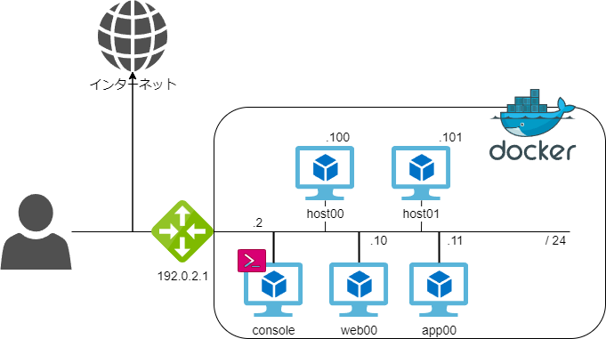

# Ansible による IT自動化

## この講義について

この講義ではハンズオン形式で Ansible について学びます。
ハンズオン用の教材は[こちら](https://github.com/iij/ansible-exercise)になります。

### 本講義で扱うこと

- Ansible概論
- Ansibleの導入
- Ansibleの実行

### 本講義で扱わないこと

- `ansible-navigator`の活用
- Ansible CICD
- Ansible モジュール/プラグインの開発
- Ansible Automation Platform全般

### システム構成

この講義で使用するコンテナのネットワーク図です。
コンテナを VM（Virtual Machine）に見立て、ハンズオンを実施します。

この講義では図中の `console` コンテナから各ホストを管理します。
### 0. 事前準備

この講義を受けるには、Ansible をインストール可能な環境が必要となります。
本講義を受けるにあたり、予めハンズオン教材に目を通すほか
教材の README に従い、講義当日までに実行環境の構築を終えて下さい。

## 1. Ansible 概要と導入

- [Ansible 概要](./INTRODUCTION.md)

## 2. Ansible の実行

- [サンプルの実行](./SAMPLE_RUN.md)

## 3. Ansible playbook の作成

- [Ansible ファイルの作成](./CREATE_PLAYBOOK.md)

## 4. Ansible で アプリケーションサーバを作成する

- [Ansible で アプリケーションサーバを作成する](./CREATE_APP_SERVER.md)

## 5. リバースプロキシの導入/運用

- [リバースプロキシの導入/運用](./REVERSE_PROXY.md)

## 6. 正しい Playbook を書くために

- [正しい Playbook を書くために](./ANSIBLE_CODE_STYLE.md)

<credit-footer/>
