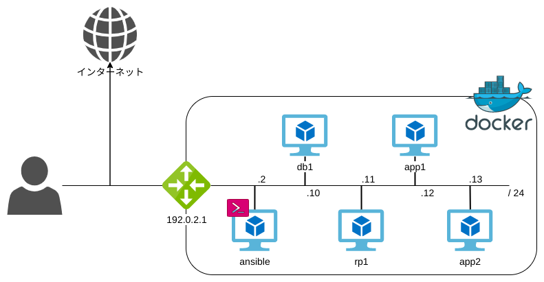

# ansibleでホストの構成管理

## 0. この講義について

この講義ではハンズオン形式でAnsibleについて学びます。
ハンズオン用の教材は[こちら](https://github.com/iij/ansible-exercise)になります。

### 下準備

この講義を受けるにはいくつかの環境準備が必要です。
教材のREADMEに従い、講義当日までに環境を整えてください。

### ネットワーク構成

この講義で使用するコンテナのネットワーク図です。
コンテナをVM（Virtual Machine）に見立て、ハンズオンを実施します。



この講義では図中のansibleコンテナから各ホストを管理します。

## 1. Ansibleとは

公式ドキュメント: <https://docs.ansible.com/ansible/latest/index.html>

Ansibleとは、IT自動化ツールです。
サーバの設定やアプリケーションのデプロイなど、さまざまな処理を自動化できます。
`IaC（Infrastructure as Code）`から生まれたツールで、[YAML](https://yaml.org/)と呼ばれる記述（解読）のしやすい言語で書くことができるため、
サーバなどに詳しくない人にも理解しやすいです。
またサーバなどの状態がファイルとして記述されるため、アプリケーションのソースコードと同様にGitなどでバージョン管理できます。

Ansibleが実際にサーバを管理する際、基本的には[OpenSSH](https://www.openssh.com/)を使って対象サーバへアクセスします。
OpenSSHは多くのサーバにデフォルトでインストールされており、Ansible独自のデーモンをインストールする手間もなく導入しやすいです。

またモジュールやプラグインも多く、数多くの処理を自動化できます。

* [モジュール一覧](https://docs.ansible.com/ansible/latest/modules/list_of_all_modules.html)
* [プラグイン一覧](https://docs.ansible.com/ansible/latest/plugins/plugins.html)

### サンプル実行

まずは実際にAnsibleを実行してみましょう。

ダウンロードした[教材](https://github.com/iij/ansible-exercise)のフォルダ内で下記コマンドを実行しコンテナ内に入る、
またはVScodeの`Remote - Containers`を使い教材のフォルダを開き、コンテナ内に入ります。

Windows

```powershell
docker-compose -f docker-compose\docker-compose.yml start
docker exec -it docker-compose_ansible_1 bash
```

Mac/Linux

```sh
docker-compose -f docker-compose/docker-compose.yml up -d
docker exec -it docker-compose_ansible_1 bash
```

Ansibleで主に使うコマンドは`ansible`と`ansible-playbook`の2つです。

[ansibleコマンド](https://docs.ansible.com/ansible/latest/cli/ansible.html)はアドホックにAnsibleを実行できます。
YAMLなどのファイルを用意しなくても良いので、細かな日々の運用作業や確認作業などに使えます。

[ansible-playbookコマンド](https://docs.ansible.com/ansible/latest/cli/ansible-playbook.html)は`playbook`と呼ばれるYAMLファイルにしたがってAnsibleを実行するコマンドになります。
基本的にAnsibleを実行する際は、こちらのコマンドを使います。
このハンズオンでも主に`ansible-playbook`コマンドを使っていきます。

それではまずは何のファイルも編集せずに、下記のコマンドをコンテナ内で実行し、Ansibleを実行してみましょう。

```sh
ansible-playbook -C site.yml
```

最後に`failed=0`と表示されていれば実行は成功です。
教材の中にはすでに、データベース（MySQL）とJavaアプリケーションを構築するためのファイルが用意されています。
したがってそのまま実行するだけで、MySQLとJavaのアプリケーションがそれぞれのホスト内で起動します。

それでは<http://localhost:8080>にブラウザでアクセスしてみましょう！

...

何も表示されないですね。

それもそのはずです。
さきほど実行したコマンドは`dryrun`すなわち、実際にデータベースやJavaアプリケーションをAnsibleが構築したのではありません。
Ansibleが「もしも実行していたらこういう結果になる」というログを表示しただけです。
したがって実際の処理は行われていないので、当然アプリケーションにもアクセスできません。

**Ansibleの良さの1つがこの`dryrun`です。**
実際にAnsibleを実行したときとほぼ同じ内容を得ることができるため、作業ミスを防ぐことができます。

さて、では下記コマンドを実行して今度こそデータベースとアプリケーションを構築しましょう。

```sh
ansible-playbook site.yml
```

`failed=0`と表示されれば実行は成功です。
ブラウザで<http://loclahost:8080>にアクセスすると素朴なWebアプリケーションの画面が見えます。
また、下記コマンドでホストに対して実際にファイルがコピーされていることが確認できます。

```sh
# MySQL config file
ansible db1 -m command -a 'cat /etc/my.cnf'

# app jar file
ansible app1 -m command -a 'ls -l /opt/ansible-exercise/app.jar'
```

もうお気付きの人もいると思いますが、コマンドのオプションに`-C（--check）`を渡すことで`dryrun`を行うことができます。
したがって一般的な使い方としては、`-C（--check）`を付けてコマンドを実行し問題がないかを確認した後、
`-C（--check）`を外して再度コマンドを実行して、本構築を行うという流れになります。

また、さきほど登場した`playbook`と呼ばれるYAMLファイルが`site.yml`になります。

Ansibleの使い方が分かったところで、いよいよファイルの作り方について学んでいきましょう。

## 2. [ケース1] リバースプロキシの導入

さきほどのセクションで構築したデータベースとアプリケーションを流用します。
現在の状態は、ブラウザから直接アプリケーションに`HTTP`でアクセスしている状態です。
nginxを導入し、`HTTPS`でアクセスしてみましょう。

### ディレクトリ構造

まず、ディレクトリ構造とそれぞれの役割について説明します。
下記は教材のディレクトリ構造の一部抜粋です。
Ansibleに関わるファイルやディレクトリのみを抜粋しています。

```sh
├── ansible.cfg  # Ansibleの設定ファイル
├── inventories  # 管理対象サーバの情報を格納するディレクトリ
│   ├── group_vars  # グループごとの変数ファイルを格納するファイル
│   │   └── all.yml  # すべてのグループに適用される変数ファイル
│   └── hosts  # サーバのIPやSSHのユーザやグループなどを記述するファイル
├── playbooks  # 実行用ファイルを格納するディレクトリ。各ファイルはsite.ymlからインポートします。
│   ├── acl.yml
│   ├── app.yml
│   ├── db.yml
│   └── rp.yml
├── roles  # ロールを格納するディレクトリ。Ansibleの実行はロールと呼ばれるまとまりで管理されます。
│   └── webapp
│       ├── defaults
│       │   └── main.yml  # ロール内で使用される変数のデフォルト値を定義するファイル
│       ├── files  # サーバへ配布したいファイルを格納するディレクトリ
│       ├── handlers
│       │   └── main.yml  # ハンドラタスクを定義するファイル
│       ├── tasks
│       │   └── main.yml  # Ansibleの具体的な処理内容を記述するファイル
│       └── templates  # サーバへ配布したいJinja2テンプレートを使ったファイルを格納するディレクトリ
├── site.yml  # playbookファイル
└── vars
    └── proxy.yml  # Proxy配下でハンズオンを実施するためのファイル
```

さらに詳しく知りたい人はAnsibleの[ベストプラクティス](https://docs.ansible.com/ansible/latest/user_guide/playbooks_best_practices.html)をご覧ください。

### ファイル編集

それではファイルを作成してみましょう。
TLSの証明書に加え、いくつかの設定ファイルはすでに用意してあります。
皆さんには下記4つのファイルを編集してもらいます。

#### roles/nginx/tasks/main.yml

nginxを構築するためのタスクファイルです。
[公式ドキュメント](http://nginx.org/en/linux_packages.html#RHEL-CentOS)のインストール手順に加え、設定ファイルや証明書の配布を行っています。

Ansibleはモジュールと呼ばれるものを使って、さまざまな処理を行います。
Ansibleに組込み済みのモジュールは[公式ドキュメント](https://docs.ansible.com/ansible/latest/modules/list_of_all_modules.html)にリストアップされており、各モジュールごとの書き方が載っています。
モジュールを自作して使うこともできますが、基本的には上記のサイトから行いたい処理に合ったモジュールを探し、タスクファイルを作ります。

下記の内容を教材の`roles/nginx/tasks/main.yml`にコピーしましょう。

```yml
---
- name: install yum-utils
  yum:
    name: yum-utils
    state: present
  environment: "{{ proxy_env | default({}) }}"

- name: add Nginx repository
  yum_repository:
    name: nginx-stable
    description: 'nginx stable repo'
    baseurl: http://nginx.org/packages/centos/$releasever/$basearch/
    gpgkey: https://nginx.org/keys/nginx_signing.key
    enabled: yes

- name: install Nginx
  yum:
    name: "nginx-{{ nginx_version }}-1.el7.ngx.x86_64"
    state: present
  environment: "{{ proxy_env | default({}) }}"
  ignore_errors: "{{ ansible_check_mode }}"

- name: create ssl directory
  file:
    state: directory
    path: /etc/nginx/ssl
    owner: root
    group: root
    mode: 0600

- name: deploy ssl files
  copy:
    src: "etc/nginx/ssl/{{ item }}"
    dest: "/etc/nginx/ssl/{{ item }}"
    mode: 0400
  with_items:
    - server.crt
    - server.key
    - dhparam.pem

- name: remove default config file
  file:
    state: absent
    path: /etc/nginx/conf.d/default.conf
  notify: reload nginx

- name: deploy config file
  template:
    src: etc/nginx/conf.d/app.conf.j2
    dest: /etc/nginx/conf.d/app.conf
    owner: root
    group: root
    mode: 0644
  notify: reload nginx

- name: start nginx
  systemd:
    name: nginx
    state: started
    enabled: yes
```

nginxの構築に使用したモジュールの一覧は以下になります。

|                                                    モジュール名                                                    | 説明                                                                                                                                                                            |
| :----------------------------------------------------------------------------------------------------------------: | :------------------------------------------------------------------------------------------------------------------------------------------------------------------------------ |
|                 [yum](https://docs.ansible.com/ansible/latest/modules/yum_module.html#yum-module)                  | yumコマンドを使ってRPMパッケージを操作できるモジュールです。                                                                                                                    |
| [yum-repository](https://docs.ansible.com/ansible/latest/modules/yum_repository_module.html#yum-repository-module) | yumで使用するリポジトリを操作できるモジュールです。                                                                                                                             |
|                [file](https://docs.ansible.com/ansible/latest/modules/file_module.html#file-module)                | 対象サーバのファイルシステムを操作できるモジュールです。<br>ディレクトリやファイルを作成/削除したり、ファイルのオーナーやパーミッションを変更できたりします。                   |
|                [copy](https://docs.ansible.com/ansible/latest/modules/copy_module.html#copy-module)                | 対象サーバへファイルをコピーできるモジュールです。                                                                                                                              |
|          [template](https://docs.ansible.com/ansible/latest/modules/template_module.html#template-module)          | 対象サーバへファイルをコピーできるモジュールです。`copy`との違いはファイル内に`Jinja2`テンプレートが使える点です。<br>ファイル内で変数を使いたい場合はこちらを使います。        |
|           [systemd](https://docs.ansible.com/ansible/latest/modules/systemd_module.html#systemd-module)            | [systmed](https://wiki.archlinux.jp/index.php/Systemd)によって管理されるプロセスを操作できるモジュールです。<br>基本的にはLinux環境でプロセスを常駐させる場合はこれを使います。 |

#### roles/nginx/templates/etc/nginx/conf.d/app.conf.j2

nginxの設定ファイルです。
ファイル内で変数を使用しているので`templates`下に配置しています。

分かりやすさのために、配置するディレクトリをコピー先のパスと同じにしています。
Ansibleやサーバの構築/運用に慣れないうちは、こうしておくことをお勧めします。

下記の内容を教材の`roles/nginx/templates/etc/nginx/conf.d/app.conf.j2`にコピーしましょう。

```jinja
upstream app_backend {
    
    server {{ app.host }}:{{ app.port }} max_fails=1 fail_timeout=3s;
    
}

server {
  listen {{ nginx_https_port }} ssl;

  ssl_protocols TLSv1.2 TLSv1.3;
  ssl_certificate /etc/nginx/ssl/server.crt;
  ssl_certificate_key /etc/nginx/ssl/server.key;
  ssl_dhparam /etc/nginx/ssl/dhparam.pem;

  location / {
    proxy_set_header  Host  $http_host;
    proxy_set_header  X-Real-IP  $remote_addr;
    proxy_set_header  X-Forwarded-Host  $server_name;
    proxy_set_header  X-Forwarded-Server  $host;
    proxy_set_header  X-Forwarded-Proto  $scheme;
    proxy_set_header  X-Forwarded-Port {{ nginx_https_port }};
    proxy_set_header  X-Forwarded-For  $proxy_add_x_forwarded_for;
    proxy_pass  http://app_backend;
  }

  error_page 404 /404.html;

  error_page 500 502 503 504 /50x.html;
  location = /50x.html {
    root  /usr/share/nginx/html;
  }
}
```

nginxの設定について説明することは主題から外れるので、この講義では行いません。
興味のある人はnginxの[公式ドキュメント](http://nginx.org/en/docs/http/configuring_https_servers.html)をご覧ください。

#### playbooks/rp.yml

nginxを構築するための実行ファイルです。
対象サーバとロールを指定することで、指定したサーバにnginxを構築できます。

下記の内容を教材の`playbooks/rp.yml`にコピーしましょう。

```yml
---
- name: set up the reverse proxy server
  hosts: rp
  become: no
  gather_facts: no
  vars_files:
    - ../vars/proxy.yml
  roles:
    - role: roles/nginx
      tags: nginx
```

#### site.yml

最後に、さきほど作った`playbooks/rp.yml`をインポートする様に教材の`site.yml`に下記を追記します。

```yml
- import_playbook: playbooks/rp.yml
```

### 実行

さて、ファイルがすべて準備できたらいよいよAnsibleを実行します。

さきほど紹介したとおり、まずは`-C（--check）`オプションを付け、`dryrun`により結果を確認しましょう。

```sh
ansible-playbook -C site.yml
```

`failed=0`の表示があれば実行は成功です。
`-C（--check）`オプションを外し、本実行を行いましょう。

```sh
ansible-playbook site.yml
```

`failed=0`と表示されれば実行は成功です。

ブラウザで<https://localhost:8443>にアクセスして確認します。
自己署名証明書を使っているためブラウザから注意文言が表示されますが、スキップしてください。
すると、さきほどと同じ画面が表示されます。

ここで、もう一つ注目してほしい部分があります。
Ansibleの実行ログを眺めると、データベースやJavaアプリケーションの構築用のタスクもステータスが`ok`の状態で、実行されているのが分かると思います。
またさきほど実行した`ansible-playbook site.yml`をもう一度実行すると、nginxの構築タスクも含め、すべてのタスクのステータスが`ok`になります。

ある操作を何回行っても等価であるとき、その操作を`冪等`であると言います。
**Ansibleの良さの1つがこの`冪等`性です。**
基本的にAnsibleは同じタスクを何回実行しても、差分のないタスクは実行されません。
すなわち、ファイルを変更しない限りホストに対して余計な変更が加わらず、安全です。

しかしこの`冪等`性は意識していないと壊れてしまう場合があります。
Ansibleを使うときは`冪等`性に注意を払いましょう。

## 3. [ケース2] バージョンアップ & スケーリング

さて、nginxを導入して初期構築タスクを自動化できました。
次は変数やホスト情報を編集して、運用タスクを自動化してみましょう。

### バージョンアップ

まずはnginxのバージョンアップをしてみましょう。

さきほどインストールされたnginxのバージョンは少し古めの`1.16.1`です。
このバージョンは`roles/nginx/defaults/main.yml`に`nginx_version`という変数として定義されています。
また、下記のコマンドを実行することで、確認することもできます。

```sh
ansible rp1 -m command -a 'nginx -V'
```

これを`1.18.0`にアップデートしてみたいと思います。
教材の`inventories/group_vars/all.yml`に下記を追記しましょう。

```yml
nginx_version: 1.18.0
```

Ansibleには変数の優先度が設定されており、同じ名前の変数は優先度の高いほうが有効になります。
これを利用することでロールの完全性を担保しつつ、タスクの内容を編集できます。

具体的な優先度は[公式ドキュメント](https://docs.ansible.com/ansible/latest/user_guide/playbooks_variables.html#variable-precedence-where-should-i-put-a-variable)をご覧ください。

ファイルの準備ができたらAnsibleを実行します。
さきほどと同様に`ansible-playbook -C site.yml`を実行しても良いですが、
実行したいのはnginxのタスクだけですので、データベースやアプリケーションのタスクは余計です。

そこで実行コマンドを下記に変更します。

```sh
ansible-playbook -C site.yml -t nginx
```

すると、さきほどまで実行されていたデータベースやアプリケーション構築のタスクは実行されず、nginxの構築タスクだけが実行されます。
また`changed=1`となり、nginxのインストールのタスクだけが変更されることが確認できます。

Ansibleにはタグという機能があり、タスクやロールなどに任意の値を設定できます。
これを利用することで、Ansible実行時に任意のタスクのみを実行する/しないことができます。
実はさきほどの`playbooks/rp.yml`にタグが設定してありました。

タグは増やしすぎても管理がたいへんになるので、ある程度のまとまりやよく使うタスクにのみ付与するのが良いでしょう。
タグの詳細については[公式ドキュメント](https://docs.ansible.com/ansible/latest/user_guide/playbooks_tags.html)をご覧ください。

`failed=0`という表示が確認できたら`-C（--check）`のオプションを外し、上記コマンドを実行しましょう。

本実行が完了したら、さきほどの確認コマンドを実行してバージョンが上がったことを確認してみましょう。

```sh
ansible rp1 -m command -a 'nginx -V'
```

### スケールアップ

次はアプリケーションサーバをスケールアップ（増設）してみましょう。
と言っても増設用のサーバはすでにコンテナとして起動してあるので、皆さんがすべきことは下記2つのファイルの編集です。

#### inventories/hosts

まずはAnsibleの管理対象にアプリケーション増設用のサーバ（app2）を追加します。
教材の`inventories/host`を下記のように追記してください。

```diff
[app]
app1
+ app2
```

これで`app`グループの中に`app2`サーバを追加できました。

Ansibleには管理対象のホストをグルーピングし、設定したグループ単位でAnsibleを実行したり、変数を設定できたりします。
こうすることで、柔軟かつ効率的にサーバを管理できます。
この講義ではそれぞれ1台しかありませんが、データベースサーバやリバースプロキシサーバもグループに分けられています。

Ansibleのグループやホストについての詳細は[公式ドキュメント](hhttps://docs.ansible.com/ansible/latest/user_guide/intro_inventory.html#inventory-basics-formats-hosts-and-groups)をご覧ください。

#### inventories/group_vars/all.yml

次に変数ファイルを編集します。
さきほども編集した`inventories/group_vars/all.yml`に下記のように追記します。

```diff
nginx_backends:
  - host: 192.0.2.12
    port: "{{ server_port }}"
+ - host: 192.0.2.13
+   port: "{{ server_port }}"
```

これはnginxが通信を経由させるサーバのリストを格納している変数です。
ここに新しく`app2`サーバの情報を追記することで、nginxが`app2`サーバにも通信を流してくれます。

nginxはロードバランサ（負荷分散装置）としての機能も備えているので、
こうすることで今まで`app1`サーバにしかいかなかった通信が`app2`にも行くようになり、負荷を分散できます。

nginxの機能について詳しく説明することは主題から外れてしまいますので、この講義では行いません。
さらに詳しく知りたい人はnginxの[公式ドキュメント](http://nginx.org/en/docs/http/load_balancing.html)をご覧ください。

#### 実行

さて、ファイルの準備ができたらAnsibleを実行します。
もうお馴染みとなった下記コマンドを実行します。

```sh
ansible-playbook -C site.yml
```

`dryrun`で結果を確認すると、新たに`app2`サーバが増えていることが確認できます。
また、nginxの設定ファイルの差分も確認できるはずです。

`failed=0`と表示されていれば問題ありません。
`-C（--check）`のオプションを外し、本実行を行いましょう。

コマンドが終了したら、ブラウザで<https://localhost:8443>にアクセスして確認してみましょう。

このWebアプリケーションは動作しているサーバのホスト名を画面に表示しています。
新しくブラウザを開き<https://localhost:8443>にアクセスすると、ホスト名の表記が変わっているはずです。

これにより、nginxが正常に負荷を分散してくれていることが確認できます。

ここで、もう一つ注目していただきたいところがあります。
Ansibleの実行ログの中に、`RUNNING HANDLER`という表記が確認できると思います。
さきほどと同じ様に`ansible-playbook site.yml`と実行した場合、この表記がなくなると思います。

これはAnsibleのハンドラという機能になります。
これは、ハンドラを設定したタスクが`changed`のときにのみ実行されるタスクを設定できる機能です。
実際に実行されるタスクは各ロールの`handlers/main.yml`に書かれています。

これにより設定ファイルが変更された場合のみ、アプリケーションやデータベースなどのプロセスを再起動できます。
影響範囲を限定できるため、安全にホストに対して変更を加えることができます。

詳細は[公式ドキュメント](https://docs.ansible.com/ansible/latest/user_guide/playbooks_intro.html#handlers-running-operations-on-change)をご覧ください。

## 4. [応用課題] ACLの導入

応用課題として、全サーバにACL（Access Control List）を導入してみましょう。

ACLとは、通信の（不）許可を設定することで、サーバのセキュリティレベルを高める手法のひとつです。
多くのプロダクション環境のサーバではACLが設定され、セキュリティレベルを高めています。

この講義で使用したサーバのここまでの状態は、どんな通信でも許可してしまうセキュリティ的には脆弱な状態です（ローカル環境ですので攻撃されたりすることはありません）。

そこで、ACLの実装のひとつである[iptables](https://linuxjm.osdn.jp/html/iptables/man8/iptables.8.html)を導入し、サーバのセキュリティレベルを向上させましょう。

教材の`roles/iptables`にロールのひな型を用意しておきました。
このひな型を利用/編集して、全サーバにACLを導入できる様にしてみましょう。

また、以下の表の通りに各サーバのポートを許可しましょう。
適切にポートを許可しなかった場合、Web画面が正常に表示されなくなります。

| サーバ名 | グループ名 | 許可ポート |
| :------: | :--------: | :--------: |
|   db1    |     db     |    3306    |
| app[1,2] |    app     |    8080    |
|   rp1    |     rp     |    8443    |

### ヒント

いくつかヒントを載せておきます。

1. CentOS7で`iptables`をインストールする場合は`yum`で`iptables-services`をインストールする
2. 設定ファイルは`/etc/sysconfig/iptables`
3. Ansibleのすべての管理対象サーバは`all`グループに自動的に属している
4. 各グループの変数は`inventories/group_vars/<group_name>.yml`で設定できる
5. まずは`roles/iptables`の中身を確認してみるとよいでしょう

### 解答例

[教材のsolutionブランチ](https://github.com/iij/ansible-exercise/tree/solution)が解答例になっています。
この解答例以外にも多くの実現方法がありますが、参考にしてもらえればと思います。

他のファイルについても、この講義を受けた後の最終的なファイルの内容になっています。
ハンズオンを進める中でつまずくことがあれば、参考にしてもらえればと思います。

<credit-footer/>
