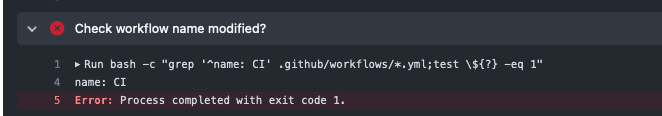

# GitHub Actions でCIテスト・デプロイを回す

# 0. この講義について
## 0.1 この講義の目的

GitHub Actions を利用したCI/CDを体験し、自分のプロジェクトにCI/CDを自ら導入できるようにする。

## 0.2 ハンズオンの対象者

- Git の操作 (clone add commit push) が行える。
- GitHub の操作 (ログイン PRの確認 マージ)が行える。
- YAML ファイルの編集のためテキストエディタが利用できる。

## 0.3 下準備
* IIJ 社内の GHE を利用して行う場合は 別途アナウンスする手順を行う必要があります。

## 0.4. この資料のお約束

### 0.4.1 コマンド実行の指示
:computer: は自分で操作する箇所を示しています。

例:
* :computer: 作業用レポジトリを手元に clone してください
* :computer: 以下の条件を満たすような PR を作成してください
* :computer: reviewdog による Suggested change を確認し取り込んでください

### 0.4.2 変更が必要な箇所の明示

 <ほげほげ> で囲まれている部分は自分の設定値で置き換えてください。

たとえば
```
git clone <リモートリポジトリのアドレス>
```

と記載されている箇所は

```
git clone git@github.com:iij/bootcamp.git
```

というように置き換えてください。

### 0.4.3 ファイルの変更の指示
* 例えば 以下のような表示があれば A,B,C 3行の Bを D にしてくれ という意味です

```diff
A
-B
+D
C
```


| 変更前 | 変更後 | 
| -------- | -------- | 
| A<br>B<br>C<br>     | A<br>D<br>C<br>  |


# 1. 継続的インテグレーション、継続的デリバリとは

継続的インテグレーション(Continuous Integration、以下CI)とは、
アプリケーションのリリースサイクルにおいてビルドやテストなどを自動化し、
継続的に実行することで品質改善や納期短縮を実現するための方法です。

もしかしたら自分のプロジェクトがそうかもれませんが、プログラミングは意外と手作業の多い分野でした。
しかしながら手作業でビルド、テストをしていると不具合が含まれていても発覚するのが遅くなり、手戻りが大きくなってしまいます。
そこでビルドやテストを自動化し、コードがpushされたらすぐに実行することで早期に不具合を見つけようというのがCIです。
また世の中にはビルドが難しいプロダクトというのも多数存在しますので、自動化されているということは開発メンバーを追加するのも楽になります。

継続的デリバリ(Continuous Delivery、以下CD)とはCIをさらに進めてユーザーに製品を届けるまでのリリースプロセス全体を自動化し、
**継続的に顧客に価値を届ける**ことを目的とした手法です。

CI/CDを導入した場合、コードをコミットするとビルドが走り、ユニットテストを通して、コードがテスト環境にデプロイされます。その後結合テスト、
システムテストを行い、必要であれば承認後、本番環境にデプロイされます。

## 1.1 GitHub Actions とは
[GitHub Actions](https://docs.github.com/ja/actions) とは GitHub が提供する CI/CD プラットフォームです。

複数の Action を組み合わせることで、 さまざまなワークフローを自動化できるようになっています。

Linux, Windows, macOS があらかじめ用意されているほか、  
self-hosted runner と呼ばれる処理用のホストを自前で用意して、利用することもできます

GitHub 上の Publicリポジトリ や、 self-hosted runner を利用する場合 無料で使えます。

Private リポジトリでは、一部制限があるので留意ください。

[GitHub Actionsの支払いについて](https://docs.github.com/ja/billing/managing-billing-for-github-actions/about-billing-for-github-actions)


# 2. まず使ってみる - Simple Workflow
github.com の場合 Publicリポジトリならば特別な準備は不要です。  
github.com が用意しているRunnerを利用することできます  

Github Enterprise の場合 特別な設定が必要だったり、Runner を自分で用意する必要がある場合があります。講師の案内に従ってください

## 2.1. レポジトリを作成
:computer: 講師の案内に従い、この講義で利用するリポジトリを作成してください  
Owner の指定や、 Public/Internal/Private の 選択が大事です。 

## 2.2. Simple workflow
github actions では一連の処理を workflow と呼びます。  
まず、サンプルとして用意されている単純なworkflow を試してみましょう

### 2.2.1. workflow ファイル配置
:computer: 作成したリポジトリにアクセスしてください
画面上段の Actions を クリックし Simple workflow の Configure をクリックしてください


すると エディタの表示になります。  
ファイルの中身の上に `.github/workflows/blank.yml` と書いてあります。
これを ```.github/workflows/check.yml``` としてください。

内容を変更せず 右上の Start commit ボタン を押してください  
Commit new file の dialog が表示されるので  
そのまま commit new file もしくは Propse new file ボタンを押してください


### 2.2.2. 実行結果の確認
:computer: その後 もう一度 画面上段の Actions をクリックしてください

すると All workflows の表示になると思います。


画像の Create blank.yml の左が 緑色のチェックアイコンになっています。  
これは workflow の成功を意味します。  
もし、ここで 赤色のバツ印 になっているとうまくいっていません。  
何が悪いかはその表示だけではわからないので、詳しく見る必要があります。

:computer: どちらの場合も Create blank.yml をクリックしてください


すると 実行結果をより詳しく見ることができます。  
実際に処理されるコマンド列などを step とよび、 一連のstep を job という単位でまとめることができます。  
workflow は 複数のjob で構成できますが、 simple workflow は build という job しかありません。


:computer: それでは 画面左 もしくは 画面中央の build をクリックして job の結果を見てみましょう


画像にある Run a one-line script などは step です。  
この job の結果画面では step ごとに どのような処理がされたか確認できます。

先程の workflow の実行結果画面で 赤色のバツ印が出ていた人は エラーの表示を確認できると思うので、そのエラーを読んでみてください。

## 2.3. Simple Workflow のアレンジ
ここまでで、 Github Actions を利用して処理を行えるようになりました。

それでは、簡単なチェックを足していきます。

### 2.3.1. Github Actions の文法を知る
Simple Workflow の 設定を読んでみましょう
レポジトリの ```.github/workflows/blank.yml``` が作成されているはずです。
以下は 執筆時に github enterprise で作成したときのものです。
バージョンによって違いがあるかもしれませんが、違いに注目しながら読んでみてください。
```yaml
# This is a basic workflow to help you get started with Actions

name: CI  # <---  表示名。 重複もゆるされてしまうので わかり易い名前にしましょう

# Controls when the workflow will run
on: # <--- どんなときに実行するか指定します。
  # Triggers the workflow on push or pull request events but only for the "main" branch
  push:
    branches: [ "main" ] # <--- 今回は main branch への push か
  pull_request:
    branches: [ "main" ] # <--- 今回は main branch への Pull Request にしてあります

  # Allows you to run this workflow manually from the Actions tab
  workflow_dispatch:  # <--- 手動で実行化

# A workflow run is made up of one or more jobs that can run sequentially or in parallel
jobs:
  # This workflow contains a single job called "build"
  build: # <--- job 名なので好きに変えられる
    # The type of runner that the job will run on
    runs-on: [ self-hosted ] # <--- どんな runner で実行するか
                             #      例えば OS version など指定できる場合もあり

    # Steps represent a sequence of tasks that will be executed as part of the job
    steps: #<--- job には step がある。 この表記は固定
      # Checks-out your repository under $GITHUB_WORKSPACE, so your job can access it
      - uses: actions/checkout@v3 # <--- git checkout を行う

      # Runs a single command using the runners shell
      - name: Run a one-line script #<--- step の 名前 省略可
        run: echo Hello, world!     #<--- 実行するコマンド

      # Runs a set of commands using the runners shell
      - name: Run a multi-line script
        run: | #<--- もし複数書きたいときはこのようにかける
          echo Add other actions to build,
          echo test, and deploy your project.
```

### 2.3.2. アレンジしてみる

それでは、 上の処理に加えて以下追加してみましょう
1. ```main``` branch だけでなく、すべての場合でチェックするように
1. job 名を ```build``` じゃなくて ```checkname``` へ
3. ```name: CI``` から書き換えてあるかチェック

変更内容は 以下のとおりです。

#### 処理対象をすべての場合に
```diff
 on:
   # Triggers the workflow on push or pull request events but only for the "main" branch
   push:
-    branches: [ "main" ]
+    branches: [ "*" ]
   pull_request:
-    branches: [ "main" ]
+    branches: [ "*" ]
   # Allows you to run this workflow manually from the Actions tab
   workflow_dispatch:
```

#### job 名を変更
```diff
 # A workflow run is made up of one or more jobs that can run sequentially or in parallel
 jobs:
   # This workflow contains a single job called "build"
-  build:
+  checkname:
     # The type of runner that the job will run on

```

#### 環境変数と name 変更漏れチェック
```diff
       - name: Run a multi-line script
         run: |
           echo Add other actions to build,
           echo test, and deploy your project.
+
+      - name: Print environments
+        run: env
+
+      - name: Check workflow name modified?
+        run: |
+          bash -c "grep '^name: CI' .github/workflows/*.yml;test \${?} -eq 1"
+

```

上記変更点を 取り込むPR を作成していきましょう。

## 2.4. 変更を commit して Pull Request を作る
それでは、修正をしていくのですが、今回は Pull Request を作ります。

別のbranch に push した内容を develop branch などへ取り込んでもらうためのリクエストを Pull Request(PR) と呼びます。

### 2.4.1. 変更をcommit
:computer: 以下の通り PullRequest のため 別branch に commit しましょう

ブラウザで```check.yml``` を 開いて 右上の 鉛筆マークから 内容の変更ができます。


このとき indent (左からどのぐらい空白があるか) を揃えるようにしてください

なお、変更後 右上のstart commit ボタンから
```Create a new branch for this commit and start a pull request. ```　を選択した上で Propose changes するようにしてください


うまくいくと PR を作成する画面に移動します。

### 2.4.2. PullRequest を作成

:computer: 以下の通り PullRequest を作成しましょう

PullRequest は 自分が書き込み権限を持っていないレポジトリに対して、修正を取り込んでもらうために利用する事が多いです。

そのため、もし、作業リポジトリを fork して作成した場合 は PR の送り先が fork 元 repository になっています。

PullRequest を作成するときは、base repository (左側) の 表記を見直してください。

今回は 自分のrepository に対して行うので、 画像の通り ```base: main``` で良いです。 

タイトルは ```環境変数の表示と name 変更チェックを追加``` にしましょう
本文には、内容の簡単な説明や、経緯などを書くのが普通ですが、今回は自由です。 

入力したら Create pull request ボタンを押しましょう


しばらくすると 茶色で ```Some checks haven't completed yet``` と表示されたあと

```All checks have failed``` として失敗とされます。


画像の通り 
```
CI / checkname (pull_request) Failing after 6s — build 
```

が表示されていれば Details をクリックしてください。 ジョブの詳細画面に飛びます。

以下のように ```name: CI``` のままなので Error となっていれば うまく仕込めたことになります。


### 2.4.3. マージ禁止設定
これで ```name: CI``` を変更し忘れても気付けるようになりました。  
が、このままでは NG なのに ```Merge pull request``` ボタンで マージできてしまいます。

CI によるテストが全部OKでないとマージできないようにしましょう。

GitHubの設定画面から変更できます。

:computer: テストが通ったときだけマージできるように設定してみましょう

1. 「Settings」->「Branches」->「Branch protection rules」->「Add rule」を押し、
2. 「Branch name pattern」に「main」と記入し、
3. 「Do not allow bypassing the above settings」にチェックを入れます。
4. 「Require status checks to pass before merging」にチェックを入れて
5. 「Status checks found in the last week for this repository」の検索窓に「checkname」と入力して選択
6. 「Create」します。


するともうマージボタンは押せなくなっています。


### 2.4.4. マージする。
:computer: check.yml の name を CI から変更し、マージしてみてください


# 3. 応用
## 3.1. reviewdog + black
Github の PR には [Suggested changes](https://docs.github.com/ja/pull-requests/collaborating-with-pull-requests/reviewing-changes-in-pull-requests/incorporating-feedback-in-your-pull-request) と呼ばれる機能があります。

PR では 変更点に対して1行ずつコメントする機能があります
それで、コードの内容について、質問しあったり、より良くするために提案をすることをコードレビューと呼びます。

その時に便利な機能です。

具体的にコードをどのように変えたら良いと思うか提案でき、
提案された内容は、ブラウザ上の操作で簡単に取り込むことができます。


コードの考え方や、仕様の捉え方のすり合わせなどのやり取りに注意を払うため、  
単純に修正ができるコードスタイルの変更については 機械的に自動で行わせましょう。

今回は、pythonのフォーマッタである[black](https://github.com/psf/black)と
ツールの処理結果をPRにコメントができる[reviewdog](https://github.com/reviewdog/reviewdog)を使い

コードの見た目をきれいにするような Suggested changes をするようにします。

例えば、以下のような ファイルを置いてみると
```yaml
# .github/workflows/reviewdog_black.yml
name: reviewdog
on: [pull_request]
jobs:
  black:
    runs-on: [ self-hosted ]
    steps:
      - uses: actions/checkout@v2
      - uses: actions/setup-python@v4
        with:
          python-version: '3.10'
      - run: pip install black
      - name: do black
        run: black .
      - name: get reviewdog
        run: |
          curl -sfL https://raw.githubusercontent.com/reviewdog/reviewdog/master/install.sh | sh -s
          ./bin/reviewdog -version
      # by https://github.com/reviewdog/action-suggester/tree/master
      - name: get diff
        run: |
          TMPFILE=$(mktemp)
          git diff > "${TMPFILE}"
          export REVIEWDOG_GITHUB_API_TOKEN="${{ secrets.GITHUB_TOKEN }}"
          ./bin/reviewdog \
          -f diff \
          -f.diff.strip=1 \
          -reporter="github-pr-review" \
          -filter-mode="diff_context" \
          -fail-on-error="true" \
          -level="warning"  <"${TMPFILE}"
```

```python
# ng_format.py
a=1+2+3
b="aaaa"
c='aaaa'
d=[1
  ,2
  ,3
      ,4]
e = list(b
        
        
        
        
        
              )
```

このように 変更点が提案され


CI の Check も NG であるとされます。


つまり、 この reviewdog/black テストを マージ時必須とすれば、フォーマットを整えたコードだけが取り込めるようになりそうです。

## 3.2. danger + github

今回 PullRequest を作成し、 その内容をgithub actions でチェックすることで、
良くないコードが取り込まれるのを防ぐやり方を学びました。

では、コードだけでなく、 PullRequest のタイトルや、説明書き、label などを確認したいときはどうすればよいでしょうか。

[danger](https://github.com/danger/danger)というツールは 非常に様々なプラグインがあり、github の plugin を利用することで

- PR の タイトル
- PR の 説明文
- PR の ラベル
- PR の 著者
- PR の 説明文の行数
- PR の merge 先の branch 名
などの情報を利用してチェックできるようになります。

以下のようなファイルを用意します。


```yaml
# .github/workflows/danger_github.yml
name: danger
on:
  pull_request:
    types: 
    - assigned
    - unassigned
    - labeled
    - unlabeled
    - opened
    - edited
    - closed
    - reopened
    - synchronize
    - converted_to_draft
    - ready_for_review
    - locked
    - unlocked
    - review_requested
    - review_request_removed
    - auto_merge_enabled
    - auto_merge_disabled
    
jobs:
  github:
    runs-on: [ self-hosted ]
    steps:
      - uses: actions/checkout@v2
      - uses: ruby/setup-ruby@v1
        with:
          ruby-version: '3.0'
      - run: gem install danger
      - name: danger
        env:
          DANGER_GITHUB_API_BASE_URL: "${{ github.api_url }}"
          DANGER_GITHUB_API_TOKEN: "${{ secrets.GITHUB_TOKEN }}"
        run: danger
```
```ruby
# Dangerfile
message "Welcome, #{github.pr_author}."

warn "PR is classed as Work in Progress" if github.pr_title.include? "[WIP]"

failure "This PR does not have any assignees yet." unless github.pr_json["assignee"]
```

すると、以下のように

1. 誰が作ったPR なのかわかるコメント
2. アサインが誰もいないので failure
3. [WIP] で始まってるので warn 

のようなコメントがされる


ここで、

自身をとりあえずself-assign してみると コメントが更新され check OK に


[WIP] を外すと更に、 warn が消えた


アサインしたり、件名を変えたりするたびに github actions が動いており、それにより更新された


このように、 PR の内容だけでなく、 PR それ自体についての情報を利用したテストも書くことができる。

これをうまく使えば、ルールに従ったPRを運用できる


# 3. GitHub Actions の 基本的な設定

github actions は 複数の step からなる Workflow を作成できるようになっています。

github actions の最大の特徴は Action と呼ばれる再利用可能なコードを組み合わせることで、簡単にさまざまなことができるようになっている点です。

GitHub Actions にはさまざまな設定項目があります。

他詳細は[公式ドキュメント](https://docs.github.com/ja/actions/using-workflows/workflow-syntax-for-github-actions) を参照ください。

## 3.1. name, on

```yaml
name: CI
on: [push]
```

* `name` - このファイルで実現されるものについての名前です。

  `.github/workflows` 以下に複数のファイルを置くことが可能です。

* `on` - ワークフローがいつ実行されるかの定義です。  

  特定の branch に対する操作のときだけに限定したりも可能ですが、  
  今回は push すべてを対象にしています。

## 3.2. jobs

```yaml
jobs:
  rspec:
    runs-on: ubuntu-latest
    steps:
      - uses: actions/checkout@v2
      - uses: ruby/setup-ruby@v1
        with:
          ruby-version: '2.6'
          bundler-cache: true
      - run: bundle exec rspec
```

jobs は job の集合体です。job は ワークフローの実行単位で必ず1つ以上含まれます。

* `rspec` というのが この job の 識別子になります。

* `runs-on` - どんなタイプのマシンで このジョブを実行したいかを指定します。  

   自前でランナーを用意する場合は `self-hosted` と指定したり、   
   GitHub.com が用意するものを利用する場合は `ubuntu-latest` などと指定します。  
   ほかにも Windows や macOS を選択できます。

* `steps` - job の実際の操作を記述する部分です。  
  `uses` や `run` などで実際にどんな操作をするか定義できます。

* `run` - コマンドを実行します。  
   コマンドは、デフォルトでは非ログインシェルを使用して実行されます。  
   yaml の `|` を利用して複数行実行することや、  
   `working-directory` を指定して特定のディレクトリで実行させることも可能です。

* `uses` - action を実行します。
   - `actions/checkout@v2`   
     Git checkout をします。 Git repository の内容について処理する場合はこれが必要です。
   - `ruby/setup-ruby@v1`   
     Ruby をインストールします。 このあとの `run` では Ruby のコマンドを利用できます。

  また、 一部 `with` で パラメータを与えられるものもあります。   
    (Ruby のバージョンを3にしてみるのもよいですね。)

  なお、 この action の @v2 や @v1 は branch や tag などの Git 的 refs を意味します。  
  つまり、 GitHub 上の ある repository の内容を利用しているということです。  
  そのため、 repository 側の更新により、意図せず振る舞いが変わる可能性があります。  

:::tip
  公式でも「リリースされたアクションバージョンのコミットSHAを使用するのが、安定性とセキュリティのうえで最も安全です。」としています。

  https://docs.github.com/ja/actions/using-workflows/workflow-syntax-for-github-actions#jobsjob_idstepsuses
:::

# 4. ほかにも

GitHub Actions の最大の特徴は action を組み合わせて workflow を実現できる点でした。

https://github.com/marketplace では さまざまな action を探すことができます

さらには 自分で action を作ることも可能です。

いろいろ探してみてください。

ちなみに、この資料も GitHub Actions で作られています。

https://github.com/iij/bootcamp/actions  
https://github.com/iij/bootcamp/tree/master/.github/workflows

# 8. 参考情報

- [GitHub Actions](https://docs.github.com/ja/actions)
