<header-table/>

# Grafana Lokiでログを監視してみよう

## 0. まえがき

### 0-1. 想定している受講者

本講義では以下の受講者を対象としています。

- 監視って言われても何を監視すればいいのか分からない
- ログ監視が必要なのはわかるけど、なんで必要なのか分からない
- ログ監視ツールの名前だけしか聞いたことがない

### 0-2. 前提知識

基本的に前提知識は無しでも問題ないですが、以下の点を押さえておくと講義がスムーズに聞けます。

- Linuxの基礎的なコマンド
- Dockerの基礎

### 0-3. 事前準備

- Dockerのインストール
  - `docker image ls`で"hello-world"が存在しない状態で、`docker run hello-world`が実行できていればOK
- Docker Composeのインストール
  - `docker compose version`でバージョン情報が出ていればOK
  - バージョンに指定はありませんが新しい方がいいです

### 0-4. 注意事項

本講義は「監視概論」と「Prometheus」の受講を前提とした講義となっています。本講義のみでの受講も可能ですが、時間があれば「監視概論」と「Prometheus」の受講を強くおすすめします。

## 1. Grafana Lokiについて知ろう

### 1-1. Grafana Lokiとは

[Grafana Loki](https://grafana.com/oss/loki/)とは[Grafana Labs](https://grafana.com/)が公開しているログ収集/検索が行えるOSSのことです。Observabilityを実現する上で必要となる監視項目である**メトリクス**、**ログ**、**トレース**のうち、ログを担当するツールに相当します。

::: tip
Grafana Cloud上にも同じ名前のコンポーネントが存在しますが、本講義ではOSS版のLokiについて扱います。
:::

### 1-2. Grafana Lokiの特徴

Grafana Lokiの特徴は大きく３つあります。

1. Prometheusに似たラベルデータを持つ
Prometheus同様のサービスディスカバリ方式を採用しており、Grafana Lokiへの取り込み時にPrometheusラベルを付与/変換/フィルタリングを行うことができます。これによりGrafanaという可視化ツールの中でPrometheusと一気通貫の管理方式を採用することができます。

2. Grafana Loki自体が内蔵ストレージを持たず、オブジェクトストレージ等を利用する
Grafana Loki自体にデータストレージを持たない構成を取ることで、自由なストレージ設計が可能になり、データ設計時の柔軟性や拡張性を担保することができます。他のOSSを自由に組み合わせるマイクロサービスアーキテクチャに近い考えになります。

3. ログ全体ではなくメタデータのみをインデックス化して保存する
Grafana Lokiの最も大きな特徴となります。Grafana Lokiはログ全文ではなく、**メタデータのみをインデックス化**して保存を行います。これにより同じログセットを保存する場合に他のログ管理ツールに比べて大幅に少ない容量にて保存が可能になります。それに伴い、保存時の書き込み速度やデータ読み込み、様々なログ形式に対応が可能となります。

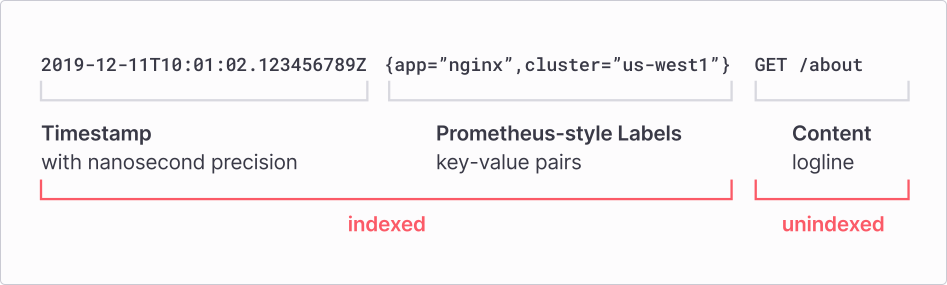

Grafana Lokiという名前の通り、Grafanaとのシナジーが非常に強く、またそれに伴いメトリクス監視ツールであるPrometheusとも管理を統一化できるのが大きな強みとなります。Grafana Loki自体にはほかにも**LogQL**などの特徴も持ち合わせていますが、ツール選定の際は主に上記３点が大きな比較対象となるため、この場では名前だけ出させていただきます。

::: tip
なぜ**メタデータのみをインデックス化する**ことが容量削減に繋がるかというと、Grafana Lokiは基本的に概念的には**Index**と**Chunk**という２つのファイルタイプでデータを保存しています。例えば`{component="printer",location="f2c16",level="error"} "Printing is not supported by this printer"`というログがある場合、`{component="printer",location="f2c16",level="error"}`をGrafana Lokiはラベルとして保存し、残りの`"Printing is not supported by this printer"`というログ本文は**Chunk**という場所に格納されます。ここでGrafana Lokiはラベルに対して(仮に)`3b2cea09797978fc`というStreamIDを発行し、同じStreamIDを持つログ本文は同じChunkへ保存されます。Chunkは一定数貯まるか時間が経過すると圧縮されます(ログは同じ単語が頻出するので圧縮率が非常に高いです)。仮に圧縮されたchunkを`chunk001`とすると、**Index**は`3b2cea09797978fc → chunk001`程度の情報しか持ちません。これによりElasticsearchのようにログ全文をインデックス化するよりも少ない容量かつ、ラベル検索においては高い速度で検索が行えるようになります。
:::

<details>
<summary>びっくりするぐらい詳しいElasticsearchとの比較</summary>
仮に以下のようなログが100万件あるとします。

```
2025-01-01 ERROR Out of paper
2025-01-01 ERROR Too much paper
2025-01-01 ERROR Printer offline
...
```

Elasticsearchはログ本文を細かく分解してインデックスを生成します。

```
ERROR
Out
of
paper
Too
much
paper
Printer
offline
```

Grafana Lokiの場合、収集エージェント側(Grafana Alloyなど)でラベル付与・整形を行うので、まずは以下の形になります。

```
{app="printer",level="error"}
Out of paper

{app="printer",level="error"}
Too much paper

{app="printer",level="error"}
Printer offline
```

この場合、Grafana Lokiのインデックスは以下になります。

```
{app="printer",level="error"}
→ Chunk001
```

先ほどのChunkの説明の通り、これによりGrafana LokiはElasticsearchに比べてストレージ効率が良くなります。

**が**、

仮にユーザが`paper`というワードで検索を行った場合、Elasticsearchはインデックスを見るだけで一発で対象ログをヒットさせることができますが、Grafana Lokiは

```
ラベルでChunkを特定
↓
Chunkを読み出す
↓
ログ本文を実際に読む
↓
paperを探す
```

となるため、Elasticsearchに比べて検索コストが高くなります。特に広い検索範囲に対する全文検索では差が大きくなります。

</details>

### 1-3. Grafana Lokiのアーキテクチャ

#### 1-3-1. Grafana Loki周辺のコンポーネント

Grafana Lokiベースのログ監視には**Agent**、**Loki**、**Grafana**の３つのコンポーネントで構成されます。


1. Agent
Agentは監視対象のログを収集し、ラベルを追加、ログの変換を行った後HTTP APIを通してGrafana Lokiへデータを送信します。以前はPromtailというツールを使っていましたが、現在はGrafana Alloyの利用が推奨されています。(Promtailは2026年3月2日をもってEoLを迎えました)

2. Loki
ログ監視アーキテクチャのメインコンポーネントになります。ログの取り込みと保存、クエリ処理などを行います。

3. Grafana
ログデータの表示に利用します。先述の通りPrometheusともシナジーがあり、メトリクス監視とログ監視を同じプラットフォーム上で行えるため、ダッシュボード管理がしやすくなります。

#### 1-3-2. Grafana Lokiのアーキテクチャ

Grafana Loki自体を構成するコンポーネントには主に以下の５つが存在します。

1. Distributor：書き込みリクエストをハンドリングするコンポーネント
2. Ingester：ログ保存(正確には保存ストレージへの書き込み)を行うコンポーネント
3. Querier：LogQL形式のクエリ処理(検索など)を行うコンポーネント
4. Query Frontend：Querierで行った検索結果のキャッシュやクエリ処理のキューイングを行うコンポーネント
5. Ruler：Grafana Lokiからアラートを発報する(正確にはAlertmanagerへ引き継ぐ)コンポーネント

他にも圧縮を担当する**Compactor**などが存在しますが、この場では割愛します。

<details>
<summary>びっくりするぐらい詳しいログ保存までの流れ</summary>
ログの書き込みまでの流れはざっくりと以下になります。

Agent → Distributor → Ingester → Storage

1. AgentがDistributorへ送信
    - Grafana Alloyなどがログを収集してGrafana LokiへPush
    - Distributorは完全にステートレス
2. DistributorでValidation
    - ラベル形式やログサイズなどを見てログを検査
    - 不正なラベルはここで拒否される
3. Label Normalization
    - 受信したデータのラベルをすべて同じ順に整理する
    - これを行うことで同じストリームは同じハッシュ値として扱われる
4. Rate Limit確認
    - 事前に設定している通信量を超えていないかを確認
    - 超えている場合は`429 Too Many Requests`を返す
5. Hash計算
    - hash(TenantID + LabelSet)により計算
    - Lokiはマルチテナントを想定したつくりになっている
6. RingからIngester選択
    - Ringとは「どのログをどのIngesterへ保存するか」を決めた仕組み(説明が難しいので詳しくは[公式ドキュメント参照](https://grafana.com/docs/loki/latest/get-started/hash-rings/))
    - replication_factorで事前に定義された数のIngesterを選択
7. 並列書き込み
    - 6.で選択したIngesterへ同じログを同時に送信
8. IngesterでWAL保存
    - Ingesterはデータを一時的にメモリへ保存するが、何かしらの障害が起きるとデータが失われる可能性がある
    - WAL(Write Ahead Log)は受け取った書き込みリクエストを永続化領域へ真っ先に記録することで障害時に復旧できるようになる
    - ただし、ディスクフルの状態でWALに書き込めない状態でもログ書き込みリクエストはエラーにならないため、ここをモニタリングする必要がある
9. メモリ上のChunkへ格納
    - ログ一つ一つを都度Storageへ書き込むと効率が悪いため、Chunkと呼ばれる場所へ格納する
    - ちなみにどのログがどのChunkに入っているかはIndexという場所で管理される
10. Quorum判定
    - replication_factorの数を2で割った数に+1した台数が書き込みの成功条件
    - 例えばreplication_factor=3の場合、2台が書き込み成功することでログ保存完了と判断
11. StorageへFlush
    - Chunkがサイズ上限に達するか一定時間経過すると圧縮されてStorageへ保存される

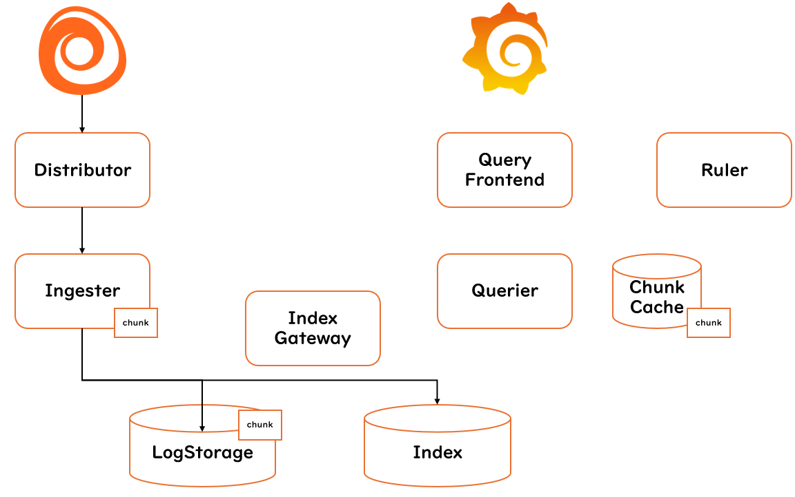

</details>

<details>
<summary>びっくりするぐらい詳しいログ検索までの流れ</summary>
ログ検索までの流れはざっくりと以下になります。

Grafana → Query Frontend → Querier → Ingester & Storage

1. GrafanaからQuery Frontendへ
   - Grafanaで検索されたクエリはまずはQuery Frontendへ流される
   - キャッシュされているクエリがここで返される
2. Query Frontendが分割
   - 検索された範囲をQuery Frontendで分割する
   - たとえば「過去30日」という内容にはDay1,Day2,...のように分割を行う
3. Query Scheduler(オプション)
   - 大量のクエリが来た場合、特定のtenantに処理が集中してしまわないようにtenantごとのキューを待って処理を行う
   - Querierは非常に重たい処理をするため、tenantごとに公平に検索が行えるようにQuery Schedulerが存在している
4. Querierが取得
   - ログ書き込み11.の手順でStorageにflushされていない可能性を考慮し、まずはIngesterを検索
5. Ingester検索
   - 直近のログはChunk内に格納されているため、Chunk内のメモリを検索
6. Index Gateway検索
   - どのログがどのChunkに格納されているかを確認するためにIndex Gatewayで知りたいログのChunkを検索
7. Storage検索
   - Querierが検索したChunkがあるStorageへChunkを取得しに行く
8. Deduplication
   - 同一ログは複数のIngesterから返ってくるため、**timestamp**、**labels**、**message**が同じものを除外する
9. 集約してGrafanaへ返却
   - QuerierがQuery Frontendを経由してGrafanaへ結果を返却する

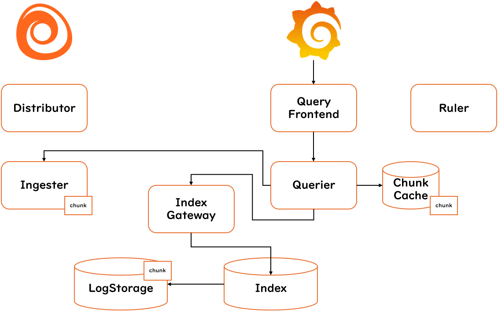

</details>

<details>
<summary>びっくりするぐらい詳しいアラート発報までの流れ</summary>
アラート発報までの流れはざっくりと以下になります。

Ruler → Query Frontend → Querier → LogQL評価 → Alertmanager

1. Rulerが定期実行
   - Rulerが事前に定義した時間ごとにアラートルールを評価
2. LogQL発行
   - アラートの評価方法としてcount_over_timeやrate、sum、avgなどを利用している場合はここでLogQLのMetric Queryを発行
3. Query Frontendへ依頼
   - 以降はクエリ検索を行うためログ検索の流れと同様
4. Querierが評価
   - 同上
5. 結果判定
   - 2.で発行したLogQLがアラートルールの条件を超過した場合、条件成立となる
6. Alert状態へ遷移
   - 該当アラートのステータスがFiringへ推移する
7. Alertmanagerへ送信
   - Rulerはアラートを通知する手段を有していないので一般的にAlertmanagerへ転送する
8. 通知
   - Alertmanagerより転送される

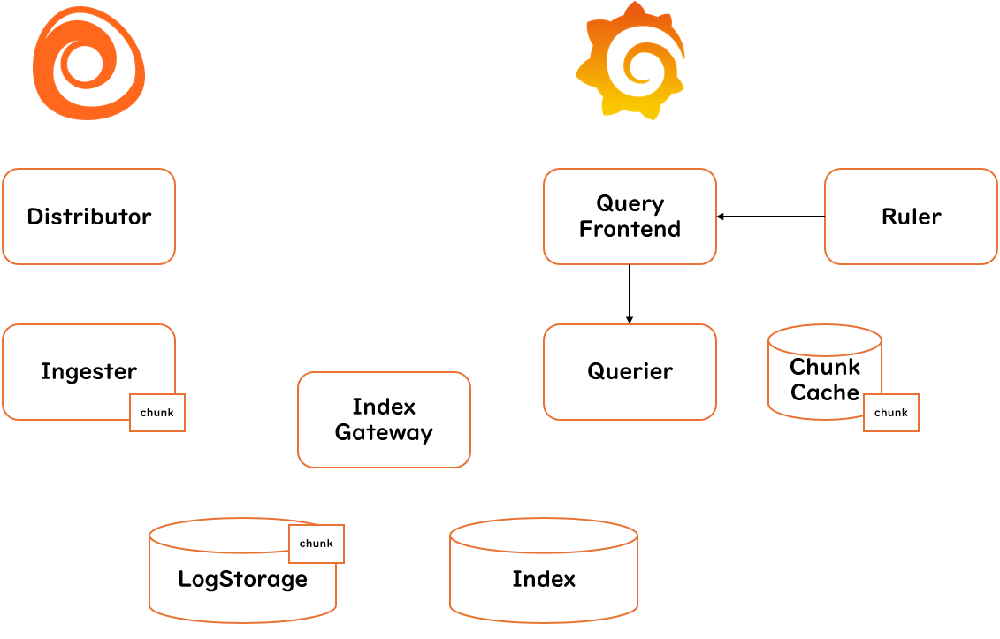

</details>

これより詳しいコンポーネントの説明は[公式ドキュメント](https://grafana.com/docs/loki/latest/get-started/components/)を参照してください。

### 1-4. Grafana Lokiのデプロイ方式

Grafana Lokiには[デプロイ方式](https://grafana.com/docs/loki/latest/get-started/deployment-modes/)が以下の３つあります。構築したい規模や環境に合わせて選択してデプロイを行います。

1. Monolithic mode
   - すべてのコンポーネントが単一のバイナリとして動作
   - 最もシンプルな構成
   - 開発、テスト向け
  
    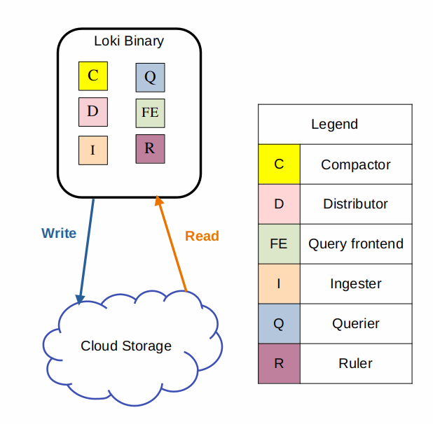

2. Simple Scalable mode
   - コンポーネントを**Read**、**Write**、**Backend**に分離
   - それぞれを個別にスケール出来る
   - 廃止予定のモード(Loki 4.0で削除予定)
   - 現行ではHelm chartのデフォルト構成
   - 本番利用可能(運用要件に応じて選択)
  
    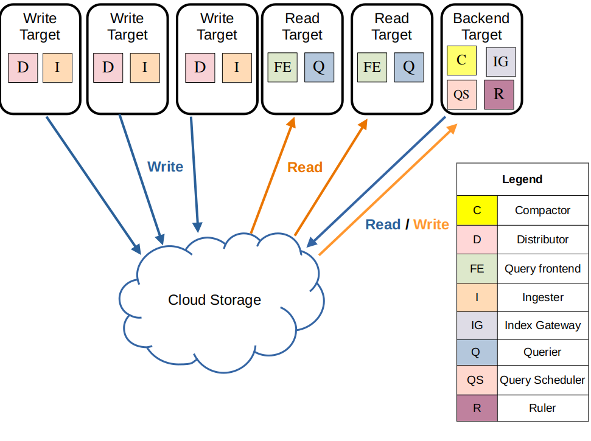
3. Microservices mode
   - 各コンポーネントがすべて独立して動作
   - 最も拡張性と柔軟性が高い
   - 本番向け(大規模)

    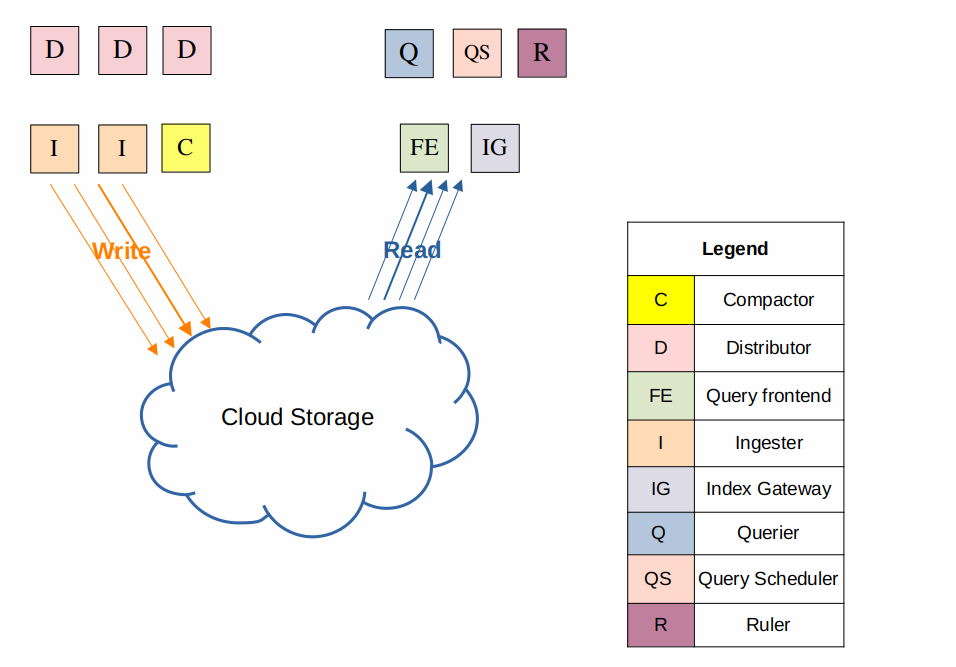

## 2. Grafana Lokiを触ってみよう

### 2-1. 本講義で使う構成

Grafana Lokiには３つのデプロイ方式がありますが、今回は最もシンプルな**Monolithic mode**にてハンズオンを進めます。ログ監視を行うコンポーネントとしてGrafana Lokiは一つの要素に過ぎないため、Agentにあたる**Grafana Alloy**と可視化を行う**Grafana**を付け加えてログ監視基盤を構築していきます。

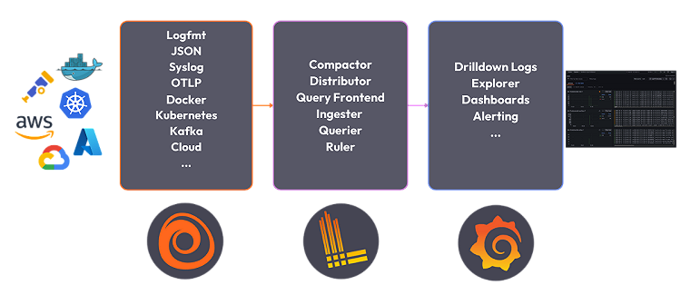

::: tip
Grafana Labsの考えるObservabilityの**ログ監視**とは、**Grafana Alloy**+**Grafana Loki**+**Grafana**という組み合わせで、これを**Loki Stack**とGrafana Labsは呼んでいます。
:::

### 2-2. Grafana Lokiの構築

ハンズオンを始める前に、別のハンズオンで使ったコンテナを`docker stop`で止めておいてください。また、`docker ps`で余計なコンテナがないかを確認してください。(理由があって何かしらのコンテナを立てている場合はポートが被らないように適宜読み替えてください)

#### STEP1 Grafana LokiとGrafanaを起動

`docker-compose.yml`を作成し、以下の内容を書き込みます。

```
services:
  loki:
    image: grafana/loki:latest
    command: -config.file=/etc/loki/local-config.yaml
    ports:
      - "3100:3100"

  grafana:
    image: grafana/grafana:latest
    ports:
      - "3000:3000"
    environment:
      GF_SECURITY_ADMIN_PASSWORD: admin

      HTTP_PROXY: ""
      HTTPS_PROXY: ""
      http_proxy: ""
      https_proxy: ""

      NO_PROXY: "localhost,127.0.0.1,loki"
      no_proxy: "localhost,127.0.0.1,loki"
```

作成が完了したら`docker compose up -d`を実行して、Grafana LokiとGrafanaを立ち上げます。`docker ps`でコンテナが起動していることや`curl --noproxy '*' http://localhost:3100/ready`でGrafana Lokiから`ready`という応答が返ってくることで疎通確認をすると尚よいです。

#### STEP2 Grafanaを操作する

ブラウザから`http://<サーバIP>:3000`を入力し、Grafanaへアクセスします。ユーザ名とパスワードは両方とも`admin`です。

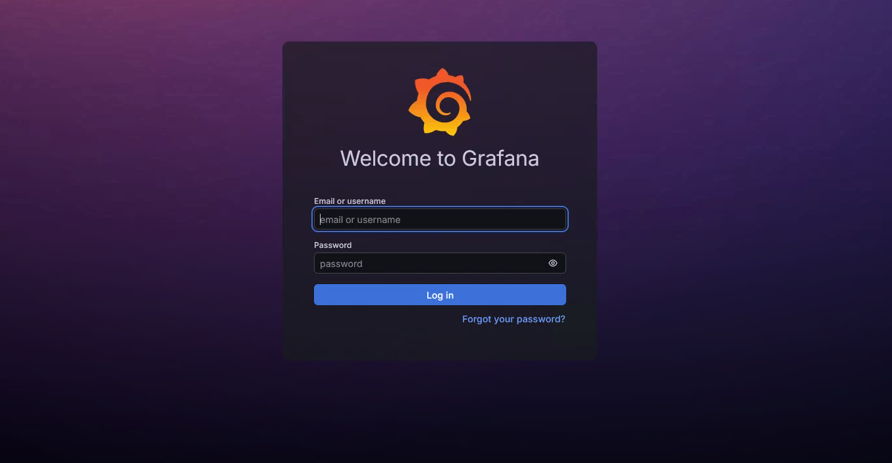

左のカラムにある`Connections`のプルダウンメニューから`Data sources`を選択します。

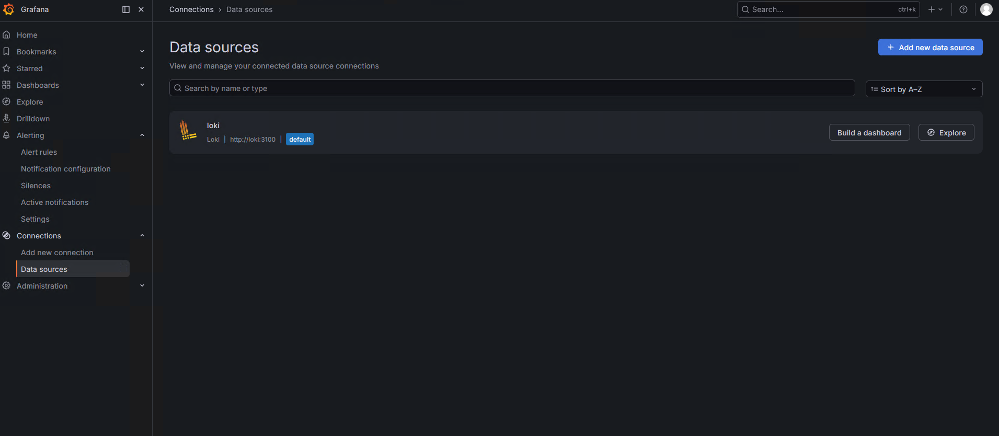

`Connection`のURLに`http://loki:3100`を入力し、一番下にある`Save & test`をクリックして接続に成功したメッセージが出ることを確認します。

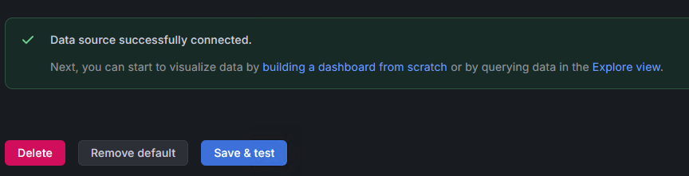

これでGrafana LokiとGrafanaの設定は完了です。

#### STEP3 Grafana Alloyを起動する

`config.alloy`を作成し、以下の内容を書き込みます。

```
local.file_match "logs" {
  path_targets = [
    {
      __path__ = "/logs/sample.log",
      job      = "handson",
    },
  ]
}

loki.source.file "logs" {
  targets    = local.file_match.logs.targets
  forward_to = [loki.write.default.receiver]
}

loki.write "default" {
  endpoint {
    url = "http://localhost:3100/loki/api/v1/push"
  }
}
```

次に`mkdir -p logs`でlogの格納ディレクトリを作成し、`touch logs/sample.log`でログの格納先を作成します。作成が完了したら以下のコマンドを実行します。

```
docker run -d \
  --network host \
  --name alloy \
  -v $(pwd)/config.alloy:/etc/alloy/config.alloy \
  -v $(pwd)/logs:/logs \
  grafana/alloy:latest \
  run /etc/alloy/config.alloy
```

実行後に`docker logs alloy`で特にエラーなどが出ていないことが確認できると尚よいです。

#### STEP4 ログ投入

ここからはGrafana Alloyへ実際にログを投入し、Grafana Lokiに送信させます。以下のコマンドを順に実行してください。

```
echo "INFO Application Started" >> logs/sample.log

echo "INFO User Login" >> logs/sample.log

echo "ERROR Database Timeout" >> logs/sample.log

echo "WARN Retry Connection" >> logs/sample.log
```

これでGrafana Alloyへログの投入が完了しました。これによりGrafana AlloyからGrafana Lokiへログが転送されます。

#### STEP5 Grafanaでログ検索

ブラウザから`http://<サーバIP>:3000`を実行し、Grafanaへアクセスします。左のカラムから`Explore`を選択し、クエリ検索画面に入ります。クエリ検索ではCodeベースの方が扱いやすいので、一番右に`Builder`,`Code`と選択できる箇所があるので、`Code`を選択してください。

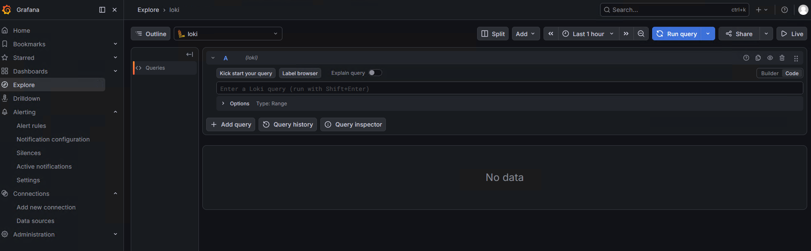

`Enter a Loki query (run with Shift + Enter)`と書かれた場所に`{job="handson"}`とクエリを入力し、`Run query`を押します。すると画面にログ画面が表示されます。

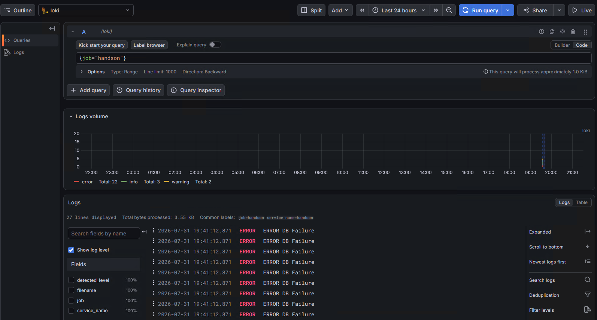

LogQLの書き方は様々ありますが、`{job="handson"} |= "ERROR"`とすることで**ERROR**のみを表示させたり、`{job="handson"} != "INFO"`とすることで*INFO*を除外したりとできます。

#### STEP6 MetricQuery体験

MetricQueryを発行し、ERROR件数を集計してみましょう。まずはクエリ入力画面に以下を入力します。

```
count_over_time(
  {job="handson"} |= "ERROR" [5m]
)
```

ここでは「１」と表示されるはずです。次に以下を実行してERRORを大量投入させます。

```
for i in {1..20}
do
  echo "ERROR DB Failure" >> logs/sample.log
done
```

すると、`count_over_time`が20個以上になると思います。これを応用することでアラートの作成を行えます。

#### STEP7 アラートの作成

ブラウザから`http://<サーバIP>:3000`を実行し、Grafanaへアクセスします。左のカラムから`Alerting`のプルダウンを表示させ、`Alert rules`を選択します。さらに右上の`New alert rule`を選択することでアラートルールの作成画面に入れます。

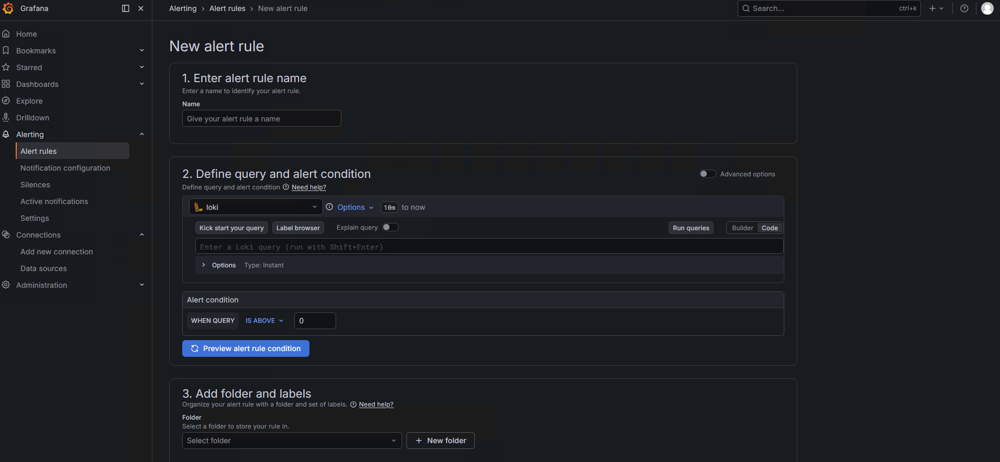

`1. Enter alert rule`には`handson`と入力、`2. Define query and alert condition`には以下を入力します。

```
count_over_time(
  {job="handson"} |= "ERROR" [5m]
)
```

また、`Alert condition`には`WHEN QUERY IS ABOVE 30`と入れます。以下、`3. Add folder and labels`には`+ New folder`から好きな名前のフォルダを作成、`4. Set evaluation behavior`にも`+ New evaluation group`から好きな名前のグループを作成します。`5. Configure notifications`は`empty`を選択します。最後に`Save`を押すことでアラートルールが作成されます。

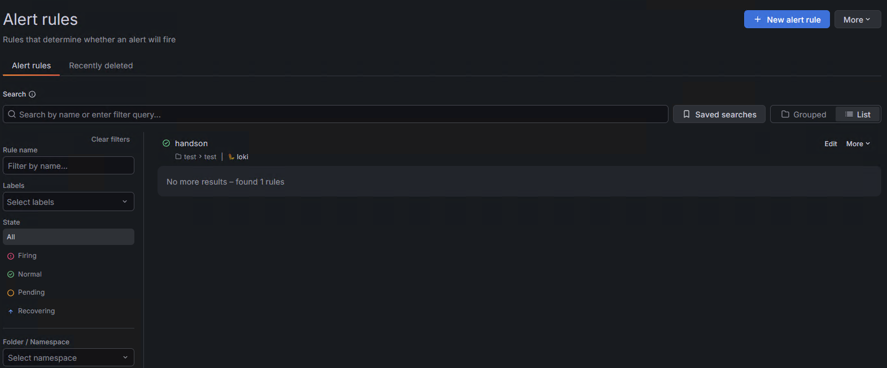

#### STEP8 アラートの発報
以下を実行し、大量にERRORログを生成します。

```
for i in {1..30}
do
  echo "ERROR Critical Failure" >> logs/sample.log
done
```

しばらくすると、Grafanaのアラートルールが`Firing`へ変化します。

## 3. おわりに

以上でGrafana Lokiのハンズオンを終了します。Grafana Lokiのアーキテクチャから実際のログ保存/ログ検索/アラート発報まで理解が出来たかと思います。今回は簡単な構成で簡単なログ保存を行いましたが、実際の現場ではこれに加えて、**オブジェクトストレージの作成**や**監視基盤の冗長化**、**Prometheusを使ったメトリクス監視との連携**など高度な設計を必要とします。まずは小さなところから監視を始めて、徐々にブラッシュアップさせていくことをおすすめします。

> 参考文献
>
> 1. 入門 監視/Mike Julian(オーライリージャパン)
> 2. SREサイトリライアビリティエンジニアリング/Betsy Beyer,Chris Jones,Jennifer Petoff,Niall Richard Murphy(オーライリージャパン)
> 3. クラウドネイティブ・アーキテクチャ/Tom Laszewki,Kamal Arora,Erik Farr,Piyum Zonooz(インプレス)
> 4. Grafana Loki公式ドキュメント/ <https://grafana.com/docs/loki/latest/>
