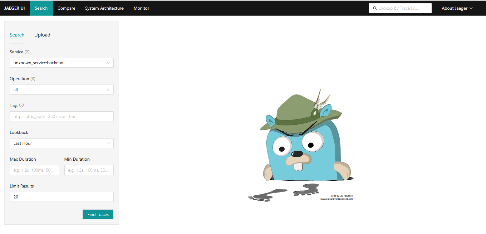
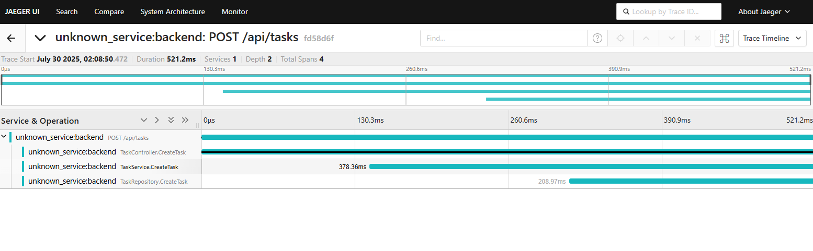
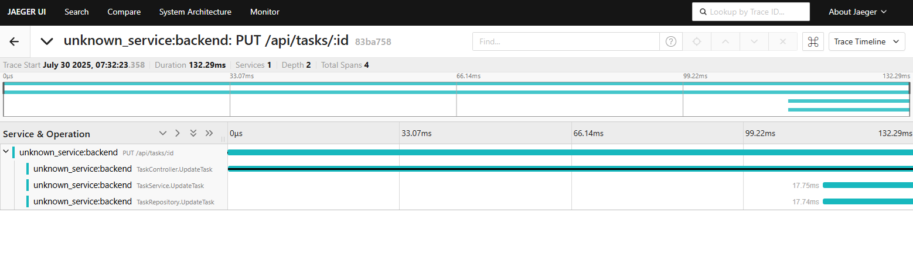

<header-table />

# OpenTelemetryによるアプリケーションの監視入門

## はじめに

### 受講対象者

- 現代の監視についてどのような監視方法があるのかわからない
- OpenTelemetryという言葉は知っているけど、実際に触ったことがない

### 前提知識

本講義では事前知識なしでも講義を進められるように心がけていますが、以下の点を抑えておくことで手を動かしつつ理解を深めることができます。

- Dockerの基本知
- Linuxの基礎知識（コマンド実行程度）

### 講義の目的

講義の目的について説明します。

本講義では、OpenTelemetryについてハンズオンを通して理解を深めることを目的としています。

具体的なOpenTelemetryのアプリケーションへの実装方法についてまではここでは触れません。
また、本番環境でどのような運用をすることで効果的なOpenTelemetryの利用となるのかの説明も本講義のスコープ外とします。

あくまでもデモ用に用意したOpenTelemetry実装済みのアプリケーションを動かしてどのようなデータ、分析ができるのかを学習するためにあります。

## 事前準備

本講義ではハンズオン用に用意したアプリケーションを実際に動かしながら進める講義です。

以下のコマンドを実行してサンプルアプリケーションを立ち上げてください。

```bash
$ git clone https://github.com/tamago0224/todo-with-claude
$ cd tod-with-claude
$ docker compose up --build -d
```

## OpenTelemetryとは

オブザーバビリティのためのフレームワークであり、トレース、メトリクス、ログといったテレメトリデータ生成、エクスポート、収集を行うための統一された処理を提供します。

### 現在のアプリケーションの設計について

昔のアプリケーションはおおよそ単一のWEBサーバとデータベースのようなシンプルな形で提供されてきた。

しかし、昨今のクラウドネイティブなアプリケーションの登場や大規模化により、１つのシステムでも複数のサーバから構成される形式となっていた。
こういった形になると、従来のログとメトリクスによる監視だけではエラーが発生した場合にどこでどういった原因のエラーが発生したのかを把握するのが難しい。

そこで、登場したのがオブザーバビリティという概念です。

### オブザーバビリティとは

システムの出力を調べることで、システムの外側から内部状態を理解する能力のこと。
この能力があることで、未知の問題に対するトラブルシューティングが可能になります。

これは監視の文脈では最初に出たトレース、メトリクス、ログといった３つのテレメトリデータを調べることで可能としています。

ただし、システムがオブザーバビリティがある状態というためにはアプリケーションが適切に計装されていることが前提です。
計装されている、とは前述した３つのシグナルをアプリケーションが出力している状態のことです。
これらの出力されたテレメトリデータがオブザーバビリティバックエンドに送信されて可視化されることで真価を発揮します。

OpenTelemetryはこれらの３つのシグナルをアプリケーションに計装するための仕組みです。

#### トレースとは

アプリケーションがリクエストを受けた際に、内部で何が起こるのかを教えてくれる機能。
リクエストがシステム内でどのような経路をたどるのかを理解するためには不可欠なものです

#### メトリクスとは

取得時点におけるサービスの状態を数値で計測・記録したもの。
数値以外にもその値をキャプチャした時刻とその他メタデータから構成される。

#### ログとは

構造化、または非構造化されたタイムスタンプ付きのテキストレコードのこと。
OpenTelemetryでのログサポートは、追加のメタデータを追加したり、様々なソースから共通のフォーマットに解析・変換するための方法を提供します。

## OpenTelemetryのアーキテクチャ


> [OpenTelemetry ドキュメント](https://opentelemetry.io/ja/docs/)より引用

## ハンズオン

### 今回利用するアプリケーションについて

今回利用するアプリケーションはユーザ認証付きのTODOアプリになります。
ユーザはログイン後、TODOタスクを追加・更新・削除することが可能です。

以下にアプリケーションの簡単な設計図を示します。


そして内部的な設計の話になりますが、本アプリケーションではMVCアーキテクチャを用いており、処理の流れとしてController層、Service層、Repository層を流れるようになっています。

大まかな流れとしては
リクエストをControllerで受け取り、Serviceで必要な処理を実装し、Repostiroyでデータベースへのアクセスなどを請け負う形となっています。

もし何かしらの名前にXXXControllerやXXXServiceがついている場合はその処理におけるレイヤーを表していると見てください。

OpenTelemetryが提供するテレメトリについては前述した３つがありますが、今回のハンズオンではその中でもトレースについて重点を置いて確認していきます。

### ユーザの作成

アプリケーションでログインするためにまずはユーザの作成を行います。
以下のコマンドを実行し、ユーザを作成してください。

```bash
$ curl -H "Content-Type: application/json" http://localhost:8080/signup -XPOST -d '{"username":"user1","password":"pass"}'
{"message":"User created successfully"}
```

ユーザの成功を表すメッセージが上記の通り表示されると思います。
これでユーザの作成は完了です。

### ログイン

次に作成したユーザでログインします。
以下のコマンドを実行し、ログインしてください。

```bash
$ curl -H "Content-Type: application/json" http://localhost:8080/login -XPOST -d '{"username":"user1","password":"pass"}'
{"token":"your-token"}
```

ログインに成功すると上記のようなJSONが返ってきます。
この`your-token`に当たるところをメモしておいてください。
これからこの文字列を使ってリクエストを送るので、使い回すためです。

この文字列自体は皆さんの環境によって異なるので、完全に一致している必要はありません。

### タスクを登録する

以下のコマンドでタスクを登録してみましょう。

```bash
$ curl -H "Content-Type: application/json" -H "Authorization: Bearer your-token" http://localhost:8080/api/tasks -XPOST -d '{"title":"task1","completed":false}'
{"id":1,"user_id":1,"title":"task1","completed":false}⏎
```

成功するとタスクの内容が返ってくると思います。
`id`や`user_id`は皆さんの環境によって変わってくるので上記の内容と異なっていても問題ありません。

それでは、成功したら実際にOpenTelemetryによって出力されたトレースについて見てみましょう。

### タスクを登録した際のトレースを確認する

OpenTelemetryは仕様としてトレースの可視化まではサポートしていません。
そこで今回はJaegerを可視化ツールとして利用します。

アプリケーションの起動とともに、以下のURLからJaegerのWEB UIにアクセスすることができるため、ブラウザを起動してアクセスしてください。

`http://<url>:16686/search`

すると、以下のような画面が表示されると思います。



画面左にある`Serivce`から、`unknown_service:backend`という項目を選択できると思うので、選択後、`Find Traces`ボタンを押してください。

すると、いくつか検索結果が表示されると思います。
その中から`unknown_service:backend:POST /api/tasks`を選択してください。もし複数同じタイトルが表示されているようでしたら右側に表示されている時刻が最も新しいものを選択してください。

すると、以下のような画面が表示されるはずです。



なにやら4本ほどの横線が確認できると思います。このラインをトレースではスパンと呼びます。

1番上のスパンが`POST /api/tasks`とあるように、リクエスト全体を表すものになります。

2番目のスパンが`TaskController.CreateTask`とあるように、リクエストを受け付けて後続の処理を呼び出すController層の処理になります。

3番目のスパンが`TaskService.CreateTask`とあるので、ControllerからSerivce層の処理を呼び出してそこでかかった処理になります。

そして最後のスパンが`TaskRepository.CreateTask`とあるため、Serviceからデータベース操作の処理であるRepositoryを呼び出してかかった処理になります。

そして、このリクエストが成功しているかどうかは、一番上のスパンをクリックすることでスパンの詳細を確認できます。
スパンには様々なメタ属性が追加されているので、その中のHTTPステータスコードを見ればリクエストが成功しているかどうか確認できます。

このようにして、トレースによってリクエストが各処理でどの程度処理の時間がかかったのか、どのようなステータスコードを返したのかが可視化されるようになります。

### タスクの状態を更新する

続いて、タスクの状態を更新してみます。

タスクには完了済みかどうかを表すフラグが存在するため、フラグを完了済みに更新するリクエストを送りましょう。

以下のコマンドで対象のタスクを更新できます。

```bash
# タスクのIDが必要なので一度GETして更新したいタスクのIDを確認する
$ curl -H "Content-Type: application/json" -H "Authorization: Bearer your-token" http://localhost:8080/api/tasks -XGET
[
    {
        "id": 1,
        "user_id": 1,
        "title": "task1",
        "completed": false
    }
]
```

上記のようなJSONが返ってくるはずです。`id`や`user_id`は人によって異なる値になるかもしれませんが、今回必要なのは`id`の値なので、こちらをメモっておいてください。
もし、複数出てきた場合は一番上の`id`をメモしておきましょう。

それでは実際に更新リクエストを送ってみます。

```bash
$ curl -H "Content-Type: application/json" -H "Authorization: Bearer your-token" http://localhost:8080/api/tasks/1 -XPUT -d '{"title":"task1","completed":true}'
{"message":"Task updated successfully"}
```

もう一度GETしてみると`completed`の値がfalseからtrueに変わっていることがわかります。

```bash
$ curl -H "Content-Type: application/json" -H "Authorization: Bearer your-token" http://localhost:8080/api/tasks -XGET
{
    "id": 1,
    "user_id": 1,
    "title": "task1",
    "completed": true
}
```

### タスク更新のトレース情報を確認する

それではタスクの更新のトレースを見てみましょう。

今回も同じようにJaegerの画面にアクセスして、`Serivce`から`unknown_service:backend`を選択して`Find Traces`ボタンを押してください。

今度は`PUT /api/tasks/:id`という項目があると思うのでそちらをクリックしてください。
以下のような画面が確認できると思います。
こちらも前回タスク作成の画面で見たものとおおよそ同じ内容が表示されています。




## まとめ

OpenTelemetryを導入することで以下のメリットが得られることがわかりました。

- システムの処理の可視化
  - 今回はトレースを通してリクエストの処理を可視化しましたが、ログにtrace_idを表示させることで、リクエストのとレースとログを一位に紐づけることもできます。
- 問題の迅速な特定
  - 処理がどこまで進んだのかわかるため、ソースコード見ずともおおよその発生源を特定することができます
- パフォーマンス調査
  - リクエストで各処理がどの程度かかっているのかを可視化できているので時間がかかっている箇所の特定が用意
- OpenTelemetryはベンダーニュートラルな仕様のため、1つのベンダに縛られることなくツールなどの組み合わせを選定できる

<credit-footer />