<header-table/>

# Prometheusでアプリケーションを監視してみよう
## 0. まえがき
### 0-1. 想定している受講者
本講義では以下の受講者を対象としています。
- 監視って言われても何を監視すればいいのか分からない
- 監視が必要なのはわかるけど、なんで必要なのか分からない
- Prometheusを触ったことがないので触ってみたい

### 0-2. 前提知識
基本的に前提知識は無しでも問題ないですが、以下の点を押さえておくと講義がスムーズに聞けます。
- Linuxの基礎的なコマンド
- dockerの基礎

### 0-3. 事前準備
- Dockerのインストール
  - `docker image ls`で"hello-world"が存在しない状態で、`docker run hello-world`が実行できていればOK
- Docker Composeのインストール
  - `docker-compose --version`でバージョン情報が出ていればOK
  - バージョンに指定はありませんが新しい方がいいです

### 0-4. 注意事項
本講義は「監視概論」と「Prometheusを触ってみよう」の二部構成になっています。Promethusのハンズオンのみを受講したい方は、時間を指定しますのでその時間になったら合流してください。「監視概論」では監視そのものの基礎を座学中心に学んでいきます。「Promethusを触ってみよう」ではPrometheusを使った監視をハンズオンを中心に学んでいきます。

## 1. 監視概論
### 1-1. 監視とは
システムに置ける「監視」は主に**monitoring**としての意味で使われます。**monitoring**の直訳的な意味は「(時間経過として)見張り、状態変化を検知すること」で、システムにおけるmonitoringとは「(主に)時間経過と共に変化したものを検知する」ことを指します。最近ではmonitoringのほかに**observability**というキーワードが出てくるようになりました。**observability**の直訳的な意味は「可観測性」です。システムにおけるobservabilityとは「システム全体がどのように動いているかを見ようとする」ことです。この二つの違いは、monitoringが「何が起きたかを知れるようにする」ことに対し、observabilityは「なぜ起きたのかまでを知れるようにする」というのが大きな違いです。

近年、IT技術の急速な発展の中で「仮想化」「クラウド化」「サーバレス」「コンテナ化」といったワードがトレンドに上がっていますが、そのどの技術にも「監視」というのは必ずついて周ります。むしろ監視で得られた情報を元に、自動でスケールするようなシステムもあり、今までの**monitoring**に加え、**observability**も含めた「監視」の重要性が高まってきています。本講義ではこの「監視」について、監視における必要な考え方から具体的な構築までをテーマに取り扱っていきたいと思います。

そもそも、監視の目的は「サービスを通してユーザに価値を提供し続ける」ことにあるとされています。もし監視を行わなかった場合、高頻度でサービス停止を招き**ユーザに価値を提供しつづける**ことができなくなります。例えば仮にシステムが落ちていたとしても、監視をしていないがために、**ユーザから問い合わせがあって初めて気が付く**なんてこともあります。また、一度は障害直せても対策を練るのに十分な情報がなく、**同じ障害を頻繁**に引き起こします。どれだけ素晴らしく画期的なサービスでも、システムが停止している時間が長ければ長いほど顧客を手離し、利益を損なうことになります。

監視を行っている身近な例にソーシャルゲームがあります。サーバ負荷を測定しておくことで、毎年どの時期に負荷がかから傾向を掴み、みんなが問題なくガチャを回せるように前もってサーバをスケーリングさせています。もしサーバ負荷に耐え切れず、アクセス障害でも起こしたら、せっかくユーザが諭吉を片手にゲームを開いたのにガチャを回せず、正気に戻って課金をしなくなってしまいます。

監視の重要性がわかっていただけましたでしょうか？次の節では先ほど挙げた監視の目的を踏まえ、目標達成に必要な4つの要素について触れていきたいと思います。

### 1-2. 監視の要素
監視目的(サービスを通してユーザに価値を提供し続けること)を達成するのに必要な要素として以下の4つが挙げられることがあります。

1. システムのリソース状況を誰でも見れるようにする(可視性)
2. 問題発生時にアラートを発し即座に対応できるようにする(通知性)
3. 問題発生時の原因特定をしやすくする(特定性)
4. 統計データを取りシステム傾向を掴み対策をとりやすくする(分析性)

時と場合によって要素が大きく変わってくることがありますが、今回は理解がしやすい4つ要素を挙げました。以下、この4つの要素について簡単に説明します。

1. 可視性

システムのアクセス率やサーバ負荷などといったリソース状況を誰でも見れるようにすることで、システム全体状況を把握できる人が増え、監視属人化を防ぐことができます。注意して欲しいのは「複雑な手順を踏まないとリソースが見れない/把握できない」ような監視システムは**可視性が悪い**と言えます。可視性向上にはいくつかの方法がありますが、基本的にGUIを使ってグラフィカルに見れるWebUIなんかがあると可視性が格段に向上します。

2. 通知性

アラートを発し、即座に対応できるようにすることでサービス提供機会の損失を低くすることができます。ただし、何でもかんでもとにかく電話をかけるだけがアラートではありません。障害の度合により適切な通知手段(電話、SMS、チャット)を取らないと、誰も通知を信用しない狼少年状態になることがあります。CPU利用率が50%超えたからと言って夜中に叩き起こされたらたまったものではありません。いわゆる、燃え尽き症候群(burn-out)と言われるもので、結局人が働いているので人の性質を無視して業務は回せないのです。

3. 特定性

常日頃からログやメトリクスを収集し、一定期間保存することで、万が一障害が起きても直前の挙動を把握することができ、障害の原因特定を迅速に進めることができます。また、障害となる原因を特定することで再発防止策も打ち立てやすく、同じような障害を起こしづらいシステムに昇華させることができます。

4. 分析性

障害の事後対応だけが監視の役割ではありません。過去のデータを基にシステム全体の傾向を分析し、対策を打ち立てることで**障害を未然に防ぐ**ことができます。さらにもっと広い意味で「そのビジネスがうまくいっているのか」といった分析も監視を通して行うことで、さらなる収益増加につなげることもできます。

これら4つの要素を柔軟に組み合わせて監視を行うのが理想とされています。したがって、この4要素の何を重視するかという問いに対しては、そのプロジェクトごとに異なるため正解がなく、プロジェクトメンバーの中で念入りに話し合う必要があります。


### 1-3. 簡単な監視ハンズオン
座学は以上になります。ここからはサーバを実際に立て、Linux上でサーバを監視してみましょう。ハンズオンの流れは以下になります。
1. dockerを使って簡単なWordPressサーバをローカルに建てる
2. vmstatでパフォーマンス監視を行う
3. curlを使って外部からサービス監視を行う

#### STEP1:dockerを使って簡単なWordPressサーバをローカルに建てる
まず、公式のWordPressサーバ(コンテナ)をdocker hubからpullします。pull出来ているか心配な場合は適宜`docker image ls`で存在を確認してください。
```
# docker pull wordpress:php8.0-apache
```
次にコンテナを立ち上げます。ポートはlocalhostの8080をコンテナの80にフォワードさせていますが、すでに他のコンテナで使用中の場合は適宜空いているポートを割り当ててください。
```
# docker run -d --name monitoring_bootcamp -p 8080:80 wordpress:php8.0-apache 
```
最後に`docker ps`でwordpressが立ち上がって、Webページにアクセス出来ていればSTEP1は完了です。
```
# docker ps
CONTAINER ID   IMAGE       COMMAND                  CREATED          STATUS          PORTS                  NAMES
3d7494717550   wordpress   "docker-entrypoint.s…"   47 minutes ago   Up 11 minutes   0.0.0.0:8080->80/tcp   monitoring_bootcamp
```
適当なブラウザでdockerを立ち上げたサーバ宛にアクセスできればOKです。

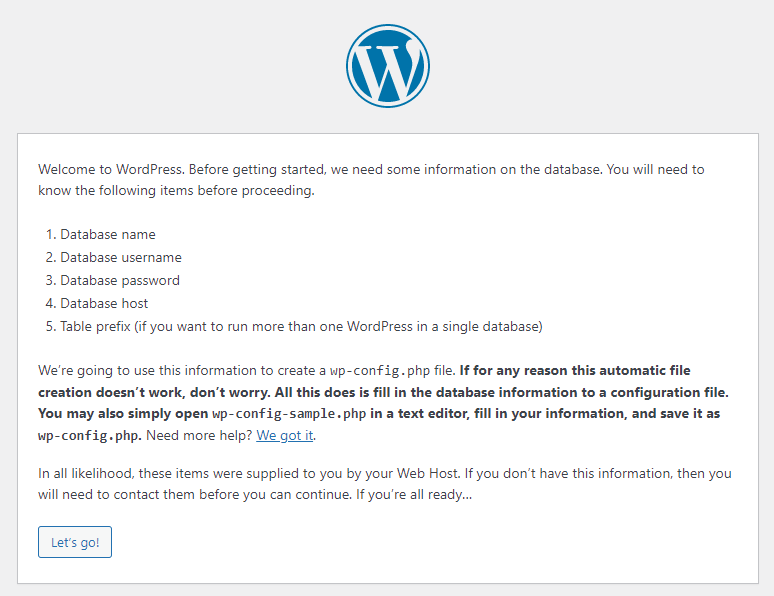


#### STEP2:vmstatでパフォーマンス監視を行う
STEP2ではサーバパフォーマンスを目視で確認します。(これをパフォーマンス監視といいます)立ち上げたコンテナの中に入り`vmstat`コマンドを入力します。
```
# docker exec -it monitoring_bootcamp /bin/bash
container~# vmstat -tw 1
```
`-t`はタイムスタンプ表示、`-w`はワイド表示です。引数の数字は1秒おきに実行するという意味です。vmstatコマンドを叩くとサーバパフォーマンスのメトリクス情報が出てきます。
```
procs -----------------------memory---------------------- ---swap-- -----io---- -system-- --------cpu-------- -----timestamp-----
 r  b         swpd         free         buff        cache   si   so    bi    bo   in   cs  us  sy  id  wa  st                 UTC
 3  0            0      9249760       122220      3209688    0    0     0     0   41  237   0   0 100   0   0 2021-05-28 10:10:46
 0  0            0      9246812       122220      3209688    0    0     0     0   84  371   0   0 100   0   0 2021-05-28 10:10:47
 0  0            0      9246004       122220      3209688    0    0     0     0   34  227   0   0 100   0   0 2021-05-28 10:10:48
 0  0            0      9246116       122220      3209696    0    0     0     0   34  112   0   0 100   0   0 2021-05-28 10:10:49
 0  0            0      9246116       122220      3209696    0    0     0     0   33  241   0   0 100   0   0 2021-05-28 10:10:50
 0  0            0      9246116       122220      3209696    0    0     0     0   32  112   0   0 100   0   0 2021-05-28 10:10:51
```
`man`コマンドでも確認できますが、各数字の意味は以下になります。
- proc
  - r：ランタイム待ちのプロセス数
  - b：割り込み不可能なスリープ状態にあるプロセス数
- memory
  - swpd：仮想メモリの量
  - free：空きメモリの量
  - buff：バッファに用いられるメモリの量
  - cache：キャッシュに用いられるメモリの量
- swap
  - si：ディスクからスワップインされているメモリの量(/s)
  - so：ディスクからスワップアウトされているメモリの量(/s)
- io
  - bi：ブロックデバイスから受け取ったブロック(blocks/s)
  - bo：ブロックデバイスに送られたブロック(blocks/s)
- system
  - in：1秒あたりの割り込み回数。クロック割込みも含む
  - cs：1秒あたりのコンテキストスイッチの回数
- cpu
  - us：カーネルコード以外の実行に使用した時間
  - sy：カーネルコードの実行に使用した時間
  - id：アイドル時間
  - wa：IO待ち時間
- timestamp：タイムスタンプ

次に、実際に負荷をかけて変化の様子を見ていきます。今回はHTTPリクエストを大量に投げるスクリプトを実行して、CPUに負荷をかけてみましょう。端末をもう一つ開き、そこからHTTPリクエストを自身に1万個投げます。(端末が一つしか開けない方は`screen`や`tmux`を駆使しください)
```
# docker exec -it monitoring_bootcamp /bin/bash
container~# seq 1 10000 | xargs -I % -P 20 curl "http://localhost" -o /dev/null -s
```
リクエストを投げると`vmstat`の画面ではどこの負荷がかかっているかが確認できます。
```
負荷かける前
procs -----------------------memory---------------------- ---swap-- -----io---- -system-- --------cpu-------- -----timestamp-----
 r  b         swpd         free         buff        cache   si   so    bi    bo   in   cs  us  sy  id  wa  st                 JST
 0  0            0      9171992       127648      3322200    0    0     0     0   48  218   0   0 100   0   0 2021-05-28 13:30:57
 0  0            0      9171992       127648      3322200    0    0     0     0   30  100   0   0 100   0   0 2021-05-28 13:30:58
 0  0            0      9171992       127648      3322200    0    0     0     0   34  204   0   0 100   0   0 2021-05-28 13:30:59
 0  0            0      9171992       127648      3322200    0    0     0     4   41  128   0   0 100   0   0 2021-05-28 13:31:00
 0  0            0      9171992       127648      3322200    0    0     0     0   34  220   0   0 100   0   0 2021-05-28 13:31:01
```
```
負荷かけた後
procs -----------------------memory---------------------- ---swap-- -----io---- -system-- --------cpu-------- -----timestamp-----
r  b         swpd         free         buff        cache   si   so    bi    bo   in   cs  us  sy  id  wa  st                 JST
 9  0            0      9156508       127648      3322200    0    0     0     0 5351 29472  47  34  19   0   0 2021-05-28 13:31:04
 9  0            0      9157360       127656      3322392    0    0     0    12 5559 31376  48  36  15   0   0 2021-05-28 13:31:05
 2  0            0      9160176       127656      3322508    0    0     0     0 6056 31527  46  37  17   0   0 2021-05-28 13:31:06
 9  0            0      9154440       127656      3322628    0    0     0     0 5915 31500  46  38  15   0   0 2021-05-28 13:31:07
 7  0            0      9151888       127656      3322772    0    0     0     0 5906 31615  49  36  15   0   0 2021-05-28 13:31:08
 ```
 ここで`procs`の`r`、`system`の`in`、`cs`、`cpu`の`us`と`sy`に注目してください。これらの挙動から以下のことが考察できます。
 - `procs`の`r`が異様に高いためプロセスの処理が追いついてない
   - CPUかメモリが原因？`b`に負荷がないからディスクは問題なさそう……。
 - `swap`の`si`か`so`が0だからメモリの量は間に合ってる
   - メモリ原因説はなさそう……。
 - `system`が異様に高く、オーバヘッドが多く生じてる
   - CPUに負荷がかかりすぎている。
 - `cpu`の`us`と`sy`が高く、アイドル時間も短くなってる
   - やはりCPUに負荷がかかっているのが原因か！

といった感じで、もしこのシステムが障害起こした時は「プロセス過多によるCPUへの高負荷が原因である！」と判断が出来るわけです。余力のある方は、`yes > /tmp/yes.txt`を実行し、ディスクIOの負荷も確認してみてください。


### STEP3:curlを使って外部からサービスの動作を監視する
最後のSTEPではサービスがちゃんと動いているかを確認します。「サービスがちゃんと動いている」とは何かについては、サービスごとに定義する必要がありますが、ここでは「WebページにアクセスしてHTTPステータスコード200が返ってくること」とします。まずは、端末をもう一つ開き、そこから`curl`コマンドを使ってHTTPステータスコードを取得します。(端末が一つしか開けない方は`screen`や`tmux`を駆使しください)
```
# while true; do date && curl -LI localhost:8080 -o /dev/null -w '%{http_code}\n' -s; sleep 1; done
もしくは
# watch -n 1 -d curl -LI localhost:8080 -o /dev/null -w '%{http_code}' -s
```
端末に「200」と表示されればOKです。このように、HTTPステータスコードを監視することを「HTTP(S)監視」といいます。この状態でWebサーバ内の情報を書き換えて、エラーを吐かせてみます。別の端末を開き、コンテナ内部の情報を書き換えます。
```
# docker exec -it monitoring_bootcamp mv /var/www/html/wp-admin /var/www/html/wp-admins
```
すると外部からHTTP監視していた端末に「500」と表示されます。つまり「サービスがちゃんと動いていない」と機械的に判断することができます。

かなり地味な監視ではありますが、HTTPステータスコードといったデータを記録することでいつ、どこで、どれぐらいの頻度で、なんのエラーを吐いているかを**ユーザに一番近いところ**で監視することができるため、サービス全体の方針決めに大きなキッカケを作ることができます。そのため地味とは言え軽視はできません。
```
# docker exec -it monitoring_bootcamp mv /var/www/html/wp-admins /var/www/html/wp-admin
```
忘れずに戻しておきましょう。

今回目視で監視を行いましたが、目視での監視を人が常に張り付いて確認するのはイケていないですし、必要なデータの収集も行うとなると大変な作業になります。次章ではこの監視を「Prometheus」というナウでヤングな監視ツールを使って楽に監視する方法を紹介します。

### 1-4. 監視のアンチパターン(読みたい人は読んでください)
監視はそれを実装するシステム時々で正解が異なります。すべてのパターンを紹介するのは現実的ではないため、監視における代表的なアンチパターンを4つほど紹介します。(「入門 監視」より抜粋)
1. ツール依存

一番陥りがちなアンチパターンです。監視デザインが素晴らしく、サービスも成功している会社/チームが使っているツールやその手順を形だけ真似て導入しても、いずれどこかでボロが出て監視に失敗します。目的化を避け、サービスに必要な監視事項を洗い出した上でツールを選定してください。有名な例で「とある島の集落に先進国が水や食料を飛行機を使って運んでいたら、現地の住民が"滑走路を作れば鉄の塊が物資を運んでくる！"と勘違いし、滑走路に似たものを作ったが、そこには一向に飛行機はやってこなかった。」という話があります。形だけ真似ても失敗します。

2. 監視を役割にする

監視のエキスパートを一人持ってきて、その人に監視システムの責任を負わせるのはアンチパターンです。一見、「DBのエキスパート」や「アプリのエキスパート」のように役割として「監視のエキスパート」を誰か一人に任せることは効率がいいように見えますが、システム構成を理解していない人にサービスの監視をさせても「何が異常状態なのかわからない」「今すぐ対応すべきことと後で対応すべきことの判断がつかない」といった状態になり、必要なアラートを無視したり、アラート自体が狼少年状態になることもあります。監視に関するスキルをメンバー全員が持ち、属人化をしないようにしてください。

3. 監視ツールが複雑すぎる

色んな機能が盛りだくさんでパッケージングされている監視ツールをそのまま使うのはアンチパターンです。大抵の場合、担当者以外が操作できなくなります。誰でも使えるツールというのは難しい課題ですが、コンポーネント化されていて必要な機能を組み合わせて利用できる監視ツールが理想と言えます。

4. 手動監視

手動で手順書を手順通り実行し、確認して問題があればアラートを発するような監視は自動化できないか見直す方がいいです。例えば先ほどのハンズオンで行った内容をそのまま監視システムとして組み込み、「人力で確認して200OKじゃないときにアラートを投げる」というのを手動で行っているのなら、それはスクリプトに出来るのでスクリプトにし、監視システム自体がそれを自動実行できるようにするべきです。


### 1-5. まとめ
ここまで監視について基礎的なことを記載しました。監視の目的は「サービスを通してユーザに価値を提供すること」にあます。また、それを達成するための要素として「可視性」「即時性」「特定性」「分析性」の4つがあり、これらを満たす柔軟な監視基盤を組むことで**ユーザに最高の価値を提供しつづける**ようになります。そのために、時として「1からオリジナルの監視ツールを作った方がいい」という場合をもあることを忘れないようにしてください。

ここまで監視の考え方については記載しましたが、具体的な分析方法や必要な監視対象については記載していません。例えば「得た監視データをどう分析するのか？」や「セキュリティ監視やネットワーク監視は何を意識すればいいのか？」などです。これらは監視対象のシステムによって異なることがあるため、いまこの場所で解説しないことにします。講義の最後に参考文献を挙げるので、いくつかの情報を横断的に読み込み、自分の中で腑に落ちる形で解釈することをオススメします。


## 2. Prometheusを触ってみよう
### 2-1. Prometheusとは
Prometheusについて説明する前に、他の監視ツールについて簡単に簡単に紹介します。

世の中にはPrometheus、Zabbix、Datadogというように多くの監視ツールがありますが、それらは「Push型」と「Pull型」の2つに大きく分類することが出来ます。
- Push型監視ツール
  - 特徴
    - 監視対象のサーバにエージェントをインストールして、エージェントから監視サーバへ監視情報を送る
  - メリット
    - 監視対象サーバが増えても対象にエージェントなどを入れるだけで監視対象を増やすことが出来る
  - デメリット
    - 監視サーバを切り替えるときにすべてのエージェントに対して、切替先の監視サーバ情報を新たに追加する必要がある
  - 例
    - Datadog、Machinist
- Pull型監視ツール
  - 特徴
    - 監視サーバが監視対象へ監視情報を取りにいく
  - メリット
    - 開発中に自身のラップトップから監視を実行できる。また、Webブラウザで監視対象を開き、手動でその状態を確認できる。
  - デメリット
    - ノードが増えた時にエージェントなどを入れたうえで、さらに監視サーバの設定ファイルを変更する必要がある
  - 例
    - Prometheus、Zabbix、Nagios

どちらもメリットデメリットがあり優越がつけがたいため、要件にあわせて選ぶ必要があります。

ここからはPrometheusの説明になります。Prometheusはsoundcloud社が作ったPull型の監視ツールです。CNCF管理下でのツールになっていて、ランクはGraduatedで成熟したCNCFプロジェクトとなります。先ほどPull型の監視ツールのデメリットで「サーバを追加する度に監視サーバの設定を変更する必要がある」という項目がありましたが、Prometheusではサービスディスカバリという機能でこの欠点を補っています。

近年、クラウド化が進みAWSやGCP、Azureなどでユーザが自由にサーバを建てたり壊したりすることができるようになりました。まや、Kubernetesのようにコンテナの破壊と創造を頻繁に繰り返すようなツールが普及したことで、監視対象が頻繁に切り替わることが多くあります。そのような中で、それらのサーバをサービスディスカバリで楽に監視することが出来るのが「Prometheus」であり、そういった背景で現在話題に上がっています。また、GO言語でかかれていて実行が早く、exporterやalertmanagerといった監視するためのパッケージが揃っていたことも人気の理由となっています。

サービスディスカバリとは一言でいうと「ある特徴の属性を持つサーバを自動で調べてくれる」機能で、たとえばAWSでは起動しているEC2を一覧化するAPIがあり、サービスディスカバリはそれを使ってホスト情報を取得し、自動で監視対象に追加することができます。

### 2-2. Prometheusで出来ること/出来ないこと
- 出来ること
  - 監視対象のサーバから監視情報の取得
  - 取得した監視情報の保管
  - 監視情報を元にしたアラート(Alertmanagerが必要)
- 出来ないこと
  - 冗長構成(内部のDB構造が冗長性を考慮していない設計なので、外部DBに保存するといった手段を取る必要が出てくる。またはPrometheusサーバを2つ建てるという形で実装可能)
  - ユーザ/ダッシュボードの管理(これを解決するためにGrafanaが使われることが多い)
  - データの長期保存(長期保存を前提として設計されていないので、別途保存用のサーバが必要)
- 出来なさそうで出来ること
  - Push型の監視(「Pushgateway」というサーバを立ててそこから監視情報をpullする形で実装できる)
  - ログ情報を収集してそこからメトリクスを取得(fluentdやtmailの実装が必要)

### 2-3. Prometheusの実装
Prometheusのアーキテクチャは以下の図を見ると分かりやすいです。

登場人物を順に説明します。
- Prometheus Server
  - Retrieval
  - TSDB
  - HTTPserver

Prometheus Serverは読んで字のごとく、監視ツールPrometheusを実行するサーバです。内部はRetrivalとTSDBとHTTPserverで構成されており、Retrivalは「サービスディスカバリで監視対象のサーバを探し出し、exporterから監視情報を取得する」、TSDB(Time Series DataBase)は「取得した情報を時系列データとしてDBに保存する」(TSDBは時系列情報に特化したDBです)、HTTPserverは「DBにあるデータをWebUI上に表示させる」という役割を持っています。

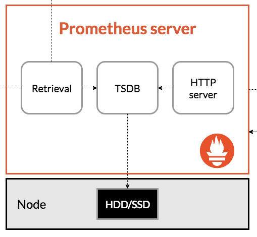

- Prometheus Targets
  - exporter
  - Pushgateway

Prometheus Tartgetsは監視情報を取得したい対象のサーバです。Pull型はこの対象にあるエージェントから監視情報を取得しますが、そのエージェントをexporterといいます。よく使われるプロダクトには典型的なメトリクスを開示するexporterが用意されており、例えばmysqlにはmy-sqlexporterがあります。バッチジョブなどのPullした瞬間に結果が得られなかったり、すでに終了していて応答がない所謂Short-lived jobsはジョブ終了時の測定値をPushgatewayにPushすることで、PrometheusがPushgatewayから監視情報をPullします。

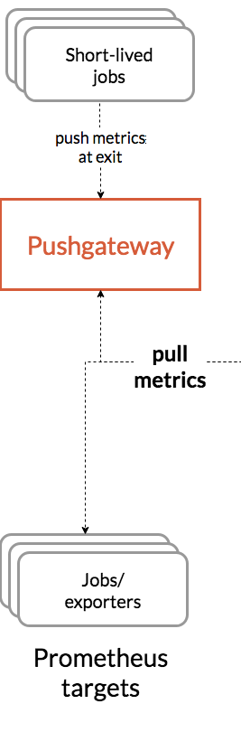

- Alertmanager

AlertmanagerはPrometheus ServerからPushされたAlertを各ツール(slack,mailなど)へ通知することが出来ます。(メールサーバなど外部ツールとの連携を必要とするため、今回はこの箇所のハンズオンは飛ばしています。)

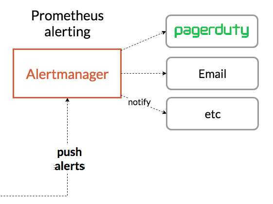

- Data visualization and export
  - PromtheusWebUI
  - Grafana

PrometheusWebUIならびにGrafanaはPrometheusに格納された時系列情報をPromQLという独自のクエリ言語で取得してWebUIに表示させます。


### 2-3. Prometheusハンズオン
ハンズオンは以下の流れで勧めます。
1. PrometheusサーバとWebサーバを建て、node exporterを使ってパフォーマンス監視を行う
2. サービス監視を行うexporterを作ってサービス監視を行う
3. サービスディスカバリ機能を使って監視対象のサーバを追加する

始める前に、ハンズオンで使ったコンテナを`docker stop`で止めておいてください。また、`docker ps`で余計なコンテナがないかを確認してください。(理由があって何かしらのコンテナを立てている場合はポートが被らないように適宜読み替えてください)

構成は以下になります。`docker-compose.yml`という名前でymlファイルを作り以下を書き込んでください。
```
version: '3'
services:
  prometheus:
    image: prom/prometheus
    container_name: prometheus
    volumes:
      - ./prometheus:/etc/prometheus
    command: "--config.file=/etc/prometheus/prometheus.yml"
    ports:
      - 9090:9090
    restart: always

  grafana:
    image: grafana/grafana
    container_name: grafana
    ports:
      - 3000:3000
    restart: always

  wordpress_1:
    image: wordpress:php8.0-apache
    container_name: wordpress_1
    ports:
      - 8080:80
      - 9100:9100
    volumes:
      - ./node_exporter-1.1.2.linux-amd64.tar.gz:/root/node_exporter-1.1.2.linux-amd64.tar.gz
      - wordpress:/var/www/html
    working_dir: /root
    command: >
      bash -c "service apache2 start &&
      tar xvfz node_exporter-1.1.2.linux-amd64.tar.gz &&
      cd node_exporter-1.1.2.linux-amd64 &&
      ./node_exporter"
    restart: always

volumes:
  wordpress:
```
構成をネットワーク図にすると以下です。(ポートは順に対応してます)


次にPrometheusの設定ファイルを作ります。`docker-compose.yml`と同じディレクトリ内にファイルを格納するディレクトリを作り、中に設定ファイルを入れます。
```
# mkdir prometheus
# cd prometheus
# vim prometheus.yml
```
設定ファイルは以下の内容になります。
```
global:
  scrape_interval: 15s

scrape_configs:
  - job_name: 'node'
    scrape_interval: 5s
    static_configs:
      - targets:
        - 'wordpress_1:9100'
```
次に監視対象のサーバに入れるエージェント(exporter)を入れます。まずはパフォーマンス監視を行いたいので、公式が出しているexporter「Node exporter」を`docker-compose.yml`が入っているディレクトリを同じ階層に用意します。
```
# wget https://github.com/prometheus/node_exporter/releases/download/v1.1.2/node_exporter-1.1.2.linux-amd64.tar.gz
```
これで一通りの準備は完了しました。`docker-compose up -d`で`docker-compose.yml`を実行してコンテナを立ち上げてください。(うまく立ち上がらない方は`docker ps`や`docker logs`を使って確認してください)

コンテナの立ち上げが完了したら、ブラウザから`http://<dockerホストのIP:8080>`でwordpressのサイトが表示させることを確認してください。(DBに接続していないので先に進めないのは仕様です)


次にnode exporterの起動確認をします。prometheusはnode exporterに対してhttpでメトリクスを取りに行きますが、ブラウザからも`http://<dockerホストのIP:9100>`から`Metrics`にアクセスすることでメトリクスを見ることができます。

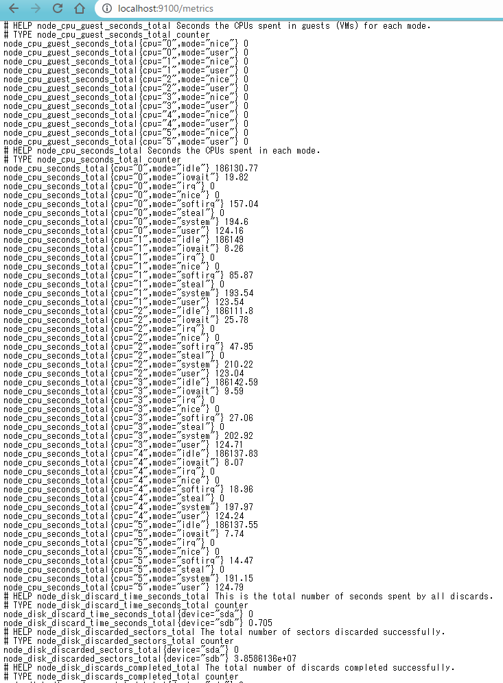

次にPrometheusでメトリクスを持ってこれていることを確認します。Prometheusサーバにブラウザから`http://<dockerホストのIP:9090>`に入り、`Status`から`Target`を選択し、wordpressのサーバがあればOKです。

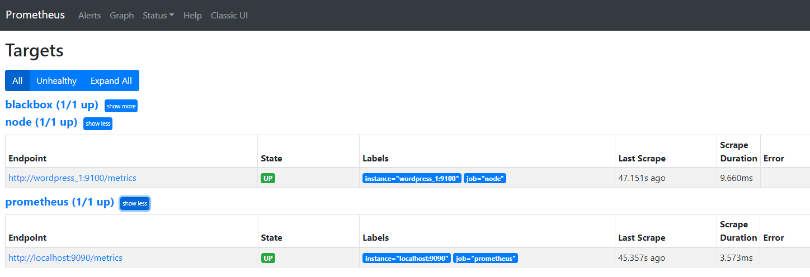

ホーム画面からは好きなメトリックスを表示することが出来ます。試しに`node_memory_Active_bytes`を選択すれば、メモリの使用量が表示されます。

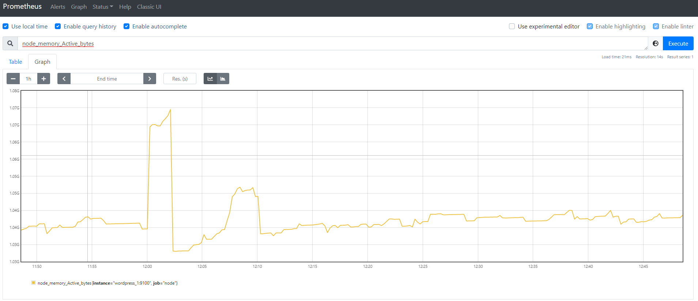

このグラフ上では単純な計算も行えます。例えば先ほどメモリ使用量を出しましたが、メモリ使用率を出したい場合は総メモリで割れば出せます。そのため、`node_memory_MemTotal_bytes`で割る形で表示すればメモリ使用率が表示されます。


最後にこれらの値をPromQL形式でGrafanaに送り、ナウでヤングな可視化を行います。`http://localhost:3000`にアクセスします。ID/PASSはadmin/adminです。


次にPrometheusサーバの場所を設定し、Grafanaにデータを読み込ませます。`Configuration`(左の歯車マーク)から`data source`を選択し、`add data sorce`からPrometheusを選択。

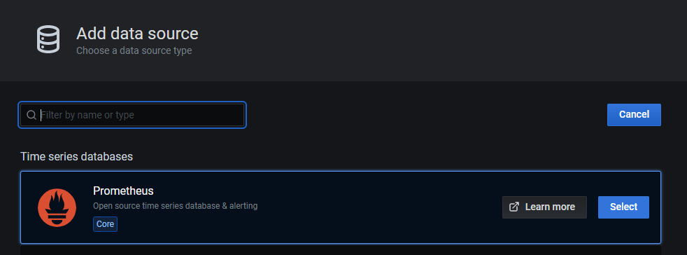

URLにPrometheusサーバである`http://prometheus:9090`を入力し、Accessを`Server(default)`にます。AccessはPrometheusへの接続元を選択します。ここではGrafanaサーバである`Server(default)`を選択していますが、セキュリティの都合で各端末のブラウザからしかPrometheusにアクセスできないような状況では、Accessを`Browser`にブラウザから見たPrometheusサーバを選択してください。docker network上でGrafanaサーバからPrometheusサーバは「http://prometheus:9090」でアクセスできるため、今回は表記になっています。最後に一番下の`save & test`でエラーが出なければOKです。


次にダッシュボードを作っていきます。`Create`タブから`NewDashboard`を選択、`Add Panel`から知りたいメトリックスを選択します。とりあえずロードアベレージ(実行待ちタスクの平均)を1分間、5分間、15分間ので表示させます。`Metrics`から`node_load1`を選択。`+Query`をでクエリを追加し`node_load5`を選択。同様に`+ Query`でクエリを追加し`node_load15`を選択。右側の`Panel`から`Panel title`を編集し、最後に右上のApplyを押すことで、パネルに追加できます。

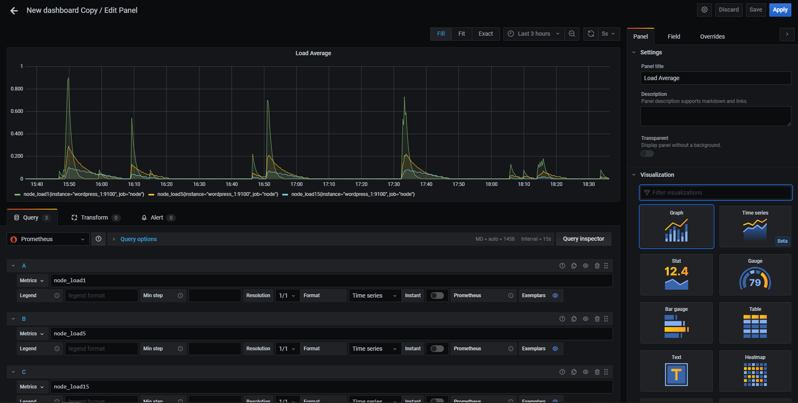

これの繰り返しで自分だけのダッシュボードを作り上げていく形になります。

最後に、Grafanaの公式では、有志の手によってダッシュボードのテンプレートがいくつか用意されているので、今度はお手軽にいい感じのダッシュボードを作ります。まず[Grafana lab](https://grafana.com/grafana/dashboards)にアクセスして、[Node Exporter Quickstart and Dashboard](https://grafana.com/grafana/dashboards/13978?pg=dashboards&plcmt=featured-sub1)を選びます。ここにあるDashboardIDまたは生JSONファイルをメモし、Grafanaにインポートすることで、有志の作ったダッシュボードと同じ形式のダッシュボードを手元で開くことが出来ます。

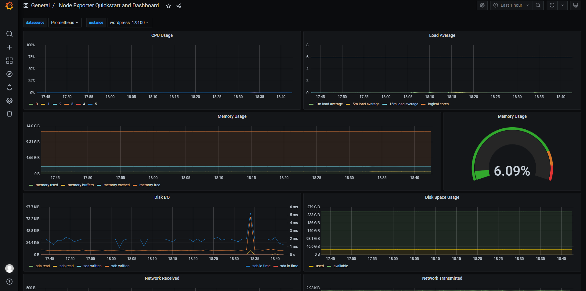

次のSTEPではHTTPでのアクセスを監視する、サービス監視を行います。パフォーマンス監視では監視対象のサーバにexporterを導入して、Prometheusサーバからメトリクスをpullしていましたが、ICMPやHTTPを使った監視はその手段が使えません。そのため、システム内部から監視を行うのではなく、外部から監視を行う「外形監視」という手段で監視します。

外形監視には「blackbox exporter」というexporterを使います。まずblackbox_exporterのコンフィグファイル`blackbox.yml`を作ります。`docker-compose.yml`があるディレクトリ配下で`blackbox.yml`を格納するディレクトリを作成します。
```
# mkdir blackbox_exporter
# cd blackbox_exporter
# vim blackbox.yml
```
設定ファイルは以下の内容にします。ここでは監視先のターゲットを指定しません。Prometheusのサービスディスカバリを使うため、ターゲットはPrometheus側で設定するためです。(ICMPなどの他監視方法も知りたい人は[公式サイト](https://github.com/prometheus/blackbox_exporter)を参照)。
```
modules:
  http_2xx:
    prober: http
    timeout: 20s
    http:
      valid_status_codes: []
      method: GET
      preferred_ip_protocol: "ip4"
```
次にblackbox_exporterのdocker imageを`docker-compose.yml`に追加します。ボリュームのマウントには先ほど追加したコンフィグファイルを指定します。
```
version: '3'
services:
  prometheus:
    image: prom/prometheus
    container_name: prometheus
    volumes:
      - ./prometheus:/etc/prometheus
      - /var/run/docker.sock:/var/run/docker.sock
    command: "--config.file=/etc/prometheus/prometheus.yml"
    ports:
      - 9090:9090
    restart: always

  grafana:
    image: grafana/grafana
    container_name: grafana
    ports:
      - 3000:3000
    restart: always

  wordpress_1:
    image: wordpress:php8.0-apache
    container_name: wordpress_1
    ports:
      - 8080:80
      - 9100:9100
    volumes:
      - ./node_exporter-1.1.2.linux-amd64.tar.gz:/root/node_exporter-1.1.2.linux-amd64.tar.gz
      - wordpress:/var/www/html
    working_dir: /root
    command: >
      bash -c "service apache2 start &&
      tar xvfz node_exporter-1.1.2.linux-amd64.tar.gz &&
      cd node_exporter-1.1.2.linux-amd64 &&
      ./node_exporter"
    restart: always

  blackbox_exporter:
    image: prom/blackbox-exporter
    container_name: blackbox_exporter
    ports:
      - 9115:9115
    volumes:
      - ./blackbox_exporter/blackbox.yml:/etc/blackbox_exporter/config.yml

volumes:
  wordpress:
```
最後にPrometheusのコンフィグファイル`prometheus.yml`に監視対象を追加します。
```
global:
  scrape_interval: 15s 

scrape_configs:
  - job_name: 'node'
    scrape_interval: 5s
    static_configs:
      - targets:
        - 'wordpress_1:9100'

  - job_name: 'prometheus'
    scrape_interval: 5s
    static_configs:
      - targets:
         - 'localhost:9090'

  - job_name: 'blackbox'
    scrape_interval: 30s
    scrape_timeout: 20s
    metrics_path: /probe
    params:
      module: [http_2xx]
    static_configs:
      - targets:
        - http://wordpress_1
    relabel_configs:
      - source_labels: [__address__]
        target_label: __param_target
      - source_labels: [__param_target]
        target_label: instance
      - target_label: __address__
        replacement: blackbox_exporter:9115
```
`relabel_configs`の箇所ではblackbox_exporter自身のラベルを監視対象のラベルに置き換えてます。これをしないとPrometheusに収集されるデータがwordpressに関するものではなく、blackbox_exporterのものだと判断されてしまいます。

これで準備は完了です。`docker-compose up -d`でblackbox_exporterを起動させたのち、`docker-compose restart prometheus`でprometheusのコンフィグファイルを再読み込みしてください。`localhost:9090`でPrometheusサーバにアクセスし、StatusからTartgetを表示し、blackboxが存在すれば成功です。

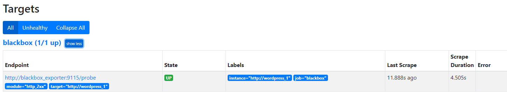

本当にPrometheusが取得できているかグラフを表示させてみましょう。まずPrometheusホーム画面の`Expression`に`probe_success`と入力し、`Excute`を押してください。

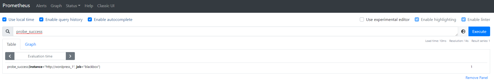

タブをTableからGraphにし、値が`1`になっていれば成功です。`0`は取得に失敗しています。

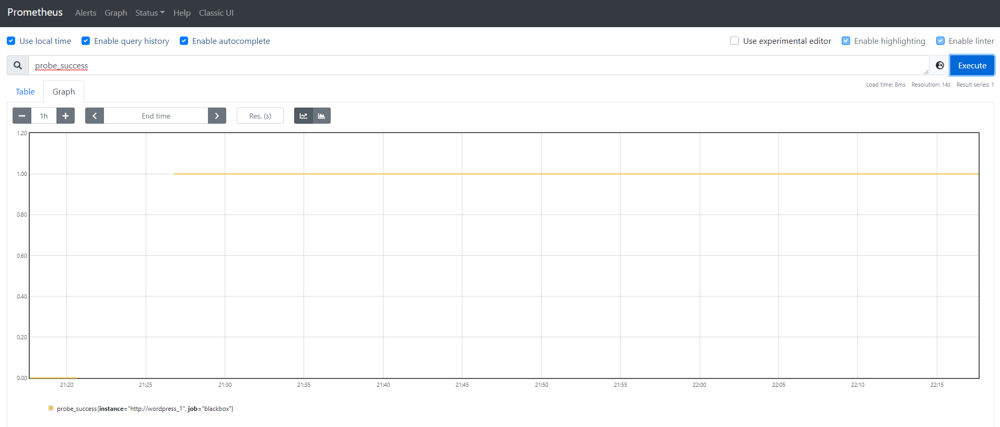

他にも`probe_http_status_code`を使えばそのサイトのHTTPステータスを確認出来たりできます。

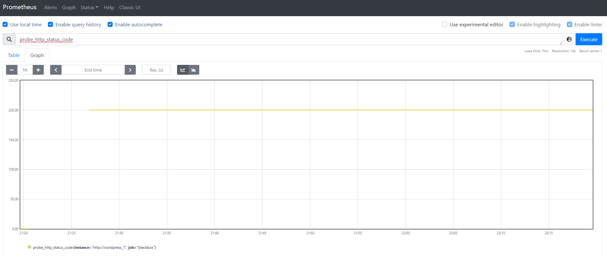

最後にGrafanaでHTTPステータスコードを表示して終わりにします。Grafanaを`localhost:3000`で開き、追加したいダッシュボードを選択します。
次に`Add Panel`からパネル追加画面を開き、`Metrics`に`probe_http_status_code`と入力します。


このままだとステータスコードの数字をグラフにしてるだけで味気ないので、`Instant`をONにし、右のカラムの`Visualization`を`Stat`に変更します。


最後にステータスコードごとに色を変えます。右のカラムのタブを`Field`にし、`Thresholds`を開きます。

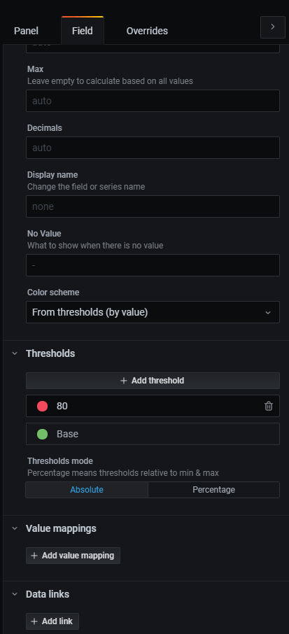

既存の設定は削除し、`300`を黄色、`400`を赤とします。このように設定することでこの値を閾値として、HTTPステータスコードが値を超えると値の色が変ります。下の画像では「200以上300未満は青」「300以上400未満は黄色」「400以上は赤」「それ以外は赤」となるように設定しています。

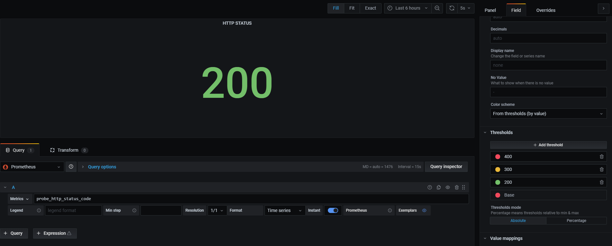

試しにwordpressの中身を書き換えてみましょう。
```
# docker exec -it wordpress_1 mv /var/www/html/wp-admin /var/www/html/wp-admins
```
を実行すればWebサーバの中身が書き換えられ、HTTPステータスコードが500になり、赤くなるはずです。

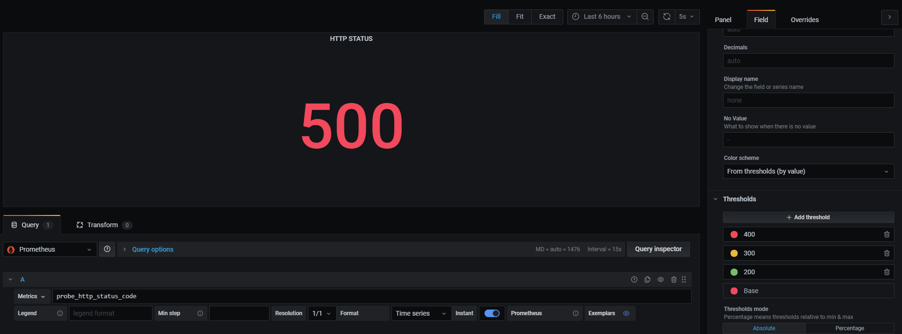

最後に`Apply`することで簡単な監視ダッシュボードが完成しました。

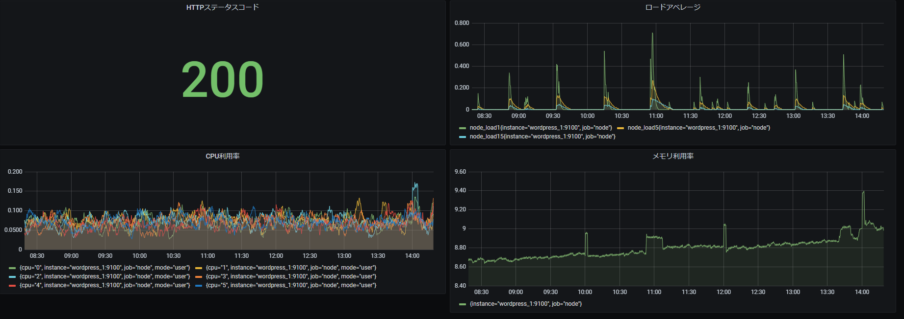

### 2-4. まとめ
Prometheusは非常に柔軟性の高い有力なツールです。実は今回の講義では有力な機能の一つであるサービスディスカバリの恩恵を最大限体験することが出来ていません。ほかにも閾値を超えたらアラートを投げるAlertmanagerなど、重要な機能がまだまだたくさんありますが、dockerにて用意する環境に限界があるため、今回は省略しました。興味のある方は[公式サイト](https://prometheus.io/)などからGetting Startedなどを見てみるといいかもしれません。

## 3. 最後に
本講義では「監視そのものの概念説明」から「実際に監視システムを構築する」ところまでを簡単に紹介しました。今回Prometheusをハンズオンにて使用しましたが、Prometheusは決して銀の弾丸にはなりえないということに注意してください。紹介をしましたがこれは代表的なアンチパターンです。監視という概念について詳しく知りたい方はオーライリーの「入門 監視」を読んでみるといいと思います。Prometheusについてもっと詳しく知りたい方はまだまだ日本語のドキュメントが充実していないため、手探りにはなりますが公式サイトを漁ってみたり、「Prometheus Meetup(JP)」などに参加して導入事例を聞いてみるといいと思います。一応「入門Prometheus」という本が出ています。