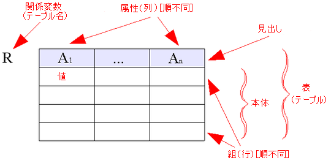
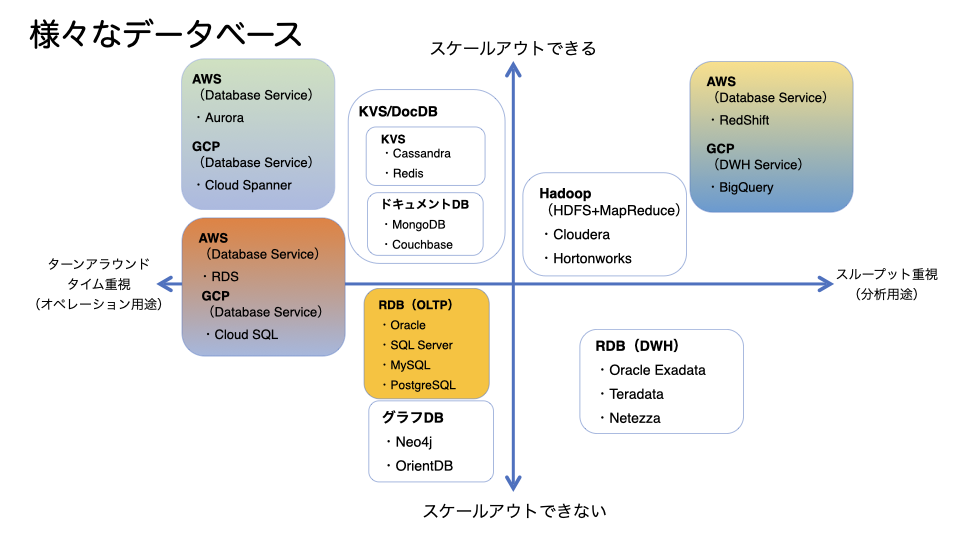

<header-table/>

# Database Overview

Databaseとはいかなる道具かを知るきっかけを与える場として本企画に賛同してこの資料をまとめます。
アプリケーション開発者を目指す方にはデータとの向き合い方を考える一材料として、あるいはDatabaseを
専門的に取り組む事を目指す方にはこれを機に幅広い知識を自ら深める入り口を与えられる事を期待します

## 目次

1. データ、データベースの関係
2. RDBMS(Relational Database Management System)
3. Relational Model
4. SQL(Query)
5. ACID特性
6. データの保全
7. データベースの中で起きている事を知る
8. RDBMSが突きつけられた課題
9. RDBMSに代る選択肢
10. Database as a Service
11. 最適解は何か

## データ、データベースの関係

1. データとは
　「ISO/IEC 2382-1」および日本工業規格の「X0001 情報処理用語-基本用語」において「データ」の用語定義は 
  "A reinterpretable representation of information in a formalized manner suitable for communication, interpretation, or processing."
  「情報の表現であって、伝達、解釈または処理に適するように形式化され、再度情報として解釈できるもの」とされている
   
   出典:WIKIPEDIA
   
2. データベースとは
　　データベースとは、構造化した情報またはデータの組織的な集合であり、通常はコンピューター・システムに電子的に格納されています。データベースは通常、データベース管理システム
  （DBMS）で制御します。データとDBMS、およびそれらに関連するアプリケーションをまとめてデータベース・システムと呼びます。多くの場合は単にデータベースと呼んでいます。

   出典: https://www.oracle.com/jp/database/what-is-database/
   
   *受講者の方に質問
 　  Q.「データベースといって思い浮かべるものは、何ですか？」
   　A.「　　　　」
    
## RDBMS(Relational Database Management System)

1. RDBMS(Relational Database Management System)
   関係（かんけい、リレーション、英: Relation）とは関係モデル（リレーショナルモデル）において、一つの見出しと0以上の同じ型の組(タブル、行)の
   順序づけられていない集合からなるデータ構造のことである

   
   
   出典:WIKIPEDIA
   
   RDBMSにおいてはデータを行と列から構成される2次元の表形式で表す事が多く、ここからはTABLE(表)を使ったデータモデルを例に
   講義を進めます
  
##  Relational Model

1. もう少し身近なデータを使って「関係」を表現してみます
   - 2021年度新入社員の関係性に関するデータをモデル化
　　　
     ```
     // emp
     EMPNO DEPNO ENAME     JOB      MGR  HIREDATE   SAL
     1     10    moriyasu  CEO      null 1992-12-03 XXXXXXXXXXX
     2     20    sorimachi HR-MGR   1001 1993-01-21 XXXXXXXXXXX        
     3     40    ado       ENGINEER 2001 1995-10-30 XXXXXXXXXXX
     4     51    ogawa     SALES    2010 1997-04-01 XXXXXXXXXXX
     5     50    muroya    SALES    2020 1999-06-01 ZZZZZZZZZZZ
     6     51    endo      GENERAL  1002 1999-06-01 ZZZZZZZZZZZ
     7     20    morita    GENERAL  1002 1999-04-01 ZZZZZZZZZZZ
     8     32    furuhashi ENGINEER 2050 2000-04-01 XXXXXXXXXXX
     9     40    asano     ENGINEER 2001 1998-01-01 XXXXXXXXXXX
     10    30    minamino  ENGINEER 2001 1998-01-01 XXXXXXXXXXX

     // dept
     DEPNO DNAME       LOCATION    DESC
     10    CEOROOM     IDB         XXXXXXXXXXX
     20    HR          IDB         XXXXXXXXXXX        
     30    SUPPORT     SRI         XXXXXXXXXXX
     31    OPERATIONS  IDB         XXXXXXXXXXX 
     32    OPERATIONS  FKO         XXXXXXXXXXX
     33    OPERATIONS  OSK         XXXXXXXXXXX
     40    DEVELOPMENT IDB         XXXXXXXXXX
     50    SALES1E     IDB         XXXXXXXXXXX
     51    SALES2E     IDB         XXXXXXXXXXX
     53    SALES1W     OSK         XXXXXXXXXXX
     ```
##  SQL 

1. SQL(Strutured Query Languageの略)
   - データ定義: データを格納する表を定義 / DDL (Data Definition Language)
   - データ操作: 表に対してデータの検索、更新、挿入、削除、複数の表を結合 / DML (Data Manipulation Language)
   - トランザクション機能: データを更新してから、更新情報が確定するまでの一連の流れを管理 / DCL (Data Control Language)

   SQLの中で最も重要な機能となる「データ検索/Query(クエリ)」について触れます
   前述のEMP表、DEPT表を用いて次の条件で”データ検索”を行ってみましょう
   
   Q.全社員の中でSUPPORT部に属している社員名を調べるSQL(Query)が書ける方？
   
   A.「」

##  ACID特性 

1. ACID特性とは
　 信頼性のあるトランザクションシステムの持つべき性質として1970年代後半にジム・グレイが定義した概念
  これ以上分解してはならないという意味の不可分性、一貫性、独立性、および永続性は、トランザクション処理の信頼性を保証する為の性質
   - “Atomicity”   （原子性）
   - “Consistency” （一貫性）
   - “Isolation”   （独立性）
   - “Durability”  （耐久性)
   
## データの保全

1. データの保全
   - データベースにおいてデータの一貫性を保護し，不整合を排除して安全にデータを保管する行為もしくはその考え方
  　
## データベースの中で起きている事を知る

1. データベース内部で起きる最適化の話
   - 最も最小の___でデータ集合を見つける事
   - 出来る限り最小限の___でデータにアクセスする事
  
     -> 何をもって「適切」なのかを判断するデータベース内部の機構を ___ と呼ぶ

   先ほどのemp表、dept表からSUPPORT部所属の社員(とLocation)を「検索」する場合どうなるか？

   ```
   SELECT e.ename, d.loc from emp e, dept d
   WHERE e.deptno=d.deptno AND e.deptno=30
   ;
   ```
    
   表の結合方法を”NASTED LOOP”とすれば、emp表には10行、dept表には10行データがあるので最大で
   10x10回の探索でデータの特定が出来るでしょう。データベース内部では、100回行って探索する事を
   最適か？という事を常に意識して動作している、と理解しておきましょう。
　　　
   ```
   // - データベースをもっと深く勉強したいと考えている方へ課題                   
   // 次のSQLを実行し、結果がどうなって、どのような影響があり、なぜそうなったか調べてみてください
   
   SELECT e.ename, d.loc from emp e, dept d
   WHERE e.deptno=d.deptno AND e.deptno=30
   AND d.deptno=30
   ;
   ```

   「適切」である事は都度状況に応じて変わる、と頭の片隅に必ず置いておきましょう。
 
## RDBMSが突きつけられた課題

1. e-commerce

   - 1990年代後半から、企業がインターネットを介して不特定多数の消費者に対して小売（企業対消費者間取引、B2C）を行うことが徐々に広まる
   - B2CのコマースにおけるDatabaseの重要性は増す一方、役割が多岐に、要件の増大は☝️
   
2. Online Game / Social Game

   - 時期同じくして1997年後半... 
   - アイテム課金 /「射幸性」

     -> あれもこれも「DBに突っ込んでおけ!」
     
        - 余談ですが、筆者はこの頃からDatabaseを知りのめり込んで行きました
        

## RDBMSに代る選択肢

1. データモデルを根底から捉え直す
   - 一時的なセッション情報管理、ユニーク性の担保、テンポラリかつアドホックなデータ等、割り切ってデータを管理したらいいのでは？
   
2. KVS
   - memcached
   - redis
   - cassandora

3. DocumentDB 
   - MongoDB
     - Schemaless
     - JSONファイルをドキュメントとして保存
   - CouchBase

## Database as a Service

1. Databaseの維持管理コストは無視できない、重要性は変わらずむしろ増すばかり
   - MySQLとにかく詳しい人ください
   - Memcachedもわかるとありがたい
   - RedisでClusterは組めますか？
   - 新Versionのあの機能を試したいんです、いつ試せそうですか？
   - 開発者はコードだけを書きたい
   - 管理は専門性とトレードオフ

2. Full Managed Database Service
   - Database管理から開放します、さあどうぞ
     - AWS RDS
     - GCP CloudSQL
   
   - 顧客「性能が全然足りません、なんとかして！」
     - クラウドベンダー「性能要求に応じてスケールアウトさせます!」
     - AWS Aurora
     - GCP Spanner

   - 顧客「クラウドでDataWareHouseが出来ると助かる。費用は使っただけ、にして欲しい」
     - AWS RedShift
     - Google BigQuery




## 最適解

　皆さんは様々な形でデータと向き合い合うことになると思います。この講義で様々なDatabaseが存在する事を紹介し、
本当にごく一部ですがDatabaseの内部構造に触れました。Databaseという便利な道具を使いこなすと、単なるデータの
塊が意味を持ち出し「データ」から貴重な「情報」に変えられるという気づきを与えられればとても嬉しく思います。
 
　繰り返しに成りますがDatabaseは便利な道具に過ぎません、楽しく面白く使い倒してください。
<<<<<<< HEAD

ご清聴ありがとうございました。

=======

ご清聴ありがとうございました。

>>>>>>> 8b3e55cf48d708b35b7252015eca6b5bf21dc753
<credit-footer/>
