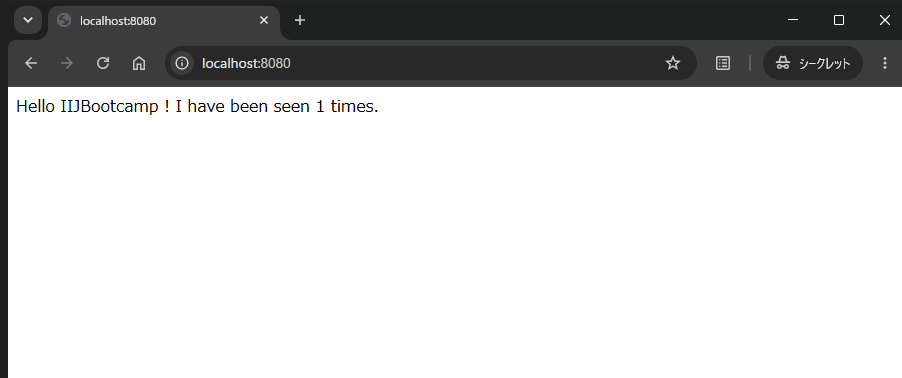

<header-table/>

# {{$page.frontmatter.title}}

## はじめに

### 事前準備

この講義では `docker compose` コマンドを使います。  
受講にあたり、**docker compose** のインストールを済ませておいてください。

> ⚠️ **注意:**  
> 本講義はDocker Compose(V2) 及び`docker compose` コマンドを前提としてドキュメントを記載しています。  
> 従来のDocker Compose(V1) 及び`docker-compose` コマンドでの動作確認は実施していません。

- 環境ごとにインストール方法が異なるので、自身の環境に合わせて導入してください。
  - 一例としてLinux 環境でDocker Compose をインストールする方法が記載された公式ドキュメントを下記に示します。
    - [Install the Docker Compose plugin](https://docs.docker.com/compose/install/linux/#install-using-the-repository)
- インストールが完了したら下記コマンドを実際に入力し、コマンドが実行できるか確認してください。

  ```bash
  $ docker compose version
  ```

### Docker Compose 概要

Docker Compose は、Docker コンテナを管理し、複数のコンテナから成るアプリケーションを定義、実行、管理するためのツールです。  
Docker Compose を使用することで、複数のDocker コンテナを1つのアプリケーションとして簡単に扱うことができます。  
Docker Compose の主な機能は以下の通りです。

- アプリケーションの定義
  - Docker Compose では、YAML 形式のファイルであるdocker-compose.yml を使用して、アプリケーションの構成やサービスの定義を行います。
  - このファイルには、各コンテナのイメージ、ポートマッピング、環境変数、ボリュームのマウントなど、アプリケーションの構成情報が含まれます。
- 複数コンテナの一括管理
  - `docker compose` は、複数のコンテナを一括して管理するためのコマンドを提供します。
    - 例えば`docker compose up` コマンドを実行すると、docker-compose.yml に定義されたすべてのコンテナが起動します。
    - 同様に`docker compose stop` コマンドを使用すると、docker-compose.yml に定義されたすべてのコンテナが停止されます。
- サービス間の依存関係の管理
  - Docker Compose では、複数のコンテナ間の依存関係を簡単に管理することができます。
    - 例えば、アプリケーションがデータベースコンテナとWeb サーバコンテナから成る場合、データベースが正しく起動した後にWeb サーバが起動するようにする、といったことができます。
- 環境変数とシークレットの管理
  - Docker Compose では、環境変数やシークレットの値をdocker-compose.yml に定義することができます。
    - これにより、アプリケーションの設定情報や機密情報を簡単かつ安全に管理することができます。
- スケーリングと更新
  - Docker Compose を使用すると、アプリケーションのスケーリングや更新も簡単に行うことができます。
    - 例えば、`docker compose scale` コマンドを使用すると、特定のサービスのコンテナ数をスケールアップまたはスケールダウンすることができます。また、新しいイメージのビルドや既存のコンテナの更新も`docker compose` コマンドで行うことができます。

このようにDocker Compose を使用することで、開発、テスト、本番環境など、さまざまな環境でアプリケーションを簡単かつ一貫して管理することができます。

### 依存関係を用いたDocker Compose の使い方

前項で説明したように以下の2つのコンポーネントから構成されるWeb サービスをDocker コンテナを用いた場合を想定してみましょう。

- フロントエンド(Flask)
- バックエンド(Rails)

通常、この構成のWeb サービスを起動する際、各コンテナを立ち上げるため、`docker run` コマンドを2回実行する必要がでてきます。従って停止する際も同様に2回の操作が必要です。

しかし、Docker Compose を用いて管理を行うと、各コンテナの定義をした設定ファイルである**docker-compose.yml** に基づいて一括管理することが可能となります。  
具体的には、上記の各コンテナの起動・停止などは、`docker compose` コマンドを1回実行するだけで済みます。

また、コンテナの起動順序も先にデータベースを起動し、後からWeb サーバを起動する、といったように適切な順番で起動することが可能となります。  
これらは特に開発やテストなどの際に、サービスの起動停止は複数回繰り返したりする為、作業の効率化につながります。

本講義では、実際に複数コンテナをDocker Compose を用いて管理を行っていきます。Docker Compose を使ったアプリケーションを実行するまでの一般的な流れは以下の通りです。

- 各コンテナのDockerfile の作成
- docker-compose.yml の作成
- `docker compose` コマンドを使用した複数のコンテナの管理

そこで本講義でも上記の流れに沿って講義を進めていきます。

## 演習1. Docker Compose を用いてサンプルアプリケーションを実行する

本章では、実際に`docker compose` コマンドを使って複数コンテナの立ち上げや停止などをしていただきます。
今回題材のサービスは、Python 製のWebAPI フレームワークとしてFlask を利用したWeb アプリケーションです。
Web アプリケーション自体の作成は本質ではないので、サンプルコードをそのまま利用します。

作業の過程で作成・取得するそれぞれのファイルは以下のように配置してください。

```bash
.
├── app.py
├── docker-compose.yml
├── Dockerfile
└── requirements.txt
```

ここでは演習用のディレクトリとして「bootcamp_compose」を作成し、作成したディレクトリ配下にファイルを配置・作成します。

```bash
$ mkdir bootcamp_compose && cd bootcamp_compose
```

### 1-1. サンプルアプリケーションの作成

本演習は Docker Compose を用いてアプリケーションを実行することがメインであるため Python アプリケーションについては言及しません。  
アプリケーションはそれぞれ以下から取得してください。

```bash
 $ curl -s https://raw.githubusercontent.com/iij/bootcamp/master/src/development/docker/docker-compose/solution/app.py -o app.py
```

```bash
 $ curl -s https://raw.githubusercontent.com/iij/bootcamp/master/src/development/docker/docker-compose/solution/requirements.txt -o requirements.txt
```

### 1-2. Dockerfile の作成

この節では、前述したコンテナのDockerfile を作成します。
Dockerfile の作成については、前講義「Docker を触ってみよう」で行いましたので、各命令などの詳細な説明は割愛します。

以下の内容をファイル名「Dockerfile」で作成してください。

```Dockerfile
FROM python:3.14-slim
WORKDIR /code

ENV FLASK_APP=app.py
ENV FLASK_RUN_HOST=0.0.0.0

COPY requirements.txt requirements.txt
RUN pip install -r requirements.txt

EXPOSE 5000
COPY app.py app.py
CMD ["flask", "run"]
```

### 1-3. docker-compose.yml の作成と解説

次に、以下の内容をファイル名「docker-compose.yml」で作成してください。

```yaml
services:
  web:
    container_name: iij-bootcamp-flask
    build: .
    ports:
      - "8080:5000"
    logging:
      driver: "json-file" # defaults if not specified
      options:
        max-size: "1m"
        max-file: "30"
  redis:
    container_name: iij-bootcamp-backend
    image: "redis:alpine"
    logging:
      driver: "json-file" # defaults if not specified
      options:
        max-size: "1m"
        max-file: "30"
```

では、ファイルの各設定について見ていきたいと思います。

- `services`
  - Docker Compose で管理する各サービスを子要素として定義していきます。
  - 本設定の子要素になっている`web` と`redis` が、それぞれflask とRedis のWeb アプリケーション用のサービスです。ここは、好きな名前を設定できます。
- `redis` の子要素
  - `container_name` は、作成されるコンテナ名を設定しています。この値やサービス名は、別コンテナからアクセスされる際のホスト名としても利用可能となります。
  - `image` では、Docker イメージを指定します。Dockerfile と同様ローカルにDocker イメージが存在しない場合は、DockerHub などからダウンロードしてきます。
- `web` の子要素
  - `build` は、独自にDockerfile などを用いてDocker イメージを作成する際に使う設定です。
  - `build` のvalue には、Dockerfile が格納されているディレクトリを示す`context` が必須となっています。
  - また、今回のようにDockerfile に「Dockerfile」以外の名前を使っている場合は、`dockerfile` で対象ファイル名を指定する必要があります。
  - `ports` は、ホストとコンテナのポートをマッピングする設定です。
  - 今回の場合、backend サービスは、コンテナ内でポート5000で起動しているので、ホストのポート8080へアクセスしたらコンテナ内の5000に接続されるように設定しています。
  - ここに記載する値は、文字列を推奨します。なぜならば、YAML の仕様では、`XX:YY` は、60進数として解釈されてしまうため、意図しない値になる可能性があるためです。
- `logging` では各サービスのログを記録する設定を定義します。

その他詳しい機能について知りたい方は、[公式リファレンス](https://docs.docker.com/compose/compose-file/)をご参照ください。

※ Docker Compose V1 の時代には `version` を記載していましたが、現在のV2 になってからは廃止となりました。

### 1-4. docker compose コマンドを用いてアプリケーションを起動する

必要なファイルが全て揃っていれば、下記の通りの出力になるはずです。ファイルが足りない場合は前項に戻って必要なファイルを準備しましょう。

```bash
$ ls
Dockerfile  app.py  docker-compose.yml  requirements.txt
```

必要なファイルがすべて揃っていたら、以下のコマンドを実行しましょう。

```bash
$ docker compose build
$ docker compose up -d
```

初回実行時は必要な image の取得や Dockerfile.backend を利用した docker build などが実行されるため、時間がかかります。

また、プロキシ環境下で 正常に apk 等が成功しない場合は以下のように `docker compose build` してから試してみてください。

```bash
$ docker compose build --build-arg https_proxy=http://<proxy>:<port>
$ docker compose up -d
```

`docker compose up` コマンドは、docker-compose.yml ファイルに基づきコンテナを新規作成し、起動するコマンドです。  
`-d` オプションを利用することで、デーモンとして起動することが可能です。  
デーモンで起動している際は、ログが標準出力されなくなってしまうので、確認したい場合は`docker compose logs` コマンドで閲覧可能です。  
また、`-f` オプションを指定することで、ログを流し続けることができます。

では、コンテナが起動しているか確認してみましょう。エラーなく`docker compose up` コマンド が実行できていれば一覧にコンテナが2つ出力されます。

```bash
$ docker compose ps
```

<details><summary>実行例</summary>

```bash
NAME                   IMAGE                  COMMAND                  SERVICE   CREATED         STATUS         PORTS
iij-bootcamp-backend   redis:alpine           "docker-entrypoint.s…"   redis     4 minutes ago   Up 4 minutes   6379/tcp
iij-bootcamp-flask     bootcamp_compose-web   "flask run"              web       4 minutes ago   Up 4 minutes   0.0.0.0:8080->5000/tcp, [::]:8080->5000/tcp
```

</details>

`docker compose ps` コマンドでは、Docker Compose で管理してる各コンテナの状態を一覧で見ることができます。  
「State」列がUp で直近の時間になっていれば立ち上がっている状態です。その他のカラムは`docker ps` の意味と基本的に同様です。

### 1-5. Webアプリケーションの動作確認方法

無事に起動できたことを確認したらブラウザでアクセスしてみましょう。
内部では表示回数をカウントしているため、リロードなどをする度に数が増えます。

> 💡 シークレットウィンドウ(Google Chrome) やInPrivate ブラウズ(Microsoft Edge) などキャッシュの影響を受けない状態で開くことを推奨します。

- ブラウザで以下のURLを入力します：  
  http://localhost:8080

- 以下のような画面が表示されれば成功です：  
  

## 演習2 Docker のネットワークを確認する

前項では、Docker Compose でコンテナ間接続を体験しました。  
本項では、Docker がどのようにしてネットワークを構築し、ホストとコンテナやコンテナ間を接続しているのかをご紹介します。

### 2-1. docker network コマンド

`docker network` コマンドは、Docker ネットワークを管理するためのコマンドです。  
`ls` サブコマンドは、Docker が把握しているすべてのネットワーク一覧を表示するコマンドです。  
Docker をインストールすると、自動的に以下の名前の3つのネットワークを作成します。

1. bridge
2. none
3. host

`docker run` コマンドを実行する際に、`--net` オプションで、これらの値を設定することができます。  
デフォルト値では、`bridge` になっています。Docker がインストールされた今回の環境では、ホストに「**docker0**」というブリッジネットワークが表れます。
これが「bridge」に接続されており、Docker はデフォルトでこのネットワークにコンテナを接続します。  
そのため、ホストからコンテナへの接続やコンテナ間の接続が可能となります。`none` は、ネットワークの接続を必要としないコンテナを作成する際に利用します。  
`host` は、コンテナがホストと同じインタフェースやIPアドレスを持たせたい際に利用します。

下記の出力例のうち「default」で終わるネットワークは、`docker compose` コマンドによって自動的に作成されたネットワークのことです。  
「default」の前には、プロジェクト名(docker-compose.yml ファイルが存在するディレクトリ名)が利用されます。

実際に以下のコマンドを実行して、確認してみましょう。

```bash
$ docker network ls
```

<details><summary>出力例</summary>

```bash
NETWORK ID     NAME                       DRIVER    SCOPE
2d48ed9c43eb   bootcamp_compose_default   bridge    local
4d1cc3f9b535   bridge                     bridge    local
91b93258f450   host                       host      local
1bdee409ed81   none                       null      local
```

</details>

### 2-2. docker network の詳細を知る

では、それぞれのネットワークがどのような空間・アドレスレンジを持っているのか確認するにはどうすればいいでしょうか。
`docker network` には`inspect` というサブコマンドがあり、詳細を確認することができるようになっています。

`inspect` サブコマンドでは、引数に取ったネットワークやコンテナの情報を表示できます。本コマンドによって、サブネットやゲートウェイといった情報などが閲覧できます。  
`docker compose` コマンドによって生成されたbridge ネットワークと各コンテナのIP アドレスを`inspect` サブコマンドで確認してみると同一ネットワークにいることが確認できると思います。

以下のコマンドを入力してください。

```bash
$ docker network inspect bootcamp_compose_default
```

※ docker-compose.yml が配置されているディレクトリ名が「bootcamp_compose」でない場合は、ネットワーク名が異なるので演習2-1. の内容を再度確認し、適切なネットワーク名を指定しましょう。


<details><summary>実行例</summary>

```json
[
    {
        "Name": "bootcamp_compose_default",
        "Id": "2d48ed9c43eb50265fde9979e32ba959a1618d2d8e6feea28d9cdb811bd1f6a8",
        "Created": "2026-07-27T17:54:21.333182079+09:00",
        "Scope": "local",
        "Driver": "bridge",
        "EnableIPv4": true,
        "EnableIPv6": false,
        "IPAM": {
            "Driver": "default",
            "Options": null,
            "Config": [
                {
                    "Subnet": "172.18.0.0/16",
                    "Gateway": "172.18.0.1"
                }
            ]
        },
        "Internal": false,
        "Attachable": false,
        "Ingress": false,
        "ConfigFrom": {
            "Network": ""
        },
        "ConfigOnly": false,
        "Options": {},
        "Labels": {
            "com.docker.compose.config-hash": "4bb79eb8cc8ceabf25967d20c04b39b3a1a8942f2115691c39051ac8b70b82ae",
            "com.docker.compose.network": "default",
            "com.docker.compose.project": "bootcamp_compose",
            "com.docker.compose.version": "5.3.1"
        },
        "Containers": {
            "4fd8586d6fb0c2ff435af20307cf9ba3a3b6271c58ea714e9cb2d34854c3065c": {
                "Name": "iij-bootcamp-backend",
                "EndpointID": "371ea4c8d06e5facb87bc1e5eb4644dcae6d4163ec36f84fc54e9b28bb4131d2",
                "MacAddress": "76:62:88:55:c8:63",
                "IPv4Address": "172.18.0.2/16",
                "IPv6Address": ""
            },
            "876b09580a6b56b3cc130f660ec803216a2ca45e5fe98b1253e01c444fd94f1f": {
                "Name": "iij-bootcamp-flask",
                "EndpointID": "c2979fce3d36016df9ef586253b4a9dcf9ac8d10be507cd2046b379254b80a57",
                "MacAddress": "6e:ba:91:f9:d4:de",
                "IPv4Address": "172.18.0.3/16",
                "IPv6Address": ""
            }
        },
        "Status": {
            "IPAM": {
                "Subnets": {
                    "172.18.0.0/16": {
                        "IPsInUse": 5,
                        "DynamicIPsAvailable": 65531
                    }
                }
            }
        }
    }
]
```

</details>

実行例の出力を確認してみると、

- iij-bootcamp-backend
  - 172.18.0.2/16
- iij-bootcamp-flask
  - 172.18.0.3/16

となっており、同一のネットワークにいることが確認できます。  
同一ネットワークにコンテナが配置されていますが、実際にはIP アドレスではなくサービス名を利用して通信することができます。
詳細については割愛しますが、気になる方は[Networking in Compose](https://docs.docker.com/compose/how-tos/networking/) を参照すると良いでしょう。

### 2-3. お片付け

最後に起動しているサービスを停止・削除して綺麗な状態にしておきましょう。

以下のコマンドを入力してください。

```bash
$ docker compose down
```

<details><summary>実行例</summary>

```bash
[+] down 3/3
 ✔ Container iij-bootcamp-backend   Removed                                                                                                                                                                  0.1s
 ✔ Container iij-bootcamp-flask     Removed                                                                                                                                                                 10.1s
 ✔ Network bootcamp_compose_default Removed
```

</details>

エラーなくコマンドが実行されたら、正常にコンテナが削除されていることを確認しましょう。

```bash
$ docker compose ps -a
```

<details><summary>実行例</summary>

```bash
NAME      IMAGE     COMMAND   SERVICE   CREATED   STATUS    PORTS
```

</details>

一覧にコンテナが1つも表示されていなければ、お片付け完了です。

## まとめ

本講義では、Docker Compose を紹介し、実際に`docker compose` コマンドを使って、複数のサービスを管理してみました。  
複数のDocker コンテナを管理する場合、Docker Compose を用いるとDocker 単独で利用するよりも効率的に管理することができるためぜひ利用してください。
また、OSS の中ではDocker イメージを始め、`docker-compose.yml` を公開しているものも多いため、それらを使って簡単に検証作業や環境構築などを行うことができます。  
ぜひ有効活用してみてください。

---
<credit-footer/>
