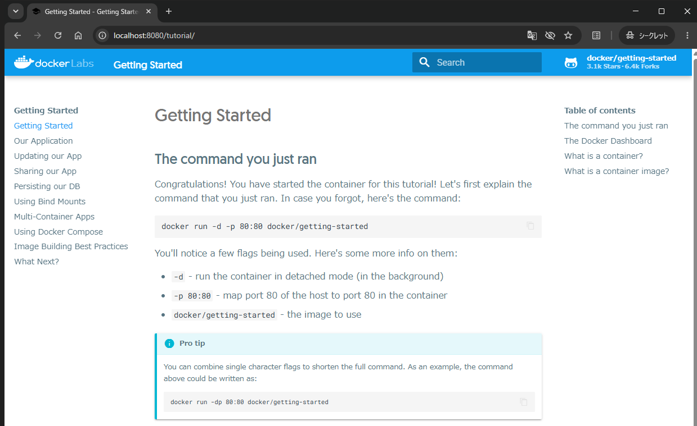

<header-table/>

# Docker コンテナで仮想環境プラットフォームを構築する

## 概要

本項では、Docker コンテナを使って仮想環境プラットフォームを実際に構築・体験をしてみましょう。  
Docker コンテナを使用して仮想環境プラットフォームを構築するには、大きく分けて以下のステップを踏む必要があります。

- Docker イメージのビルド
- Docker コンテナの作成
- Docker コンテナの起動

従って、最初はイメージのビルドが必要となるのですがイメージの作成にはDockerfile の知識が必要です。  
いったんイメージの作成は次項の課題とし、ここでは**既存のDockerコンテナイメージ**を利用して、コンテナの起動と利用を体験しましょう。

## 演習1. hello-worldコンテナを起動する

Docker の動作確認として、公式のhello-world イメージを使ってコンテナを起動します。

```bash
$ docker run --rm hello-world
```

<details><summary>実行中の出力例</summary>

```bash
Unable to find image 'docker/hello-world:latest' locally
latest: Pulling from docker/hello-world
c158987b0551: Pull complete
1e35f6679fab: Pull complete
cb9626c74200: Pull complete
b6334b6ace34: Pull complete
f1d1c9928c82: Pull complete
9b6f639ec6ea: Pull complete
ee68d3549ec8: Pull complete
33e0cbbb4673: Pull complete
4f7e34c2de10: Pull complete
Digest: sha256:d79336f4812b6547a53e735480dde67f8f8f7071b414fbd9297609ffb989abc1
Status: Downloaded newer image for docker/hello-world:latest
89e2c9780f5caf3b5250013e002e8aaf9f8ea74c2e940eca49b890dfc019ab5e
```

</details>

### 成功例

イメージの取得後、次のようなメッセージが表示され、コンテナが終了してターミナルが戻ってくれば成功です。

```text
Hello from Docker!
This message shows that your installation appears to be working correctly.
...
```

## 発展演習1. alpine コンテナでシェルを操作する

演習1.では、コンテナ実行後にメッセージが表示されてすぐ終了します。  
本発展演習では別のイメージを使い、コンテナが終了せず操作できる状態を体験します。  
実際にコンテナ内部でコマンド操作ができることを確認しましょう。

alpine イメージを使い、対話型シェルでコンテナを起動します。

```bash
$ docker run --rm -it alpine sh
```

<details><summary>実行中の出力例</summary>

```bash
Unable to find image 'alpine:latest' locally
latest: Pulling from library/alpine
55afa1ecc21d: Pull complete
56dceff11b33: Download complete
f5124fb579e2: Download complete
Digest: sha256:28bd5fe8b56d1bd048e5babf5b10710ebe0bae67db86916198a6eec434943f8b
Status: Downloaded newer image for alpine:latest
```

</details>

### 成功例

イメージの取得後、以下のようなプロンプトが表示されれば成功です。

```text
/ #
```

この状態でLinux コマンドを試すことができます。  
試しに`date` コマンドを実行してみましょう。

### 実行例

```bash
$ date
Sun Dec 27 00:30:24 UTC 2026
```

コマンドを実行した時刻がUTC で標準出力されているはずです。


### 終了方法

`exit` と入力してシェルを終了すると、コンテナも停止・削除されます。

```bash
$ exit
```

## 発展演習2. Dockerコンテナを起動し、Webサーバを立ち上げる

では、コンテナを使ってサービスを提供することも体験してみましょう。
この演習では、Docker コンテナを使ってWeb サーバをサービスとして起動し、実際にブラウザからアクセスできることを確認します。

まず、`docker run` コマンドで getting-started コンテナをフォアグラウンドで起動します。

```bash
$ docker run --rm -p 8080:80 docker/getting-started
```

<details><summary>実行中のログ</summary>

```bash
Unable to find image 'docker/getting-started:latest' locally
latest: Pulling from docker/getting-started
c158987b0551: Pull complete
1e35f6679fab: Pull complete
cb9626c74200: Pull complete
b6334b6ace34: Pull complete
f1d1c9928c82: Pull complete
9b6f639ec6ea: Pull complete
ee68d3549ec8: Pull complete
33e0cbbb4673: Pull complete
4f7e34c2de10: Pull complete
Digest: sha256:d79336f4812b6547a53e735480dde67f8f8f7071b414fbd9297609ffb989abc1
Status: Downloaded newer image for docker/getting-started:latest
89e2c9780f5caf3b5250013e002e8aaf9f8ea74c2e940eca49b890dfc019ab5e
```

</details>

### 起動の確認

> 💡 シークレットウィンドウ(Google Chrome) やInPrivate ブラウズ(Microsoft Edge) などキャッシュの影響を受けない状態で開くことを推奨します。

- ブラウザで以下のURLを入力します：  
  http://localhost:8080

- 以下のような画面が表示されれば成功です：  
  

### コンテナの終了

**Ctrl + C** を押して終了します。

---
<credit-footer/>
