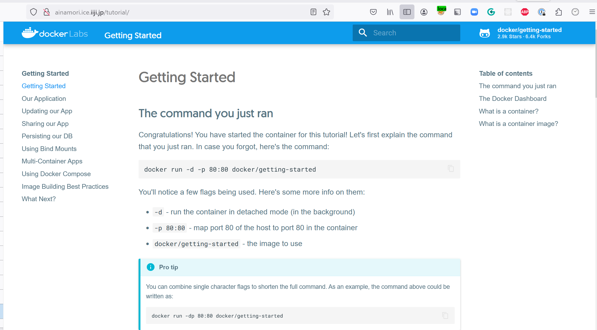

<header-table/>

## おさらい

それでは実際にDockerを使って仮想環境プラットフォームを作ってみましょう。
事前準備の項を済ませているならばDocker環境は構築されているはずです。
下記コマンドを入力し、コマンドが実行できるか確認してください。

```bash
$ docker version
```

上記コマンドが実行できない方は事前にDocker（及びコマンド）のインストールが終わっているか否か確認し、未完了の人は、Docker のインストールを行ってください。

## Docker コンテナを起動する

Dockerコンテナを使って仮想環境プラットフォームを構築するには、大きく分けて以下のステップを踏む必要があります。

- Dockerイメージのビルド
- Dockerコンテナの作成
- Dockerコンテナの起動

従って、Dockerコンテナを起動する為に最初にすべきことは**Dockerコンテナイメージ**を取得する事になります。

Dockerコンテナイメージは、自分で作成(ビルド)して取得する方法と、作成済みのDockerコンテナイメージを取得する方法の2種類があります。
まずは、作成済みのイメージを利用してコンテナを起動することを試してみましょう。

### 演習1 Dockerコンテナを起動する

- **docker run**コマンドを使用して**getting-started**コンテナを起動する
  ```bash
  docker run --rm -p 80:80 docker/getting-started
  ```
<details><summary>実行中のログ</summary>

```
Unable to find image 'docker/getting-started:latest' locally
latest: Pulling from docker/getting-started
c158987b0551: Pull complete
1e35f6679fab: Pull complete
cb9626c74200: Pull complete
b6334b6ace34: Pull complete
f1d1c9928c82: Pull complete
9b6f639ec6ea: Pull complete
ee68d3549ec8: Pull complete
33e0cbbb4673: Pull complete
4f7e34c2de10: Pull complete
Digest: sha256:d79336f4812b6547a53e735480dde67f8f8f7071b414fbd9297609ffb989abc1
Status: Downloaded newer image for docker/getting-started:latest
89e2c9780f5caf3b5250013e002e8aaf9f8ea74c2e940eca49b890dfc019ab5e
```
</details>

- 起動の確認
  - ブラウザを開き、以下のURLを入力します
    ```
    http://localhost:80
    ```
  - 以下のような画面が表示されれば成功です
    
- コンテナの終了
 **Ctrl + c** を押す
- ターミナルが戻ってくる

### 発展課題1

先ほどの作業ではフォアグラウンドで実行している為、ターミナルが占有されてしまいます。
また、このような起動では例えばssh等で接続している場合はセッション切断と共にコンテナが停止してしまう為、発展課題ではこれを永続化する事をやってみましょう。

デーモン起動をすると、ターミナルは返ってきてしまうため起動確認は `docker ps`を使って確認します。

- コンテナのデーモン起動
  ```bash
  docker run --rm -p 80:80 docker/getting-started
  ```
- コンテナの起動確認
  ```bash
  CONTAINER ID   IMAGE                    COMMAND                   CREATED         STATUS         PORTS                               NAMES
  38ebcf110f45   docker/getting-started   "/docker-entrypoint.…"   3 seconds ago   Up 2 seconds   0.0.0.0:80->80/tcp, :::80->80/tcp   fervent_shaw
  ```
  - ここで**NAMES**に表示されている値を記憶、若しくは記録しておいてください
- 起動の確認
  - ブラウザを開き、以下のURLを入力します
    ```
    http://localhost:80
    ```
  - 以下のような画面が表示されれば成功です
    
- コンテナの終了
  - **docker stop**コマンドを用いてdockerコンテナを停止します
  ```
  docker stop <NAME>
  ```
- コンテナが停止したことの確認
  - ブラウザにて **http://localhost**にアクセスし、アクセスできないことを確認する
  - **docker ps**コマンドを用いて、何も表示されないことを確認する
    ```
    docker ps
    CONTAINER ID   IMAGE     COMMAND   CREATED   STATUS    PORTS     NAMES
    ```

<credit-footer/>
