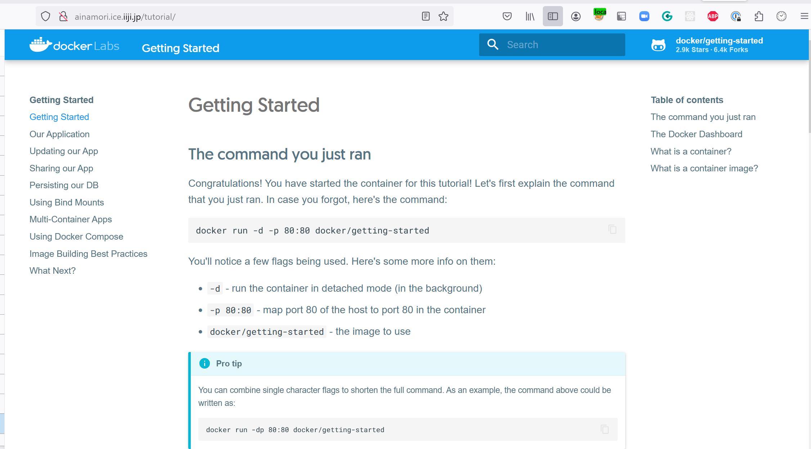

<header-table/>

## おさらい

前回ではコンテナの起動に作成済みのイメージを使ってコンテナを起動していました。
今回は作成済みのコンテナイメージを使ってコンテナを起動するのではなく、コンテナイメージの作成から行ってみましょう。

### 演習2 Dockerコンテナイメージを作成する

Dockerコンテナイメージの作成には予め作成済みである`DockerFile`を使用します

- DockerFileの取得
  ```bash
  git clone https://github.com/docker/getting-started.git
  ```
- イメージのビルド
  ```bash
  cd getting-started
  docker build -t iijbootcamp_docker01 .
  ```
- コンテナの起動
  ```bash
  docker run --rm -p 80:80 --name iijbootcamp_docker01-tutorial iijbootcamp_docker01
  ```
<details><summary>実行中のログ</summary>

```
/docker-entrypoint.sh: Looking for shell scripts in /docker-entrypoint.d/
/docker-entrypoint.sh: Launching /docker-entrypoint.d/10-listen-on-ipv6-by-default.sh
10-listen-on-ipv6-by-default.sh: info: Getting the checksum of /etc/nginx/conf.d/default.conf
10-listen-on-ipv6-by-default.sh: info: Enabled listen on IPv6 in /etc/nginx/conf.d/default.conf
/docker-entrypoint.sh: Launching /docker-entrypoint.d/20-envsubst-on-templates.sh
/docker-entrypoint.sh: Launching /docker-entrypoint.d/30-tune-worker-processes.sh
/docker-entrypoint.sh: Configuration complete; ready for start up
2022/06/17 04:10:18 [notice] 1#1: using the "epoll" event method
2022/06/17 04:10:18 [notice] 1#1: nginx/1.21.6
2022/06/17 04:10:18 [notice] 1#1: built by gcc 10.3.1 20211027 (Alpine 10.3.1_git20211027)
2022/06/17 04:10:18 [notice] 1#1: OS: Linux 4.18.0-348.2.1.el8_5.x86_64
2022/06/17 04:10:18 [notice] 1#1: getrlimit(RLIMIT_NOFILE): 1048576:1048576
2022/06/17 04:10:18 [notice] 1#1: start worker processes
2022/06/17 04:10:18 [notice] 1#1: start worker process 32
```

</details>

- ここまでできたらDockerコンテナによる仮想環境プラットフォームの構築は完了です。
  - とりあえずここでは **Ctrl+C** で停止してください。

### 発展課題2

前回同様、演習. 2の通り実施するとターミナルが占有されていまいます。
従って、今回もバックグラウンドで起動し、ターミナルが占有されないように実行してみましょう

- コンテナのデーモン起動
  ```bash
  docker run --rm -p 80:80 -d --name iijbootcamp_docker01-tutorial iijbootcamp_docker01
  ```
- コンテナの起動確認
  ```bash
  CONTAINER ID   IMAGE                    COMMAND                   CREATED         STATUS         PORTS                               NAMES
  38ebcf110f45   docker/getting-started   "/docker-entrypoint.…"   3 seconds ago   Up 2 seconds   0.0.0.0:80->80/tcp, :::80->80/tcp   fervent_shaw
  ```
  - ここで**NAMES**に表示されている値を記憶、若しくは記録しておいてください
- 起動の確認
  - ブラウザを開き、以下のURLを入力します
    ```
    http://localhost:80
    ```
  - 以下のような画面が表示されれば成功です
    
- コンテナの終了
  - **docker stop**コマンドを用いてdockerコンテナを停止します
  ```
  docker stop <NAME>
  ```
- コンテナが停止したことの確認
  - ブラウザにて **http://localhost**にアクセスし、アクセスできないことを確認する
  - **docker ps**コマンドを用いて、何も表示されないことを確認する
    ```
    docker ps
    CONTAINER ID   IMAGE     COMMAND   CREATED   STATUS    PORTS     NAMES
    ```

## 参考

### Docker イメージのビルド

Dockerコンテナを使って仮想環境プラットフォームを作成するためには、Dockerイメージが必要となります。

通常であれば、`Dockerfile`を使用して自分のアプリケーションのDockerイメージを作成します。
`Dockerfile`は、アプリケーションの依存関係や設定、実行コマンドなどを指定するためのテキストファイルです。
`DockerFile`が作成できたらDockerイメージをビルドして作成します。その際に使うコマンドは`docker build`になります。

通常であればテキストエディタを開いて`DockerFile`を作成しますが、完全にゼロの状態から`DockerFile`を作成するのは難しい為、先ずはチュートリアル用に公開されている物を使用すると良いでしょう

<credit-footer/>
