<header-table/>

# Gitの使い方

## 0. まえがきと事前準備

### 0.1. この講義の目的

バージョン管理システムとしてgitを利用し、**変更**を管理することの大切さを学び、
gitとgithubを使った基本的なソフトウェア開発サイクルを回せるようになることがこの講義の目的です。

### 0.2. 対象の読者

これからプログラムを書く、またはテキストファイルによる設定ファイル、マニュアル、仕様書などを記述する可能性のある技術者を対象としています。

講義にあたって事前に以下の要件を満たすようにしてください。

- 以下のコマンドを使えること
  - ls, cd, mkdir
- vi(m), emacs, nanoのいずれかでテキスト編集ができること

### 0.3. この講義で取り扱わないこと

- RCS（Revision Control System）、Subversionなどのバージョン管理システム

### 0.4. 事前準備

この講義では実際にgitコマンドを操作しながら覚えてもらいます。
事前に自分のPCにgitをインストールして使えるようにしておきましょう。

ダウンロード元: [Git - Downloads](https://git-scm.com/downloads)

各OSごとのインストール方法は[Pro Git](https://git-scm.com/book/ja/v2/%E4%BD%BF%E3%81%84%E5%A7%8B%E3%82%81%E3%82%8B-Git%E3%81%AE%E3%82%A4%E3%83%B3%E3%82%B9%E3%83%88%E3%83%BC%E3%83%AB)
を参照してください、

以下のようにしてgitコマンドが実行できることを確認しておきましょう。

```bash
$ git --version
git version 2.21.0
```

インストールがうまトファイルの文字コードはUTF-8で作くいかなかった人は講義の前に申し出てください。
バージョンは2以上のものであればどのバージョンでも構いませんが、なるべく最新版を入れるようにしてください。

## 1. バージョン管理システムとは

バージョン管理システム(Version Control System, VCS)とは、
ファイルの「変更」を記録し、**誰が**、**いつ**、**どんな変更を**行ったかを参照することができるようにするソフトウェアのことです。
VCSにはたくさんの種類がありましたが戦国時代を経て、現在ではgitがデファクトスタンダードと言ってもよい状況となっています。

### 1.1. たくさんのバージョン管理システム

- [git](https://git-scm.com/)
- [Mercurial](https://www.mercurial-scm.org/)
- [Apache Subversion](https://subversion.apache.org/)
- Visual SourceSafe
- [BitKeeper](http://www.bitkeeper.org/)
- [RCS](http://www.gnu.org/software/rcs/rcs.html)

ではなぜVCSを使うとどんないいことがあるのでしょうか？

まず、最新の状態が一目瞭然です。もう`最新_コピー(2)_修正版`のようなファイル名を付ける必要はありません。
いつでも任意の時点の内容にファイルを戻すことができますので安心してファイルを上書きすることができます。

また問題が発生した場合にいつから発生していたのかを調べたり、昔のファイルに戻して復旧させたり、
コードを書いた人を調べて直接質問しに行ったり

## 2. gitの初期設定

まずは自分の情報を登録しましょう。

自分の名前とメールアドレスします。
`--global`オプションをつけているので、あらゆるリポジトリでこの設定が有効になります。

```
  $ git config --global user.name 'Kazuki Hamasaki'
  $ git config --global user.email 'kazuki-h@iij.ad.jp'
```

登録した情報を確認してみましょう。

```
$ git config -l
```

今後コードの変更を行うとその変更の作者を示す情報として、この情報が使用されます。

## 3. リポジトリを作成する

ファイルやディレクトリを記録するための場所のことを **リポジトリ(Repository)** と呼びます。
1つのソフトウェアで1つのリポジトリとすることが多いです。
EclipseのProjectや、Visual StudioのSolutionの単位と同じと考えてもらうのがよいです。

なにはともあれ、リポジトリがないと始まりません。
以下の手順でリポジトリを作成してください。

- 好きな場所にディレクトリを作成し、移動する

```
$ mkdir git_handson
$ cd git_handson
```

- このディレクトリをgitリポジトリとして初期化する

```
$ git init
```

これであなたのいるディレクトリはgitリポジトリとなりました。

## 4. Gitの基本 変更の記録



リポジトリの中にgitで変更を管理しないファイルを置いておくこともできます。
gitで変更を管理することを`追跡(track)`と呼びます。
追跡されていないファイルは`Untrack`です。

追跡されてるファイルは`Unmodified`、`Modified`、`Staged`の3つの状態で管理します。

- Unmodified
  - 変更されていないファイル
- Modified
  - 変更されたファイル
- Staged
  - ステージされているファイル

変更したファイルはステージングエリアに乗せます。
ステージングエリアに乗っているファイルがまとめてひとつの変更として記録されます。
ファイルの変更を記録することを **コミット(Commit)** と呼びます。

### 4.1. コミットする

ファイルを作成して、さっそくコミットしましょう。

- 以下の内容のファイルを作成する。（お好きなエディタでどうぞ！）

::: warning
テキストファイルの文字コードはUTF-8で作成しましょう。このあとの操作で文字化けすることがあります。
:::

```
$ vim hello.txt
```

※typo していますが、そのまま記述してください。

```
おはよう ぎっと
こんにちは ぎっと
こんばんは じっと
```

gitがファイルをどのように扱っているか確認してみましょう。

- ファイルの状態を確認する

```
$ git status
```

以下のように表示されます。

```
Untracked files:
  (use "git add <file>..." to include in what will be committed)

	hello.txt

nothing added to commit but untracked files present (use "git add" to track)
```

リポジトリの中にファイルを置いただけで追跡されるわけではありません。
そのためファイルを新しく作った場合には`Untracked`に表示されます。

`hello.txt`への変更を記録するためにはまずステージングエリアに登録する必要があります。

- コミットしたいファイルをステージングエリアへ登録する

```
$ git add hello.txt
```

- ファイルが`Staged`として登録されていることを確認する

```
$ git status
```

- ステージングエリアのファイルをコミットする

```
$ git commit
```

コミット時にはメッセージを記入することができ、これを**コミットメッセージ**と呼びます。
あとから見たときにどのような変更を入れたかわかりやすくするためのものです。

- テキストエディタが起動するので、コミットメッセージを記入します。

```
  1 はじめてのgit
  2
  3 # Please enter the commit message for your changes. Lines starting
  4 # with '#' will be ignored, and an empty message aborts the commit.
  5 #
  6 # Date:      Wed Jun 26 22:08:30 2019 +0900
  7 #
  8 # On branch master
  9 #
 10 # Initial commit
 11 #
 12 # Changes to be committed:
 13 #   new file:   hello.txt
 14 #
```

::: tip
nanoが起動して困りましたか？
好きなエディターを使いたい場合は以下のように設定します。

```
git config --global core.editor 'vim -c "set fenc=utf-8"'
```

atomを使いたい人は`--wait`オプションが必要です。

```
git config --global core.editor "atom --wait"
```
:::

#### 4.1.1. コミットメッセージには理由を書こう

コミットメッセージには**なぜその修正を入れたのか**理由を書くようにしましょう。

どんな修正を入れたかは履歴を見れば確認できます。
なぜその修正を入れる必要があったかは往々にしてコードには現れません。
それを残しておくための場所がコミットメッセージです。

### 4.2. コミットの確認

- 歴史が刻まれていることを確認します。

```
$ git log

commit b8490bfc83a2c91bac6772b2f9e533ccf2455baf (HEAD -> master)
Author: Kazuki Hamasaki <kazuki-h@iij.ad.jp>
Date:   Wed Jun 26 22:08:30 2019 +0900

    はじめてのgit
```

`commit`はコミットごとに発行される一意のIDでコミットハッシュ値と呼ばれています。
`Author`はコミットを作成した人です。「2. gitの初期設定」で設定した値が使われているはずです。
`Data`はコミット日時ですね。
その下にはコミットコメントが表示されています。

でもどんな変更を入れたか表示されていませんね。

- 前回のコミットの内容を表示してみる

```
$ git show
```

`git show`では変更に関する差分のみが表示されます。
ここの差分はユニファイド形式になっています。
`+`が追加された行、`-`が削除された行です。
ファイルがまるごと追加されたため、すべての行が追加されたという表示になっています。

よく見たら[typo](http://e-words.jp/w/%E3%82%BF%E3%82%A4%E3%83%9D.html)してますよね。直してみましょう。

### 4.3. さらにコミットを積み重ねる

- typo を直しましょう

```
$ vim hello.txt
```

```
おはよう ぎっと
こんにちは ぎっと
こんばんは ぎっと
```

- コミットする前に、前コミットとの変更差分をみてみます。

```
$ git diff
```

タイポだけを直せていますか？

- 問題なければコミットします

```
$ git add hello.txt
$ git status
$ git commit
```

- コミットの確認

```
$ git log
$ git show
```

コミットの履歴と差分をまとめて見るには`git log`の`-p`オプションが利用できます。

- コミットの履歴と差分をまとめて確認する

`git log -p`

## 5. ブランチ

### 5.1. 実はあなたは今、"master"というブランチにいます

`ブランチ(Branch)`とは、履歴の流れを分岐させて記録する仕組みです。
Gitリポジトリを作成すると、自動的に"master"ブランチが一つ作成されています。

- 現在のブランチを確認してみましょう

```
$ git branch
```

"*" は現在のブランチを指しています

ブランチの切り方としては、作業内容単位で切っていくのが一般的です。
何か作業をするときはとりあえずブランチを切ってそこで作業を行い、
完了しだい"master"ブランチに反映させます。

"master"ブランチをそのままメインブランチとして扱うことが多いです。
今回もその慣習に従います。

### 5.2. 新たな Branch を作る

今度は "ぎっと" を "Git" に直したい。
せっかくなので別のブランチで作業してみましょう。

- "fix"というブランチを作成してみます。

```
$ git branch fix
```

- ブランチを確認する

```
git branch
```

"fix"ブランチを作成したものの、
あなたはまだ "master"ブランチにいるままです。

### 5.3. ブランチを移動する

-  "fix" Branch に移動するために Checkout する

```
git checkout fix
```

- 現在のブランチを確認する

```
git branch
```

" * " が "fix" を指すようになりましたね?

- コミットを確認してみる

```
git log
```

ブランチを作成した時点での"master"ブランチのコミットが引き継がれているはずです。

### 5.4. "fix"ブランチで Commit する

- ファイルを書き換える

```
$ vim hello.txt
```

```
おはよう Git
こんにちは Git
こんばんは Git
```

- Commit する

```
$ git add hello.txt
$ git status
$ git commit
```

- 確認する

```
$ git log
$ git show
```

これで "fix"ブランチで Commit を積むことができました。
"master"ブランチに戻るとどう見えるでしょう。

### 5.5. "master"ブランチへ戻る

- "master" へ移動するために Checkout します

```
$ git checkout master
```

- "master"ブランチの履歴を見る

```
$ git log
$ git show
```

先ほどの Commit は"fix"ブランチで行ったものなので、当然見えません。

### 5.6. Merge する

"master"ブランチに "fix"ブランチの変更を取り込みます。
- "fix"ブランチの変更内容を、メインである"master"ブランチへ取り込みましょう

```
$ git merge fix
```

- 確認してみましょう

```
$ git log
$ git show
```

"fix"ブランチで行ったコミットが取り込まれていれば問題ありません。

Git の基本操作をひと通り流してやってみました。
Git ハンズオンは以上で終了です。

## 6. 参考文献

さらに高度な使い方を知りたい方は[Pro Git](https://git-scm.com/book/ja/v2)が便利です。日本語版が公開されています。
