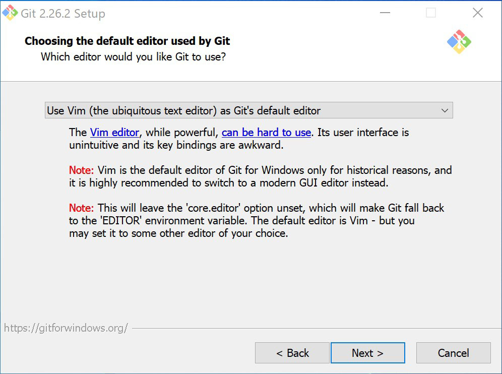
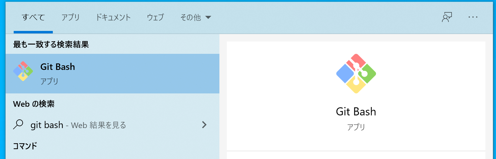

<header-table/>

# {{$page.frontmatter.title}}

## 0. まえがきと下準備

### 0.1. この講義の目的

バージョン管理システムとしてGitを利用し、**変更**を管理することの大切さを学び、
GitとGitHubを使った基本的なソフトウェア開発サイクルを回せるようになることがこの講義の目的です。

### 0.2. この講義のゴール

手元のPCでGitとGitHubが利用できる状態になっていて、[GitHub Flow](https://gist.github.com/Gab-km/3705015)を利用した開発ができるようになる。

### 0.3. 想定する受講者

これからプログラムを書く、またはテキストファイルによる設定ファイル、マニュアル、仕様書などを記述する可能性のある技術者を対象としています。
主に新卒の技術職採用者を想定しています。中級者向けの応用的な内容は扱いません。

講義にあたって事前に以下の要件を満たすようにしてください。

- ITパスポート試験レベルの技術を理解している。
- 基礎的なコマンドラインの操作ができる。
  - ls, cd, mkdirを使ってディレクトリの移動、ファイルの操作が行える。

新卒研修の内容を踏まえたものになっています。
プログラミング言語の知識は必要ありません。
自分がこの講義を受講したらよいかわからない、受講できるレベルにあるかわからない場合は担当のメンターに相談してください。

### 0.4. この講義で取り扱わないこと

- RCS（Revision Control System）、Subversionなどのバージョン管理システム

### 0.5. この資料のお約束

:computer: は自分で操作する箇所を示しています。

 <ほげほげ> で囲まれている部分は自分の設定値で置き換えてください。たとえば

```
git clone <リモートリポジトリのアドレス>
```

と記載されている箇所は

```
git clone git@github.com:iij/bootcamp.git
```

というように置き換えてください。

## 1. Gitをインストール

この講義では実際にGitコマンドを操作しながら覚えてもらいます。
事前に自分のPCにGitをインストールして使えるようにしておきましょう。

### Windows

先にテキストエディタをインストールしておきましょう。
メモ帳ではデフォルトの文字コードがUTF-8になっていないことがあります。
この講義では[VSCode](https://azure.microsoft.com/ja-jp/products/visual-studio-code/)を推奨します。
[Atom](https://atom.io/)や[Sublime Text](https://www.sublimetext.com/3)、[Notepad++](https://notepad-plus-plus.org/)を使ってもかまいません。Vimに慣れている人はVimを使ってもよいです。
メモ帳、サクラエディタは非推奨です。

[Downloading Git](https://git-scm.com/download/win)から「64-bit Git for Windows Setup」を選んでインストールしてください。

インストール途中で以下のようにGitで利用するテキストエディタに何を使うのかを聞かれます。
VSCodeをインストールした人は「Use Visual Studio Code as Git's default editor」を選択してください。



他のオプションはすべてデフォルトにしてください。
インストールすると「Git Bash」が起動できるようになっています。



このハンズオンではGit Bashコマンドを使って進めてください。

### macOS

macOSでは標準でGitが利用できます。
Xcode(Command Line Tool)が必要で、入っていない場合は時間がかかりますので事前に入れておきましょう。
最新版のGitが欲しい場合はHomebrewでインストールすることもできます。

```zsh
brew install git
```

### Linux

ディストリビューションごとのパッケージは [Download for Linux and Unix
](https://git-scm.com/download/linux) に記載されています。

#### インストールの確認

::: tip チェックポイント1 🏁
:computer: Gitが正しくインストールされているか確認しましょう。

```bash
$ git --version
git version 2.21.0
```
:::

Gitのバージョンは2.20以上を使いましょう。古い場合はアップデートしてください。

## 2. バージョン管理システムとは

バージョン管理システム(Version Control System, VCS)とは、
ファイルの「変更」を記録し、**誰が**、**いつ**、**どんな変更を**行ったかを参照できるようにするソフトウェアのことです。
VCSにはたくさんの種類がありましたが戦国時代を経て、現在ではGitがデファクトスタンダードと言ってもよい状況となっています。

### 2.1. たくさんのバージョン管理システム

- [Git](https://git-scm.com/)
- [Mercurial](https://www.mercurial-scm.org/)
- [Apache Subversion](https://subversion.apache.org/)
- Visual SourceSafe
- [BitKeeper](http://www.bitkeeper.org/)
- [RCS](http://www.gnu.org/software/rcs/rcs.html)

ではなぜVCSを使うとどんなよいことがあるのでしょうか？

まず、最新の状態が一目瞭然です。もう`最新_コピー(2)_修正版`のようなファイル名を付ける必要はありません。
いつでも任意の時点の内容にファイルを戻すことができますので安心してファイルを上書きできます。

また問題が発生した場合にいつから発生していたのかを調べたり、昔のファイルに戻して復旧させたり、
コードを書いた人を調べて直接質問しに行ったりできます。

## 3. Gitの初期設定

まずは自分の情報を登録しましょう。

自分の名前とメールアドレスを設定します。
`--global`オプションをつけているので、あらゆるリポジトリでこの設定が有効になります。

:computer: 自分のアカウント情報を設定する。

```
  $ git config --global user.name '<自分の名前>'
  $ git config --global user.email '<自分のメールアドレス>'
```

講師が設定する場合は以下のようになります。

```
  $ git config --global user.name 'Kazuki Hamasaki'
  $ git config --global user.email 'kazuki-h@iij.ad.jp'
```

:computer: 登録した情報を確認する。

```
$ git config -l
```

今後コードの変更を行うとその変更の作者を示す情報として、この情報が使用されます。

## 4. リポジトリを作成する

ファイルやディレクトリを記録するための場所のことを **リポジトリ(Repository)** と呼びます。
1つのソフトウェアで1つのリポジトリとすることが多いです。
EclipseのProjectや、Visual StudioのSolutionの単位と同じと考えてもらうのがよいです。

なにはともあれ、リポジトリがないと始まりません。
以下の手順でリポジトリを作成してください。

:computer: 好きな場所にディレクトリを作成し、移動する。

```
$ mkdir git_handson
$ cd git_handson
```

:computer: このディレクトリをGitリポジトリとして初期化する。

```
$ git init
```

これであなたのいるディレクトリはGitリポジトリとなりました。

## 5. Gitの基本 変更の記録


リポジトリの中にGitで変更を管理しないファイルを置いておくこともできます。
Gitで変更を管理することを`追跡(track)`と呼びます。
追跡されていないファイルは`Untracked`です。

追跡されているファイルは`Unmodified`、`Modified`、`Staged`の3つの状態で管理します。

- Unmodified
  - 変更されていないファイル
- Modified
  - 変更されたファイル
- Staged
  - ステージされているファイル

変更したファイルはステージングエリアに乗せます。
ステージングエリアに乗っているファイルがまとめてひとつの変更として記録されます。
ファイルの変更を記録することを **コミット(Commit)** と呼びます。

### 5.1. コミットする

ファイルを作成して、さっそくコミットしましょう。

:computer: 以下の内容のファイルを作成する。（メモ帳以外のお好きなエディタでどうぞ！）

::: warning
テキストファイルの文字コードはUTF-8で作成しましょう。このあとの操作で文字化けすることがあります。
:::

```
$ code hello.txt
```

※typo していますが、そのまま記述してください。

```
おはよう ぎっと
こんにちは ぎっと
こんばんは じっと
```

Gitがファイルをどのように扱っているか確認してみましょう。

:computer: ファイルの状態を確認する

```
$ git status
```

以下のように表示されます。

```
Untracked files:
  (use "git add <file>..." to include in what will be committed)

	hello.txt

nothing added to commit but untracked files present (use "git add" to track)
```

リポジトリの中にファイルを置いただけで追跡されるわけではありません。
そのためファイルを新しく作った場合には`Untracked`に表示されます。

`hello.txt`への変更を記録するためにはまずステージングエリアに登録する必要があります。

:computer: コミットしたいファイルをステージングエリアへ登録する。

```
$ git add hello.txt
```

:computer: ファイルが`Staged`として登録されていることを確認する。

```
$ git status
```

:computer: ステージングエリアのファイルをコミットする。

```
$ git commit
```

コミット時にはメッセージを記入でき、これを**コミットメッセージ**と呼びます。
あとから見たときにどのような変更を入れたかわかりやすくするためのものです。

- テキストエディタが起動するので、コミットメッセージを記入します。

```
  1 はじめてのgit
  2
  3 # Please enter the commit message for your changes. Lines starting
  4 # with '#' will be ignored, and an empty message aborts the commit.
  5 #
  6 # Date:      Wed Jun 26 22:08:30 2019 +0900
  7 #
  8 # On branch master
  9 #
 10 # Initial commit
 11 #
 12 # Changes to be committed:
 13 #   new file:   hello.txt
 14 #
```

VSCodeで編集した場合はファイルを保存して閉じるとコミットは完了です。

::: tip
nanoが起動して困りましたか？
好きなエディタを使いたい場合は以下のように設定します。

```
git config --global core.editor 'vim -c "set fenc=utf-8"'
```

atomを使いたい人は`--wait`オプションが必要です。

```
git config --global core.editor "atom --wait"
```
:::



まずは開発の歴史に小さな一歩が刻まれました。（小さな一歩のイメージ図）

#### 5.1.1. コミットメッセージには理由を書こう

コミットメッセージには**なぜその修正を入れたのか**理由を書くようにしましょう。

どんな修正を入れたかは履歴を見れば確認できます。
なぜその修正を入れる必要があったかは往々にしてコードには現れません。
それを残しておくための場所がコミットメッセージです。

### 5.2. コミットの確認

:computer: 歴史が刻まれていることを確認します。

```
$ git log

commit b8490bfc83a2c91bac6772b2f9e533ccf2455baf (HEAD -> master)
Author: Kazuki Hamasaki <kazuki-h@iij.ad.jp>
Date:   Wed Jun 26 22:08:30 2019 +0900

    はじめてのgit
```

`commit`はコミットごとに発行される一意のIDでコミットハッシュ値と呼ばれています。
`Author`はコミットを作成した人です。「2. Gitの初期設定」で設定した値が使われているはずです。
`Data`はコミット日時ですね。
その下にはコミットコメントが表示されています。

しかしどんな変更を入れたか表示されていませんね。

:computer: 前回のコミットの内容を表示してみる

```
$ git show
```

`git show`では変更に関する差分のみが表示されます。
ここの差分はユニファイド形式になっています。
`+`が追加された行で、`-`が削除された行です。
ファイルがまるごと追加されたため、すべての行が追加されたという表示になっています。

よく見たら[typo](http://e-words.jp/w/%E3%82%BF%E3%82%A4%E3%83%9D.html)してますよね。直してみましょう。

### 5.3. さらにコミットを積み重ねる

:computer: typoを直しましょう。

```
$ code hello.txt
```

```diff
おはよう ぎっと
こんにちは ぎっと
-こんばんは じっと
+こんばんは ぎっと
```

上はファイルをどう編集するかという差分になっています。+や-をコピペしないようにしましょう。

:computer: コミットする前に、前コミットとの変更差分をみてみます。

```
$ git diff
```

タイポだけを直せていますか？

:computer: 問題なければコミットします。

```
$ git add hello.txt
$ git status
$ git commit
```

コミットコメントは好きに考えてみてください。

:computer: コミットの確認

```
$ git log
$ git show
```

コミットの履歴と差分をまとめて見るには`git log`の`-p`オプションが利用できます。

:computer: コミットの履歴と差分をまとめて確認する

```
git log -p
```



::: tip コミットとコミットとの間の矢印は逆じゃないの？
Gitのコミットオブジェクトは直前のコミットへのポインタを持っています。
詳しく知りたい人は [Gitの内側 - Gitオブジェクト コミットオブジェクト](https://git-scm.com/book/ja/v2/Git%E3%81%AE%E5%86%85%E5%81%B4-Git%E3%82%AA%E3%83%96%E3%82%B8%E3%82%A7%E3%82%AF%E3%83%88#r_git_commit_objects)をご覧ください。
:::

## 6. ブランチ

### 6.1. 実はあなたは今、"master"というブランチにいます

`ブランチ(Branch)`とは、履歴の流れを分岐させて記録するしくみです。
Gitリポジトリを作成すると、自動的に`master`ブランチが1つ作成されています。

:computer: 現在のブランチを確認してみましょう

```
$ git branch
```

"*" は現在のブランチを指しています。

ブランチの切り方としては、作業内容単位で切っていくのが一般的です。
何か作業をするときはとりあえずブランチを切ってそこで作業を行い、
完了しだい`master`ブランチに反映させます。

`master`ブランチをそのままメインブランチとして扱うことが多いです。
今回もその慣習に従います。

### 6.2. 新たな Branch を作る

今度は "ぎっと" を "Git" に直したい。
せっかくですので別のブランチで作業してみましょう。

:computer: `fix`というブランチを作成する。

```
$ git branch fix
```

:computer: ブランチを確認する。

```
$ git branch
```



`fix`ブランチを作成したものの、
あなたはまだ`master`ブランチにいるままです。

### 6.3. ブランチを移動する

:computer: "fix" Branch へ移動するために Checkout する。

```
$ git checkout fix
```

:computer: 現在のブランチを確認する

```
$ git branch
```

" * " が "fix" を指すようになりましたね?



:computer: コミットを確認してみる

```
$ git log
```

ブランチを作成した時点での`master`ブランチのコミットが引き継がれているはずです。

### 6.4. "fix"ブランチで Commit する

:computer: ファイルを書き換える

```
$ code hello.txt
```

```diff
-おはよう ぎっと
+おはよう Git
こんにちは ぎっと
こんばんは ぎっと
```

:computer: Commit する。

```
$ git add hello.txt
$ git status
$ git commit
```



:computer: 今いるfixブランチのファイルを確認する。

```
$ git log
$ git show
```

これにより `fix`ブランチで Commit を積むことができました。
`master`ブランチに戻るとどう見えるでしょう。

### 6.5. "master"ブランチへ戻る

:computer: `master` へ移動するために Checkout します。

```
$ git checkout master
```



:computer: "master"ブランチの履歴を見る。

```
$ git log
$ git show
```

先ほどの「6.4. "fix"ブランチで Commit する」で行ったコミットは"fix"ブランチで行ったものですので、masterブランチでは見えません。

複数人で開発する場合には同時にいくつもの変更が行われていることがあります。
`fix`ブランチで修正中ですが、並行して`master`ブランチでも変更を入れてみましょう。

:computer: masterブランチで別のコミットをする

```diff
おはよう ぎっと
こんにちは ぎっと
-こんばんは ぎっと
+おやすみ ぎっと
```



:computer: `master`と`fix`の2つのブランチを言ったり来たりして、ファイルの状態が変わることを確認しましょう。

### 6.6. マージする

今いるブランチに他のブランチでの変更を取り込むことをマージ（merge）と呼びます。

修正が完了して問題がないことを完了したのでこの修正を`master`ブランチに取り込みます。
`master`ブランチに "fix"ブランチの変更を取り込みます。

`master`ブランチの内容は

```
おはよう ぎっと
こんにちは ぎっと
おやすみ ぎっと
```

に`fix`ブランチの内容

```
おはよう Git
こんにちは ぎっと
こんばんは ぎっと
```

を取り込みます。すると

```
おはよう Git
こんにちは ぎっと
おやすみ ぎっと
```

となるはずです。歴史は以下のようになります。



ブランチをマージするには`git merge`コマンドを使います。

```
$ git merge <取り込みたいブランチ名>
```

:computer: "master"ブランチへ移動してから"fix"ブランチの変更内容を、メインである"master"ブランチへ取り込みましょう

```
$ git checkout master
$ git merge fix
```

マージするときのコミットコメントはデフォルトでOKです。

:computer: マージされたファイルがどのように変更されたのか確認してみましょう

```
$ git log
$ git show
```

 `fix`ブランチで行ったコミットが取り込まれているでしょうか？

::: tip チェックポイント2 🏁

hello.txtが以下のようになっていれば正解です！

```
おはよう Git
こんにちは ぎっと
おやすみ ぎっと
```

:::

Git の基本操作を一通り流してやってみました。
Git ハンズオンは以上で終了です。

次は [GitHub ハンズオン](../github) に進んでください。

## 7. 参考文献

さらに高度な使い方を知りたい方は[Pro Git](https://git-scm.com/book/ja/v2)が便利です。日本語版が公開されています。

こんな説明じゃブランチがわからん！という人は [Learn Git Branching (日本語版)](https://learngitbranching.js.org/?locale=ja) で練習できます。

### 7.1. GUIクライアント

Gitには、機能が限定されますがGUIクライアントも用意されています。おすすめは以下の3つのクライアントです。

- [GitHub Desktop (Win, macOS)](https://desktop.github.com/)
- [TortoiseGit (Win)](https://tortoisegit.org/)
- [SourceTree (Win, macOS)](https://www.sourcetreeapp.com/)

また各種統合開発環境にもGitを操作する機能が含まれています。

- [Using Version Control in VS Code](https://code.visualstudio.com/docs/editor/versioncontrol)
- [Git - ヘルプ | IntelliJ IDEA](https://pleiades.io/help/idea/using-git-integration.html)

これらのクライアントの利用も検討してください。

<credit-footer/>
