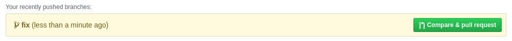

<header-table/>

# GitHub 入門

[GitHub](https://github.com/)とはGitのリモートリポジトリをホスティングしてくれるサービスです。
IIJでは社内で使えるGitHub Enterpriseを提供しています。

## 0. まえがきと下準備

### 0.1. この講義の目標

- GitHubを利用した開発フローであるGitHub Flowを用いて基本的な開発フローができるようになる。
- Pull Requestを使った修正ができるようになる。
- コードレビューの意義を理解する。

### 0.2. 要求する事前知識

- 基本的なGitの使い方を知っていること
  - 先に[Gitハンズオン](../git)から受講してください。
- SSH（Secure Shell）と公開鍵の知識

### 0.3. IIJの方へ

この資料はgithub.comを利用して演習を行うように記載されています。
IIJでは社内に閉じて利用できるオンプレ版のGitHub Enterpriseを提供していますのでそちらをご利用ください。当日案内します。

以下の資料ではGitHub Enterpriseの環境でスクリーンショットを作成しています。
github.comとは画面が異なることがありますので適宜読み替えていただくようにお願いします。

### 0.4. IIJ以外の方へ

本講義ではgithub.comを利用します。社外のサービスを利用できるかどうかを確認してください。
また会社用のアカウントが利用できることがありますので確認してはじめてください。

### 0.5. この資料のお約束

:computer: は自分で操作する箇所を示しています。

 <ほげほげ> で囲まれている部分は自分の設定値で置き換えてください。たとえば

```
git clone <リモートリポジトリのアドレス>
```

と記載されている箇所は

```
git clone git@github.com:iij/bootcamp.git
```

というように置き換えてください。

## 1. GitHubとは

Gitは分散型バージョン管理システムと呼ばれています。
ほかの人と共同作業をしたくなった場合は、手元で作ったリポジトリをほかのリポジトリとやりとりできます。
手元にあるリポジトリを**ローカルリポジトリ**と呼び、ほかのコンピュータにあるリポジトリを**リモートリポジトリ**と呼びます。

しかし、他人のコンピュータのリポジトリに直接変更を送ったり取り込んだりするのは面倒ですので
Gitサーバを立て、そこを経由してやりとりするのが一般的です。


[GitHub](https://github.com/)とはGitのリモートリポジトリをホスティングしてくれるサービスです。
GitHubは単純なGitサーバの機能だけではなく、開発に必要な便利な機能をセットで提供してくれます。

GitHub以外にも[GitLab](https://about.gitlab.com/)や[Bitbucket](https://bitbucket.org/)といったサービスが利用されています。

### 1.1. GitHubを利用する準備

リモートとのGitリポジトリにはいくつかの通信方式が利用できますが、最も一般的なものはSSHを使う方法です。
このハンズオンではGitHubとの通信にSSHを利用します。
まずはGitHubを利用する準備を整えましょう。

#### 1.1.1. SSH鍵の作成

:computer: SSHするための鍵を生成してください。すでに作成されている方はそちらを利用してください。

- [新しい SSH キーを生成して ssh-agent に追加する](https://help.github.com/ja/github/authenticating-to-github/generating-a-new-ssh-key-and-adding-it-to-the-ssh-agent)

#### 1.1.2. アカウントを作る

:computer: https://github.com/ に ログインしてアカウントを作成してください。

GitHubではリポジトリのやりとりで公開鍵認証方式によるsshが利用できますので、
上記で作った自分の公開鍵を以下のURLから登録してください。

https://github.com/settings/ssh/new

- [GitHub.comでのやり方](https://help.github.com/ja/github/authenticating-to-github/adding-a-new-ssh-key-to-your-github-account)
- [GitHub Enterpriseでのやり方](https://help.github.com/ja/enterprise/2.20/user/github/authenticating-to-github/adding-a-new-ssh-key-to-your-github-account)

::: tip チェックポイント3 🏁
ただしくSSHが設定できているか確かめてみましょう

```
$ ssh -T git@github.com
```

以下のように表示されたら成功です！

```
Hi kazuki-h! You've successfully authenticated, but GitHub does not provide shell access.
```

:::

## 2. GitHubの基礎

### 2.1. リポジトリを作る

まずはGitHubで利用するためのリポジトリを登録します。
これはローカルリポジトリで`git init`するのと一緒ですが、GitHubではWebページから操作します。

:computer: リポジトリを作る

右上のユーザーアイコンの横の+から「New Repository」を選びます。


リポジトリは作り放題です。

「Repository name」は「first_repo」にしましょう。


Publicリポジトリは誰でも参照でき、Privateリポジトリは指定した人のみが参照できます。
GitHub BussinessとEnterpriseを使っている人はInternalリポジトリも追加で表示されていると思いますが、その場合はInternalリポジトリを指定してください。
「Initialize this repository with a README」にもチェックを入れましょう。

### 2.2. Cloneする

リモートリポジトリをそっくりそのまま手元にローカルリポジトリを持ってくることできます。これを`clone`と呼びます。


:computer: さっそく作ったリポジトリを`clone`してみましょう。

「Clone or download」から`<リモートリポジトリのアドレス>`をコピーできます。SSHとHTTPSを選ぶことができますので、SSHになっていることを確認してください。


- `git clone`コマンドを利用して`clone`します。

::: warning Gitハンズオンから引き続き作業している方へ
Gitハンズオンとは別のリポジトリで作業しましょう。
:::

```
git clone <リモートリポジトリのアドレス>
```

コマンドラインを開き、コピーしたアドレスを使って以下のようにcloneします。

```bash
$ git clone git@github.com:kazuki-h/first_repo.git
Cloning into 'first_repo'...
remote: Enumerating objects: 3, done.
remote: Counting objects: 100% (3/3), done.
remote: Total 3 (delta 0), reused 0 (delta 0), pack-reused 0
Receiving objects: 100% (3/3), done.

$ cd first_repo
$ ls -l
-rw-rw-r-- 1 kazuki-h kazuki-h 44 Apr 11 17:41 README.md
```

リポジトリがcloneできて`README.md`ができていることが確認できます。
`README.md`を開いてGitHub上で表示されているファイルと同じものが表示されていることを確認してください。

### 2.3. リモートリポジトリの情報を確認する

`git clone`をするとリモートリポジトリの情報が自動で記録されます。
`git remote`コマンドでリモートリポジトリの設定を変更できます。
どのようにリモートリポジトリが登録されているか確認してみましょう。

:computer: リモートリポジトリの情報を確認する

```bash
$ git remote -v
```

以下のような情報が表示されることを確認しましょう。

```
origin	git@github.com:kazuki-h/first_repo.git (fetch)
origin	git@github.com:kazuki-h/first_repo.git (push)
```

`origin`はリモートリポジトリの別名です。デフォルトで`origin`という名前になります。
これからのコマンドでは`origin`と書くことでGitHub上のリモートリポジトリを指定したことになります。

リモートリポジトリは複数登録することも、自分で好きな名前を付けることもできますが今回のハンズオンでは取り扱いません。

### 2.4. 変更をpushする

リモートリポジトリと手元のローカルリポジトリは勝手に同期したりはしません。
それぞれ独立したGitリポジトリとして扱われます。そのためリポジトリ間でコミットをやり取りする必要があります。

リモートリポジトリに対して手元の変更を送ることを`Push`（プッシュ）と呼びます。
逆に他の開発者によって入った変更を手元のローカルリポジトリに取り込むことを`Pull`（プル）と呼びます。


:computer: `README.md`に好きな文言を加えてコミットし、pushしてみましょう。

```bash
$ git add README.md
$ git commit
```

```bash
$ git push origin master
```

このコマンドはoriginに手元のmasterブランチの変更を送ることを意味しています。

:computer: GitHubのページをリロードし変更が反映されているか確認してみましょう。

### 2.5. コミット履歴を見る

GitHub上でコミット履歴を確認できます。


:computer: `2 commits`と表示されている場所をクリックして該当コミットの内容を確認しましょう。


またコミットハッシュをクリックすると変更差分を確認できます。

`<>`をクリックするとそのコミット時点でのスナップショットが表示されます。

### 2.6. Blameする

`git blame` コマンドを使うと、特定のファイルの各行ごとに、いつ誰がどのコミットで編集したかを調べることができます。
GitHub上ではWeb UIで見ることができます。

まずGitHub上でリポジトリの一番上に戻って`README.md`ファイルを開いてください。
Blameボタンを押してください。


### 2.7. ブランチを切る

複数人で開発をする場合はいきなりmasterブランチに修正をコミットするのではなく、
修正用ブランチを切ってそこに修正を入れていき、動作確認ができたらmasterブランチに戻すということを行います。

ブランチを作った場合にGitHubでどう見えるか、見てみましょう。

:computer: ローカルリポジトリでブランチを切ります

```
$ git checkout -b fix
```

`README.md`に何か1行足してコミットしてください。

:computer: ブランチをリモートリポジトリに反映させます

```
$ git push origin fix
```

GitHubでリポジトリの一番上のページを開き、`2 branches`になっていることを確認してください。
ブランチは以下のボタンで切り替えることができます。


fixブランチに切り替えて、`README.md`の内容が切り替わることを確認してください。

## 3. Pull Request

GitHub最大のメリット、それがPull Requestです。
Web UIのないGitサーバというものも存在しますが、Pull Requestを使うためにGitHubを使うと言ってもよいくらいです。

Pull Requestは別のブランチで作成した変更を取り込んでもらう依頼を行うための機能です。
Gitlabでは「Merge Request」と呼びます。


さっそくPull Requestを出してみましょう。
さきほどから新しい表示が増えていることに気付いていると思いますが、
「Compare & pull request」ボタンからPull Requestを作成できます。

:computer: Pull Requestを作成してください



Pull Requestを作成する画面になったらどういった変更を入れるかを記載します。


変更内容が良ければマージしてもらいます。
自分のリポジトリではほかに見てもらう人がいないので自作自演でマージしてしまいましょう。
「Merge pull request」ボタンを押してください。

これでfixブランチに入れた修正がリモートリポジトリのmasterブランチに反映されたはずです。

:computer: GitHub上でmasterブランチの内容を表示して修正が反映されたことを確認しましょう

:computer: ローカルリポジトリの`master`ブランチに移動してファイルの内容がGitHubの表示とは異なる（マージ前の状態である）ことを確認しましょう。

```bash
$ git checkout master
```

この状態ではリモートリポジトリ（GitHub）ではマージされているが、ローカルリポジトリには反映されていない状態です。
リモートリポジトリの変更をローカルリポジトリに取り込むには`Pull`（プル）コマンドを利用します。

```bash
$ git pull <リポジトリ> <リモートブランチ> 
```

::: tip チェックポイント4 🏁

:computer: 手元のローカルリポジトリのmasterブランチをpullして最新の状態にし、手元でも修正が反映されたことを確認しましょう。

```bash
$ git pull origin master
```
:::

### 3.1. コードレビュー

ソースコードの査読を行うことをコードレビューと呼びます。
コードレビューでは不具合を見つけることを主な目的として行いますが、
可読性や保守性を向上させたり、チーム内でプロジェクトに関する知識の共有を行って属人化しないようにするなどの効果もあります。

開発にはおいては積極的にコードレビューを取り入れていきましょう。
不具合を見つけることだけが目的ではありませんので、必ず経験のあるエンジニアがレビュー役に回る必要はありません。
新人であっても先輩のコードをレビューすることが必要ですし、経験のない部分のコードであっても積極的にレビューしていきましょう。

また[ペアプログラミング](https://medium.com/product-run/%E3%83%9A%E3%82%A2%E3%83%97%E3%83%AD%E3%82%B0%E3%83%A9%E3%83%9F%E3%83%B3%E3%82%B0%E3%81%AE%EF%BC%95%E3%81%A4%E3%81%AE%E3%81%84%E3%81%84%E3%81%93%E3%81%A8-ea618415f46f)と言って二人ー組でコードを書く方法もありますので調べてみると良いでしょう。

## 4. Organization (組織)

すべてのリポジトリはOrganization(組織)の下に配置されます。
Organization（以下org）は実際の部署に紐づくものではなく、リポジトリをまとめる単位に過ぎません。
どういった単位でorgを作るかは利用者に任されていますが、サービスやプロダクト、ワーキンググループ(WG)といった単位で作ることが多いようです。

::: tip
IIJの社内環境ではorgの作成は自由で数も制限はありません。
現在IIJ社内では300以上のorgが登録されています。
:::

自分のアカウントもorgの1つです。先ほど作ったリポジトリは自分のアカウント名のorg配下に配置されています。

## 5. Issue （イシュー）

GitHubには簡易的な課題管理システム(Issue Tracking System、以下ITS)が備わっています。
ITSは取り組まなければいけない、機能追加や不具合の改修などを記録しておくものです。

### 5.1. バグを報告してみよう

不具合のないプログラムはおそらく存在しません。
バグは湯水のように湧いてきます。
バグは発見したら記録しておかないとどれを直したのか分からなくなってしまいます。見付け足ら報告しましょう。

:computer: まずは既存プロジェクトにどんなIssueがあるのか確認してみましょう。

- https://github.com/iij/mruby/issues

:computer: 自分のリポジトリでIssueを作成してみましょう。


#### 5.2. よい不具合報告とは？

不具合の報告は存外難しいものです。
以下のことに気を付けて報告するようにしてください。

- 発生した事象について正確に記載する
  - 「エラーが発生しました」ではどのようなエラーが発生したかわかりません。エラーが表示されましたか？それはなんと書いてありましたか？反応がありませんでしたか？それはどのタイミングでしたか？
- 正確な用語を利用する
  - 自分の用語ではなく、システムで利用されている用語を利用してください。
- こう動作するべきだという期待値を記載する
- 現象を発生させる手順を記載する
  - いつ、どのアカウントを使って、どのページを操作し、どのボタンを押し、どんなデータを入力したかを記載します。
  - 同じ手順で現象が再現しますか？
- 環境を記載する 
  - OS、ブラウザ、インターネット環境、プロキシは何を使用していますか？
- スクリーンショットを付ける
  - 何かエラーが表示されたらスクリーンショットを取っておきましょう。Issueには画像も貼り付けることができます。

### 5.3. ラベルを付けて分類する

Issueにはラベルを複数付けることができます。

付けたラベルで絞り込んで表示できます。
デフォルトで用意されているラベルのほかに自分で定義することもできます。

:computer: さきほど作ったIssueにラベルを付けましょう。


### 5.4. 担当者を割り当てる

Assignees に担当者を割り当てることができます。

💻 さきほど作ったIssueに自分を担当者として割り当てましょう。

上のメニューから「Issues」を選んで「Assigned」を選ぶと自分に割り当てられているチケットの一覧をリポジトリ横断で把握できます。


## 6. みんなで開発してみよう

Gitのブランチ機能は強力ですが自由度が高く、複数人で開発していると開発の進め方に迷ってしまうでしょう。
そこでGitを利用した開発モデルがいくつか提案されています。

[git-flow](https://danielkummer.github.io/git-flow-cheatsheet/index.ja_JP.html) が有名ですが、
GitHubとGitを利用している場合に使える[GitHub Flow](https://gist.github.com/Gab-km/3705015)を紹介します。

### 6.1. GitHub Flow

Git-flowは実践してみると分かりますが、かなり複雑なワークフローです。
リリースプロセスが複雑で重厚な開発に向いています。
でも実際にはもっとシンプルな開発フローで済むことも多いのです。

GitHub Flowは以下には特徴があります。

- masterブランチのものは何であれデプロイ可能である
- 新しい何かに取り組む際は、説明的な名前のブランチをmasterから作成する（例: new-oauth2-scopes）
- 作成したブランチにローカルでコミットし、サーバ上の同じ名前のブランチにも定期的に作業内容をpushする
- フィードバックや助言が欲しいとき、ブランチをマージしてもよいと思ったときは、 プルリクエスト を作成する
- 他の誰かがレビューをして機能にOKを出してくれたら、あなたはコードをmasterへマージできる
- マージをしてmasterへpushしたら、ただちにデプロイをする

### 6.2. GitHub Flowをやってみよう

TAを相手にGitHub Flowを体験してみましょう。

::: tip ラストチェックポイント 🏁
TAを自分の`first_repo`に招待してGitHub Flowを体験しよう。

1. Teamsのチャンネルで「ラストチェックポイントお願いします！」と高らかに宣言します。
2. 自分のリポジトリのURLを貼り付けてください。
3. TAが割り当てられたらTAを自分のリポジトリに招待してください。  

[コラボレーターを個人リポジトリに招待する
](https://help.github.com/ja/github/setting-up-and-managing-your-github-user-account/inviting-collaborators-to-a-personal-repository)

[コラボレーターを個人リポジトリに招待する(GitHub Enterprise版)](https://help.github.com/ja/enterprise/2.20/user/github/setting-up-and-managing-your-github-user-account/inviting-collaborators-to-a-personal-repository)
:::

1. ローカルブランチを作成する
2. なにかを修正する
3. ローカルブランチにコミットする
4. pushする
5. Masterブランチに対してPull Requestを作成する 
6. TAがレビューする
7. 必要に応じてさらに修正する
8. レビューが承認される
9.  Masterにマージされる
10. (オプション) TAがコミットするのであなたがレビューしてください！

## 7. Gist

[Gist](https://github.com/gist) はテキストデータを保存し、公開することのできる「Pastebin」と呼ばれるサービスの一種です。
GitHubのアカウントを持っている人は自由に作成でき、参照は自由にできます。
コードハイライトを利用することもできます。

IIJでは社内での情報共有ため[Confluence](https://www.atlassian.com/ja/software/confluence)が導入されていますが、
confluenceにgistのURLを貼ると内容が自由に展開されるマクロが導入されています。


## 8. Next Action

このハンズオンが終わったら自分のメンターに相談して、所属部署のリポジトリにPull Requestをしてみましょう。

## 9. 参考資料

- [GitHub.com ヘルプドキュメント](https://help.github.com/ja/github)
- [GitHub Learning Lab](https://lab.github.com/)
- [Code Review Developer Guide | eng-practices](https://google.github.io/eng-practices/review/)

<credit-footer/>
