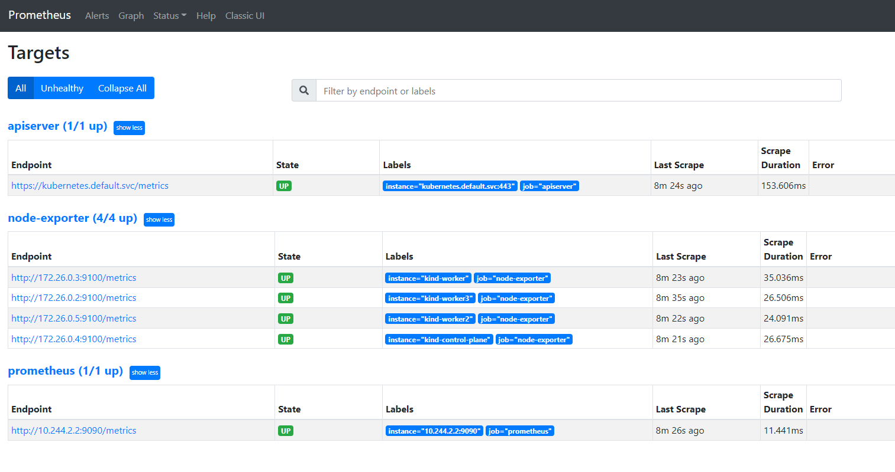

<header-table/>

# Kubernetes でアプリケーション開発

## 0. まえがき
### 0-1. 想定している受講者
本講義では以下の受講者を対象としています。
- Kubernetesという名前は知っているがどんなものなのかは知らない
- Kubernetes入門しようにも何から始めたらよいのかわからない
- Kubernetesの仕組みがわからない

### 0-2. 前提知識
以下の点を知らないと講義についていけない可能性があります。
- Linuxの基本的なコマンド
- dockerの基礎

加えて以下の点を知っていると講義をスムーズに聞けます。
- YAMLファイルの読み方/書き方
- コンテナアーキテクチャの基礎

### 0-3. 事前準備
- docker / docker-compose のインストール
- Kubernetes環境
  - 環境構築に自信が無い人katacodaを使ってください
    - https://www.katacoda.com/courses/kubernetes/playground
    - __**外部リソースなのでコピペする際は気を付けてください**__
  - ローカルでkubernetesを動かしたい人はkindを以下の手順で構築してください

> kindを使ったkubernetes環境の構築
> 
> kindはkubernetes in dockerの略です。その名の通り、dockerを使ってkubernetes環境を構築します。
> ([公式ドキュメント参照](https://kind.sigs.k8s.io/docs/user/quick-start/))
> ```bash
> # [ $(uname -m) = x86_64 ] && curl -Lo ./kind https://kind.sigs.k8s.io/dl/v0.29.0/kind-linux-amd64
> # chmod +x ./kind
> # sudo mv ./kind /usr/local/bin/kind
> ```
> dockerホストからkindに対してコマンドを実行したいのでkubectlをdockerホストに入れます
> ```bash
> # curl -LO "https://dl.k8s.io/release/$(curl -L -s https://dl.k8s.io/release/stable.txt)/bin/linux/amd64/kubectl"
> # sudo install -o root -g root -m 0755 kubectl /usr/local/bin/kubectl
> ```
> 試験的にクラスターを構築して正しくインストールされたか確認する
> ```bash
> # kind create cluster
> Creating cluster "kind" ...
>  ✓ Ensuring node image (kindest/node:v1.32.0) 🖼 
>  ✓ Preparing nodes 📦  
>  ✓ Writing configuration 📜 
>  ✓ Starting control-plane 🕹️ 
>  ✓ Installing CNI 🔌 
>  ✓ Installing StorageClass 💾 
> Set kubectl context to "kind-kind"
> You can now use your cluster with:
> 
> kubectl cluster-info --context kind-kind
> 
> Have a question, bug, or feature request? Let us know! https://kind.sigs.k8s.io/#community 🙂
> 
> # docker ps
> CONTAINER ID   IMAGE                  COMMAND                  CREATED          STATUS          PORTS                       NAMES
> d76ca5889d8d   kindest/node:v1.32.0   "/usr/local/bin/entr…"   59 seconds ago   Up 49 seconds   127.0.0.1:35447->6443/tcp   kind-control-plane
> 
> # kubectl cluster-info --context kind-kind
> Kubernetes control plane is running at https://127.0.0.1:35447
> CoreDNS is running at https://127.0.0.1:35447/api/v1/namespaces/kube-system/services/kube-dns:dns/proxy
> 
> To further debug and diagnose cluster problems, use 'kubectl cluster-info dump'.
> 
> # kubectl get node
> NAME                 STATUS   ROLES           AGE     VERSION
> kind-control-plane   Ready    control-plane   2m43s   v1.32.0
> ```
> 確認出来たら削除
> ```bash
> # kind delete cluster
> ```
> bootcamp用のクラスター環境を構築する
> ```bash
> # vim cluster.yml 
> ```
> 以下の内容を記載する
> ```yml
> kind: Cluster
> apiVersion: kind.x-k8s.io/v1alpha4
> nodes:
>   - role: control-plane
>   - role: worker
>   - role: worker
>   - role: worker
> ```
> クラスター構築
> ```bash
> # kind create cluster --config cluster.yml 
> Creating cluster "kind" ...
>  ✓ Ensuring node image (kindest/node:v1.32.0) 🖼 
>  ✓ Preparing nodes 📦 📦 📦 📦  
>  ✓ Writing configuration 📜 
>  ✓ Starting control-plane 🕹️ 
>  ✓ Installing CNI 🔌 
>  ✓ Installing StorageClass 💾 
>  ✓ Joining worker nodes 🚜 
> Set kubectl context to "kind-kind"
> You can now use your cluster with:
> 
> kubectl cluster-info --context kind-kind
> 
> Thanks for using kind! 😊
> 
> # kubectl cluster-info --context kind-kind
> Kubernetes control plane is running at https://127.0.0.1:46863
> CoreDNS is running at https://127.0.0.1:46863/api/v1/namespaces/kube-system/services/kube-dns:dns/proxy
> 
> To further debug and diagnose cluster problems, use 'kubectl cluster-info dump'.
> 
> # kubectl get node
> NAME                 STATUS   ROLES           AGE   VERSION
> kind-control-plane   Ready    control-plane   72s   v1.32.0
> kind-worker          Ready    <none>          33s   v1.32.0
> kind-worker2         Ready    <none>          33s   v1.32.0
> kind-worker3         Ready    <none>          32s   v1.32.0
> ```

## 1. Kubernetesとは

Kubernetesは複数サーバで構成された基盤上でコンテナ群を一元管理するためツール「コンテナオーケストレーションツール」と呼ばれるものです。最近ではdockerを使ってコンテナ単位でアプリケーションを実装することが多くなりましたが、docker単体では複数台のdockerホスト上でコンテナ群を一元管理することができません。そのため複数ホストで構成される規模のプロダクションに耐えられるシステムをdocker単体で構築することは困難とされてきました。そこで複数のdockerホストに跨ってコンテナアプリケーションをデプロイ、スケーリング、ネットワーク管理機能などをするオーケストレーションツールが登場しました。

Kubernetesは元々Googleがアプリケーションデプロイに利用していたBorgと呼ばれるクラスターマネージャーをOSS化したもので、現在はLinux Foundation傘下にあるCNCF(Cloud Native Computing Foundation)が管理しています。ランクはGraduatedで成熟したCNCFプロジェクトとなっています。

> 【豆知識】
> 
> Kubernetesはギリシャ語で「操舵士」や「パイロット」を意味し、ロゴは操舵士にちなんで舵をモチーフにされています。7つのスポークは当初のKubernetesのコードネーム「Project Seven」にちなんでいます。

KubernetesをベースにカスタマイズしたKubernetesサービスを最近ではKaaS(Kubernetes as a Service)と言い、AWSやGCPなどの各クラウドベンダで提供されています。

- Amazon EKS
- Google Kubernetes Engine(GKE)
- Azure Kubernetes Service(AKS)

先ほど「カスタマイズ」と言いましたが、Kubernetesはそれ単体で完成するものではなくログ基盤にfluentdとelasticsearchを使ったり、それぞれのクラウドサービスとの繋ぎこみなど提供元によって機能やスペックが異なります。このようにカスタマイズされたKubernetes基盤のことをLinuxのディストリビューションに例えて「Kubernetesディストリビューション」と呼びます。

IIJでも社内向けのKubernetes基盤としてIKE(IIJ Kubernetes Engine)の運用と導入が進んでいます。

- [IIR](https://www.iij.ad.jp/dev/report/iir/040/03.html)
- [IIJエンジニアブログ](https://eng-blog.iij.ad.jp/kubernetes)

従来のVMでのシステム構築と比べてKubernetesを利用することでシステム開発・管理が格段に楽になります。例えば従来のシステム構築では、どのVMに何を割り当てるかのリソース計算を人が考えなければならず、システムがスケーリングするたびに多くの労力を使いましたが、Kubernetesではマシンリソースやネットワークをプールとして扱い自動で管理するため、システムのスケーリングに柔軟に対応することができます([詳細](https://kubernetes.io/ja/docs/tutorials/kubernetes-basics/scale/scale-intro/))。また、従来ではシステムのアップデートを行うたびに「サービス停止→アップデート→サービス再開」という手順でアップデートをしていたが、Kubernetesではサービスを停止することなくシステムアップデートを行うことができ、サービス可用性を高めてくれます([詳細](https://kubernetes.io/ja/docs/tutorials/kubernetes-basics/update/update-intro/))。

上記以外にも多くのメリットがあり、Kubernetesでシステム開発を行うとアプリケーションの構築作業が劇的に減る他、APIなどからの自動デプロイなども非常に簡単に行うことができます。

## 2. Kubernetesの基本構造
### 2-1. 宣言的な構成管理
Kubernetes上にアプリケーションをデプロイする際、その構成管理は宣言的に行われます。デプロイしたい人は「アプリケーションやそれを構成するコンテナ群はこのような配置であるべき」という宣言(manifest)を**マニフェストファイル**に記載することで、Kubernetesはマニフェストファイルに沿った構成を宣言どおりにデプロイします。このような構成管理方法はIaC(Infrastructure as a Code)と呼ばれており、Ansible同様に冪等性の確保や自動化に貢献しています。このような構成管理方法の主なメリットはGitによるバージョン管理のしやすさが挙げられます。
> Ansibleで「Playbook」と呼ばれているものがKubernetesでいう「Manifest」です。

### 2-2. コントロールプレーンとワーカーノード
Kubernetesは大きく分けて2つの要素で構成されています。**コントロールプレーン**と**ワーカーノード**です。
> 文献によってはコントロールプレーンのことを**マスターノード**と表記することがありますが、同じ意味なので誤解の無いように注意してください。


#### 2-2-1. コントロールプレーン
コントロールプレーンはKubernetesクラスター全体の状態の管理を行うことが主な仕事です。例えばアプリケーション開発者が宣言したマニフェストファイルどおりに作られたPodがワーカーノードに割り当てられているかを監視し、割り当てられていなかった場合はそのPodを実行するノードを各のノードのリソース状況を考慮して割り当てます。このようなコンポーネントを**kube-schduler**と言います。他にもマニフェストファイルによって宣言された構成情報を閲覧/編集するためのAPIサーバの役割を果たす**kube-apiserver**などがあります。(他のコンポーネントも知りたい人は[公式ページ](https://kubernetes.io/ja/docs/concepts/overview/components/)へ)
> 【Podとは】
> 
> Kubernetesはコンテナを「pod」と呼ばれる単位で管理します。podにはいくつかのコンテナの集まりで、同じpodに所属するコンテナ同士はlocalhostでお互いに通信することができます。
> 
> Podにどのようなコンテナを同居させるのかは設計次第ですが、例えばアプリケーションのログを集めるコンテナを同じpodに同居させたり、nginxなどwebのフロントになるアプリケーションを同居させたりします。

#### 2-2-2. ワーカーノード
ワーカーノードはPodの管理やPodの実行環境/通信機能を提供することが主な仕事です。例えばコントロールプレーンコンポーネントである**kube-apiserver**から受け取った構成情報どおりにPodが稼働するように管理します。このようなコンポーネントを**kubelet**と言います。ただしkubeletは実際にPodを作成したり、そのネットワーク環境を構築することはせず、あくまでもノード上のPod状態を維持するように管理することが仕事です。実際にPodを作ったりするコンポーネントを**コンテナランタイム**と言います。他には、後程出てきますがService宛の通信を稼働中のPod群へ転送させる**kube-proxy**などがあります。

### 2-3. Kubernetesの基本構造まとめ
Kubernetesは主に**コントロールプレーン**と**ワーカーノード**に分けられており、コントロールプレーンはクラスター全体の状態管理、ワーカーノードはコントロールプレーンからの指示通りにユーザによって宣言された構成を作り上げることが役割でした。そして、それぞれの役割を果たすために多くのコンポーネントが内蔵されている、という話でした。各コンポーネントについてもっと詳しく知りたい方は[公式ページ](https://kubernetes.io/ja/docs/concepts/architecture/)を参照してください。

## 3. マニフェストファイルの書き方
### 3-1. Kubernetesオブジェクト
先ほども説明したように、Kubernetes上にPodなどをデプロイする際、ユーザはマニフェストファイルを書く必要があります。マニフェストファイルではいくつかのKubernetesオブジェクトを組み合わせて、ユーザの意図する状態を記載します。マニフェストファイルに記載されたKubernetesオブジェクトはコントロールプレーンによって読み取られ、読み取られたKubernetesオブジェクトが存在し続けるようにクラスター全体を管理します。

> 【Kubernetesオブジェクト】
> 
> Kubernetesオブジェクトはクラスターの状態を表現するパーツです。以下にKubernetesオブジェクトの例と簡単な説明を記載します
> - ReplicaSet: Pod群の稼働状況を管理する
> - Deployment：バージョンに相当するReplicaSetを管理する
> - CronJob：定期実行するpodを管理する
> - Service：特定のラベルを持ち、サービスを提供できる状態のPod群への接続を提供する
> - Ingress：証明書やドメイン名を通して外部からの通信を制御する
> - PersistentVolume：ストレージなどの永続化volumeを管理する
> 
> 代表的な物を上げましたが、他にも色々あります。興味のある方は[公式サイト](https://kubernetes.io/docs/reference/generated/kubernetes-api/v1.22/)参照。

### 3-2. Deployment

上でも述べた通りDeploymentはPodの稼働状況を管理するオブジェクトです。予め起動するPodの数を指定することで、何かしらの原因でPodが消失しても自動で立ち上げ直してくれたり、逆に多すぎる場合は終了させます。

現在稼働しているPodは、kubectlというcliツールを使って確認できます。
今は何も稼働してないはずです。

> 【kubectl】
> 
> KubernetesのコントロールプレーンにはKubernetesクラスターの構成管理情報にアクセスするためのエンドポイントを提供する**kube-apiserver**がありますが、生身の人間がAPIを生で叩いて**kube-apiserver**にアクセスするのは少しキツイものがあります。そこでAPIをコマンドで操作できる**kubectl**というものがあり、kubectlを使うことによりコマンドベースでAPIを叩くことができます。

```
$ kubectl get pods
No resources found in default namespace.
```

以下のようなマニフェストファイルを`app.yml`として作成し、Kubernetesクラスターにデプロイしてみましょう。
`image`として指定しているのはサンプル用の簡単なアプリケーションです。

```yml
apiVersion: apps/v1
kind: Deployment
metadata:
  name: bootcamp
spec:
  replicas: 2
  selector:
    matchLabels:
      app: bootcamp
  template:
    metadata:
      labels:
        app: bootcamp
    spec:
      containers:
      - name: bootcamp-app
        image: registry.k8s.io/echoserver:1.4
        ports:
          - containerPort: 8080
      restartPolicy: Always
```
> 【Deploymentにおける必須フィールド】
> 
> Kubernetesオブジェクトをマニフェストファイルに記載する際、必ず以下のフィールドに値をセットする必要があります
> - apiVersion：オブジェクトのAPIVersionを指定
> - kind：どのオブジェクトを作るかを指定
> - metadata：オブジェクトを特定するための情報を指定
> - spec：オブジェクトの状態を指定


`apiVersion`にはオブジェクトのAPIVersionを書きます。
オブジェクトAPIがどのAPIGROUPに属しているかでapiVersionの書き方が変わってきます。
今回はDeploymentのオブジェクトなのでそのAPIグループを調べます。

```
$ kubectl api-resources
NAME                              SHORTNAMES         APIGROUP                           NAMESPACED   KIND
bindings                                                                                true         Binding
componentstatuses                 cs                                                    false        ComponentStatus
configmaps                        cm                                                    true         ConfigMap
...
deployments                       deploy             apps                               true         Deployment
```

ここではDeploymentが`apps`に属しているということが分かりました。
もしAPIGROUPが空の場合はCore groupに属するため、`apiVersion: v1`で問題ないです。
次にAPIGROUPで利用可能なversionを調べます。

```
$ kubectl api-versions | grep apps
apps/v1
apps/v1beta1
apps/v1beta2
```

ここでは3つほど出ましたが、この中の最も新しいversionを使ってください。
今回は`apps/v1`を使ってマニフェストファイルを作りました。


yamlを作成したら、以下のコマンドでデプロイできます。

```bash
$ kubectl apply -f app.yml
deployment.apps/bootcamp created
```

別端末で`get pods`しながらpodが作られる様子を見てみましょう`-w`をつけると自動で表示を更新してくれます。

```bash
$ kubectl get pods -w
NAME                        READY   STATUS              RESTARTS   AGE
bootcamp-6bcddb7cf8-jpzg5   0/1     ContainerCreating   0          11s
bootcamp-6bcddb7cf8-tq2fs   0/1     ContainerCreating   0          11s
bootcamp-6bcddb7cf8-jpzg5   1/1     Running             0          83s
bootcamp-6bcddb7cf8-tq2fs   1/1     Running             0          84s
```

`Running`となっていれば無事にアプリケーションが起動しました。今回は`replicas`に`2`を指定したのでpodが2個起動しています。`replicas`の値を変えて再度`kubectl apply`して遊んでみましょう。

### 3-3. Service

Podの起動ができましたので、次はPodへのアクセスを試みます。KubernetesクラスターではPod群へのサービスディスカバリーの方法としてServiceオブジェクトが用いられます。Serviceを利用することでPod群に共通のIPアドレスを割り当て、まるで一つの「サービス」であるかのようにアクセスできるようになります。

> 【PodとServiceの関係】
> 
> Podは生成の度にIPアドレスが割り振られます。これは何かしらの理由でPodが落ちて別のPodが再生成されるときにもIPアドレスが割り振られますが、落ちたPodと同じIPアドレスが割り振られるとは限りません。こうなった場合に新しいPodへアクセスしたい別Podは新しいPodのIPアドレスがわからなくなってしまいます。ServiceはこのようなPodを共通のIPアドレスで管理し、Podへのアクセスやロードバランシングを行う役割を持っています。また、Serviceの生成によりKubernetesクラスター内の[CoreDNS](https://kubernetes.io/ja/docs/tasks/administer-cluster/coredns/)のA/AAAAレコードやPod内の`resolve.conf`が自動的に書き換えられるため、Service名を使ってPodへアクセスすることも可能になります。

> 【ServiceからPodへの通信の受け渡し】
> 
> Serviceが作られるとService宛の通信がPodへ転送されますが、その仕組みは**ワーカーノード**内のコンポーネントである**kube-proxy**によって実現されます。すべてのServiceは基本的にClusterIP(あとで説明します)によるVIPの保持が義務付けられており、またClusterIP配下のPodのIPアドレスはendpointに記載されています。そして、ClusterIPからPodの持つIPへの振り替えを**kube-proxy**が行います。**kube-proxy**の振り替え方式はいくつか選択肢がありますが、デフォルトの**iptableモード**ではiptablesのchainがあり、これによってパケットが転送されます。他のモードについて知りたい方は[公式ページ](https://kubernetes.io/ja/docs/concepts/services-networking/service/#virtual-ips-and-service-proxies)を参照してください。

先ほどと同じようにServiceのマニフェストファイルを作りましょう。今回は`service.yml`とします。

```yml
apiVersion: v1
kind: Service
metadata:
  name: bootcamp-svc
spec:
  type: ClusterIP
  ports:
  - port: 80
    protocol: TCP
    targetPort: 8080
  selector:
    app: bootcamp
```
Serviceオブジェクトの中には様々なサービスタイプ種類があり、今回は`ClusterIP`というサービスタイプを利用しています。ClusterIPはServiceにおけるデフォルト設定であり、明示的に記載が無ければ`type: ClusterIP`が設定されることに注意してください。

> 【サービスタイプ】
> 
> それぞれのServiceの特徴について簡単に触れます。少し長くなるので講義では`ClusterIP`のみを説明しますが、興味のある人は他のサービスタイプも読んでみてください。
> #### ClusterIP
> ClusterIPによって割り振られるIPアドレスはKubernetesクラスター内でのみ有効です。主にクラスター外からアクセスする必要のない箇所などでクラスター内ロードバランスをする際に利用されます。
> 
> 
> #### NodePort
> ClusterIPを作った上で、全node各々の`<ip address:port>`で受信したアクセスをServiceへ転送することで、クラスタ外からアクセスできるようにします。Docker Swarmでいうところの`Expose`です。図では全Kubernetes nodeの`port:30080`へのアクセスを`NodePort Service`に転送しています。
> 
> 
> #### LoadBalancer
> Kubernetesクラスター外のロードバランサーより払い出された仮想IPアドレスを利用してクラスター外からのアクセスを可能にします。NodePortでは各nodeに`<node ip>:<node port>`が割り振られ、ユーザはいずれかのアドレス宛にアクセスするため、アクセスしているnodeで障害が起きた際にそのnodeを利用しているユーザはサービスを利用できなくなります。それに対して`type: LoadBalancer`は、ユーザがクラスター外のロードバランサーから払い出されたIPアドレスのみを知っておくだけでサービスを利用することができます。また、nodeで障害が起きてもそのnodeの切り離しを行うようにクラスター外のロードバランサーを設定することで、ユーザはサービスを継続して利用することができます(ただし従来のロードバランサー＋仮想マシンの組み合わせ同様に、障害検知から除外までの間は通信断が発生します)。ここでいうクラスター外のロードバランサーはプロバイダに依存しており、たとえばGCPの場合はGCLBが使われています。
> 

それでは同じようにapplyしてから`Service`の稼働状況を確認します。

```bash
$ kubectl apply -f service.yml
service/bootcamp-svc created
$ kubectl get svc
NAME           TYPE        CLUSTER-IP       EXTERNAL-IP   PORT(S)   AGE
bootcamp-svc   ClusterIP   xxx.xxx.xxx.xxx   <none>        80/TCP    1h
```

次に実際にPodにアクセスしてみましょう。`kubectl proxy`でコントロールプレーンのAPIサーバにポートフォワーディングします。先ほども説明しましたが`type: ClusterIP`は外から直接アクセスができません。そのため手元のホストからコントロールプレーンまでをポートフォワードし、コントロールプレーンからPodまでをREST APIを使って通信させます。

```
$ kubectl proxy
Starting to serve on 127.0.0.1:8001
```

このプロキシ機能はServiceへのアクセスをRESTとして`/api/v1/namespaces/<namespace>/services/<scheme>:<service>:<port>/proxy/`と表現しているため、今回は`http://127.0.0.1:8001/api/v1/namespaces/<your namespace>/services/bootcamp-svc/proxy/`へアクセスすることでコンテンツを取得することができます。

> `<your namespace>`にはデプロイ先のnamespaceを入力します。
> namespaceがわからない場合は`kubectl config get-contexts`から探してください。`CURRENT`に米印が付いているものがいま作業しているコンテキストになります。もし`NAMESPACE`の欄に何もなければ`namespace: default`ということになります。  
> ```
> $ kubectl config get-contexts
> CURRENT   NAME                CLUSTER    AUTHINFO   NAMESPACE
>           minikube            minikube   nirazuka
> *         nira                nirakube   nirazuka   nirazuka
> ```

katacodeを使っている場合、RESTを辿ることができないため`kubectl port-foward`を利用します。`kubectl port-foward`はローカルのポートをPodやServiceに直接フォワーディングすることができます。
```
$ kubectl port-forward service/bootcamp-svc --address=0.0.0.0 :80
Forwarding from 0.0.0.0:35715 -> 8080
```
あとはTerminal横の「＋」ボタンから「select port to view on Host 1」を選択し、表示されているポートへアクセスすればコンテンツを取得することができます。


`Hello Kubernetes!` が表示されたでしょうか。無事にpodにアクセスすることができました。

> 今回はServiceでアプリケーションを公開しましたが、本来はServiceの上にIngressを作って公開することが推奨されています。
> Ingressを利用するとSSLの設定やVirtualHostの設定などを行えるようになります。
> 興味のある方は[公式ページ](https://kubernetes.io/ja/docs/concepts/services-networking/ingress/)を参考に触ってみて下さい。

### 3-4. Podを削除してみる

試しに手動で無理やりpodを削除してみましょう。`kubectl get pods -w`で確認しながら、以下のコマンドでpodを削除してみます。

```bash
$ kubectl delete pods <pod-name>
```

例によってpod-nameはコピペしてください。`kubectl get pods -w`しているとPodの数が`replicas`の設定値に合うように新しく起動される様子が分かります。

```bash
$ kubectl get pods -w
NAME                        READY   STATUS    RESTARTS   AGE
bootcamp-6bcddb7cf8-jpzg5   1/1     Running   0          23m
bootcamp-6bcddb7cf8-tq2fs   1/1     Running   0          23m
bootcamp-6bcddb7cf8-jpzg5   1/1     Terminating   0          23m
bootcamp-6bcddb7cf8-ffj7f   0/1     Pending       0          0s
bootcamp-6bcddb7cf8-ffj7f   0/1     Pending       0          0s
bootcamp-6bcddb7cf8-ffj7f   0/1     ContainerCreating   0          0s
bootcamp-6bcddb7cf8-ffj7f   1/1     Running             0          7s
bootcamp-6bcddb7cf8-jpzg5   0/1     Terminating         0          23m
```

`bootcamp-6bcddb7cf8-jpzg5`が手動で削除したpodです。`bootcamp-6bcddb7cf8-jpzg5`の削除が始まった途端に新しく`bootcamp-6bcddb7cf8-ffj7f`というpodを立てようとしているのが分かります。

このようにpodがエラーで停止したり、新しいアプリケーションのデプロイなどでpodを停止してもすぐさま`ReplicaSet`が状態を修復してくれます。
それだけではなく、前段の`Service`がpodの状態を監視しながら通信を流す先を決めてくれるため、一部のpodが停止している間も自動的に生きているpodに通信を流してくれます。

そのためユーザーに一切影響なくpodの停止と復旧が全て自動で可能になっています。このようなインフラをKubernetesとコンテナなしで構築するのはかなり困難です。

## 4. 応用(Kubernetesの監視)
ここからは本格的なアプリケーションのデプロイを体験してもらいます。katacodeでやっている方はうまくいかないことがあるため本項目は飛ばしてください。

今回Kubernetes上に構築するアプリケーションは監視ツールのPrometheusで、以下の順序でデプロイします。(マニフェストファイルは[Prometheus実践ガイド](https://www.hanmoto.com/bd/isbn/9784910313009)の内容を一部改変したものを利用しています)
1. node exporterのデプロイ
2. RBAC認可を使ってリソースにアクセスするためのアカウントをデプロイ
3. Prometheusのデプロイ

### 4-1. node exporterのデプロイ
node exporterは各ノードのメトリクス情報を収集するツール(exporter)です。これを各nodeに配置する必要がありますが、`Deployment`オブジェクトを利用すると配置nodeの指定を都度行う必要があり煩雑です。そのため、ここでは`DeamonSet`オブジェクトを利用します。`DeamonSet`オブジェクトは各ノードに等しくPodを配置するオブジェクトです。`node-exporter.yml`という名前で以下の内容のマニフェストファイルを作成します。
```yml
apiVersion: apps/v1
kind: DaemonSet
metadata:
  labels:
    app: node-exporter
  name: node-exporter
  namespace: default
spec:
  selector:
    matchLabels:
      app: node-exporter
  template:
    metadata:
      labels:
        app: node-exporter
    spec:
      containers:
        - name: node-exporter
          image: 'prom/node-exporter:v1.3.1'
          ports:
            - name: http
              containerPort: 9100
              protocol: TCP
      hostNetwork: true
      hostPID: true
      tolerations:
        - key: node-role.kubernetes.io/control-plane
          operator: Exists
          value: ''
          effect: NoSchedule
---
apiVersion: v1
kind: Service
metadata:
  labels:
    app: node-exporter
  name: node-exporter
  namespace: default
spec:
  ports:
    - name: http
      port: 9100
      targetPort: http
  selector:
    app: node-exporter
```
各ノードに対して`prom/node-exporter:v1.3.1`というコンテナを1つずつデプロイさせています。`hostNetwork`と`hostPID`を`true`にすることでノードとコンテナのネットワーク/プロセスIDを共有させます。これは通常、コンテナはホストの環境とプロセス等が分離された状態になっているため、共有させないとPodからノードの情報を取得することができためです。`node-exporter`は外部から接続させる必要がないため、`Service`は`CluserIP`を指定しています。

準備が出来たら`kubectl apply -f node-exporter.yml`でデプロイします。
```bash
# kubectl apply -f node-exporter.yml
daemonset.apps/node-exporter created
service/node-exporter created

# kubectl get pods
NAME                          READY   STATUS    RESTARTS   AGE
node-exporter-75rpz           1/1     Running   0          47m
node-exporter-p25gq           1/1     Running   0          47m
node-exporter-tcbsp           1/1     Running   0          47m
```

### 4-2. RBAC認可を使ってリソースにアクセスするためのアカウントをデプロイ
KubernetesはRole Based Access Control(RBAC)といわれる、各種リソースへのアクセス制御をユーザロールベースで行っています。そのため、監視に必要なリソースへのアクセスに必要な権限をユーザに付与する必要があります。ここでは権限の定義を行う`ClusterRole`、権限とユーザとの紐づけを行う`ClusterRoleBind`という二つのオブジェクトを利用します。`role-based-access-control.yml`という名前でマニフェストファイルを作り、以下の内容を記載します。
```yaml
---
apiVersion: rbac.authorization.k8s.io/v1
kind: ClusterRole
metadata:
  name: prometheus
rules:
- apiGroups: [""]
  resources:
  - nodes
  - services
  - endpoints
  - pods
  - metrics
  - nodes/metrics
  verbs: ["get", "list", "watch"]
- apiGroups:
  - extensions
  resources:
  - ingresses
  verbs: ["get", "list", "watch"]
- nonResourceURLs:
  - /metrics
  verbs: ["get"]
---
apiVersion: rbac.authorization.k8s.io/v1
kind: ClusterRoleBinding
metadata:
  name: prometheus
roleRef:
  apiGroup: rbac.authorization.k8s.io
  kind: ClusterRole
  name: prometheus
subjects:
- kind: ServiceAccount
  name: prometheus
  namespace: default
---
apiVersion: v1
kind: ServiceAccount
metadata:
  name: prometheus
  namespace: default
```
`default`namespace上の`prometheus`というアカウントに対して、各種リソースへの参照権限を付与する内容になります。`kubectl apply -f role-based-access-control.yml`を実行してデプロイします。
```bash
# kubectl apply -f role-based-access-control.yml 
clusterrole.rbac.authorization.k8s.io/prometheus created
clusterrolebinding.rbac.authorization.k8s.io/prometheus created
serviceaccount/prometheus created
```
これにより、API Serverなどへのアクセスするための認証情報が払い出されました。

### 4-3. Prometheusのデプロイ
最後にPrometheusのデプロイを行います。Prometheusのデプロイには`Deployment`と`Service`オブジェクトを利用しますが、Prometheus自体の設定ファイルは`ConfigMap`というオブジェクトを利用して定義します。これを利用することによりコンフィグファイルをマニフェストファイルとして管理することができ、さらにPrometheusに反映させることが出来ます。`prometheus.yml`というマニフェストファイルを作り以下の内容を記載します。
```yaml
---
apiVersion: apps/v1
kind: Deployment
metadata:
  labels:
    app: prometheus
  name: prometheus
  namespace: default
spec:
  replicas: 1
  selector:
    matchLabels:
      app: prometheus
  template:
    metadata:
      labels:
        app: prometheus
    spec:
      serviceAccountName: prometheus
      containers:
      - image: prom/prometheus:v2.33.3
        imagePullPolicy: IfNotPresent
        name: prometheus
        args:
        - --config.file=/prometheus/prometheus.yml
        - --log.level=debug
        - --web.enable-lifecycle
        ports:
        - name: http
          containerPort: 9090
          protocol: TCP
        volumeMounts:
        - name: prometheus
          mountPath: /prometheus/prometheus.yml
          subPath: prometheus.yml
      volumes:
      - name: prometheus
        configMap:
          name: prometheus
---
apiVersion: v1
kind: Service
metadata:
  labels:
    app: prometheus
  name: prometheus
spec:
  ports:
  - name: http
    port: 9090
    protocol: TCP
    targetPort: 9090
  selector:
    app: prometheus
  type: ClusterIP
---
apiVersion: v1
kind: ConfigMap
metadata:
  name: prometheus
  labels:
    app: prometheus
data:
  prometheus.yml: |
    global:
      scrape_interval: 15s
    scrape_configs:
    - job_name: 'prometheus'
      kubernetes_sd_configs:
      - role: pod
      relabel_configs:
      - source_labels: [__meta_kubernetes_pod_name]
        regex: prometheus-.+
        action: keep
    - job_name: 'apiserver'
      kubernetes_sd_configs:
        - role: service
      scheme: https
      tls_config:
        ca_file: /var/run/secrets/kubernetes.io/serviceaccount/ca.crt
      authorization:
        credentials_file: /var/run/secrets/kubernetes.io/serviceaccount/token
      relabel_configs:
      - source_labels:
        - __meta_kubernetes_namespace
        - __meta_kubernetes_service_name
        - __meta_kubernetes_service_port_name
        action: keep
        regex: default;kubernetes;https
    - job_name: 'node-exporter'
      scheme: http
      kubernetes_sd_configs:
      - role: node
      relabel_configs:
      - source_labels: [__address__]
        action: replace
        regex: (.+):.+
        replacement: ${1}:9100
        target_label: __address__
```
Prometheusの設定の詳細については割愛しますが、4-2ににて発行した認証情報は`tls_config`ならびに`authorization`で指定しています。
> 【Prometheus講義受講者向け】
> 
> Prometheusの講義内で「Prometheusの特徴の1つにサービスディスカバリがあり、監視対象を動的に取得することができる」と話しました。
> そのサービスディスカバリは`kubernetes_sd_configs`の部分で設定しています。`role`という概念を利用してKubernetes内の各種リソースを動的に取得します。`role`で取得できるリソースは以下の5つです。
> - Node
> - Service
> - Endpoints
> - Pod
> - Ingress

`kubectl apply -f prometheus.yml`でPrometheusをデプロイし、確認を行います。
```bash
# kubectl apply -f prometheus.yml 
service/prometheus created
deployment.apps/prometheus created
configmap/prometheus created

# kubectl get all
NAME                              READY   STATUS    RESTARTS   AGE
pod/node-exporter-75rpz           1/1     Running   0          115m
pod/node-exporter-p25gq           1/1     Running   0          115m
pod/node-exporter-tcbsp           1/1     Running   0          115m
pod/prometheus-76b579c56c-r7nps   1/1     Running   0          115m

NAME                    TYPE        CLUSTER-IP     EXTERNAL-IP   PORT(S)    AGE
service/kubernetes      ClusterIP   10.96.0.1      <none>        443/TCP    29h
service/node-exporter   ClusterIP   10.96.16.136   <none>        9100/TCP   115m
service/prometheus      ClusterIP   10.96.128.27   <none>        9090/TCP   115m

NAME                           DESIRED   CURRENT   READY   UP-TO-DATE   AVAILABLE   NODE SELECTOR   AGE
daemonset.apps/node-exporter   3         3         3       3            3           <none>          115m

NAME                         READY   UP-TO-DATE   AVAILABLE   AGE
deployment.apps/prometheus   1/1     1            1           115m

NAME                                    DESIRED   CURRENT   READY   AGE
replicaset.apps/prometheus-76b579c56c   1         1         1       115m
```

### 4-4. Prometheusの確認
ひと通りのアプリケーションのデプロイが完了したので、さっそくアクセスします。Prometheusは`ClusterIP`の配下にあるため、ポートフォワーディングしてあげます。
```bash
# kubectl port-forward svc/prometheus --address 0.0.0.0 8080:9090
```
ブラウザからアクセスし、`Status`タブの`Targets`を開いて全て問題なく取得できていれば完了です。

これでKuberentes上の各コンポーネントに対して監視を行うことが出来ました。

> 【Prometheus講義を受講した人向け】
>
> 式ブラウザから各種APIオブジェクトのメトリクス情報を取得してみてください。
> また、Kubernetes上で動くアプリケーションの監視にはkube-state-metricsやcAdvidsorといったエクスポートを利用します。余裕のある人はPodの監視も行ってみてください。


## 5. 最後に

Kubernetesの紹介と代表的なオブジェクトである`Deployment`と`Service`について簡単に触ってみました。
Kubetenetesでは他にも様々なオブジェクトや設定を使います。

例えば

- アプリケーションの環境変数を設定するために`env`を使う
- データベースなどステートフルなpodを稼働させるために`StatefulSet`を使う
- データの永続化のため`PersistentVolume`や`PersistentVolumeClaim`を使う
- アプリケーションのコンフィグファイルを管理するのに`ConfigMap`を使う
- APIキーやパスワードなど秘密情報を扱うために`Secret`を使う(ただしキー値はbase64でエンコードされた文字列)

などなどです。`PersistentVolume`や`PersistentVolumeClaim`などはディストリビューションごとに扱い方が違ったりしますし、構築したいアプリケーションによってマニフェストファイルの書き方は様々なので今回は割愛しました。

社内でKubetenetesを使ってアプリケーションを構築する場合はIKEが使いやすいかと思いますので、ぜひチュートリアルなどを眺めてみてください。


> 【参考文献】
> 1. Kubernetes完全ガイド/青山信也(インプレス)
> 2. イラストでわかるDockerとKubernetes/徳永航平(技術評論社)
> 3. Docker/Kubernetes実践コンテナ開発入門/山田明憲(技術評論社)
> 4. [Kubernetes公式ドキュメント](https://kubernetes.io/)/CNCF
> 5. Prometheus実践ガイド/仲亀拓馬(テッキーメディア)
