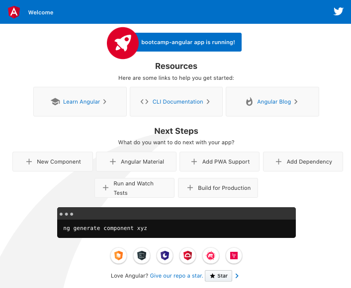
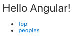
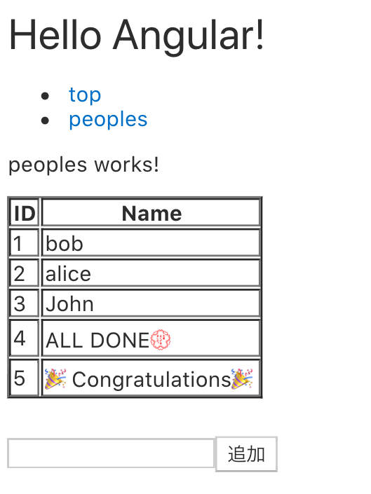

# Angular を触ってみよう

## Angular の紹介

- 公式(日本語) => [https://angular.jp/](https://angular.jp/)

Angular は2016年に発表されたwebフレームワークで、googleが中心になって開発されています。

前身となるAngularJS(1系)は2009年に登場し、双方向バインディングなど現在のAngularに繋がる多くの概念を生み出しましたが、パフォーマンスや使い勝手の向上を目的にバージョン2.0に上がる際に１から作り直されました。

(現在では「Angular」と呼ぶときはバージョン２以降を、「AngularJS」と呼ぶと１系を指すので、呼び方には少し注意が必要です。)

特徴としては

- フルスタックフレームワーク
  - Angular だけでフロントエンド開発に必要な機能が揃っている
- TypeScript ベースで開発されている
  - Angular を使う場合はほぼ確実に TypeScript を使う
  - 公式ドキュメントも全て TypeScript ベース
- component指向
- 半年に1回のメジャーリリース

などが上げられます。

比較的大規模なWebアプリケーションの構築に向いています。
その理由としては、TypeScriptでの開発が半ば強制されること。
ベストプラクティスな構成が公式から提供されているため、アプリケーションが大きくなってきても破綻しにくい。などが挙げられます。
(大抵の必要なツールや機能が全て公式から提供されているため組み合わせに悩まなくていいのもポイント)

逆に記述量が多いため、小さいアプリケーションの開発ではオーバーヘッドが大きくなりがち。また学習コストも比較的高いです。

## first step

Angular でアプリケーションを構築する場合はほぼ必ず [angular-cli](https://cli.angular.io/) というツールを利用します。これはAngular専用のCLIツールで、テンプレートコードを生成したり、開発用サーバを立ち上げたりしてくれます。
コマンド名は「ng」です。(aNGularの略称)

まずはこれを使い、自動生成されるAngularアプリケーションを起動してみましょう。

### docker imageの利用方法

```bash
docker pull forestsource/bootcamp-angular
cd <好きなディレクトリ ex. "/var/tmp/angular">

# MacOS, Linux
docker run --name bootcamp-angular -it --rm -v "$(pwd)":/app -p 4200:4200 forestsource/bootcamp-angular bash

# Windows
## Docker Desktopの Settings -> Resources -> FILE SHARING -> C にチェックを入れる(作業したいディレクトリがあるドライブにチェック)
mkdir C:\Users\%username\Desktop\bootcamp-angular
docker run --name bootcamp-angular -it --rm -v C:\Users\%username\Desktop\bootcamp-angular:/app :/app -p 4200:4200 forestsource/bootcamp-angular bash

# 追加でシェルを使いたい場合
docker exec -it bootcamp-angular bash
```

### angular-cliで開発環境を構築
今回使うdocker imageにはすでにangular(angular-cli)がインストールされています。

```bash
ng new bootcamp-angular
# > ? Would you like to add Angular routing? (y/N) : y  Angularを選択するユースケースではほぼ間違いなく使うかと思います。
# > CSS を選択
# > ✔ Packages installed successfully. と出力されたら成功です。

cd bootcamp-angular/

# Angular アプリケーションが生成されている
ls -l

# アプリ起動
ng serve --host 0.0.0.0
```

アプリケーションの起動後 http://localhost:4200 にアクセスするとサンプルアプリケーションが表示されます。
Angular 開発環境の構築はこれで完了です。簡単ですね！



### サンプルアプリケーションをいじってみる

`ng new`で生成されたアプリケーションの中身を少し見てみましょう。Angular アプリケーションのソースコードは主に `src/app/` 以下にあります。

```bash
# docker版
-rw-r--r-- 1 root root   246 Aug  3 10:18 app-routing.module.ts
-rw-r--r-- 1 root root     0 Aug  3 10:18 app.component.css
-rw-r--r-- 1 root root 25757 Aug  3 10:18 app.component.html
-rw-r--r-- 1 root root  1089 Aug  3 10:18 app.component.spec.ts
-rw-r--r-- 1 root root   220 Aug  3 10:18 app.component.ts
-rw-r--r-- 1 root root   393 Aug  3 10:18 app.module.ts

# VM版
[vagrant@localhost bootcamp-angular]$ ls -l src/app/
合計 20
-rw-rw-r--. 1 vagrant vagrant  245  2月 27 11:35 app-routing.module.ts
-rw-rw-r--. 1 vagrant vagrant    0  2月 27 11:35 app.component.css
-rw-rw-r--. 1 vagrant vagrant 1152  2月 27 11:35 app.component.html
-rw-rw-r--. 1 vagrant vagrant 1125  2月 27 11:35 app.component.spec.ts
-rw-rw-r--. 1 vagrant vagrant  221  2月 27 11:35 app.component.ts
-rw-rw-r--. 1 vagrant vagrant  393  2月 27 11:35 app.module.ts
```

Angular はcomponent指向のフレームワークという話をしましたが、この`.component`とついているのが１つのcomponentです。この`app.component`はアプリケーション全体を束ねる親componentになります。

`app.component.html` の中を見ると以下のようなコードがあります。
行が長いので`cat app.component.html | grep "app is running!"`すると見つけられます。

```html
   <span>{{ title }} app is running!</span>
```

`{{}}`というhtmlには見慣れない記法が入っています。Angular ではこのようにhtml側に変数を展開しながらUIを作っていきます。`title`という変数は`app.component.ts`で宣言されています。

```typescript
import { Component } from '@angular/core';

@Component({
  selector: 'app-root',
  templateUrl: './app.component.html',
  styleUrls: ['./app.component.css'],
})
export class AppComponent {
  title = 'bootcamp-angular';
}
```

色々書いてありますが、ほとんどはおまじないだと思ってもらえればいいです。重要なのは`title = 'bootcamp-angular';`で、このように`AppComponent`クラスで宣言した変数がhtml側で`{{ title }}`として展開可能です。

試しにタイトルを変更してみましょう。

```typescript
title = 'my-first-angular';
```

と変更してファイルを保存してください。ブラウザが勝手に更新されてタイトルが変更されます。

### (補足）ユニットテスト

ユニットテスト とは、メソッドや関数単位でテストコードを作成し、コードを書くのと同時に自動でテストを行う開発手法です。TDD (Test Driven Development) など聞いたことがあるかもしれません。

実は`ng new`コマンドはユニットテスト用の環境も用意してくれています。以下のコマンドを実行してください。(`ng serve`を止めてこちらを実行した方がいいかもしれません)

#### 設定変更
`./bootcamp-angular/karma.conf.js(テストツールの設定ファイル)`のブラウザ設定を下記のように必要があります。
Chromeはrootで実行する場合は`--no-sandbox`が必要なので追加しています。

```bash
@@ -25,7 +25,13 @@
     colors: true,
     logLevel: config.LOG_INFO,
     autoWatch: true,
-    browsers: ['Chrome'],
+    browsers: ['ChromeHeadlessNoSandbox'],
+    customLaunchers: {
+      ChromeHeadlessNoSandbox: {
+        base: 'ChromeHeadless',
+        flags: ['--no-sandbox']
+      }
+    },
     singleRun: false,
     restartOnFileChange: true
   });
```
テストを実行する。

```bash
ng test

#> 09 05 2020 16:06:23.410:INFO [karma-server]: Karma v5.0.5 server started at http://0.0.0.0:9876/
#> 09 05 2020 16:06:23.411:INFO [launcher]: Launching browsers ChromeHeadlessNoSandbox with concurrency unlimited
#> 09 05 2020 16:06:23.466:INFO [launcher]: Starting browser ChromeHeadless
#> ...(省略)
#> TOTAL: 2 FAILED, 1 SUCCESS
#> TOTAL: 2 FAILED, 1 SUCCESS
```

ユニットテストが実行され、いくつかエラーが表示されると思います。これはデフォルトで生成されるテストコードに「タイトルが`bootcamp-angular`であること」を確認するテストが含まれているためです。

そのテストコードは`src/app/app.component.spec.ts`にあります。

```typescript
  it('should create the app', () => {
    const fixture = TestBed.createComponent(AppComponent);
    const app = fixture.componentInstance;
    expect(app).toBeTruthy();
  });

  it(`should have as title 'bootcamp-angular'`, () => {
    const fixture = TestBed.createComponent(AppComponent);
    const app = fixture.componentInstance;
    expect(app.title).toEqual('bootcamp-angular');
  });

  it('should render title', () => {
    const fixture = TestBed.createComponent(AppComponent);
    fixture.detectChanges();
    const compiled = fixture.nativeElement;
    expect(compiled.querySelector('.content span').textContent).toContain('bootcamp-angular app is running!');
  });
});

```

やはり色々書いてありますが、今はおまじないだと思ってください。重要なのは上の二箇所です。
ここでは以下の２つのテストを実施しています。

- `AppComponent` クラスの `title` 変数の内容が `bootcamp-angular` であること。
- レンダリングされたhtml （完成系のhtml）の`span`タグの中に`bootcamp-angular app is running!`という文字列が含まれること

先ほどタイトルを変更してしまったので、テストが失敗するようになっています。これを編集してテストが通るようにしてみてください。`ng serve`と同様に、`ng test`もファイルを編集すると自動的にテストをやり直してくれます。

## component を作ってみる

次はcomponentを作ってみましょう。angular-cliには雛形を自動的に生成してくれる機能があります。以下のコマンドを実行してください。

```bash
ng generate component peoples

#> CREATE src/app/peoples/peoples.component.css (0 bytes)
#> CREATE src/app/peoples/peoples.component.html (22 bytes)
#> CREATE src/app/peoples/peoples.component.spec.ts (635 bytes)
#> CREATE src/app/peoples/peoples.component.ts (279 bytes)
#> UPDATE src/app/app.module.ts (479 bytes)

```

すると`src/app/peoples/`以下にcomponentの雛形が生成されます。ただし作っただけでは表示されません。componentを表示するには以下の２通りの方法があります。

- 既存のcomponentに埋め込んで表示する
- ルーティングを登録して別ページとして表示する

ここではルーティングを登録してみましょう。`src/app/app-routing.module.ts`を以下のように変更してください。

```typescript
import { NgModule } from '@angular/core';
import { Routes, RouterModule } from '@angular/router';
import { PeoplesComponent } from './peoples/peoples.component';

const routes: Routes = [
  { path: 'peoples', component: PeoplesComponent}
];

@NgModule({
  imports: [RouterModule.forRoot(routes)],
  exports: [RouterModule]
})
export class AppRoutingModule { }
```

これは`/peoples`というパスにアクセスした時`PeoplesComponent`の内容を表示するという設定です。
`PeoplesComponent`の表示位置は`src/app/app.component.html`にある

```html
<router-outlet></router-outlet>
```

の部分に表示されます。試しに http://192.168.20.10:4200/peoples にアクセスしてみてください。下の方に`peoples works!`が表示されていれば成功です。

このようにAngularなどモダンなフレームワークはページ遷移を再現するための「ルーター」と呼ばれる機能を提供しています。

ついでに邪魔なので、`src/app/app.component.html`には`peoples`へのリンクだけを残して綺麗にしてしまいましょう。
この時 `<style>`タグは残しておくと、わずかに見やすくなります。

```html
<h1>Hello Angular!</h1>

<ul>
  <li>
    <a routerLink="/">top</a>
  </li>
  <li>
    <a routerLink="/peoples">peoples</a>
  </li>
</ul>

<router-outlet></router-outlet>
```



このように、定義したroutingに従って`a`タグでリンクを張ることができます。

## API からデータを取得してみる

次は外からHTTPアクセスでデータを取得してみます。実際にはWebサーバのAPIをたたくことが多いですが、今回はjQueryの時と同様に以下のjsonファイルの内容を取得してみます。

[https://raw.githubusercontent.com/iij/bootcamp/master/test.json](https://raw.githubusercontent.com/iij/bootcamp/master/test.json)

TypeScriptでは型の分からないobjectを扱うのは基本的には避けるべきです。そこでまずは取得するデータの型を定義しましょう。型を定義するには`interface`を使います（これはTypeScriptの話）。
angular-cliでは`interace`を生成する機能があるので、それを使ってみましょう。

```bash
ng generate interface models/people
#> CREATE src/app/models/people.ts (28 bytes)
```

すると `src/app/models/people.ts` にファイルが生成されます。取得するデータに合わせてfieldを定義しましょう。

```typescript
export interface People {
  id: number;
  name: string;
}
```

これで`id`と`name`を持つようなobjectを`People`型として扱えます。逆に言うと`People`型なオブジェクトには必ず`id`と`name`が存在することが保証されています。

続いてHTTPリクエストを実行する部分を書いてみましょう。AngularではHTTPリクエストは`Service`を使って実行するのが基本です。なぜ`Service`を使うのかなど、詳しくは [公式ドキュメント](https://angular.jp/tutorial/toh-pt4) を参照してください。

早速`Service`の雛形を作りたいところですが、もう一つ準備があります。Angular では`module`と言う単位でアプリケーションが分離されており、今回のようにHTTPのリクエストを行うためには`HttpClientModule`を追加で読み込む必要があります。
（これは不要なコードを読み込まないようにしてブラウザで動くJavascriptのコードを少しでも減らすための工夫です）

moduleの読み込みは`app.module.ts`で行います。以下のように追記してください。

```typescript
@@ -1,5 +1,6 @@
 import { BrowserModule } from '@angular/platform-browser';
 import { NgModule } from '@angular/core';
+import { HttpClientModule } from '@angular/common/http';

 import { AppRoutingModule } from './app-routing.module';
 import { AppComponent } from './app.component';
@@ -12,7 +13,8 @@
   ],
   imports: [
     BrowserModule,
-    AppRoutingModule
+    AppRoutingModule,
+    HttpClientModule
   ],
   providers: [],
   bootstrap: [AppComponent]

```

これでアプリケーションに`HttpClientModule`が読み込まれます。では`Service`の雛形を作りましょう。

```bash
ng generate service services/people

#> CREATE src/app/services/people.service.spec.ts (357 bytes)
#> CREATE src/app/services/people.service.ts (135 bytes)

```

`services/people.service.ts`にファイルが生成されます。テストコードも一緒に生成されますが、今回はテストコードまで触れません。

以下のようにjsonを取得するためのコードを書いていきましょう。この時点ではまだどこからも呼び出されていないので保存してもアプリケーションは更新されません。

```typescript
import { Injectable } from '@angular/core';
import { HttpClient } from '@angular/common/http';
import { People } from '../models/people';
import { Observable } from 'rxjs';

@Injectable({
  providedIn: 'root'
})
export class PeopleService {
  private jsonUrl = 'https://github.com/iij/bootcamp/test.json';

  constructor(private http: HttpClient) { }

  getJson(): Observable<People[]> {
    return this.http.get<People[]>(this.jsonUrl);
  }
}
```

## データをHTMLに表示してみる

上で書いた`Service`の`getJson`メソッドを実行すると、URL先のjsonを非同期通信で取得します。非同期に取得したデータをHTMLに表示してみましょう。

まずはcomponentでserviceを呼び出すため`peoples/peoples.component.html`を以下のように追記してください。


```typescript
import { Component, OnInit } from '@angular/core';
import { PeopleService } from '../services/people.service';
import { take } from 'rxjs/operators';

@Component({
  selector: 'app-peoples',
  templateUrl: './peoples.component.html',
  styleUrls: ['./peoples.component.css']
})
export class PeoplesComponent implements OnInit {
  peoples = [];

  constructor(private peopleService: PeopleService) { }

  ngOnInit() {
    this.peopleService.getJson().pipe(
      take(1)
    ).subscribe(response => {
      this.peoples = response;
    });
  }
}
```

少し解説します。

- `ngOnInit`: Angular のcomponentが画面に表示されるタイミングで実行される関数です。
  - `constructor` が実行されるタイミングはcomponentの描画と無関係なため、初期化処理は基本的に`ngOnInit`に記述します。
- `subscribe`: Observable に非同期データが流れて来た時の処理を記述します
  - `Promise`の`then`やcallback関数のようなものです。
  - Observable について詳しくは「補足」で記述します。
- `take(1)`: Observable 処理を1回で終了します。
  - 詳しく語ると長いですが、これをしないと`subscribe`が延々とデータを待ち続けてしまいます。
  - `unsubscribe`する手もありますが、今回はシンプルにいきました。

ややこしく見えますが、やってることはjsonを取得して結果を`peoples`という変数に入れているだけです。次に`peoples`の中身を表示するHTML側を書いていきます。

`peoples/peoples.component.html`を以下のように編集してください。

```html
<p>
  peoples works!
</p>
<table border=1>
  <tr><th>ID</th><th>Name</th></tr>
  <tr *ngFor="let people of peoples">
    <td>{{ people.id }}</td><td>{{ people.name }}</td>
  </tr>
</table>
```

Angular らしさが出てきました。AngularではHTML上に`*ngFor`のような独自の記法がよく登場します。

`*ngFor` は Angular の機能の中でもよく使うものです。配列やmapを指定すると`for`文のようにHTMLを展開してくれます。今回は`peoples`と言う配列を渡しているので、`peoples`の長さだけ`<tr></tr>`が繰り返し表示されます。
繰り返しの中では、各要素に`people`と言う変数でアクセスできるようにしています。

このようにAngularではJavaScriptで作られた値(今回は`peoples`)を少ないコード量でHTMLに表示することができます。

## Formを作ってみる

最後に簡単な入力フォームを作ってみます。Angular でフォームを作るには以下の２通りのやり方が有ります。

- テンプレート駆動フォーム: AngularJS の頃に近い書き方。`ngModel`で変数をformに紐づける。
- リアクティブフォーム: Observable に親和性の高い書き方。JavaScript側で実際に値を変更したりできる。

詳しい違いは [公式ドキュメント](https://angular.jp/guide/forms-overview) を参照してください。

最近ではテストが容易などの理由でリアクティブフォームを使って書くことが多いですので、ここでもそちらを使っていきたいと思います。

まずはTypeScript側のコードを書いていきます。まずはHTTPリクエストの時と同じようにmoduleを追加しましょう。
`app.module.ts`を以下のように変更してください。

```typescript
@@ -1,6 +1,7 @@
 import { BrowserModule } from '@angular/platform-browser';
 import { NgModule } from '@angular/core';
 import { HttpClientModule } from '@angular/common/http';
+import { ReactiveFormsModule } from '@angular/forms';

 import { AppRoutingModule } from './app-routing.module';
 import { AppComponent } from './app.component';
@@ -14,7 +15,8 @@
   imports: [
     BrowserModule,
     AppRoutingModule,
-    HttpClientModule
+    HttpClientModule,
+    ReactiveFormsModule
   ],
   providers: [],
   bootstrap: [AppComponent]
```

続いてcomponentを書いていきます。`peoples/peoples.component.ts`を以下のように変更してください。

```typescript
import { Component, OnInit } from '@angular/core';
import { PeopleService } from '../services/people.service';
import { FormControl } from '@angular/forms';
import { take } from 'rxjs/operators';

@Component({
  selector: 'app-peoples',
  templateUrl: './peoples.component.html',
  styleUrls: ['./peoples.component.css']
})
export class PeoplesComponent implements OnInit {
  peoples = [];
  peopleName = new FormControl('');

  constructor(private peopleService: PeopleService) { }

  ngOnInit() {
    this.peopleService.getJson().pipe(
      take(1)
    ).subscribe(response => {
      this.peoples = response;
    });
  }

  addPeople() {
    const last = this.peoples[this.peoples.length - 1];
    this.peoples.push({
      id: Number(last.id) + 1,
      name: this.peopleName.value
    });
    this.peopleName.setValue('');
  }
}
```

`peopleName`という名前でform用の変数を定義します。text inputに入力されたtextはこの変数に入ります。

`addPeople()`というメソッドを実行すると`peoples`の末尾に入力した名前のデータが挿入されます。

続いてHTML側を書きましょう。一番下の4行を追加してください。

```html
<p>
  peoples works!
</p>
<table border=1>
  <tr><th>ID</th><th>Name</th></tr>
  <tr *ngFor="let people of peoples">
    <td>{{ people.id }}</td><td>{{ people.name }}</td>
  </tr>
</table>
<br/>
<input type="text" [formControl]="peopleName"> <button (click)="addPeople()">追加</button>
<br/>
<span *ngIf="peopleName.value.length > 0">入力中: {{ peopleName.value }}</span>
```

`[formControl]`という部分で`peopleName`をinputタグに紐づけます。そしてボタンをクリックした時に`addPeople()`が実行されるように`click`イベントを定義しました。

何か入力して「追加」ボタンを押すと表示に追加されるはずです。

一番下の行は不要ですが、Angular の機能を紹介するために書いています。`*ngIf`は`*ngFor`よりもさらに使う機能で、引数内の条件式が`true`の時にだけhtml要素を表示してくれます。

ここまでくればこのような画面が表示されます。



## 最後に

Angular の機能と基本的な書き方を紹介しました。ここで紹介できたのはほんの一部ですので、興味があれば [公式ドキュメント](https://angular.jp/guide/quickstart) を参照してください。

## (補足) Observable

Angularを使う上で避けては通れないのが`Observable`です。これは`Promise`と同じように非同期処理を解決するためのデザインパターンで、Angular ではHTTPリクエストだけではなく、「全て」の状態変化が`RxJS`というライブラリを使ったObservableで管理されています。

Observableパターンでは非同期なデータの流れを「ストリーム」として扱い、そのストリームを変更していくことで非同期データを扱います。ほんの一例ですが、例えば以下のようなことができます。

```typescript
observable = of(1, 2, 3, 4, 5);  // 1~5の数字が順番に流れてくるストリームを作成
observable.pipe(
  map(num => { return num * 2 }),  // 各値を２倍
  filter(num => num > 4),          // > 4 な値のみにフィルタリング
).subscribe(num => {
  console.log(num);                // 「6」「8」「10」 が順番に表示される
});
```

やはり詳しくは [公式ドキュメント](https://angular.jp/guide/observables) を参照してください（若干分かりにくいかもしれません）。

Angular ではHTTPリクエストはもちろん、URLの変更やform要素の入力、ユーザーイベントなど全ての変更がObservableで処理されています。
