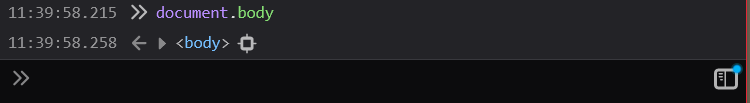
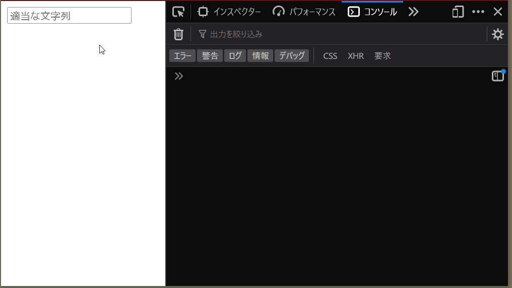

# 素のJavaScript + DOM入門

JavaScriptは、ウェブアプリケーションのフロントエンドに欠かせない、重要なプログラミング言語です。この講義では、ReactやVue.js、Svelteなど現代的なJavaScript用フレームワークを一切使わずに簡単なアプリケーションを作ってみることで、そうしたフレームワークが根本的な処理で何をしているのか、はたまたそうしたフレームワークがどのような処理を代替してくれているのか、理解する手がかりにすることを目指します。

## 前提知識

他のプログラミング言語によるプログラミング経験。JavaScriptの構文については軽く触れる程度にとどめますので、これまで学習したプログラミング言語について、その言語から類推できるほどの理解が備わっていると好ましいです。

## 事前準備・注意事項

- 適当なテキストエディターとブラウザーが動くパソコン
    - 特にこだわりがなければ[Visual Studio Codeをこちらからダウンロードしてインストール](https://azure.microsoft.com/ja-jp/products/visual-studio-code)するのを推奨します
    - ブラウザーについては、次のいずれかのブラウザーの、比較的新しいバージョンの利用のみを想定します
        - Microsoft Edge （以下「Edge」）
        - Google Chrome
        - Safari
        - Mozilla Firefox （以下「Firefox」）
        - ⚠️特に断りがない限り、ブラウザーのスクリーンショットを掲載する際はFirefoxで撮影したものを使用します。他のブラウザーを使用した場合やブラウザーなどの設定により、**表示される内容が多かれ少なかれ異なります**のでご了承ください

## 作業用のディレクトリーを作る

ここ以降本講義を通じて作るファイルをまとめるために、（例えば）以下のコマンドで専用のディレクトリーを作ってください:

```bash
# デスクトップにiij-bootcamp-domディレクトリーを作る
cd ~/Desktop
mkdir iij-bootcamp-dom
```

以降、この節で作ったディレクトリーを、上記の例と同様に`iij-bootcamp-dom`ディレクトリーと呼びます。

## 最初のブラウザーアプリケーション

とりあえず、最も単純なJavaScriptのアプリケーションを作ってみましょう。

前の節で作った`iij-bootcamp-dom`ディレクトリーに、`1.html`というファイルを作ります。「JavaScriptの勉強なのにHTMLファイル？」と疑問に持った方もいらっしゃるかも知れませんのでお答えしますと、次のような事情があります:

- 今回勉強するDOMを操作するJavaScriptは、原則HTMLファイルを経由して読み込まれるため。`.js`ファイルだけをブラウザーで開いてプログラムを起動することはできない
- `.html`ファイルと`.js`ファイルを分割して読み込ませることもできるものの、1つのファイルに完結させた方が扱いが楽だから
    - 細かい話: 特に今回紹介するモダンな`<script type="module">`を使用した場合、`file://`プロトコルで（つまり、ウェブサーバーを介さず、`.html`を直接開いて読んだ場合において）`.js`ファイルを読むことができないので

`1.html`は次の内容にしましょう。今回はHTMLの解説はしないので、おまじないが多くて退屈なコードになってしまいますが、ご容赦ください。

```html
<!DOCTYPE html>
<html>
  <head>
    <meta charset="utf-8">
    <script type="module">
      // ここにJavaScriptを書きます！そう、この行はJavaScriptのコメントです！
      console.log("Hello, world!");
    </script>
    <title></title>
  </head>
  <body>
  </body>
</html>
```

解説は後にして、保存できたら`1.html`をダブルクリックして開いてみましょう。

いかがでしょうか？何も表示されませんでしたか？


そう、ブラウザーのタブが新しく開かれ、何も書かれていない、真っ白なページが表示されるのが正解です。今回書いたプログラムは、ブラウザーのタブを含め、ユーザーが直接見えるところには何も表示しません。じゃあ何をするの？と疑問に思ったところで、書いたプログラムの解説をします。

HTMLからJavaScriptで書かれたプログラムを実行する場合、`<script>`というタグを使用します。上記のHTMLで言うところの`<script type="module">`から`</script>`までの間にJavaScriptを書きます。抜き出すと次の箇所です:

```js
// ここにJavaScriptを書きます！そう、この行はJavaScriptのコメントです！
console.log("Hello, world!");
```

※細かい話: 多くのプログラミング言語と同様に、文字列リテラルを除いて空白文字は見た目を整える以上の意味を持ちません。なので上記のコードでも先頭のスペースは取り除いています。

まず、1行目の`// ここにJavaScriptを書きます！そう、この行はJavaScriptのコメントです！`は、書いてあるとおりコメントです。JavaScriptでは、C言語などと同様`//`以降行末までがコメントとなっています。ちなみに、これもC言語などと同様`/*`と`*/`で囲われた箇所もコメントになっています。

```js
// これは行コメントです。
/* これはブロックコメントです */
```

コメントの次の行、`console.log("Hello, world!");`が、実行するJavaScriptのコードです。`console`というオブジェクトの`log`メソッドを`"Hello, world!"`という文字列に対して呼んでいる、ということが読み取れるでしょうか？`console`は大抵のJavaScript処理系で利用できる、デバッグ時に便利なメソッドをたくさん備えたオブジェクトです。`log`メソッドはその代表で、引数として渡した文字列（や、その他あらゆるオブジェクトの中身）をデバッグログとして書き出してくれます。

要するに、我々が「最初のブラウザーアプリケーション」として書いたプログラムは、デバッグログとして`"Hello, world!"`という文字列を表示するだけのプログラムです。ではそのデバッグログは一体どうやって見ることができるのでしょうか？そのためには「開発者ツール（通称DevTools）」というブラウザーの機能を使います。開発者ツールは現代の主要なブラウザー全てに搭載されている、ブラウザーアプリケーションのデバッグに必須のツール群です。`console.log`によって出力した情報も、開発者ツール上でのみ閲覧できるようになっています。

開発者ツールを起動するには、<kbd>Ctrl</kbd> + <kbd>Shift</kbd> + <kbd>I</kbd>（Macの場合<kbd>Cmd</kbd> + <kbd>Option</kbd> + <kbd>I</kbd>）というショートカットキー（OS・ブラウザーによっては<kbd>F12</kbd>キーも利用できます）を使うのがおすすめです。Safariをご利用の場合、設定を変更しないと開発者ツールは利用できなくなっているので、[Apple サポート](https://support.apple.com/ja-jp/guide/safari/sfri20948/mac)を参考に「開発」メニューが表示されるようにしてください。

さて、開発者ツールが起動できたらいよいよ`console.log`に渡した文字列とご対面です！画面上部にある「コンソール」というタブをクリックしてください。


表示できたでしょうか？これでJavaScriptで書かれた最初のプログラムが動きましたね！🎉

### 🚩チェックポイント

スクリーンショットのように、開発者ツールの「コンソール」に文字列を書き込むJavaScriptを書けた。

### ここまでのまとめ

- HTMLファイルに直接JavaScriptを書いて実行する際は、`<script>`タグを使用する
    - 補足: `<script type="module">`が現状最も新しい書き方
- JavaScriptの行コメントは `//` で始める。`/*` と `*/` で囲えばブロックコメントになる
- `console.log`というメソッドで出力した文字列は、各ブラウザーが提供する「開発者ツール」という機能を使えば閲覧できる
- 開発者ツールWindowsやLinuxだと<kbd>Ctrl</kbd> + <kbd>Shift</kbd> + <kbd>I</kbd>、Macでは<kbd>Cmd</kbd> + <kbd>Option</kbd> + <kbd>I</kbd>といったショートカットキーなどで起動できる

## JavaScript構文概要

ここからは、これ以降で使用**しない**ものも含めて、JavaScriptの主要な機能を簡単に紹介します。いずれのサンプルコードも、先ほど書いた`<script type="module">`と`</script>`で囲ったところに挿入して保存・ブラウザーの再読み込みをすれば、動作を確認できるようになっています。是非気になったものを試してみてください！

### 変数宣言

```js
const aConstant = "これは定数です";
let aVariable = "これは変数です";

console.log(aConstant);
console.log(aVariable);

aVariable = "これで変数を書き換えることができます";
console.log(aVariable);

// これはエラー
aConstant = "定数なので再代入できません！";

// これもエラー
let aVariable = "同じ変数を再度宣言することもできません！";
```

### 基本的な型

#### 真偽値

```js
// 「true」はJavaScriptにおける「真」。boolean型
console.log(true);
console.log(false);

// 論理積
console.log(true && true);
console.log(true && false);
console.log(false && true);
console.log(false && false);

// 論理和
console.log(true || true);
console.log(true || false);
console.log(false || true);
console.log(false || false);
```

#### 数値

```js
// 数値型（浮動小数点数）
console.log(0.123);

// これも数値型（浮動小数点数）
// C言語などで言うところの「int型」はない
console.log(1);

// もちろんよくある四則演算ができる
console.log(1 + 1);
console.log(4 - 2);
console.log(0.2 * 10);
console.log(7 / 3.5);

// 一通りの比較演算もできる
console.log(1 == 1);
console.log(4 != 2);
console.log(0.2 < 10);
console.log(7 > 3.5);
console.log(100 >= 100);
console.log(100 <= 100);
```

その他、数値を扱う関数やメソッドなどについては[Number - JavaScript | MDN](https://developer.mozilla.org/ja/docs/Web/JavaScript/Reference/Global_Objects/Number)や[Math - JavaScript | MDN](https://developer.mozilla.org/ja/docs/Web/JavaScript/Reference/Global_Objects/Math)をご覧ください。

#### 文字列（後ほど使用します）

```js
const doubleQuoted = "先ほどから何度も使っている、ダブルクォートで囲った文字列リテラル";
const singleQuoted = "シングルクォートで囲った文字列リテラル";
console.log("バックスラッシュによるエスケープシーケンスも使えます。これは改行 =>\n次の行");
console.log("シングルクォートでも同様。これは改行 =>\n次の行");

const backQuoted = `最近のJavaScriptではバッククォートで囲った文字列リテラルが使えます。`;
const multiLine = `バッククォートによる文字列リテラルでは、エスケープシーケンスを使わずに途中で改行を挟むこともできます。
しかも、ドルマーク $ とブレース {} によって任意の式を埋め込むことができます！
例: いちたすいちは～？ ${1 + 1}！`;
console.log(multiLine);

console.log(`文字列の長さは、 .length で分かります: ${"12345".length}`);

console.log(`数値と同様の演算子で、文字列同士の比較もできます:
オレ == オレ => ${"オレ" == "オレ"}
コナン != しんいち => ${"コナン" != "しんいち"}
ABC < DEF => ${"ABC" < "DEF"}
XYZ > ABC => ${"XYZ" > "ABC"}
ABC <= ABC => ${"ABC" <= "ABC"}
ABC >= ABC => ${"ABC" >= "ABC"}
`);
```

その他、詳しい使い方は[String - JavaScript | MDN](https://developer.mozilla.org/ja/docs/Web/JavaScript/Reference/Global_Objects/String)をご覧ください。

#### 配列

```js
// 配列リテラルは、角括弧 [] で表します。

// 空の配列
console.log([]);

console.log(["これは", "4つの", "要素が入った", "配列です"]);
console.log([1, "つの配列に", "複数の種類の", "値を含めることができます:", true]);

const array = ["一番目", "二番目", "三番目"];
console.log(`配列の長さ（要素の数）は .length で分かります: ${array.length}`);

console.log(`配列の特定の要素にアクセスしたいときは、角括弧を使います: ${array[1]}
多くの言語でお馴染み0始まりの番号なのでご注意ください。`);
```

その他、詳しい使い方は[Array - JavaScript | MDN](https://developer.mozilla.org/ja/docs/Web/JavaScript/Reference/Global_Objects/Array)をご覧ください。

#### オブジェクト

JavaScriptにおけるオブジェクトは、「キー（名前）と値の関連付け」の集まりです。一つのオブジェクトにつき、同じキーに関連付けられた値は一つしか存在することができません。他のプログラミング言語では「ハッシュ」や「辞書」、「マップ」などと呼ばれているものと概ね同じ性質を備えています。

```js
// オブジェクトリテラルは、波括弧 {} で表します。

// 空のオブジェクト
console.log({});

// 波括弧 {} の中で キー: 値, キー: 値, ... を繰り返すことで、
// オブジェクトを記述します:
const book = {
  title: "こころ",
  author: "夏目漱石",

  // 空白など、JavaScriptの識別子（変数や関数などの名前）
  // に使えない文字列をキーにする場合、文字列リテラルで記述してください:
  "1st publish year": 1914,
};

console.log(book);

// キーに対応する値は、ピリオドに続けてキーの名前を書くことで取得できます:
console.log(book.title);

// ただし、キーがJavaScriptの識別子として無効な文字列であった場合、
// 角括弧と文字列リテラルを使って指定しなければなりません
console.log(book["1st publish year"]);

// この、角括弧を使った方法は、ユーザーの入力からキーを指定する場合など
// 動的にキーを指定する場合でも使えます。
const authorKey = "author";
console.log(book[authorKey]);

// 先ほどの構文とイコール = を組み合わせることで、
// オブジェクトのキーに対応する値を更新することができます:
book.title = "ご注文はうさぎですか？";
book[authorKey] = "Koi";
book["1st publish year"] = 2011;

// 後でキーを追加することもできます
book.note = "なぜごちうさ？と思った方へ: 先に「こころ」を思いついたので「こころ」つながりで思い出しただけです😜";

console.log(book);
```

このほか、オブジェクトの扱い方についての詳しい解説は[オブジェクトでの作業 - JavaScript | MDN](https://developer.mozilla.org/ja/docs/Web/JavaScript/Guide/Working_with_objects)をご覧ください。

#### `Map`型（連想配列）

JavaScriptには、前節の「オブジェクト」以外にも「キー（名前）と値の関連付け」の集まりを表すものがあります。それは`Map`と呼ばれているものです。オブジェクトは実態として、予め決まったキーのみを扱うことに特化した構造となっており、キーを頻繁に追加・削除するような処理には向いていない、などの事情により、`Map`が別途作られました。

詳しくは[Map - JavaScript | MDN](https://developer.mozilla.org/ja/docs/Web/JavaScript/Reference/Global_Objects/Map)をご覧ください。

### 制御構造

#### `if`文・真偽値と等価に扱われる値

```js
if (true) {
  console.log("条件節の値が真なので呼ばれます！");
} else {
  console.log("こちらは呼ばれません！");
}

// 同様に「false」はJavaScriptにおける「偽」。同じくBoolean型
if (false) {
  console.log("こちらは呼ばれません！");
} else {
  console.log("条件節の値が偽なので呼ばれます！");
}
```

JavaScriptでは`true`・`false`以外にも「真」・「偽」と同様に扱われる値がたくさんあります。

```js
// 「0」もJavaScriptにおける「偽」
if (0) {
  console.log("こちらは呼ばれません！");
} else {
  console.log("条件節の値が偽なので呼ばれます！");
}

// 空文字列「""」もJavaScriptにおける「偽」
if ("") {
  console.log("こちらは呼ばれません！");
} else {
  console.log("条件節の値が偽なので呼ばれます！");
}

// 「何もない」ことを表す「null」もJavaScriptにおける「偽」
if (null) {
  console.log("こちらは呼ばれません！");
} else {
  console.log("条件節の値が偽なので呼ばれます！");
}

// 宣言されたけど初期値が設定されなかった変数に用いられる
// 「undefined」もJavaScriptにおける「偽」
// 前述の「null」とよく似ている。
// 遭遇するケースがより多いためか「undefined」の方が頻繁に用いられる
if (undefined) {
  console.log("こちらは呼ばれません！");
} else {
  console.log("条件節の値が偽なので呼ばれます！");
}

// その他、空の配列や空のオブジェクトを含め、
// 多くの値が「真」と同等に扱われる
if ([]) {
  console.log("条件節の値が真なので呼ばれます！");
} else {
  console.log("こちらは呼ばれません！");
}

if ({}) {
  console.log("条件節の値が真なので呼ばれます！");
} else {
  console.log("こちらは呼ばれません！");
}
```

最後のコメントに`// 多くの値が「真」と同等に扱われる`と書いたとおり、実際には例外があります。詳しくは[Falsy (偽値) - MDN Web Docs 用語集: ウェブ関連用語の定義 | MDN](https://developer.mozilla.org/ja/docs/Glossary/Falsy)をご覧ください。

#### `switch`文

```js
const x = "比較対象となる値";
switch(x) {
  case 1:
    console.log("xは1でした");
    break;
  case 2:
    console.log("xは2でした");
    break;
  case 3: // break; がないとその次の case に続きます
  case 4:
    console.log("xは3か4のどちらかでした");
    break;
  case "比較対象となる値":
    console.log("xは「比較対象となる値」でした");
    break;
  default:
    console.log("xはどれでもありませんでした");
    break;
}
```

#### `for ... of`文

配列などの各要素に対して、同じことを繰り返し実行するための構文です。

```js
const array = ["これは", "4つの", "要素が入った", "配列です"];
for (const element of array) {
  // この中でarrayの各要素を代入したelementにアクセスできます
  console.log(element);
}
```

ここでは割愛しますが、配列以外にも、任意の[反復処理オブジェクト](https://developer.mozilla.org/ja/docs/Web/JavaScript/Reference/Iteration_protocols)に対して`for ... of`文は使えるようになっています。

#### `while`文・インクリメント演算子

```js
let count = 1;
console.log("1から10まで数えます！");
while (count <= 10) {
  console.log(`...${count}`);
  ++count;
}

console.log("for ... of文のサンプルと同じことをします！");
const array = ["これは", "4つの", "要素が入った", "配列です"];
let i = 0;
while (i < array.length) {
  const element = array[i];
  console.log(element);
  ++i;
}
```

#### `for`文

C言語などの`for`文と同様、基本的には`while`文の形少し変えただけのものと同様です。なので同じことをするサンプルを書きます:

```js
console.log("1から10まで数えます！");
for (let count = 1; count <= 10; ++count) {
  console.log(`...${count}`);
}

console.log("for ... of文のサンプルと同じことをします！");
const array = ["これは", "4つの", "要素が入った", "配列です"];
for (let i = 0; i < array.length; ++i) {
  const element = array[i];
  console.log(element);
}
```

### エラー処理

プログラムの実行時に問題が発生した際作られる`Error`オブジェクトは、`try/catch/finally`文（あるいは、`catch`か`finally`を省略した`try/catch`文・`try/finally`文）で処理することができます:

```js
// undefined に対してキーに対応する値を
// 得ようとすると、エラーになります
undefined.key;
// Uncaught TypeError: undefined has no properties
// というエラーに。


// try/catch/finally文を使うことでエラーが
// 発生した場合に行う処理を記述できます
try {
  undefined.key;
} catch (error) {
  // ここで error という変数を通じて、
  // Error オブジェクトにアクセスできます

  // エラーメッセージや、名前にアクセスできます
  console.log(error.name);
  console.log(error.message);

  // 標準の仕様では定義されていませんが、多くの処理系において
  // スタックトレースにもアクセスできます
  console.log(error.stack);
} finally {
  console.log("ここはエラーが発生してもしなくても必ず実行されます");
}

// catch節かfinally節のどちらか一方のみが省略できるようになっています。
// 以下はfinally節を省略したtry/catch文
try {
  // ついでに共有しますと、
  // throwという文を使うことで、自分で定義したエラーを投げることもできます
  throw new Error("ついでに投げられたエラー")
} catch (error) {
  console.log("ついでにcatchしました");
  console.log(error);
}

// catch節を省略したtry/finally文では
// finally節に書いた処理が実行された後、
// エラーが投げられます
try {
  throw new Error("catchされないエラー")
} finally {
  console.log("ここはエラーが発生してもしなくても必ず実行されます");
}
```

### 関数

JavaScriptにおいて関数を定義する方法は、歴史的な経緯や細かい仕様の違いによりいくつかあります。ここでは最も代表的な、`function`文による関数定義を紹介します:

```js
function f(argument1, argument2, argument3) {
  console.log("これは昔からある、function文による関数定義です");

  // Tip: これまで紹介していませんでしたが、実は console.log には複数の引数を渡すことができます
  console.log("これらは引数: ", argument1, argument2, argument3);

  // 結果を返して巻数の実行を終了するときは return 文を使います
  return "これはfの戻り値です";
}

// 実行するときはもちろん括弧で。
console.log(f("一つ目", "2つめ", "みっつめ"));

// **注意**: 引数の数が足りなくても**エラーになりません！**
console.log(f("あれ、一つ目しかない！"));
```

#### 関数式（⚠️重要⚠️ 後ほど使用します）

JavaScriptの世界では、これまで紹介した文字列や数値、配列などと同様に、関数も変数に代入したり、他の関数の引数として渡したりすることができるようになっています（このことを「JavaScriptでは、関数もファーストクラスオブジェクトである」と言います）。これはこの後紹介するイベントリスナーを実現するためにも使われている、大変重要な機能です。

関数を「他の関数の引数として渡す」のを円滑に行うために、名前の付いていない関数を定義する「関数式」という構文があります。

「関数式」には新しいものと古いものの2種類の構文があります。今回は新しいものだけを紹介します:

```js
function functionReceivingAnotherFunction(f) {
  console.log("この関数は、**関数式を使っていない**、普通のfunction文で定義した関数です。");
  console.log("「関数を受け取る関数」のデモのために定義しました。");

  console.log('この関数では、引数として受け取った関数 f にそれぞれ異なる引数を渡して2回呼び出し、その結果をデバッグログに書き出します');

  console.log("1回目の実行結果:", f("1回目の引数。"));
  console.log("2回目の実行結果:", f("2回目の引数！"));
}

// これが関数式。
// 明確なキーワードがなく、記号だけで書かれているので分かりづらいが、
// 丸括弧 () で引数を列挙した後、
// 右向きの太い矢印 => 、
// 波括弧 {}、
// が続き、波括弧 {} の中に関数の本体を書く
(arg) => {
  console.log("この間数式は特に変数に代入されたり他の関数の引数として渡されることもないので、呼び出されることがありません。");
  console.log("関数式の構文をわかりやすく説明するために作成しただけです。");
  console.log("当然、この引数が役に立つこともありません: ", arg);
};

functionReceivingAnotherFunction((arg) => {
  console.log("この間数式はfunctionReceivingAnotherFunction関数の引数として渡されています");
  console.log("なので2回呼び出されるはずです。");
  console.log("受け取った引数はこれ:", arg);
  return "関数式の結果";
});

function f1(arg) {
  console.log("この関数もfunction文で定義した関数です。");
  console.log("function文で定義した関数も、問題なく他の関数の引数として渡すことができます。");
  console.log("f1が受け取った引数:", arg);
  return "f1の戻り値";
}
functionReceivingAnotherFunction(f1);

const f2 = (arg) => {
  console.log("この関数は、関数式とconstによる変数宣言を組み合わせて定義した関数です。");
  console.log("f1のようにfunction文で関数を定義するのと、このように関数式とconstで関数を定義するのは、概ね同じ行為です。");
  console.log("細かい違いはありますが、ここでは割愛します。");

  console.log("f2が受け取った引数:", arg);
  return "f2の戻り値";
};
// もちろん、「関数を受け取る関数」の引数として渡すこともできます。
functionReceivingAnotherFunction(f2);
```

「関数を受け取る関数」を利用してもっと便利なことをするサンプルは、後ほど紹介します。乞うご期待。

### ここまでで取り上げなかったこと

- [クラスの定義方法](https://developer.mozilla.org/ja/docs/Web/JavaScript/Reference/Classes)
- [モジュールの定義・扱い方](https://developer.mozilla.org/ja/docs/Web/JavaScript/Guide/Modules)
- `async`/`await`, `Promise`など非同期処理を扱いやすくする機能
    - [非同期 JavaScript - ウェブ開発を学ぶ | MDN](https://developer.mozilla.org/ja/docs/Learn/JavaScript/Asynchronous)
- 関数の引数や変数に代入する際の便利な構文
    - [分割代入](https://developer.mozilla.org/ja/docs/Web/JavaScript/Reference/Operators/Destructuring_assignment)
    - [残余引数](https://developer.mozilla.org/ja/docs/Web/JavaScript/Reference/Functions/rest_parameters)
    - [デフォルト引数](https://developer.mozilla.org/ja/docs/Web/JavaScript/Reference/Functions/Default_parameters)
- [Null 合体演算子 (??)](https://developer.mozilla.org/ja/docs/Web/JavaScript/Reference/Operators/Nullish_coalescing)
- [正規表現](https://developer.mozilla.org/ja/docs/Web/JavaScript/Guide/Regular_expressions)
- その他諸々の組み込みのクラスや、それらが提供するAPI
- `var`, `for ... in`をはじめとする、現在はあまり使用されない構文
- などなど

### 🚩チェックポイント

ここまでを通じてJavaScriptについて新たに知ったことや、サンプルコードを動かすなどして気づいたことがあれば、書き留めておきましょう。「そんなものない！」と言う方は自分を褒めましょう😤。

## DOMツリーをたどる

これから、JavaScriptでHTMLの内容を編集する方法を一つずつ紹介します。HTMLで書かれた文書をJavaScriptで操作するとき、文書の内容は「DOM (Document Object Model)」と呼ばれる形式のデータを操作することになります。「DOM」という言葉自体の定義はちょっと抽象的で分かりづらいので、ひとまずここでは、今後「DOMオブジェクト」とか「DOMツリー」といった言葉を見た時「あっ、JavaScriptでHTMLの内容を操作する話をしてるんだな」と思えるようになれればよいでしょう。

::: details
実際には、JavaScript以外のプログラミング言語で操作する場合もこの「DOM」を使います。が、現代の現実的なユースケースの大半はJavaScriptで操作する場合です。
:::

特定のHTMLを表すDOMがどのようになっているか見るために、例として下記のHTMLを用意しました。コピペして、`iij-bootcamp-dom`ディレクトリーに`2.html`という名前で保存してください。

```html
<!DOCTYPE html>
<html>
  <head>
    <meta charset="utf-8">
    <script type="module">
    </script>
    <title></title>
  </head>
  <body>
    <h1>私たちのバックボーン</h1>
    <p>本文書は、IIJ社員に求められる行動と心構えの指針となるものです。</p>
    <p>私たちのバックボーンは、IIJの経営理念を実現するための具体的な指針として、創業30周年を機に社員によって作成されました。</p>
    <p>「私たちのバックボーン」という名前は、この文書がIIJ社員が受け継いでいく「精神的な支柱」になって欲しいという願いと、IIJの根幹である「バックボーンネットワーク」にかけて付けられています。</p>
    <h2>本文</h2>
    <dl>
      <dt>1. チャレンジ：「実現する！」を前提にした行動を</dt>
      <dd>
        <p>大きな野望も小さな改善も、私たちは自らその実現に向けて動き、周囲を動かします。</p>
        <p>０を１にする「発明」でも、今あるものの「改善」でも、私たちは自由に発想を膨らませ、積極的な議論を通じてアイデアを深めます。</p>
        <p>面白いことを実現しようと動いている人がいれば、私たちはそのチャレンジの渦に飛び込みます。</p>
        <p>創業以来の議論とチャレンジの繰り返しを、私たちはこれからも続けていきます。</p>
      </dd>
      <dt>2. 好奇心：「気になる！」だけでは終わらせない</dt>
      <dd>
        <p>個人の好奇心は、きっかけしだいで大きな成果に結びつく可能性を秘めています。だからこそ私たちは自身や周囲の好奇心を大切にします。</p>
        <p>IIJの「世界初・日本初」や、「お客様が満足できる価値」を生みだしてきた原動力の一つは好奇心です。</p>
        <p>社員の好奇心は、可視化も数値化もできないIIJの大切な財産です。</p>
        <p>それらの財産が、インターネットの可能性を広げ、デジタル社会の未来をよりよいものに変えていくと、私たちは信じています。</p>
      </dd>
      <dt>3. 情熱 ：「面白い！」を極めることが、プロフェッショナルへの道</dt>
      <dd>
        <p>私たちは目の前の「面白い！」と思う物事に、こだわりと情熱を持って取り組みます。</p>
        <p>そうすれば自分で判断できること、達成できることが広がり、仕事はもっと面白くなります。</p>
        <p>私たちはその仕事の「プロフェッショナル」であり「第一人者」である誇りを持つため、情熱を注ぎ研鑽を続けます。</p>
      </dd>
      <dt>4. 責任感：「これでいいだろう」で妥協しない</dt>
      <dd>
        <p>IIJは社会を支えるインターネットインフラを提供しています。</p>
        <p>インターネットを止めないこと、安全を守ること、改善を続けること、新たな可能性を示し続けることをお客様と社会に対して約束しています。</p>
        <p>私たちはこれからも一つ一つの仕事の先にいる人たちのため、最後まで妥協せず、誠実に向き合い続けます。</p>
      </dd>
      <dt>5. 尊重：「どういう事だろう？」と感じた時こそ、耳を傾ける</dt>
      <dd>
        <p>私たちは、多様な背景・価値観を持つ仲間がそれぞれの強みを活かして活躍し、様々な角度から物事を議論できる組織を目指します。</p>
        <p>そのためにたとえ困難に思えても、私たちはお互いを尊重しあい、誠実なコミュニケーションを心がけます。</p>
        <p>誠実なコミュニケーションとはその場しのぎでごまかさず、疑問は素直に発言し、相手への理解を諦めないことです。</p>
        <p>こうして私たちは、多様な人材が活躍できる環境を作り、各々が自己実現できる職場を作ります。</p>
      </dd>
    </dl>
  </body>
</html>
```

::: tip
このHTMLは、[私たちのバックボーン](https://www.iij.ad.jp/company/about/our_backbone/)の大半をコピーし、DOMについて説明するためにタグの構成を変更したものです。
:::

コピペして保存した`2.html`を開くと次のような文章が表示されるはずです:


では、HTMLがDOMによってどのように表現されるか見ていきましょう。

### 準備: 開発者ツールをもっと使う

DOMがどのような構造となっているか見るに当たって、以前の節でも紹介した、開発者ツールを使います。開発者ツールにはDOMの構造をチェックするのに便利な機能が二つあるので、それぞれ紹介します。

#### コンソール

一つ目は先ほども使用した「コンソール」です。「コンソール」はJavaScriptで`console.log`などを使用した際にログを表示するだけでなく、「コンソール」画面上で入力したJavaScriptの式を入力して、すぐに結果を見ることができます。例えば、次のスクリーンショットではFirefoxの開発者ツールにおける「コンソール」に計算式を入力して、電卓のように使っています:


「コンソール」ではDOMを操作するJavaScriptの式を入力することもできるので、その場でウェブページの内容を書き換えたり、一部の情報を抜き出したりすることができます。

#### 要素（インスペクター）

開発者ツールが提供する、DOMを扱う機能はもう一つ、しかももっとパワフル💪なものがあります。それは開発者ツールにおいて「要素」と書かれたタブをクリックすると表示されます（Firefoxの場合は「インスペクター」と書かれたタブです）。

「要素」では、DOMの構造をグラフィカルに表示するほか、その場で各要素（この場合、DOMツリーを構成するもの全般）を書き換えることができます。

以下はEdgeの開発者ツールにおける「要素」機能を表示した際のスクリーンショットです:


「要素」は一目で分かるとおり大変便利な機能ですが、今回は**JavaScriptで**DOMを操作する方法を学ぶのがゴールなので、この機能にはこれ以降触れません。あしからず。ただし、これ以降紹介するコードをデバッグするのにも有用なので、是非お手元で試してみてください！

### コンソールで行く！わくわくDOMツリーツアー

いよいよ、「コンソール」を使ってDOMがどのような構造になっているか見てみましょう。

「DOMツリー」という言葉が先ほどから登場しているとおり、DOMでは、HTMLで書かれた文書をツリー（木）構造で表現します。以下は、先ほどの`2.html`に書いたHTML文書が表すDOMツリーを、抜粋して模式化した図です:


`document`がDOMツリーの根（ルート）を表していて、その下に`head`タグや`body`タグの内容が枝分かれして含まれているのが分かるでしょうか？

::: details
本当のところ`document`の子ノードは`DOCTYPE`宣言と`html`要素なのですが、説明のために簡略化しています。あしからず。
:::

この図を見ながら、コンソールに入力したJavaScriptの式が、DOMツリーにおけるどの部分を指しているか想像してみてください。

まずはDOMツリーにおけるルート、`document`を入力してみましょう:


Firefoxの場合、👆のスクリーンショットのように入力の結果として`HTMLDocument`が表示されていれば正解です。

あるいはEdgeであれば👇のスクリーンショットのように、単に`#document`と表示されます:


いずれにしてもこれだけでは大して面白くないので、どんどん中身を掘っていきましょう。

`document`は、`head`タグに書いた内容と`body`タグに書いた内容が、それぞれ同名のキーでアクセスできるようになっています。ここではウェブブラウザー上で直接目視できる`body`に注目してみましょう:



この`<body>`などと表示された箇所にマウスカーソルを当ててみると、ブラウザーが表示しているウェブページ全体の色が変わります。コンソールに入力したJavaScriptで取得した要素が、ウェブページのどの辺りを指しているのか、視覚的に分かるようになっているわけですね。

`body`の中にある要素は、`children`というキーで取得できます。


`HTMLCollection`というオブジェクトの中に、いくつかの要素が含まれているのが読み取れるでしょうか？これらはDOMツリーにおいて、`body`の直接の子要素に当たる要素です。

`document.body.children`にある要素も詳しく見てみましょう。手近なところで、最初の（0番目の）要素をチェックします:

![document.body.children\[0\]](./2.1-h1.png)

`body`の最初の子要素、`h1`が出てきました。結果として出てきた要素にマウスカーソルを当てると、「私たちのバックボーン」という見出しを指していることがはっきり分かります。

ではこの`h1`要素の中身も覗いてみましょう。`children`を使ってみます:

![document.body.children\[0\].children](./2.1-children2.png)

おっと、`h1`の子要素には何も入っていない、空っぽだと返ってきました。でもHTMLでは「私たちのバックボーン」と書いたとおり、問題の`h1`タグにはちゃんと中身があります。一体なぜでしょう？

実は`.children`は、要素の中身のうち、HTMLのタグを含んでいる部分（開始タグから終了タグまで）で表される「要素のノード」しか教えてくれません。`document.body`の場合は`body`タグの中に`h1`や`p`、`dl`などのタグが含まれていたので`.children`がそれらを返したのですが、この`h1`タグについては中に「私たちのバックボーン」という地の文しか書かれていないため、`.children`が空っぽを返したのです。

DOMツリーはHTMLのタグで表される「要素」の他、様々な種類の「ノード」と呼ばれるもので構成されています。そのうち「要素」は特によく使う重要なものなので`.children`のように多くの機能で特化して使えるようになっているのです。

では、今回の`h1`要素に含まれる「私たちのバックボーン」のような地の文（「テキストノード」と言います）も含めた中身、子ノードにアクセスするにはどうすればよいでしょうか？

`childNodes`というキーを使います:

![document.body.children\[0\].childNodes](./2.1-childNodes1.png)

`NodeList`というオブジェクトに`text`と書かれたそれらしいものが含まれていますね。これが「テキストノード」です。これも取得してみましょう:

![document.body.children\[0\].childNodes\[0\]](./2.1-text1.png)

ようやく見出し「私たちのバックボーン」にたどり着けました😌。

しかし、ここで取得した「私たちのバックボーン」と書かれているものは、実はJavaScriptの文字列として直接扱えません。それが証拠に、バッククォートの文字列リテラルを使って新しい文字列の中に埋め込もうとすると、`[object Text]`というあまり役に立たない文字列になってしまいます:

![`この文章の見出しは「${document.body.children[0].childNodes[0]}」です。`](./2.1-object_Text.png)

しかも、正しいはずの文字列と比較しても、`true`になりません:

![document.body.children[0].childNodes[0] == "私たちのバックボーン"](./2.1-equal-equal.png)

というのも、`.childNodes`で取得できるものが含んでいるのは、「テキストノード」という、JavaScriptの文字列とはまた別のものだからです。「テキストノード」は`"私たちのバックボーン"`のような文字列をラップしつつ、他にもDOMのノードとして必要な情報をいろいろ含んだオブジェクトなのです。

ではその、ラップしている本物のJavaScriptの文字列を取得する方法を紹介しましょう。`nodeValue`というキーを使ってください:

![document.body.children\[0\].childNodes\[0\].nodeValue](./2.1-nodeValue1.png)

`==`で比較したり、文字列リテラルに埋め込んだりするなど、JavaScriptの文字列として操作するのもぜひやってみてください！

### ここまでのまとめ

- HTMLで書かれた文書をJavaScriptで操作する際は、「DOM」と呼ばれる形式のデータを操作する
- DOMでは、HTMLの文書全体を木構造で表現している
- DOMにおける木構造には、HTMLタグに対応する「要素」や地の文に対応する「テキストノード」など、様々なノードが含まれている

### 🚩チェックポイント: クイズ

(1) 実は、先ほどの「`2.html`に書いたHTML文書が表すDOMツリーを、抜粋して模式化した図」では、`<h2>本文</h2>`の直前にあるはずの`p`タグを描き漏らしてしまいました。その`p`タグに書いてある内容を、JavaScriptの文字列として取得する式は、どんな式でしょうか？答え合わせを簡単にするため、必ずこの節で学習したDOMの機能のみを使ってください。

<!-- 答え: document.body.children[3].childNodes[0].nodeValue -->

(2) 次の文字列が入っている**テキストノードを**取得する式を書いてください。(1)と同様に、必ずこの節で学習したDOMの機能のみを使ってください。

> 私たちはその仕事の「プロフェッショナル」であり「第一人者」である誇りを持つため、情熱を注ぎ研鑽を続けます。

<!-- 答え: document.body.children[5].children[5].children[2].childNodes[0] -->

## アプリケーションを作るのに必要なDOMの操作

いよいよ、JavaScriptを使ってDOMを書き換えたり、ユーザーがDOMの要素に何かしたときにJavaScriptを実行するよう設定したりすることで、ウェブアプリケーションを作るために必要な、最低限の機能を学びましょう。

### ボタンを押したときに実行するコードを設定する

はじめに、「イベントリスナー」という機能を利用することで、ユーザー（など）がウェブサイトに対して何かしらの操作を行った時、指定したJavaScriptの関数を実行するよう設定してみましょう。具体的には、ユーザーがボタンをクリックしたとき、指定したJavaScriptの関数が実行されるよう設定します。

下準備として、次の、JavaScriptもユーザーに見える要素も書かれていない、事実上空っぽのHTMLファイルを`iij-bootcamp-dom`ディレクトリーに作成してください。名前は`3.html`にしておきましょう。

```html
<!DOCTYPE html>
<html>
  <head>
    <meta charset="utf-8">
    <script type="module">
    </script>
    <title></title>
  </head>
  <body>
  </body>
</html>
```

続いて、ユーザーがクリックしたらJavaScriptのコードを実行する、対象のボタンを追加します。`body`タグの中に、次のコードを追記してください:

```html
<button>適当なボタン</button>
```

::: warning
`button`要素など、ユーザーがクリックすることを前提とした要素のみにイベントリスナーを設定してください。`div`など、そうでない要素には設定しないでください。

参考: [なぜ \<div\> に onClick がダメなのか？](https://zenn.dev/tm35/articles/64eac4c0570c4d)
:::

ここまでが下準備です。ついにJavaScriptでイベントリスナーを設定するときが来ました！`script`タグの中に追加するコードを少しずつ紹介します。

まずは、イベントリスナーを追加したい、`button`要素を取得します。`button`要素は`body`のすぐ下にいるはずですので、こうすればよいでしょう:

```js
const buttonElement = document.body.children[0];
```

取得した`button`要素を表すオブジェクトの[`addEventListener`](https://developer.mozilla.org/ja/docs/Web/API/EventTarget/addEventListener)というメソッドを呼び出すことで、ユーザー（など）がウェブサイトに対して何かしらの操作を行った時に、指定した関数を実行するよう設定できます:

```js
buttonElement.addEventListener("click", (event) => {
  console.log("「適当なボタン」を押しました！");
});
```

上記の`addEventListener`メソッドは第1引数としてイベントの種類、第2引数としてイベントが発生した場合に実行する関数を指定します。ここでは、イベントの種類として`"click"`、すなわち「ユーザーが（`buttonElement`のボタンを）クリックしたとき」を指定し、第2引数では関数式を使って定義した関数を指定しています。

第2引数で指定した関数の引数にも注目してください。`event`という名前の引数を受け取っています。これは、実際に対象のイベントが発生した時（今回の場合、ユーザーがボタンをクリックした時）都度作成される、[`Event`](https://developer.mozilla.org/ja/docs/Web/API/Event)というオブジェクトです。発生したイベントについての詳細な情報を含んでいます。今回は特に使用していませんが、次の節で使用例を紹介しましょう。

以上のコードを`script`タグに書けたら、再読み込みして動作確認してみましょう。ボタンをクリックする度、開発者ツールの「コンソール」に`"「適当なボタン」を押しました！"`というメッセージが追記されるはずです:


👆のスクリーンショットのとおり、実際のところコンソールには`"「適当なボタン」を押しました！"`というメッセージが追記された回数が表示されます。これは、同じメッセージが連続して流れてコンソールがいっぱいになってしまうのを防ぐために、開発者ツールが行っている配慮です。

#### 🚩チェックポイント

スクリーンショットのように、「適当なボタン」をクリックする度に「コンソール」にログが追記されるページを作成できた。

### 入力欄の中身が変わったとき実行するコードを設定する

今度は、ユーザーが入力欄に入力した時実行する巻数を設定してみます。しかも、単に入力した時JavaScriptを実行するだけでなく、どんな入力をしたのかまで見てみましょう。

何はともあれ、入力した情報を取得するための`input`要素が必要です。先ほどの「JavaScriptもユーザーに見える要素も書かれていない、事実上空っぽのHTMLファイル」を`4.html`という名前で保存して、`body`タグの中に次の内容を加えてください:

```html
<input type="text" placeholder="適当な文字列">
```

続いて、先ほどと同様に`input`要素を取得し、`addEventListener`でイベントリスナーを設定します。ただし、要素を取得する処理などは前のセクションで例示したので、ここでは省略します。

ここでは、`addEventListener`の第1引数に`"input"`という文字列を渡してください。そうすることで、`input`要素に何らかの入力があった時に第2引数に渡した関数を実行することができます。そして、第2引数に渡す関数は、次のような定義にしてください:

```js
(event) => {
  console.log("適当な文字列を入力しました:", event.target.value);
}
```

先ほど引数として受け取っただけで何にも使わなかった`event`が、ここで活躍します。変数`event`に含まれる`Event`オブジェクトは、[`target`](https://developer.mozilla.org/ja/docs/Web/API/Event/target)というキーで、イベントが発生した要素を取得することができます。この場合は必ず`input`要素となります。

そして、[`input`要素を表すオブジェクト](https://developer.mozilla.org/ja/docs/Web/API/HTMLInputElement)は、`value`というキーによって、`input`要素に実際に入力されている文字列を取得することができます。

したがって、ここでの`event.target.value`という式は、「イベントが発生した`input`要素に現在入力されている文字列」を表します。

以上のコードを正しく入力できていれば、次のように振る舞うウェブページができるはずです:



ユーザーがキーを入力する都度、新しいログが追記されていますね。日本語入力を有効にした場合、確定前の文字でさえ取得することができます。

#### 🚩チェックポイント

スクリーンショットのように、適当な文字列を入力する度に「コンソール」に入力した内容が追記されるページを作成できた。

### 要素を（もっと簡単に）取得する

次に学ぶことは、「コンソールで行く！わくわくDOMツリーツアー」で学習した、DOMツリーをたどって要素を取得する処理を、もっと簡単に行う方法です。「わくわくDOMツリーツアー」では`.children`などを何度も使うことでお目当ての要素までたどりましたが、大変でしたよね😓。

`.children`などを何度も使う方法はただ大変なだけじゃなく、HTML文書の構造の変更に弱い、という問題があります。例えば、先ほどの「私たちのバックボーン」を記したHTMLの構造を思い出してください（再掲します）:


「わくわくDOMツリーツアー」では`document.body.children[0].childNodes[0]`というコードで見出しの「私たちのバックボーン」を取得していましたが、仮に`h1`タグの手前に別の要素 ――改訂履歴を掲載したものとかでしょうか ――が追加された場合、`document.body.children[0].childNodes[0]`ではもうアクセスできなくなってしまいます。これでは変更に弱くなり、メンテナンスが難しくなるでしょう。

そこで、狙ったDOM要素へ簡単にアクセスできるようにするため、DOMには要素を取得するための様々な方法が提供されています。本節ではそのうち、特に重要な`id`と`class`という二つの属性（アトリビュート）を使ったものを紹介します。

早速試すために、先ほど「私たちのバックボーン」を記した`2.html`を開き、`<dt>1. チャレンジ：「実現する！」を前提にした行動を</dt>`という行を次のように書き換えることで、`dt`タグに`id`属性を付与してください:

```html
<dt id="challenge">1. チャレンジ：「実現する！」を前提にした行動を</dt>
```

保存してブラウザーで再度開いてから、開発者ツールの「コンソール」を起動し、次のJavaScriptを入力してください:

```js
document.getElementById("challenge")
```

`id`属性を付与した`dt`要素が、一発で取得できました！🎯

`document.getElementById`というメソッドは、引数として指定した`id`を持った要素を返します。対称の要素がDOMツリー内のどこにいたって関係ありません。このように、`id`属性を予めJavaScriptで使用する要素に設定しておくことで、JavaScriptのプログラムは簡単に必要な要素にアクセスできます。

ただし原則として、同じ`id`属性を備えた要素は、一つのHTML文書内で一つしか存在してはならないことになっています。予め設定した**複数の**要素にまとめてアクセスしたい場合は、`class`属性と`document.getElementsByClassName`メソッドを使います。例えば次のJavaScriptによって、`class`属性として`myFavorites`という値を設定した要素全てを取得することができます:

```js
document.getElementsByClassName("myFavorites")
```

#### 🚩チェックポイント

上記のJavaScriptを開発者ツールの「コンソール」に入力した時、次の文字列を含む要素を取得できるよう`2.html`の各タグに`class`属性を付与してください。値は`myFavorites`です。

- `面白いことを実現しようと動いている人がいれば、私たちはそのチャレンジの渦に飛び込みます。`
- `4. 責任感：「これでいいだろう」で妥協しない`
- `誠実なコミュニケーションとはその場しのぎでごまかさず、疑問は素直に発言し、相手への理解を諦めないことです。`

正しく設定できたかチェックする際は、次のコードを利用してください（詳細は割愛します）:

```js
for (const element of Array.from(document.getElementsByClassName("myFavorites"))) {
  console.log(element.childNodes[0].nodeValue);
}
```

<!---### 要素の情報を取得する-->

<!---### 要素の中身を書き換える-->

### 新しい要素を作って追加する

今度は、JavaScriptで新しい要素を作ってウェブページに追加してみましょう。これまでに学習したことを応用しつつ、新しいSNSを作るつもりで、ボタンを押したときに`input`要素に入力したメッセージを追記する機能を作ります。

まずは、メッセージの内容を入力する`input`タグと、クリックすると実際に投稿（追記）する`button`タグを追加しましょう。具体的には、次のような内容の`body`を備えた`5.html`を、`iij-bootcamp-dom`ディレクトリーに作ってください。前述の`3.html`か`4.html`をコピーしてから作るのがおすすめです。

```html
<input id="postContents" type="text" placeholder="いまどうしてる？">
<button id="doPost">投稿する</button>
```

上記の通り、今回は`input`タグと`button`タグに`id`要素を設定しています。先ほどの復習も兼ねて、これからこれらの要素にイベントリスナーを設定する際は、`document.getElementById`を使って取得しましょう。

そして`script`タグでは、`button`要素の`click`イベントに対してイベントリスナーを設定します。

```js
const postContentsInput = /* input要素を取得するコード */;
const doPostButton = /* button要素を取得するコード */;
doPostButton.addEventListener("click", (event) => {
  // いよいよ、ここに投稿内容を追加する処理が入ります！
});
```

ここからのコードは、上記👆の例で`// いよいよ、ここに投稿内容を追加する処理が入ります！`と書いた箇所、すなわち`button`要素に対するイベントリスナーの本体に書くコードという前提で紹介します。

今回のゴールは、`button`をクリックした時点で入力していた内容を、新しい要素として追記することです。したがって、まずは`input`要素に入力した内容を取得しましょう。ここで問題です。そのためにはAとBどちらのコードを入力すれば良いでしょうか？

- A. `postContentsInput.value`
- B. `event.target.value`

⚠️答えをよく考えてから次段落に進んでください。

---------

分かりましたか？では答えを言いましょう。

答えは「A. `postContentsInput.value`」です。今回の「`button`要素に対するイベントリスナー」において、`event.target`は`button`要素を指しています。つまり、先ほどの例で言うところの`doPostButton`と同じ要素です。しかし、今回入力した値を取得したいのはあくまでも`input`要素の方なので、`input`要素を差している、`postContentsInput.value`を使います。取得した入力内容は変数に代入しておきましょう:

```js
const postContents = postContentsInput.value;
```

続いて、入力した内容を含める要素を作ります。ひとまずここでは`p`要素を作って、その中に含めましょう。JavaScriptで新しく`p`要素を作るには、次のように`document.createElement`というメソッドを呼びます:

```js
const p = document.createElement("p");
```

`document.createElement`は引数としてタグの名前を受け取ると、その名前の要素を作って返してくれます。これによってできた`p`要素の中身を設定した上で、`body`要素に追記します。

では、入力した内容`postContents`を、新しく作った`p`要素の内容にします。やり方はいくつかあるのですが、ここでは最も愚直ながら、これまで行ってきたことと一貫している、`document.createTextNode`を使った方法を紹介します。

`document.createTextNode`メソッドは名前の通り、引数として文字列を受け取ることで、その文字列を含むテキストノードを作成します。今回は、先ほど`postContents`という変数に保存した、`input`要素に入力した文字列を渡してください:

```js
const text = document.createTextNode(postContents);
```

そして、作成したテキストノードを`p`要素の中身、DOMの用語を使うと子ノードとして追加するために`appendChild`というメソッドを呼びましょう:

```js
p.appendChild(text);
```

最後に、ここまでで中身を組み立てた`p`要素が画面上で見えるよう、`body`に追加します。`body`もDOM要素の一つなので、やることは先ほどと同様`.appendChild`を、今度は`p`要素に対して呼ぶだけです:

```js
document.body.appendChild(p);
```

これで、メッセージを投稿するSNSっぽいものができました🎉！


#### 🚩チェックポイント

スクリーンショットのように、「投稿」と書かれたボタンをクリックする度、入力欄に入力したメッセージを追記する機能が実装できた。

### 要素を削除する

人生、誰しもやり直したいことがありますよね。メッセージを追記する機能を実装したまではよかったものの、もしかしたら間違ってあらぬことを投稿してしまって、削除したくなるかも知れません。そこで最後は、DOM要素を削除する方法を学ぶことで、追記したメッセージを削除する機能を作ってみましょう！

まずは下準備として、前節で作成した`5.html`を`6.html`という名前にコピーします。それから、再び投稿する`button`要素のイベントリスナーの本体を編集します。

下準備ができたら、先ほどのイベントリスナーで`p`要素を作った後、コード例で言うところの`const p = document.createElement("p");`という行の下で、新しく`button`要素を作り、`p`要素に`appendChild`してください。そうすることで、一つ一つのメッセージの左側にボタンが作られます。`button`要素の中身は、`X`と一文字だけ入ったテキストノードにしましょう。後でこれにイベントリスナーを追加することで、「削除ボタン」として機能してもらいます。

これまでの総復習のようなコードになるのでよく思い出しながら書いてください。うまくいっていれば、次👇のスクリーンショットにあるようなボタンが、各メッセージの左に表示されるはずです。うまくいかなかったら、TAの方などに聞いてみてください！


あと一歩です。仕上げとして、新たに追加したボタンの、`click`イベントに対してイベントリスナーを追加します。そして、そのイベントリスナーの関数本体で、[`removeChild`](https://developer.mozilla.org/ja/docs/Web/API/Node/removeChild)というメソッドを呼び出します:

```js
document.body.removeChild(p);
```

上記の`removeChild`というメソッドが、まさしく要素を削除するためのメソッドです。`removeChild`は、呼び出し元の要素における直接の子ノードを引数として与えることで、引数として指定したノードを削除します。

上記の場合、削除する`p`要素は`body`に属しているので、`document.body`から`removeChild`を呼び出すことで、削除しています。

全てがうまくいっていれば、下記のように動作する削除ボタンができてるはずです！


#### 🚩チェックポイント

スクリーンショットのように、「X」と書かれたボタンをクリックすると、追記した要素を削除する機能を実装できた。

### ここまでのまとめ

- ユーザーなどがDOMの要素に対して何らかの操作を行った際実行するJavaScriptのコードを設定するには、要素の`addEventListener`というメソッドを使う
- `addEventListener`に渡した関数が受け取る`Event`オブジェクトは、対象のイベントが発生したときの詳細な情報を含む
    - 例えば、イベントオブジェクトの`target`というキーを通じて、イベントが発生した要素を取得することができる
- DOMツリーにおける、決まった要素に簡単にアクセスするには、HTMLの`id`属性や`class`属性と、`document.getElementById`メソッドや`document.getElementsByClassName`メソッドを組み合わせて使う
- 新しく要素を作ってDOMツリーに追加するには、`document.createElement`メソッドと、`親の要素.appendChild`メソッドを使う
- 新しく作った要素の内容として、テキストノードを作りたい場合は`document.createTextNode`メソッドを使う
- 要素を削除するには`親の要素.removeChild`メソッドを使う

## 参考文献（本文中で言及しなかったもののみ）

- [MacのSafariで「開発」メニューのデベロッパツールを使用する - Apple サポート (日本)](https://support.apple.com/ja-jp/guide/safari/sfri20948/mac)
- [【Mac】ChromeのデベロッパーツールをF12で開くよう設定する - suzu6の技術ブログ](https://www.suzu6.net/posts/1/)
- [Safariの開発者用デベロッパーツールの表示と簡単な使い方 | Hep Hep!](https://hep.eiz.jp/safari-developer-tool/)
- [All keyboard shortcuts — Firefox Source Docs documentation](https://firefox-source-docs.mozilla.org/devtools-user/keyboard_shortcuts/index.html)
- [令和時代の Ruby 基礎文法最速マスター - Secret Garden(Instrumental)](https://secret-garden.hatenablog.com/entry/2020/12/01/232816)
- [図書カード：こころ](https://www.aozora.gr.jp/cards/000148/card773.html)
- [ご注文はうさぎですか? - Wikipedia](https://ja.wikipedia.org/wiki/%E3%81%94%E6%B3%A8%E6%96%87%E3%81%AF%E3%81%86%E3%81%95%E3%81%8E%E3%81%A7%E3%81%99%E3%81%8B%3F)
- [Error.prototype.stack - JavaScript | MDN](https://developer.mozilla.org/ja/docs/Web/JavaScript/Reference/Global_Objects/Error/stack)
- [関数式 - JavaScript | MDN](https://developer.mozilla.org/ja/docs/Web/JavaScript/Reference/Operators/function)
- [アロー関数式 - JavaScript | MDN](https://developer.mozilla.org/ja/docs/Web/JavaScript/Reference/Functions/Arrow_functions)
- [DOM の紹介 - Web API | MDN](https://developer.mozilla.org/ja/docs/Web/API/Document_Object_Model/Introduction)
- [\<dl\>: 説明リスト要素 - HTML: HyperText Markup Language | MDN](https://developer.mozilla.org/ja/docs/Web/HTML/Element/dl)
- [\<dd\>: 詳細説明要素 - HTML: HyperText Markup Language | MDN](https://developer.mozilla.org/ja/docs/Web/HTML/Element/dd)
- [コンテンツカテゴリー - HTML: HyperText Markup Language | MDN](https://developer.mozilla.org/ja/docs/Web/HTML/Content_categories#%E3%83%95%E3%83%AD%E3%83%BC%E3%82%B3%E3%83%B3%E3%83%86%E3%83%B3%E3%83%84)
- [HTMLDocument - Web API | MDN](https://developer.mozilla.org/ja/docs/Web/API/HTMLDocument)
- [Document - Web API | MDN](https://developer.mozilla.org/ja/docs/Web/API/Document)
- [Element - Web API | MDN](https://developer.mozilla.org/ja/docs/Web/API/Element)
- [Node - Web API | MDN](https://developer.mozilla.org/ja/docs/Web/API/Node)
- [Element.children - Web API | MDN](https://developer.mozilla.org/ja/docs/Web/API/Element/children)
- [Event.currentTarget - Web API | MDN](https://developer.mozilla.org/ja/docs/Web/API/Event/currentTarget)
- [Element.append() - Web API | MDN](https://developer.mozilla.org/ja/docs/Web/API/Element/append)
- [Element.remove() - Web API | MDN](https://developer.mozilla.org/ja/docs/Web/API/Element/remove)
