<header-table/>

# {{$page.frontmatter.title}}

[[toc]]

## 講義の全体像

この講義では **「ToDo アプリを作って React による実践的な実装パターンを体感しよう」** を目標として、以下の構成で進めていきます。

- React の基本的な動作を体感する(プロパティ、State、イベントハンドラ)
  - ⛳️ プログラミング初心者の人のゴール
- ToDo アプリでより実践的な実装パターンを体感する
  - ⛳️ 通常のゴール
- ToDo アプリでサーバとやり取りする
  - ⛳️ 進みが早い人のゴール

人によっては既に知っている内容も含まれると思いますので、適宜先へ先へと進めていってください。

通常のゴールまで辿り着けば、以下のようなアプリが完成する予定です。

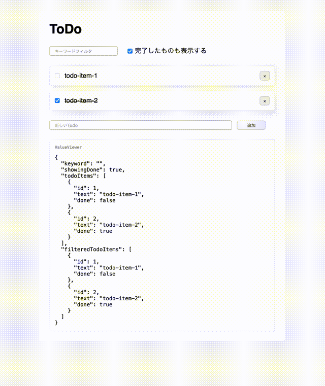

頑張っていきましょう 😉

## 実行環境の用意

この講義では実行環境として以下の 2 つを想定します。
環境構築に慣れていない人には 1 の PlayCode を、実際の開発環境に近いことをしたい人には 2 の Vite をお勧めします。

### 1. PlayCode を利用する

[PlayCode](https://playcode.io/react-template)を利用して React の環境を用意します。
PlayCode はブラウザの上でコードを編集しながらウェブアプリの開発を手軽に体験できる環境です。
本来の開発環境と比較すると JavaScript から TypeScript への変換処理などが隠蔽されている部分もありますが、React の動作を試すだけなら十分です。

::: warning

PlayCode は社外の環境なので、業務関係の情報を不意にコピペしないよう注意してください。

:::

[リンク](https://playcode.io/react-template)を開くと PlayCode の React 環境が表示されると思います。
しかし、この画面だとファイルが見えず、余計な情報も含まれているので、先に画面構成を変更します。

1. 画面上の「React Playground」ボタンをクリック
2. 出現したメニューから「Files」「Preview」を有効化し、「AI Chat」「Console」を無効化

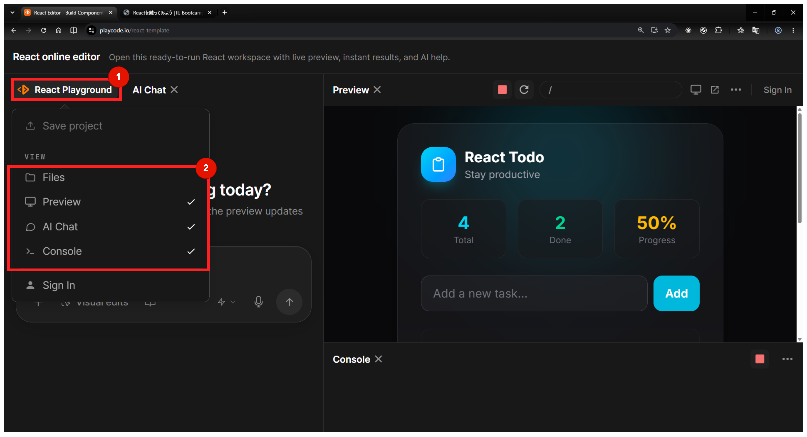

これにより、左側にファイルブラウザが表示され、右側にプレビュー/エディターが表示される画面になるはずです。
加えて、この状態では JavaScript 用の構成になっているので、TypeScript で書けるようにファイルを整えます。

1. `App.jsx` の右にある三点リーダーから `App.tsx` にリネーム
2. `index.jsx` 内の import も `App.tsx` を参照するようにする

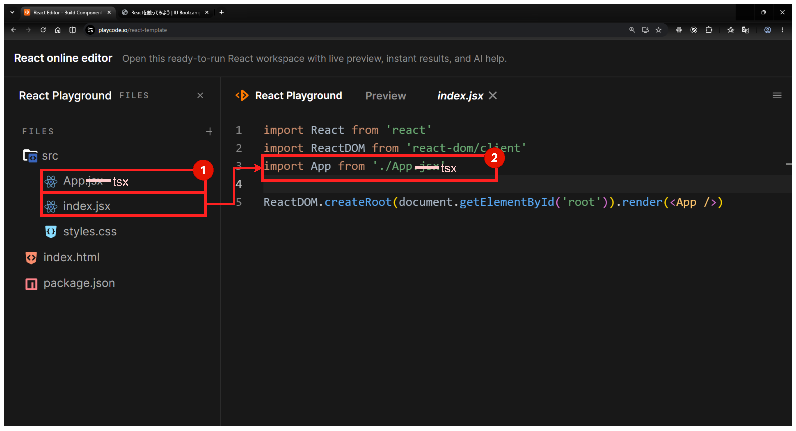

エディタのタブをドラックランドドロップすると画面分割も可能なので、適宜設定してください。
「Preview」タブを右側にドラックランドドロップし、エディター/プレビューと左右分割して表示すると快適かと思います。

なお、PlayCode ではファイルを編集すると自動でプレビューの内容が更新されます。
そのため、ファイル変更の適用にブラウザの更新などは不要です。

### 2. Vite を利用してローカル環境にプロジェクトの雛形を用意する

[Vite](https://vitejs.dev)を利用してローカル環境にプロジェクトの雛形を用意します。

Vite を利用した環境のセットアップを例示しておきます。
難しそうであれば PlayCode を利用してください。

```sh
# Node.jsのインストール(インストール済みの場合はスキップ)
# nodeコマンドとnpmコマンドが使えるようになれば方法は任意です
# 以下はmiseを利用した一例です (mise: https://mise.jdx.dev/getting-started.html)
mise use --global node@latest

# Viteを利用したプロジェクトのセットアップ
npm create vite@latest bootcamp-react
# => React => TypeScript => Oxlint => yes を選択する
```

開発サーバが起動し、ブラウザで<http://localhost:5173>にアクセスして以下のような画面が見れれば成功です 😉

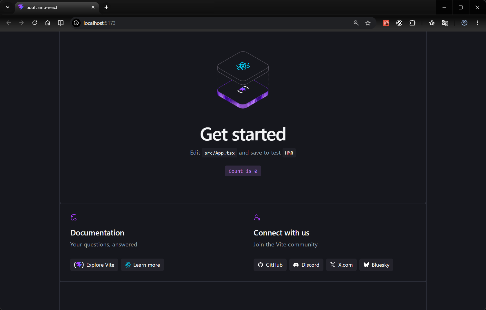

Vite ではファイルを更新すると自動でブラウザの表示も更新されます。
開発のためのエディタは好きなものを利用してください。

なお、開発サーバは `Ctrl+C` で終了します。起動しなおす場合は、セットアップで作成された `bootcamp-react` ディレクトリに入り、`npm run dev` コマンドを発行してください。

:::tip プロジェクトをテンプレートから作成したら git commit しておく

以降の講義の流れには関係ありませんが、Git を使える人は、この状態で一番初めのコミットを作っておくといいでしょう。

```sh
git init
git add .
# 「npm create vite というコマンドで生成したよ」というコメントでコミット
git commit -m 'npm create vite'
```

この時点でコミットしておくことで、この後、手動で編集した箇所がわかりやすくなります。
気になる人は適当に編集した後で`git diff`してみてください。

テンプレートから大量のファイルを作成するタイプのプロジェクトでは、自動生成されたファイルと手動で書いたコードを分けてコミットしておくと、特に複数人で開発している場合に、どのコードが意図して書かれたものなのかがわかりやすくなります。

:::

:::tip ツールのバージョン管理

この講義の主題からは外れますが、開発において重要な概念なので少し触れておきます。

本来、プログラミング言語などのツールはひとつのバージョンしかインストールしておけません。
そのため、異なるバージョンを使用するプロジェクト 2 つに参加していると、プロジェクトを行き来するたびにツールをアップデート/ダウングレードする必要があり、とても面倒なことになります。
これを解決するのがバージョン管理ツールで、複数のバージョンをインストールし、それらを瞬時に切り替えることができます。

昨今よく使われているものには[asdf](https://asdf-vm.com/ja-jp/)や[mise](https://mise.jdx.dev/)(みーず) がありますが、セキュリティや操作の簡便性から mise がより注目されてきているようです。

:::

### フォルダ構成

React のプロジェクトのフォルダにはいろんなファイルがありますが、この講義では`src`フォルダだけを気にしてもらえれば大丈夫です。`src`フォルダの中にもいろんなファイルがありますが、ひとまず以下に示す 3 つのファイルのみを気にしてください。

```txt
(プロジェクトのフォルダ)
├── src
│   ├── App.tsx    ← メインのアプリ実装
│   ├── index.jsx  ← アプリのセットアップ (Viteの場合はmain.tsx)
│   ├── styles.css  ← スタイルシート      (Viteの場合はindex.css)
│   └── (その他諸々)
└── (その他諸々)
```

この講義では主に`src/App.tsx`を編集して React の動作を確認していきます。

:::warning 以降は PlayCode のファイル構成で説明します

Vite 環境の方は適宜読み替えをお願いします。

:::

### スタイルシートの適用

今回のハンズオン用のスタイルシートをあらかじめ[github.com/iij-ykosugi/bootcamp-todo](https://github.com/iij-ykosugi/bootcamp-todo/blob/main/src/index.css)に用意しておきました。
それぞれの環境ごとに以下のファイルにコピペで上書きしてください。

- PlayCode 環境: `src/styles.css`
- Vite 環境: `src/index.css`

### 🚩 チェックポイント

ここまでで以下の準備が終わっていれば完璧です 😉

- PlayCode、もしくは Vite を利用して React の開発環境の準備ができた
  - コードを編集する準備と、ブラウザの表示を確認する準備ができた
- React のプロジェクトの`src`フォルダが確認できた
- ハンズオン用のスタイルシートの適用が終わった

## TypeScript に触れてみる

React に入る前に、まず TypeScript に触れておきましょう。
上記でセットアップした環境はまだ使いませんので、まだ終わっていない人は TA を呼ぶなりして、この時間に頑張って間に合わせてください 😉

React の開発では JavaScript の代わりに、その拡張言語である[TypeScript](https://www.typescriptlang.org)をよく使います。
TypeScript は Microsoft 発の、JavaScript に**型**の概念を加えた言語です。

例えば以下の関数定義は

```js
function double(n) {
  return n * 2;
}
```

TypeScript では次のように書けます。

```ts
function double(n: number) {
  return n * 2;
}
```

引数に`number`という型をつけることができます。
これにより「この関数の引数はどのような値であるべきか」という、JavaScript ではコメントで表現するしかなかった部分を補完することができます。
逆に型以外の点では JavaScript とほぼ同じ表記になります。

この章では、基本的な TypeScript の書き方に絞って、手を動かしながら確認していきます。
(TypeScript を既に知っている人は読み飛ばして構いません)

:::tip TypeScript の実行環境

TypeScript は通常、そのままではブラウザや Node.js などの JavaScript の実行環境では実行できず、以下の流れで処理する必要があります。

1. TypeScript でソースコードを記述
2. コンパイラ(トランスパイラ)が型チェックをしながらソースコードを JavaScript に変換
3. ブラウザ等 JavaScript の動作環境で実行

実際にはこの流れはツール類がほぼ自動で実行してくれます。
包括的なツールとして最近では[Vite](https://vitejs.dev)がよく使われます。

面倒に見えるかもしれませんが、最近ではツール類が洗練され、設定の手間がほとんどかからなくなっています。
一般に React で開発を行う際も TypeScript がよく使われるため、この講義でも TypeScript の利用を前提として進めます。

:::

### TS Playground を開く

この章では、簡単のために[TS Playground](https://www.typescriptlang.org/play)というブラウザ上で TypeScript を試せる環境を使います。
React の環境(PlayCode や Vite)はそのままにしておいて、**別のタブ**で開いてください。

::: warning

TS Playground も社外の環境なので、業務関係の情報を不意にコピペしないよう注意してください。

:::

#### 動作テスト

最初から入っているコードを全部消して、以下を貼り付けてください。

```ts
const message: string = "Hello, TypeScript!";
console.log(message);
```

画面左上の「Run」を押すと、右側のパネルに`Hello, TypeScript!`と表示されるはずです。

### 型注釈と型推論

先ほど書いた`: string`の部分が **型注釈** と呼ばれるもので「この変数には文字列が入る」ということを表しています。

型注釈をつけると、それと違う型の値を入れようとしたときに教えてもらえます。
以下を貼り付けて、2 行目に赤い波線が出ることを確認してください。

```ts
let message: string = "Hello, TypeScript!";
message = 123;
```

波線にマウスカーソルを乗せると`Type 'number' is not assignable to type 'string'.`(number 型は string 型に代入できません)というメッセージが表示されます。
このように **プログラムを実行する前に間違いを教えてくれる** のが TypeScript の一番のメリットです。

ところで、実は型注釈は省略できる場合が多くあります。
以下を貼り付けて、`message`にマウスカーソルを乗せてみてください。

```ts
let message = "Hello, TypeScript!";
message = 123;
```

`let message: string`と表示され、`: string`と書いていないのに文字列型として扱われていることがわかります。
そして 2 行目には変わらず赤い波線が出ます。

これは **型推論** と呼ばれる機能で、代入された値から TypeScript が型を推測してくれています。
そのため実際のコードでは、型注釈を書く場所と書かない場所があります。

:::tip どこに型注釈を書くのか

「常に書く」でも間違いではないのですが、冗長になるので一般的には以下のような使い分けをします。

- **関数の引数には書く**
  - 関数の中身だけを見ても何が渡ってくるか推測できないためです
- **変数には基本的に書かない**
  - 代入する値から推論できるためです

:::

### タイプミスを検出してもらう

型の恩恵をもう少し体感してみましょう。以下を貼り付けてください。

```ts
const message = "Hello, TypeScript!";
console.log(message.length);
console.log(message.lenght);
```

3 行目に赤い波線が出て`Property 'lenght' does not exist on type 'string'.`(string 型に`lenght`というプロパティはありません)と表示されます。
`length`のタイプミスを、実行する前に見つけてもらえました。

さらに、`message.`まで入力すると、その型が持つ変数や関数の一覧が候補として表示されます。
これも「`message`が文字列である」と TypeScript が知っているからこそできることです。

このように、TypeScript は **型チェックのための言語** であると同時に **エディタに賢く補完してもらうための言語** でもあります。

### オブジェクトの型を定義する

「オブジェクト」は、キーと値のペアの集合体を表現するために用いられる JavaScript の概念です。
TypeScript では、このオブジェクトを表す型（**オブジェクト型**）を定義することができます。

以下を貼り付けてください。

```ts
// オブジェクトの型定義
type Member = {
  name: string;
  age: number;
};

const alice: Member = { name: "alice", age: 25 }; // オブジェクト
console.log(alice.name);
```

型は `type` というキーワードにより宣言します。
このコードでは `Member`という型を定義し、変数`alice`に対して「これは`Member`型である」と注釈されています。
これにより、`alice`は「文字列の`name`、数値の`age`、を保持するオブジェクトである」という情報が付与されます。

ここで、定義に反することをするとどうなるか試してみましょう。
以下のそれぞれを試して、どんなメッセージが出るか確認してみてください。

```ts
type Member = {
  name: string;
  age: number;
};

// 1. ageを書き忘れる
const a: Member = { name: "alice" };

// 2. ageに文字列を入れる
const b: Member = { name: "bob", age: "25" };

// 3. 定義にないキーを追加する
const c: Member = { name: "carol", age: 30, email: "carol@example.com" };

// 4. 存在しないキーを参照する
const d: Member = { name: "dave", age: 40 };
console.log(d.email);
```

### 配列の型

型のうしろに`[]`をつけると「その型の配列」を表します。

```ts
const names: string[] = ["asa-taka", "igarashi", "ueda"];

// これはエラーになる
const numbers: number[] = [1, 2, "three"];
```

もちろん、自分で定義した型に対しても使えます。

```ts
type Member = {
  name: string;
  age: number;
};

const members: Member[] = [
  { name: "alice", age: 25 },
  { name: "bob", age: 30 },
];

// mapで各要素を変換してみる
const names = members.map((member) => member.name);
console.log(names);
```

ここで`member`には型注釈を書いていないことに注目してください。
`members`が`Member[]`だとわかっているため、`map`に渡した関数の引数`member`は`Member`型だと推論されます。
試しに`member.`と入力すると`name`と`age`が候補に出てくるはずです。

### 関数の型

ここが初めての人には少しとっつきにくい部分ですが、React では非常に重要なので押さえておきましょう。

TypeScript では **関数そのものを型として表現** できます。
書き方は`(引数名: 引数の型) => 返り値の型`です。

```ts
type Member = {
  name: string;
  age: number;
};

// 「Memberを受け取ってstringを返す関数」の型
type Formatter = (member: Member) => string;

const format: Formatter = (member) => `${member.name} (${member.age})`;
console.log(format({ name: "bob", age: 30 }));
```

`Formatter`という「関数の型」を定義し、実際の関数がその形に合っていることをチェックしてもらっています。

返り値がない関数の場合は`void`という型を使います。

```ts
// 「booleanを受け取って何も返さない関数」の型
type CheckHandler = (checked: boolean) => void;

const onCheck: CheckHandler = (checked) => {
  console.log(checked ? "チェックされた" : "チェックが外れた");
};

onCheck(true);
```

引数がない場合は `()` と記述します。

```ts
type Greeting = () => void;

const hello: Greeting = () => {
  console.log("hello");
};

hello();
```

### 🚩 チェックポイント

ここまでで、以下のことがなんとなく掴めていれば十分です 😉

- 型注釈(`: string`)をつけると、間違った値を入れたときに **実行する前に** 教えてもらえる
- 型が決まっていると、エディタが候補を出してくれたりタイプミスを見つけてくれたりする
- `type`で **オブジェクトの型** に名前をつけられる
- `string[]`は **配列** 、`(x: number) => void`は **関数** を表す

## React の軽い紹介

続いて、React と、React と共に使われる JSX という言語の紹介をしておきます。

### React が解決してくれる課題

先に行われた DOM の講義を通して、ブラウザの標準 API として存在する DOM 操作のメソッドを利用し、表示中の画面を書き換えられることは体感できたと思います。

しかし DOM 操作を直接行う方法では、次のような複雑な DOM に対して変更を行おうとした場合には大変になります。

```html
<div class="profile-list">
  <div class="profile-container">
    <div class="profile-pict">
      
    </div>
    <div class="profile">
      <p>...</p>
    </div>
  </div>
  <div class="profile-container">
    <!-- ...繰り返し... -->
  </div>
</div>
```

昨今の HTML はネストが深く属性も山盛りです。
そして実際のウェブアプリはこの数十倍の複雑さになります。
さらにアプリの種類によっては頻繁で細やかな表示の変更が求められることもあります。

この膨大な DOM に対して、変更内容に応じた更新をかける処理をブラウザの素朴な API を利用して開発するのは現実的ではありません。

React を利用することでこのような処理が簡単に書けるようになります。

### React

[React](https://react.dev)は Meta(旧 Facebook)発の UI フレームワークです。

React とはデータと DOM の対応付けをやってくれるフレームワークであり、さらにデータの更新に対してリアクティブ(反応的)に画面を更新してくれるフレームワークです。
この「リアクティブな画面更新」を行う機能により複雑で画面が繊細に更新されるようなウェブアプリを効率的に開発することができます。

<!-- その辺りはSvelteと同様の位置付けのフレームワークです。　# svelte は 2025 やらない -->

…と、こんなことを言われてもピンとこないですよね。それを理解するためのハンズオンです 😉

### JSX(TSX)

さらに React では**JSX**という JavaScript の拡張言語を使います。
JSX は簡単に言えば「JavaScript のコード中に HTML を書けるようにした言語」です。

例えば以下のような表現ができます。

```tsx
function Hello() {
  const myName = "asa-taka";
  return (
    <div>
      Hello <b>{myName}</b>
    </div>
  );
}
```

どうでしょうか。気持ち悪いですね 😉

JavaScript と HTML が入り混じっています。
ここでは 2 つだけ JSX のルールを紹介しておきますが、まだ覚える必要はありません。

:::warning JSX のルール

- **JSX 要素は`return`や変数への代入など、JavaScript の「値(より正確には式)」として、任意の場所で使える**
  - ただしルートの要素は 1 つでなければならない
- **JSX の中(要素の属性値 or 子要素)では`{}`で囲むことで JavaScript の表現が使える**
  - ただし値を返すもの(簡単に言えばそのまま変数に代入できるもの)に限ります
  - 例として`{1}`や`{fn(1, 'foo') + 1}`は正しい JSX 中の表現ですが`{if ...}`は使えません
    - 条件分岐には`&&`や`?:`が、繰り返しには配列の`map`メソッドなどがよく使われます

:::

ハンズオンを進めながら、理解を深めたくなったらまた戻ってきてください。

ウェブアプリを開発する上では慣れると JSX の方が便利なのと、他の React の解説でもほぼ JSX が使われているため、この講義でも JSX の利用を前提として進めます。

TypeScript と JSX を合わせたものは特に TSX と呼ばれることもありますが、その場合でも JSX と呼ばれることが多いです。
ただし、Typescript を使う場合の拡張子は`.tsx`でなければなりません。

:::warning HTML とは属性名が異なる場合がある

`class`が`className`になっているなど、JavaScript の予約語の都合上、属性名が通常の HTML とは異なるものがあるので気をつけてください。
他にも`for`が`htmlFor`になっていたりします。

ただしこれらは JSX 独自の仕様というよりは[Web API](https://developer.mozilla.org/en-US/docs/Web/API/Element/className)の仕様から来るものに思われます。

:::

:::tip JSX にも変換処理が必要

TypeScript と同様、JSX も純粋な JavaScript ではないため、ブラウザ上で動作させるためには JavaScript に変換する処理が必要になります。
ただしこの変換も、今回セットアップしたようなツールにより自動化されています。

:::

:::details JSX は実際には何を表しているのか

JSX が最終的な JavaScript でどのような値になるかはコンパイラの設定によります。
React の場合は`ReactElement`という特定の型のオブジェクトを返し、詳細は省きますがこれは React による Virtual DOM のノードの表現です。

コンパイラの変換処理としては

```tsx
const element = <div className="app" />;
```

という JSX のコードは

```ts
const element = React.createElement("div", { className: "app" });
```

という純粋な JavaScript のコードと等価です。
`ReactElement`が具体的にどのようなオブジェクトなのか、気になる人は適当に`console.log(<div />)`を含めたコードの出力をブラウザのコンソールで覗いてみてください。

このようにシンプルな変換処理(シンタックスシュガー)があるだけで実体としては純粋な JavaScript と同じと思ってもらえると、初見での気持ち悪さはだいぶ軽減されると思います。

:::

### 🚩 チェックポイント

この章では以下のことを説明しましたが、まだそこまで理解できていなくても大丈夫です 😉

- **React**はデータの変更に対しリアクティブに画面を更新することで細やかな画面更新が必要なアプリを開発できるフレームワークである
- React の開発では**JSX**という、JavaScript の中に HTML を書けるような拡張言語を使うのが主流である

## React コンポーネントとプロパティ

前置きが長くなりましたが、いよいよ React を触っていきます。

まず、React では画面を構成する部品を「コンポーネント」という単位で定義します。
ここでは最もシンプルな React コンポーネントとして、プロパティを受け取り描画内容を返すだけの React コンポーネントを作っていきましょう。

### とりあえず React を動作させる

この講義では主に`src/App.tsx`を編集して React の動作を確認していきます。
手始めに`App.tsx`を**丸ごと**以下のように書き換えてください。既にあるコードはすべて消してしまって大丈夫です。

```tsx
export default function App() {
  return (
    <div className="App">
      <p>
        Hello, <b>React!</b>
      </p>
    </div>
  );
}
```

成功すると以下のような表示になります 😉


おめでとうございます。ここでは`App`というコンポーネントを定義しました。
React ではコンポーネントを「DOM のようなもの」を返す関数として定義します。
この場合`App`は`div`要素に囲まれた「Hello, React!」と表示される「DOM のようなもの」を表しています。
「DOM のようなもの」だと言いにくいので以降は「JSX 要素」と呼ぶことにします。

そして`App`というコンポーネントは`src/index.jsx`で読み込まれ DOM としてレンダリング(DOM を操作して描画)されます。

### コンポーネントを切り分けてみる

先ほど「コンポーネント」とは「画面を構成する部品」と説明しました。
この考え方を理解するために、`App`コンポーネントの描画内容の一部を切り分けてみましょう。

以下のように`App.tsx`を書き換えてください。

```tsx{1-6,12}
function Hello() {
  return (
    <p>
      Hello, <b>React!</b>
    </p>
  );
}

export default function App() {
  return (
    <div className="App">
      <Hello />
    </div>
  );
}
```

この変更では表示内容は特に変わりません。

新しく`Hello`というコンポーネントを定義し、`App`の中にあった「Hello, React!」の`p`要素を切り分けました。
そして新しい表現として、その`Hello`コンポーネントを`App`の中で`<Hello />`として利用しています。
このように他のコンポーネントも JSX の表記により利用することができます。

この`App`の中で`Hello`が使われる、という関係を指してそれぞれを **親コンポーネント** (ここでは`App`)、**子コンポーネント** (ここでは`Hello`)と呼びます。

### プロパティで親コンポーネントから値を渡す

コンポーネントには引数としてオブジェクトを渡すことができます。
これを React では「プロパティ」と呼んでいます。
プロパティを利用することでコンポーネントの動作や表示内容にバリエーションを持たせることができます。

`Hello`コンポーネントに`yourName`プロパティを追加して、挨拶する相手を指定できるようにしてみましょう。

以下のように`App.tsx`を書き換えてください。

```tsx{1-5,8,16}
type HelloProps = {
  yourName: string;
};

function Hello({ yourName }: HelloProps) {
  return (
    <p>
      Hello, <b>{yourName}</b>
    </p>
  );
}

export default function App() {
  return (
    <div className="App">
      <Hello yourName="asa-taka" />
    </div>
  );
}
```

成功すると以下のような表示になります 😉


`HelloProps`はプロパティの型定義であり、`Hello`コンポーネントがどのようなオブジェクトを受け取るかを表現しています。
そして、このオブジェクトに含まれる`yourName`プロパティを受け取り、`{yourName}`として JSX の中で参照しています。
React ではこのように汎用性を持たせながら、機能や描画内容の切り出しを行います。

:::tip 分割代入

`function Hello({ yourName }: HelloProps)`という引数の書き方は
[分割代入(destructuring assignment)](https://developer.mozilla.org/ja/docs/Web/JavaScript/Reference/Operators/Destructuring_assignment)と呼ばれるものです。
オブジェクトから特定のキーの値を取り出して、同じ名前の変数に代入することができます。

```ts
const props = { yourName: "asa-taka" };

// 以下の2つは同じ意味になる
const yourName = props.yourName;
const { yourName } = props;
```

つまり`Hello`コンポーネントは「プロパティのオブジェクトを受け取り、その中の`yourName`を取り出して使っている」ということです。
分割代入を使わない場合は以下のようにも書けますが、React では分割代入を使う書き方が主流です。

```tsx
function Hello(props: HelloProps) {
  return (
    <p>
      Hello, <b>{props.yourName}!</b>
    </p>
  );
}
```

:::

さて、これができたら続けて`Hello`コンポーネントの`yourName`プロパティを変更して複数回使用してみましょう。

以下のように`App.tsx`を書き換えてください。

```tsx{17-18}
type HelloProps = {
  yourName: string;
};

function Hello({ yourName }: HelloProps) {
  return (
    <p>
      Hello, <b>{yourName}!</b>
    </p>
  );
}

export default function App() {
  return (
    <div className="App">
      <Hello yourName="asa-taka" />
      <Hello yourName="igarashi" />
      <Hello yourName="ueda" />
    </div>
  );
}
```

成功すると以下のような表示になります 😉


コンポーネントの切り分けと一部の要素をプロパティとして抜き出すことで整理されたコードが書けることがわかると思います。
コンポーネントらしくなってきましたね。

### 繰り返し処理

JSX の中では`{}`で囲むことで JavaScript の表現がそのまま使えるので、これを利用して更に処理をプログラム的にしてみましょう。
繰り返し処理を利用して同じような要素の生成をまとめて行います。

繰り返し処理といえば`for`文ですが、これは JSX の中では直接は使うことができないため、配列の[`map`](https://developer.mozilla.org/ja/docs/Web/JavaScript/Reference/Global_Objects/Array/map)メソッドがよく利用されます。

配列の`map`メソッドは、例えば以下のように使われるメソッドです。

```js
const list = [1, 2, 3, 4];
const doubled = list.map((x) => x * 2);
console.log(doubled);
// => [2, 4, 6, 8]
```

というように、配列の全ての要素に対して引数で渡された関数による変換を行った新たな配列を生成します。
この場合は`(x) => x * 2`という「引数を倍にして返す関数」を渡すことで、各要素を倍にした配列を得ることができます。

React ではこれを、配列から JSX の要素を生成するためによく使います。
つまり、配列の個々の要素を受け取り JSX を返す関数を書くことで JSX の要素の配列を生成することができます。

:::details アロー関数

アロー関数は`(引数1, 引数2, ...) => { ... }`の形で定義される関数です。
`{}`内の式(expression)が一つの場合は`{}`を省略でき、その場合はその式の値がそのまま返り値になります。

`function`による関数定義とは何点か違いがありますが、この講義では以下のように使い分けています。

- コンポーネント定義では`function`を利用する
  - `function` による定義を行うとその関数に `.name` というプロパティで名前がつくため
  - この名前により開発用の拡張機能やコンポーネントのエラーメッセージが読みやすくなる
- それ以外の用途では`=>`を利用する
  - シンプルで読みやすいため

この辺りはプロジェクトごとに方針があるので、それに従うのが良いでしょう。

:::

さて、前置きが長くなりましたが以下のように`App.tsx`を書き換えてください。

```tsx{14,17-19}
type HelloProps = {
  yourName: string;
};

function Hello({ yourName }: HelloProps) {
  return (
    <p>
      Hello, <b>{yourName}!</b>
    </p>
  );
}

export default function App() {
  const members = ["asa-taka", "igarashi", "ueda"];
  return (
    <div className="App">
      {members.map((member) => (
        <Hello key={member} yourName={member} />
      ))}
    </div>
  );
}
```

この変更では表示内容は特に変わりません。

配列の要素には`key`という特殊なプロパティが新たに必要になる点に注意してください。
ここでは配列の中で一意な値を設定する必要があるとだけ覚えておけば十分です。
今回は`member`の値がそもそも全て異なっているので、それをそのまま`key`に利用しました。

:::details key という特殊なプロパティ

`key`は React の JSX の中で配列を扱うときに必要となるプロパティで、要素のトラッキングのために利用されます。
具体的には、配列の要素が更新された場合に DOM に正しくその更新を反映させるために使用されています。
コンポーネント側にはプロパティとして特に定義されている必要はなく、上記の例でも`HelloProps`に`key`は含まれていません。

参考: [ja.react.dev - リストのレンダー](https://ja.react.dev/learn/rendering-lists#keeping-list-items-in-order-with-key)

:::

### 条件分岐で描画内容を変更する

繰り返し処理の次は条件分岐を実装してみましょう。

以下のように`App.tsx`を書き換えてください。

```tsx{6-12}
type HelloProps = {
  yourName: string;
};

function Hello({ yourName }: HelloProps) {
  if (yourName.length > 5) {
    return (
      <p>
        こんにちは、<b>{yourName}!</b>
      </p>
    );
  }

  return (
    <p>
      Hello, <b>{yourName}!</b>
    </p>
  );
}

export default function App() {
  const members = ["asa-taka", "igarashi", "ueda"];
  return (
    <div className="App">
      {members.map((member) => (
        <Hello key={member} yourName={member} />
      ))}
    </div>
  );
}
```

成功すると以下のように、名前が 5 文字よりも長いメンバーに対しては「Hello」の代わりに「こんにちは」と表示されるようになります 😉


さて、この書き方でも良いのですが、JSX の中で三項演算子`?:`を利用するともう少しシンプルに書けます。

以下のように`App.tsx`を書き換えてください。

```tsx{8-9}
type HelloProps = {
  yourName: string;
};

function Hello({ yourName }: HelloProps) {
  return (
    <p>
      {yourName.length > 5 ? "こんにちは、" : "Hello, "}
      <b>{yourName}!</b>
    </p>
  );
}

export default function App() {
  const members = ["asa-taka", "igarashi", "ueda"];
  return (
    <div className="App">
      {members.map((member) => (
        <Hello key={member} yourName={member} />
      ))}
    </div>
  );
}
```

すっきりしましたね 😉

常にこの書き方が読みやすいとは限らないので、状況に応じて可読性の高い方を選んでください。

### 🚩 チェックポイント

ここまでで、以下のことが理解できていると素晴らしいです 😉

- React では**プロパティ**を受け取り**JSX 要素**を返す**関数**を**コンポーネント**として定義し、画面を構成する
- プロパティを利用することでコンポーネントの表示内容にバリエーションを持たせ、汎用性を高められる
- 繰り返し処理や条件分岐を利用することで効率的に画面を構成することができる

## State とその変更に対するリアクティブな動作

ここまでの内容で React のコンポーネントの基本的な表現を理解してもらえたと思います。
ただし、ここまでは単なるテンプレートエンジン的な処理しかしておらず、実はちょっとした便利関数を書けばブラウザの DOM API でも同じようなことはできてしまいます。

ここからは React の真骨頂である **「データの変更に応じて描画内容が変わる」** というリアクティブな描画更新処理を体感してもらいます。
そのためには **State(状態)** にまつわる処理と **イベントハンドラ** を理解する必要があります。

少し難易度が増しますが、頑張ってついてきてください 😉

### カウンタプログラム

**State(状態)** という概念は React に限らずいろんなフレームワークで取り扱われる概念です。
親から(プロパティなどで)渡される値**ではなく**、かつそのコンポーネントが動いている間に(ユーザとのやり取りの中などで)変化する値を **コンポーネント自身** で保持したい場合に使われます。

…こんなことを言われてもピンとこないですよね。そのためのハンズオ 😉(略)

というわけで以下の「カウンタプログラム」で実際に動作を確かめて欲しいと思います。

カウンタプログラムも React に限らず、そのフレームワークで State がどのように実現されているかをデモするためによく使われます。
動作としてはシンプルで、ボタンを押すとカウンタの値が 1 つずつ増えていくというものです。

`App.tsx`を**丸ごと書き換えて**、以下のようにしてください。

```tsx
import { useState } from "react";

function Counter() {
  const [count, setCount] = useState(0);
  return (
    <div>
      <button onClick={() => setCount(count + 1)}>+1</button>
      <p>count: {count}</p>
    </div>
  );
}

export default function App() {
  return (
    <div className="App">
      <Counter />
    </div>
  );
}
```

ボタンを押すごとに値が「1→2→3→...」のように増えていけば成功です 😉

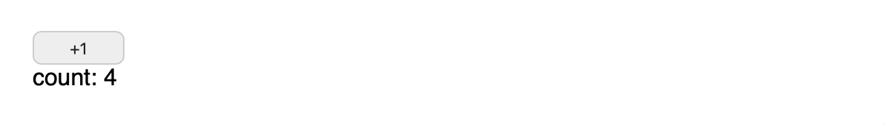

新しく登場した`useState`と **イベントハンドラ** について少し詳しく説明しましょう。

React コンポーネントでは、自身で値を保持する場合、値が更新された場合に描画内容が再評価される必要があるため、そのための仕組みとして`useState`を利用します。
`useState`は初期状態を引数(ここでは`0`)で渡し、状態の値(ここでは`count`)と状態を更新するための関数(ここでは`setCount`)を返します。

```tsx
const [count, setCount] = useState(0);
```

なお`const [count, setCount] = ...`という書き方は、プロパティの節で紹介した分割代入の配列版で、返り値の配列の 1 番目の要素と 2 番目の要素をそれぞれ変数に代入しています。

この方法で定義した`setCount`は、呼ばれるたびにコンポーネントの再評価のトリガーとなります。
これにより`count`が更新された状態でコンポーネントが再評価され、コンポーネントの返す値の変化を React が検知することで描画内容の更新が行われます。

状態を更新する手段を手にしたので、次にそれをユーザの操作により実行するための React における **イベントハンドラ** の説明をしましょう。
といっても DOM のイベントハンドラとほぼ同じように扱えます。

```tsx
<button onClick={() => setCount(count + 1)}>+1</button>
```

`onClick`には`button`がクリックされた際に評価される任意の関数を書くことができ、ここでは`setCount(count + 1)`を渡すことで、ボタンを押すたびに`count`の値を増やす処理をしています。

描画が更新される流れをまとめると以下のようになります。

1. `button`をクリックする
2. `onClick`の`setCount(count + 1)`が実行される
3. `setCount`が実行されたことによりコンポーネントが再評価される
4. コンポーネントが返す内容が変わったことを React が検知する
5. それに合わせてブラウザの描画内容が更新される

初めは難しいと思うので **「コンポーネントで値を保持したい場合は`useState`を使い、値の更新には 2 番目の返り値の関数(ここでは`setCount`)を使えば描画内容も更新される」** とだけ覚えておけば十分です。

この`useState`とイベントハンドラによる描画内容のリアクティブな更新パターンは、React によるアプリを作る上でいろんな形で現れるため、しっかり慣れ親しめるといいですね 😉

:::tip State(状態)の具体例

状態と言われても何が状態になりうるのかピンとこない人も多いと思いますので、具体例をいくつか挙げておきます。

- UI の状態: パネルの開閉状態、フィルタ条件、input 要素の値、など
- データの取得状態: サーバから取得したデータ自体、取得に失敗した場合のエラー、取得中か否か、など

これらの状態を保持するのにも一般的に`useState`が使われます。

:::

:::details useState のようなものが必要となる理由をもう少し詳しく説明するなら

React のコンポーネントは一般的に、アプリが実行されている間に何度も関数として評価されます。
具体的には親コンポーネントが再評価された場合や、自身に渡されるプロパティが変更された場合に再評価されます。
その再評価を跨いでオブジェクトや文字列、数値などの値を保持したい場合に`useState`を利用します。
これだけなら関数のスコープ外の適当な変数に値を保持することも考えられますが、その変更を検知して再評価する必要があるため`useState`のようなものが必要となります。

ただし、フレームワークは使って覚えるものなので、今はこういった詳細を把握する必要はありません。

:::

### 文字列の State と onChange

カウンタプログラムでは実際に作るアプリのイメージが湧きづらいと思いますので、今度は入力された文字列を State として保持するパターンを見てみましょう。

`App.tsx`を**丸ごと**、以下のように書き換えてください。

```tsx
import { useState } from "react";

function TextInput() {
  const [text, setText] = useState("");
  return (
    <div>
      <input
        value={text}
        onChange={(event) => setText(event.currentTarget.value)}
      />
      <p>input: {text}</p>
    </div>
  );
}

export default function App() {
  return (
    <div className="App">
      <TextInput />
    </div>
  );
}
```

入力欄に入力された値が下にそのまま表示されていれば成功です 😉

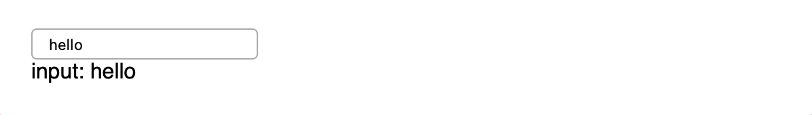

カウンタプログラムではクリックが起きたことのみを検知すれば十分だったため`() =>`という書き方をしていましたが、
今回は`(event) =>`という書き方をしており、これによりイベントの送信元(この場合は`input`要素)の情報を参照することができます。
`event.currentTarget`はイベントハンドラを登録している要素(この場合は`input`要素)を表し、さらにその`value`で入力された値が取得できるため、`event.currentTarget.value`で入力値を取得しています。

イベントハンドラにもいろんな種類があり、`onChange`は入力欄の値が変わった場合に毎回実行され、この場合はキーによる入力が行われるごとに実行されます。
`useState`は今回は文字列を保持するものとして定義しており、`setText(event.currentTarget.value)`を渡すことで、入力欄の値を State として保持しています。

:::details React には双方向バインディングがない

React には VueJS や Svelte のような双方向バインディングがないため「`input`要素の値」のような、素朴な感覚ではその`input`要素自身が持っていそうな State を親コンポーネントが参照する場合には、(プロパティ経由で)その State の管理を親コンポーネントが担う必要があります。

今回のコードの場合は`input`が「何を値として表示するか」と「その値を更新する手段」を親コンポーネントである`TextInput`が管理し、それを子コンポーネントである`input`要素に`value`と`onChange`プロパティで与えているという図式です。

[制御されたコンポーネントと非制御コンポーネント](https://ja.react.dev/learn/sharing-state-between-components#controlled-and-uncontrolled-components)
の言葉を使うなら、これは「制御されたコンポーネント」のパターンになります。

:::

### フィルタ処理で見るもっとリアクティブな例

今の段階の知識で理解できる、ちょっと実践的な実装パターンとして「リストのフィルタ処理」を書いてみましょう 😉

以下の 2 つのメソッドを利用することで、意外とシンプルに実装できてしまいます。

- 配列の[`filter`](https://developer.mozilla.org/ja/docs/Web/JavaScript/Reference/Global_Objects/Array/filter)メソッド
  - 各要素に対して関数を適用して、関数が`true`を返すもののみを含んだ新しい配列を返す
- 文字列の[`includes`](https://developer.mozilla.org/ja/docs/Web/JavaScript/Reference/Global_Objects/String/includes)メソッド
  - 文字列が部分文字列を含む場合に`true`を返す

これらを利用して`App.tsx`を**丸ごと**以下のように書き換えてください。

```tsx
import { useState } from "react";

function ListFilter() {
  const [text, setText] = useState("");
  const members = ["asa-taka", "igarashi", "ueda"];
  const filteredMembers = members.filter((member) => member.includes(text));
  return (
    <div>
      <input
        value={text}
        onChange={(event) => setText(event.currentTarget.value)}
      />
      {filteredMembers.map((member) => (
        <p key={member}>{member}</p>
      ))}
    </div>
  );
}

export default function App() {
  return (
    <div className="App">
      <ListFilter />
    </div>
  );
}
```

入力欄に適当な文字列を入力すると、それを含む要素だけが下に表示されるようになれば成功です 😉

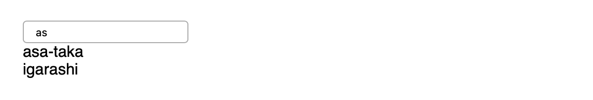

例えば`as`と入力するとその文字列を含む`asa-taka`と`igarashi`が表示されます。
これはシンプルな検索機能として有用な実装パターンです。

`members.filter`に、各要素が`text`(入力欄の値)を部分文字列として含む場合に`true`を返す関数を渡すことで実現しています。

これができたら更に以下のように書き換えてみてください。

フィルタの対象となるリストを`members`プロパティとして渡せるようにしています。
プロパティの選び方によりコンポーネントの汎用性を高められることがわかると思います。

```tsx{3-7,23-24}
import { useState } from "react";

type ListFilterProps = {
  members: string[];
};

function ListFilter({ members }: ListFilterProps) {
  const [text, setText] = useState("");
  const filteredMembers = members.filter((member) => member.includes(text));
  return (
    <div>
      <input value={text} onChange={(event) => setText(event.currentTarget.value)} />
      {filteredMembers.map((member) => (
        <p key={member}>{member}</p>
      ))}
    </div>
  );
}

export default function App() {
  return (
    <div className="App">
      <ListFilter members={["asa-taka", "igarashi", "ueda"]} />
      <ListFilter members={["endo", "ogata", "kataoka"]} />
    </div>
  );
}
```

表示は以下のようになれば成功です 😉

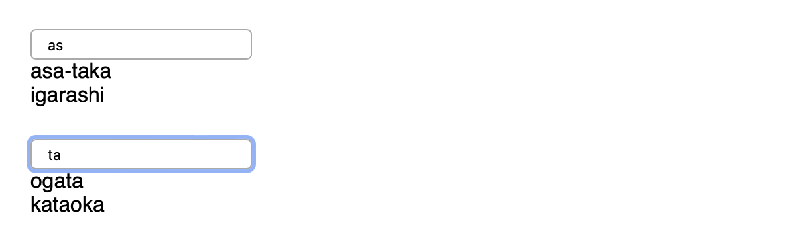

こうすることで`ListFilter`コンポーネントは「リストを表示して、それを検索するための入力欄も表示したい」という場合に汎用的に利用できるコンポーネントになりました。

ここまでの内容で、プロパティと State、イベントハンドラを利用して、なんとなくリアクティブに動作する例を紹介してきました。
だんだんと「自分でもアプリが作れるかもしれないな…🤔」と感じてもらえると嬉しいです。

### 🚩 チェックポイント

ここまでで、以下のことが理解できていると素晴らしいです 😉

- `useState`を利用するとコンポーネントに **State(状態)** を持たせることができる
- State と**イベントハンドラ**を組み合わせることで、**ユーザの操作に対してリアクティブ**な動作を実装することができる

:::tip ⛳️ 初心者の人向けのゴール

プログラミング初心者の方はここまでついてくるだけでも大変だったかもしれません。
よく頑張りましたね 😉

:::

## ToDo アプリ

さて、ここからはもう少し実践的な複雑さを持ったアプリとして ToDo アプリを作っていきましょう。
完成すると以下のような動作をするアプリになります。


これを実装するために、ここまでに学んできたコンポーネントの切り分け、State やイベントハンドラ、フィルタ処理を全部使っていきましょう 😉

:::details ToDo アプリを作る意義

新しくフレームワークを使おうとする場合、よく「ToDo アプリを作ると良い」と言われます(それをまとめた[ToDoMVC](https://todomvc.com)というサイトもある)。

理由としてはデータ操作に必要な「CRUD 操作」を最小限の題材で網羅できるためだと思われます。

CRUD 操作とはデータに対する基本的な操作である、以下の 4 種類の操作の頭文字をとったものです。

- Create: 新規作成
- Read: 閲覧
- Update: 更新・変更
- Delete: 削除

これらは API を設計する際やそれに対するフロントエンドを作成する際に基本となる考えになります。
例えばブログシステムを作ろうとする場合、記事に対する CRUD 操作や、コメントに対する CRUD 操作がそれぞれ必要になりそうだ、というように必要となる機能を洗い出すために参照できます。

そしてこれらの操作に対してはそれぞれある程度決まった実装パターンがあるため、この CRUD という操作の分類は **「この機能ははこんな感じに実装できる」** という感覚を自身の中で体系化するためにも役立ちます。
この ToDo アプリを実装することでそれらの実装パターンを体感してもらえると嬉しいです 😉

:::

### フィルタ付きリストから ToDo アプリの基礎を作る

まずはスタート地点として以下のように`App.tsx`を**丸ごと**書き換えてください。
実装としてはフィルタ処理のものと比べてほぼ新しいことはしていないので、書き換えはコピペで済ませ「何をしていてどういう構成になっているか」の把握に時間を使って欲しいです。

```tsx
import { useState } from "react";

/** リスト表示の対象となる、個々のToDoを表す型。*/
export type TodoItem = {
  /** 表示や操作の対象を識別するために利用する、全ての`TodoItem`の中で一意な値。 */
  id: number;
  /** ToDoの内容となる文字列。 */
  text: string;
  /** 完了すると`true`となる。 */
  done: boolean;
};

type TodoListItemProps = {
  item: TodoItem;
};

/** ToDoリストの個々のToDoとなるReactコンポーネント。 */
function TodoListItem({ item }: TodoListItemProps) {
  return (
    <div className="TodoItem">
      <p style={{ textDecoration: item.done ? "line-through" : "none" }}>
        {item.text}
      </p>
    </div>
  );
}

/** ToDoリストの初期値。 */
const INITIAL_TODO: TodoItem[] = [
  { id: 1, text: "todo-item-1", done: false },
  { id: 2, text: "todo-item-2", done: true },
];

/** アプリケーション本体となるReactコンポーネント。 */
export default function App() {
  const todoItems = INITIAL_TODO;
  const [keyword, setKeyword] = useState("");

  const filteredTodoItems = todoItems.filter((item) => {
    return item.text.includes(keyword);
  });

  return (
    <div className="App">
      <h1>ToDo</h1>
      <div className="App_todo-list-control">
        <input
          placeholder="キーワードフィルタ"
          value={keyword}
          onChange={(ev) => setKeyword(ev.currentTarget.value)}
        />
      </div>
      {filteredTodoItems.length === 0 ? (
        <div className="dimmed">該当するToDoはありません</div>
      ) : (
        <div className="App_todo-list">
          {filteredTodoItems.map((item) => (
            <TodoListItem key={item.id} item={item} />
          ))}
        </div>
      )}
    </div>
  );
}
```

表示としては以下のようになっていれば想定通りです 😉

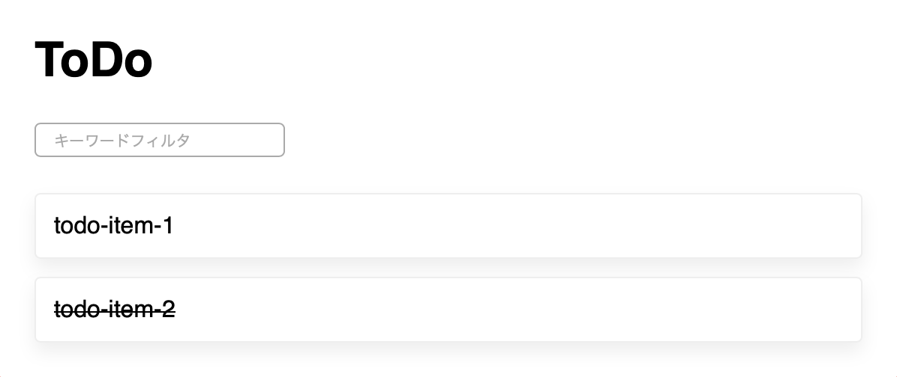

現時点での機能としては単純にフィルタ付きのリストです。

ちょっとした新しいこととして`style`プロパティを利用して`item.done`が`true`の場合、つまり ToDo が完了している場合に`text-decoration: line-through`で取り消し線を表示するようにしています。

```tsx
<p style={{ textDecoration: item.done ? "line-through" : "none" }}>
  {item.text}
</p>
```

他にはクラス指定によりスタイルを適用していますが、React の処理の本質とは離れるためここでは割愛します。

### 状態確認用コンポーネントを追加する

ここからは「コンポーネントが現在どのような値を持っているか」を確認できると理解がしやすいため、そのための状態確認用コンポーネント`ValueViewer`を追加します。

:::warning ここからは diff コマンドによる差分表示

ここからはコード量が増えてきたため、`diff`コマンドを利用した差分表示でコードの変更箇所を示します。
各行頭の`-`が削除してほしい行(赤)、`+`が追加してほしい行(緑)を表しているので、その通りに変更してください。

```diff
- 削除してほしい行
+ 追加してほしい行
```

`@@ -44,9 +50,13 @@`のような記述は`diff`コマンドによる位置表示の出力であり、数字は気にせず「行のまとまりの区切り」程度に捉えてください。

コードの全体像を確認したい場合は [github.com/iij-ykosugi/bootcamp-todo](https://github.com/iij-ykosugi/bootcamp-todo/tree/main/src/todo) に各ステップのコードがまとめられているため、参考にしたり、どうしても動かなくなった場合はここからコピペをしてリカバリーしてください。

:::

以下のように`App.tsx`に`ValueViewer`を追加してください。

```diff
@@ -25,6 +25,17 @@
   );
 }
+type ValueViewerProps = {
+  // `unknown`は「どんな型の値でもありうる」ことを表す型。
+  // なんでも受け付けるが、中身を使う前には型の絞り込みが必要になる。
+  value: unknown;
+};
+
+/** `value`の内容を`JSON.stringify`して表示する、動作確認用コンポーネント。 */
+function ValueViewer({ value }: ValueViewerProps) {
+  return (
+    <pre className="ValueViewer">{JSON.stringify(value, undefined, 2)}</pre>
+  );
+}
+
 /** ToDoリストの初期値。 */
 const INITIAL_TODO: TodoItem[] = [
   { id: 1, text: "todo-item-1", done: false },
@@ -59,6 +70,7 @@
           ))}
         </div>
       )}
+      <ValueViewer value={{ keyword, todoItems, filteredTodoItems }} />
     </div>
   );
 }
```

コード全体: <https://github.com/iij-ykosugi/bootcamp-todo/blob/main/src/todo/step2.tsx>

ToDo リストの下に JSON が表示されれば成功です 😉

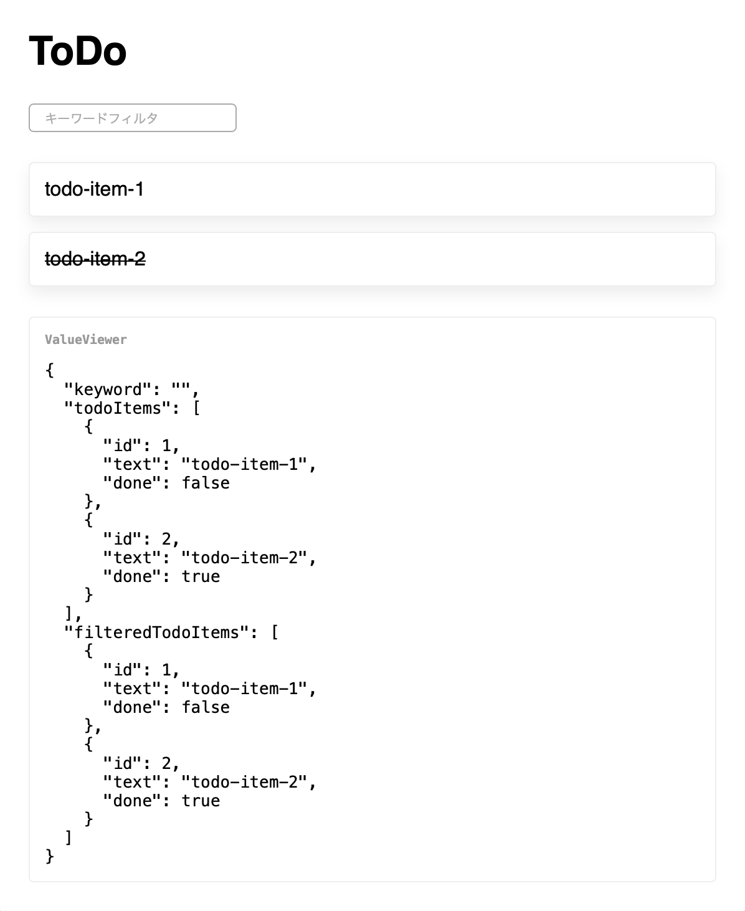

ここで定義した`ValueViewer`は`value`で渡された値を「整形された JSON」として表示するコンポーネントです。

:::tip JSON

[JSON](https://developer.mozilla.org/ja/docs/Learn/JavaScript/Objects/JSON)は JavaScript に限らず幅広く利用される構造化データの記述方式です。
雑な表現をすると、ここでは「文字列化された JavaScript のオブジェクト」程度に考えてもらえれば十分です。
要は任意のデータを手軽に表示する手段として利用しているだけです。

:::

更に動作を確認するためにフィルタ入力欄を操作してみてください。
フィルタの文字列によって JSON 内の`filteredTodoItems`が変わるとともに、表示される ToDo リストの要素が変わると思います。

React がデータの変更に対して描画内容をリアクティブに更新するということを、これによりさらに体感してもらえると嬉しいです 😉

### データの更新処理(Update)に対応する

ここまではフィルタ処理も含め「閲覧操作」の実装を行なってきました。
しかし、アプリケーションの実装の複雑さはデータの追加や更新などの「変更操作」によって生まれると言えます。

つまりここを理解するには頭を使う必要があるかもしれませんが、理解に取り組んだ分「ちょっとできる人」になれるということです 😉

変更操作の手始めとして、CRUD 操作の Update に該当する「更新処理」を実装してみましょう。
具体的には`TodoListItem`のチェックボックスによりデータの`done`を操作することを可能にします。

`App.tsx`を以下のように変更してください。

```diff
@@ -12,12 +12,18 @@
 type TodoListItemProps = {
   item: TodoItem;
+  onCheck: (checked: boolean) => void;
 };
 /** ToDoリストの個々のToDoとなるReactコンポーネント。 */
-function TodoListItem({ item }: TodoListItemProps) {
+function TodoListItem({ item, onCheck }: TodoListItemProps) {
   return (
     <div className="TodoItem">
+      <input
+        type="checkbox"
+        checked={item.done}
+        onChange={(ev) => onCheck(ev.currentTarget.checked)}
+      />
       <p style={{ textDecoration: item.done ? "line-through" : "none" }}>
         {item.text}
       </p>
@@ -44,9 +50,15 @@
 /** アプリケーション本体となるReactコンポーネント。 */
 export default function App() {
-  const todoItems = INITIAL_TODO;
+  const [todoItems, setTodoItems] = useState(INITIAL_TODO);
   const [keyword, setKeyword] = useState("");
+  const updateItem = (newItem: TodoItem) => {
+    setTodoItems(
+      todoItems.map((item) => (item.id === newItem.id ? newItem : item)),
+    );
+  };
+
   const filteredTodoItems = todoItems.filter((item) => {
     return item.text.includes(keyword);
   });
@@ -66,7 +78,13 @@
       ) : (
         <div className="App_todo-list">
           {filteredTodoItems.map((item) => (
-            <TodoListItem key={item.id} item={item} />
+            <TodoListItem
+              key={item.id}
+              item={item}
+              onCheck={(checked) => {
+                updateItem({ ...item, done: checked });
+              }}
+            />
           ))}
         </div>
       )}
```

コード全体: <https://github.com/iij-ykosugi/bootcamp-todo/blob/main/src/todo/step3.tsx>

動作としては前述の通り、チェックボックスにより`TodoItem`の`done`の値が変わり、それが表示に随時反映されていれば成功です 😉

`ValueViewer`の値もぜひ観察してみてください。

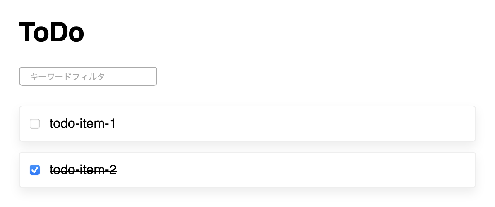

チェックボタンが機能することで一気に ToDo らしくなりましたね。

いくつか説明が必要な箇所があると思いますので、ここでは一気に説明してしまいます。

- `todoItems`の定義に`useState`を使用した
  - ToDo のリストが更新された際に表示を更新する必要があるためです
  - つまり`App`コンポーネントが`todoItems`という State を持ったということです
- `TodoListItem`に`onCheck`プロパティを追加した
- `App`に`updateItem`を定義して`TodoListItem`の`onCheck`に渡した
  - 実装としては`map`メソッドを利用し「`id`が一致する ToDo を引数の`newItem`と入れ替えた新しい配列」で State を更新しています

この中で注目してほしいのは、`App`と`TodoListItem`というコンポーネントの親子関係の間でどのように役割が分担されているかということです。

整理するとそれぞれ以下の役割を担っています。

- 親コンポーネントの役割(ここでは`App`)
  - State の管理(`useState`)とそれに対する処理(`updateItem`)を定義し、子コンポーネントにプロパティとして渡す
- 子コンポーネントの役割(ここでは`TodoListItem`)
  - チェックボックスや入力欄などの「イベントのソースとなる要素」を定義する
  - その要素のイベントに対する処理をプロパティ(`onCheck`)として親から受け取り、イベントハンドラとして登録する
    - この際、親コンポーネントから扱いやすいように引数や返り値の変換も行なうことが多いです

React ではこのパターンを基本としてアプリのパーツを作り、それらを組み合わせることで、ブラウザの DOM API を直接触る場合とは比較にならないくらい複雑で細やかに画面が更新されるアプリを「整理された形で」構築することができます。

:::warning State の更新時には「入れ物」を更新しよう

`todoItems[id] = newItem`のように直接代入しないのは「それをすると React の変更検知がうまく動かない」ためです。
詳しくは[state 内の配列の更新](https://ja.react.dev/learn/updating-arrays-in-state)を見てください。

簡単なルールを紹介すると、配列やオブジェクトを State で管理し更新する場合は「一番外側の入れ物」は新しいものにする必要があります(この表現でも難しいですよね…)

今回の場合は`map`メソッドが新しい配列を返すものであるため、それを利用して State を更新しています。

:::

### 終了した ToDo を非表示にするフィルタ条件を追加する

`done`の更新処理が実装できたところで、次にそれに対するフィルタ条件を追加してみましょう。
更新処理の追加に比べれば小さい変更で実装できます。

以下のように`App.tsx`を修正してください。

```diff
@@ -52,6 +52,7 @@
 export default function App() {
   const [todoItems, setTodoItems] = useState(INITIAL_TODO);
   const [keyword, setKeyword] = useState("");
+  const [showingDone, setShowingDone] = useState(true);
   const updateItem = (newItem: TodoItem) => {
     setTodoItems(
@@ -60,6 +61,7 @@
   };
   const filteredTodoItems = todoItems.filter((item) => {
+    if (!showingDone && item.done) return false;
     return item.text.includes(keyword);
   });
@@ -72,6 +74,13 @@
           value={keyword}
           onChange={(ev) => setKeyword(ev.currentTarget.value)}
         />
+        <input
+          id="showing-done"
+          type="checkbox"
+          checked={showingDone}
+          onChange={(ev) => setShowingDone(ev.currentTarget.checked)}
+        />
+        <label htmlFor="showing-done">完了したものも表示する</label>
       </div>
       {filteredTodoItems.length === 0 ? (
         <div className="dimmed">該当するToDoはありません</div>
@@ -88,7 +97,9 @@
           ))}
         </div>
       )}
-      <ValueViewer value={{ keyword, todoItems, filteredTodoItems }} />
+      <ValueViewer
+        value={{ keyword, showingDone, todoItems, filteredTodoItems }}
+      />
     </div>
   );
 }
```

コード全体: <https://github.com/iij-ykosugi/bootcamp-todo/blob/main/src/todo/step4.tsx>

これにより「完了したものも表示する」というチェックボックスが追加され、そのチェック状態によりその通りリストの表示状態が更新されれば期待通りです 😉

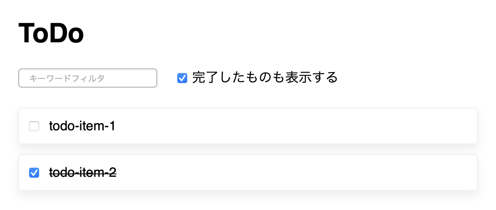

やっていることは新しいフィルタ条件用チェックボックスの状態を保持する`useState`と、それを参照するフィルタ関数の処理の追加のみであるため説明は省略します。

### データの追加処理(Create)に対応する

どんどんいきましょう。次は新しく ToDo を追加するための`CreateTodoForm`を追加しましょう。

以下のように`App.tsx`を編集してください。

```diff
@@ -31,6 +31,26 @@
   );
 }
+type CreateTodoFormProps = {
+  onSubmit: (text: string) => void;
+};
+
+/** 新しくToDoを追加するためのフォームとなるReactコンポーネント。 */
+function CreateTodoForm({ onSubmit }: CreateTodoFormProps) {
+  const [text, setText] = useState("");
+  return (
+    <div className="CreateTodoForm">
+      <input
+        placeholder="新しいTodo"
+        size={60}
+        value={text}
+        onChange={(ev) => setText(ev.currentTarget.value)}
+      />
+      <button onClick={() => onSubmit(text)}>追加</button>
+    </div>
+  );
+}
+
 type ValueViewerProps = {
   value: unknown;
 };
@@ -48,12 +68,22 @@
   { id: 2, text: "todo-item-2", done: true },
 ];
+/**
+ * ID用途に重複しなさそうな数値を適当に生成する。
+ * 今回は適当にUnix Epoch(1970-01-01)からの経過ミリ秒を利用した。
+ */
+const generateId = () => Date.now();
+
 /** アプリケーション本体となるReactコンポーネント。 */
 export default function App() {
   const [todoItems, setTodoItems] = useState(INITIAL_TODO);
   const [keyword, setKeyword] = useState("");
   const [showingDone, setShowingDone] = useState(true);
+  const createItem = (text: string) => {
+    setTodoItems([...todoItems, { id: generateId(), text, done: false }]);
+  };
+
   const updateItem = (newItem: TodoItem) => {
     setTodoItems(
       todoItems.map((item) => (item.id === newItem.id ? newItem : item)),
@@ -97,6 +127,7 @@
           ))}
         </div>
       )}
+      <CreateTodoForm onSubmit={(text) => createItem(text)} />
       <ValueViewer
         value={{ keyword, showingDone, todoItems, filteredTodoItems }}
       />
```

コード全体: <https://github.com/iij-ykosugi/bootcamp-todo/blob/main/src/todo/step5.tsx>

以下のように「新しい ToDo」という入力欄が表示され、テキストを入力し追加ボタンを押すと新しい ToDo が追加されれば成功です 😉

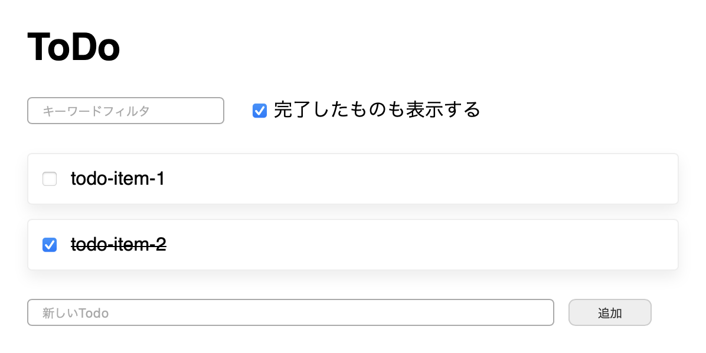

`ValueViewer`で見ても`todoItems`に新しい ToDo が追加されたのがわかると思います。

これで最低限、ToDo アプリとして動作するようになりましたね。

`generateId`は更新/削除する際に操作対象の ToDo を特定するための一意な値 (id) を生成します。
また、id は `map`関数で利用する`key`としても利用します。
他の点は更新処理の実装時と比べて新しいことはしていないため説明を省略します。

:::tip スプレッド演算子(`...`)

`...`は「スプレッド演算子」と呼ばれ、配列の中身を別の配列の中に展開することができます。

```ts
const list = [1, 2, 3];
const newList = [...list, 4, 5];
console.log(newList);
// => [ 1, 2, 3, 4, 5 ]
```

同様にオブジェクトに対しても以下のように働きます。

```tsx
const obj = { a: 12, b: "foo" };
const newObj = { ...obj, c: 99 };
console.log(newObj);
// => { a: 12, b: 'foo', c: 99 }
```

これらを利用することで他の要素を引き継ぎ、特定の要素のみを更新・追加した、**新しい** 配列やオブジェクトを作ることができます。

React では先述の通り、変更検知の都合上、状態を更新するときには「入れ物」を新しく作り直す必要があるためこの表現がよく使われます。

参考: [スプレッド構文を使ったオブジェクトのコピー](https://ja.react.dev/learn/updating-objects-in-state#copying-objects-with-the-spread-syntax)

:::

### 状態とそれに対する操作をカスタム Hook としてまとめる

さて、`App`コンポーネントの実装が増えてきたため、ある程度の塊で処理を分割したいと思います。

これまでに何度も利用してきましたが`useState`は[React Hook](https://ja.react.dev/reference/react/hooks)と呼ばれるものの一つです。
Hook の詳細は省きますが、ここでは「React コンポーネントの中だけで使える特殊な関数」という理解で十分です。
詳細はリンク先を確認してください。

そして React では Hook をまとめて独自の Hook を定義でき、これをカスタム Hook と呼びます。
React ではこれを利用し「状態とそれに対する操作」をまとめてカスタム Hook として定義し、処理をまとめるということをよくやります。

ここでは`todoItems`とそれに対する操作をカスタム Hook としてまとめたいと思います。

`App.tsx`を以下のように変更してください。

```diff
@@ -74,6 +74,20 @@
  */
 const generateId = () => Date.now();
+/** ToDoのStateとそれに対する操作をまとめたカスタムHook。 */
+const useTodoState = () => {
+  const [todoItems, setTodoItems] = useState(INITIAL_TODO);
+  const createItem = (text: string) => {
+    setTodoItems([...todoItems, { id: generateId(), text, done: false }]);
+  };
+  const updateItem = (newItem: TodoItem) => {
+    setTodoItems(
+      todoItems.map((item) => (item.id === newItem.id ? newItem : item)),
+    );
+  };
+  // `as const`をつけると返り値が「順番と型が固定された配列(タプル)」として扱われる。
+  // つけない場合は各要素の型が混ざったものになり、分割代入した変数が正しく型付けされない。
+  return [todoItems, createItem, updateItem] as const;
+};
+
@@ -84,20 +98,10 @@
 /** アプリケーション本体となるReactコンポーネント。 */
 export default function App() {
-  const [todoItems, setTodoItems] = useState(INITIAL_TODO);
+  const [todoItems, createItem, updateItem] = useTodoState();
   const [keyword, setKeyword] = useState("");
   const [showingDone, setShowingDone] = useState(true);
-  const createItem = (text: string) => {
-    setTodoItems([...todoItems, { id: generateId(), text, done: false }]);
-  };
-
-  const updateItem = (newItem: TodoItem) => {
-    setTodoItems(
-      todoItems.map((item) => (item.id === newItem.id ? newItem : item)),
-    );
-  };
-
   const filteredTodoItems = todoItems.filter((item) => {
     if (!showingDone && item.done) return false;
     return item.text.includes(keyword);
```

コード全体: <https://github.com/iij-ykosugi/bootcamp-todo/blob/main/src/todo/step6.tsx>

この変更では表示内容は変わりません。

ここでは`todoItems`と`createItem`と`updateItem`を`useTodoState`という名前の関数でまとめました。
この`use***`というのは内部で React Hook を使っていることをわかりやすくするためのただの命名規則で、実質カスタム Hook というのは Hook を含んでいるだけのただの関数です。

ひとつ注目して欲しいのは、この切り出しにより`setTodoItems`というメソッドが`App`コンポーネントからはアクセスできなくなった点です。
`setTodoItems`は`todoItems`に対して、いわばどのような変更も行える万能メソッドです。
それを隠蔽し、追加や変更など、ある特定の操作に特化したメソッドのみを利用側のコードに見せることで、その State がどのような変更操作を意図しているのかを明確にし、コードの可読性を上げることができます。

「State とそれに対する操作をまとめる」というパターンはよく使うため覚えておくと良いでしょう 😉

### データの削除処理(Delete)に対応する

最後に残りの CRUD 操作である削除(Delete)処理を実装します。
データに対する削除操作は概ね「削除ボタン」として実装されることが多いです。
ここでも「削除ボタン」として実装しましょう。

方針としては`TodoListItem`に`onCheck`を追加した時と同じように`onDelete`プロパティを追加します。
以下のように`App.tsx`を修正してください。

```diff
@@ -13,10 +13,11 @@
 type TodoListItemProps = {
   item: TodoItem;
   onCheck: (checked: boolean) => void;
+  onDelete: () => void;
 };
 /** ToDoリストの個々のToDoとなるReactコンポーネント。 */
-function TodoListItem({ item, onCheck }: TodoListItemProps) {
+function TodoListItem({ item, onCheck, onDelete }: TodoListItemProps) {
   return (
     <div className="TodoItem">
       <input
@@ -27,6 +28,9 @@
       <p style={{ textDecoration: item.done ? "line-through" : "none" }}>
         {item.text}
       </p>
+      <button className="button-small" onClick={() => onDelete()}>
+        ×
+      </button>
     </div>
   );
 }
@@ -85,12 +89,15 @@
       todoItems.map((item) => (item.id === newItem.id ? newItem : item)),
     );
   };
+  const deleteItem = (id: number) => {
+    setTodoItems(todoItems.filter((item) => item.id !== id));
+  };
-  return [todoItems, createItem, updateItem] as const;
+  return [todoItems, createItem, updateItem, deleteItem] as const;
 };
 /** アプリケーション本体となるReactコンポーネント。 */
 export default function App() {
-  const [todoItems, createItem, updateItem] = useTodoState();
+  const [todoItems, createItem, updateItem, deleteItem] = useTodoState();
   const [keyword, setKeyword] = useState("");
   const [showingDone, setShowingDone] = useState(true);
@@ -127,6 +134,7 @@
               onCheck={(checked) => {
                 updateItem({ ...item, done: checked });
               }}
+              onDelete={() => deleteItem(item.id)}
             />
           ))}
         </div>
```

コード全体: <https://github.com/iij-ykosugi/bootcamp-todo/blob/main/src/todo/step-final.tsx>

以下のように各 ToDo に削除ボタンがついて、ボタンを押してその項目が削除されれば想定通りです 😉

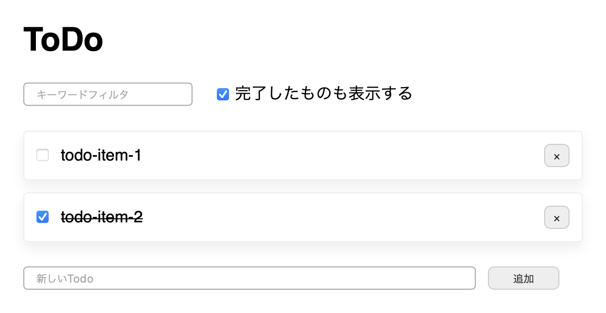

`ValueViewer`で`todoItems`を見てもそのデータが消えているのがわかると思います。

以上で ToDo アプリの一通りの実装ができました。やったね。

### 🚩 チェックポイント

ここまでで、以下の React における実装パターンを学べていると良いでしょう。

- CRUD 操作のそれぞれに対応する実装パターン
  - ここで紹介した以外にもたくさんの実装パターンがあります
- State とそれに対する操作手段をカスタム Hook としてまとめる
- 親コンポーネントでは State とそれに対する操作手段を、子コンポーネントではイベントのソースとなる要素とそのハンドラへの処理の登録をそれぞれ分担する
  - ただしなんでもかんでも親が State を持てばいいというわけではないのが難しいところです

:::tip ⛳️ 通常のゴール

もしここまでついて来れていたら大したものです。お疲れ様でした 😉

:::

### 発展課題

時間に余裕があれば挑戦してみてください。
この先の「API サーバとのやりとりを行う ToDo アプリ」に進んでも構いません。

- [`localStorage`](https://developer.mozilla.org/ja/docs/Web/API/Window/localStorage)を利用してリロードしても変更した内容が保たれるようにしよう
  - 現在の実装ではリロードすると値が消えてしまいますが、ブラウザには`localStorage`という値の保存場所があります
  - `localStorage`には文字列しか格納できないため、任意のデータを保存する場合は、保存する前には`JSON.stringify`で文字列にし、取り出した後には`JSON.parse`で JavaScript の値(オブジェクト・数値・文字列・etc)として変換します
    - こういう文字列変換する処理をシリアライズ、その逆変換をデシリアライズと言います
  - これができると、自分の手元で動作すればいいだけのアプリであればグッと実用性が増します
- `CreateTodoForm`の入力後に入力欄の値がクリアされるようにしてみよう
  - この方が使用感は上がると思います
- 削除処理の前に確認メッセージを入れてみよう
  - [`window.confirm`](https://developer.mozilla.org/ja/docs/Web/API/Window/confirm)というブラウザ標準の API を使うと割と簡単に実装できます
  - ただし ToDo アプリ程度だと、毎回確認が入ると使用感が落ちるかもしれないですね
- その他、好きに機能を拡張してみよう
  - ToDo に締切を入力できるようにする、など自由に機能を拡張してください

:::tip まだまだ序の口 その 1 - CRUD 操作の奥深さ

今回の講義では単一画面で組むこととしたため、CRUD 操作の実装パターンや悩みどころについては触れられていない部分が多いです。
実際[React Router](https://reactrouter.com/)などを使い画面遷移を実装することで、イベントハンドラでの連携や各操作の API レスポンスとして返されると嬉しい値など、ノウハウの貯めどころは格段に増えてきます。

ただし大きなアプリの機能の一部として「リストをページ遷移なしで編集する」というケースは存在するため、その点では ToDo アプリも十分に応用しがいのある実装例と言えます。

:::

:::tip まだまだ序の口 その 2 - 実際のアプリに必要な要素

ToDo アプリは基礎の一要素にはなりますが、より実践的なアプリを組む場合には不足している要素がたくさんあります。

実践を考えると、例えば以下の要素が不足していると考えられます。

- サーバとのやりとり
  - ブラウザを跨いだデータの永続化に必要になります
  - ネットワーク越しに API を利用して CRUD やその他の操作を行う必要が出てきます
  - `Promise`などの非同期処理の理解や HTTP についての理解も必要になります
- 認証
  - 社内で業務上の情報を扱うツールを作る場合は避けられないでしょう
- ルーティングライブラリを利用したマルチページ化(react-router など)
  - 擬似的に複数ページのアプリケーションを表現する技術です
  - アプリ開発の世界では URL と画面の対応付けのことを「ルーティング」と呼び、IP ルーティングとは異なる概念です
- フォームのバリデーション
  - TODO アプリであれば TODO のタイトルが空でないか？入力した締切日が過去でないか？など、フォームの入力値が正しいかどうかを検証する技術です (TypeScript では [zod](https://zod.dev/) や [valibot](https://valibot.dev/) など)
  - これらのライブラリは必ずしも React 用に作られたものではないので、[react-hook-form](https://react-hook-form.com/) を利用して React に最適化することが一般的です

[最近の React 公式のチュートリアル](https://react.dev/learn/start-a-new-react-project)では[Next.js](https://nextjs.org)という統合的なフレームワークがプロジェクトを始める際の第一の選択肢として挙げられており、これは上に挙げた要素を含むものになっているため、触ってみると良いかもしれません(まだきちんと触ったことはないので自信はないです)。

また、ToDoMVC のさらに発展版のような、[RealWorld](https://codebase.show/projects/realworld)という、より実践的な要素を網羅した実装例をまとめたサイトもあるため、参考にするといいかもしれません(こちらも私はあまり見たことはないです)。

:::

## API サーバとのやりとりを行う ToDo アプリ

:::tip エクストラステージへようこそ

ここからはほとんどの人は到達できないと思いますが、駆け足で進められた人への暇つぶしとして書いておきます 😉

:::

ここまではブラウザ内で完結した処理のみを実装してきましたが、ここからはさらに実践的な例としてサーバとのやり取りを想定した実装に挑戦してみましょう。
一般的にウェブアプリといえば、ほぼこの形態です。
サーバに対してデータを保存することができれば、別の PC や他の人が同じ情報にアクセスできます。
ここまでできると、ちょっとした SaaS(Software as a Service)ですね。

コードの量が増えるためファイルを 2 つに分けます。
まず、API クライアントの定義である、以下の内容の`api.tsx`を`App.tsx`と同じ階層(`src`の直下)に新たに作成してください。
このようなコードは実際の開発では API 定義より自動生成する場合もあるため、コピペで作成しても大丈夫です。

```tsx
/** 個々のToDoを表す型。*/
export type TodoItem = {
  /** 全てのToDoで一意な値 */
  id: number;
  /** ToDoの内容 */
  text: string;
  /** 完了すると`true`となる。 */
  done: boolean;
};

/**
 * ブラウザ上で動作するAPIクライアントのモック(=それらしく動くもの)。
 * 今回はあまり内部の処理について理解する必要はなく、ToDoの配列を保持して
 * それを操作するためのメソッドを提供している、という程度の理解で十分。
 *
 * ネットワーク越しのリクエストを再現するため、各メソッドには遅延時間を設けている。
 */
export class TodoApiMock {
  private todoItems: TodoItem[];

  constructor(todoItems: TodoItem[]) {
    this.todoItems = todoItems;
  }

  /** 条件に該当するToDoを配列で返す。 */
  async queryItems(keyword: string, includeDone: boolean) {
    await this.simulateNetworkDelay();
    return this.todoItems.filter((item) => {
      if (!includeDone && item.done) return false;
      return keyword ? item.text.includes(keyword) : true;
    });
  }

  /** 新しくToDoを作成する。 */
  async createItem(text: string) {
    await this.simulateNetworkDelay();
    const newItem = { id: this.generateId(), text, done: false };
    this.todoItems.push(newItem);
    return newItem;
  }

  /** 既存のToDoを置き換える。 */
  async updateItem(newItem: TodoItem) {
    await this.simulateNetworkDelay();
    this.todoItems = this.todoItems.map((item) =>
      item.id === newItem.id ? newItem : item,
    );
  }

  /** 既存のToDoを削除する。 */
  async deleteItem(id: number) {
    await this.simulateNetworkDelay();
    this.todoItems = this.todoItems.filter((item) => item.id !== id);
  }

  private simulateNetworkDelay() {
    return new Promise((resolve) => setTimeout(resolve, 500));
  }

  /** ID用途に重複しなさそうな数値を適当に生成する。 */
  private generateId() {
    // モックなので適当に1970-01-01からの経過ミリ秒を利用した
    return Date.now();
  }
}

/**
 * APIサーバに対してリクエストを行う実際のAPIクライアント。
 * REST風のAPIを想定している。
 *
 * ここではブラウザ標準の`fetch`を利用しているが、[Axios](https://www.npmjs.com/package/axios)
 * というライブラリを使うとこれよりも楽に書け、特にJSONの扱いが便利になる。
 */
export class TodoApiClient {
  private baseUrl: string;

  /**
   * @example
   * new TodoApiClient('http://localhost:8080')
   */
  constructor(baseUrl: string) {
    this.baseUrl = baseUrl;
  }

  /** 条件に該当するToDoを配列で返す。 */
  async queryItems(keyword: string, includeDone: boolean) {
    const url = new URL(`${this.baseUrl}/todo`);
    if (keyword !== "") {
      url.searchParams.set("keyword", keyword);
    }
    if (includeDone) {
      url.searchParams.set("include_done", "true");
    }
    return fetch(url).then((res) => res.json());
  }

  /** 新しくToDoを作成する。 */
  async createItem(text: string) {
    return fetch(`${this.baseUrl}/todo`, {
      method: "POST",
      headers: { "Content-Type": "application/json" },
      body: JSON.stringify({ text }),
    }).then((res) => res.json());
  }

  /** 既存のToDoを置き換える。 */
  async updateItem(newItem: TodoItem) {
    return fetch(`${this.baseUrl}/todo/${newItem.id}`, {
      method: "PUT",
      headers: { "Content-Type": "application/json" },
      body: JSON.stringify(newItem),
    }).then((res) => res.json());
  }

  /** 既存のToDoを削除する。 */
  async deleteItem(id: number) {
    return fetch(`${this.baseUrl}/todo/${id}`, { method: "DELETE" }).then(
      (res) => res.json(),
    );
  }
}
```

このファイルは`TodoApiClient`と`TodoApiMock`を主に定義しています。

`TodoApiClient`は実際にサーバにアクセスするクライアントクラスです。
`TodoApiMock`はブラウザ上で処理が完結している「それらしく動作する」モック(=クライアントもどき)です。
実際の開発でもモックを利用しながらウェブアプリの実装を進め、ある程度形になったところで実際のサーバにアクセスし、動作を結合させたりします。

次に`App.tsx`を以下のように**丸ごと**書き換えてください。

```tsx
import { useEffect, useState } from "react";

import { type TodoItem, TodoApiMock } from "./api";

const INITIAL_TODO: TodoItem[] = [
  { id: 1, text: "todo-item-1", done: false },
  { id: 2, text: "todo-item-2", done: true },
];

/** モックと実際のAPIクライアントを切り替えるためのコメントアウト */
const todoApi = new TodoApiMock(INITIAL_TODO);
// const todoApi = new TodoApiClient("http://localhost:8080");

type TodoListItemProps = {
  item: TodoItem;
  onCheck: (checked: boolean) => void;
  onDelete: () => void;
};

function TodoListItem({ item, onCheck, onDelete }: TodoListItemProps) {
  return (
    <div className="TodoItem">
      <input
        type="checkbox"
        checked={item.done}
        onChange={(ev) => onCheck(ev.currentTarget.checked)}
      />
      <p style={{ textDecoration: item.done ? "line-through" : "none" }}>
        {item.text}
      </p>
      <button className="button-small" onClick={() => onDelete()}>
        ×
      </button>
    </div>
  );
}

type CreateTodoFormProps = {
  onSubmit: (text: string) => void;
};

function CreateTodoForm({ onSubmit }: CreateTodoFormProps) {
  const [text, setText] = useState("");
  return (
    <div className="CreateTodoForm">
      <input
        placeholder="新しいTodo"
        size={60}
        value={text}
        onChange={(ev) => setText(ev.currentTarget.value)}
      />
      <button onClick={() => onSubmit(text)}>追加</button>
    </div>
  );
}

type ValueViewerProps = {
  value: unknown;
};

function ValueViewer({ value }: ValueViewerProps) {
  return (
    <pre className="ValueViewer">{JSON.stringify(value, undefined, 2)}</pre>
  );
}

export default function App() {
  const [todoItems, setTodoItems] = useState<TodoItem[] | null>(null);
  const [keyword, setKeyword] = useState("");
  const [showingDone, setShowingDone] = useState(false);

  const reloadTodoItems = async () => {
    setTodoItems(await todoApi.queryItems(keyword, showingDone));
  };

  useEffect(() => {
    reloadTodoItems();
    // eslint-disable-next-line react-hooks/exhaustive-deps
  }, []);

  return (
    <div className="App">
      <h1>ToDo</h1>
      <div className="App_todo-list-control">
        <input
          placeholder="キーワードフィルタ"
          value={keyword}
          onChange={(ev) => setKeyword(ev.currentTarget.value)}
        />
        <input
          id="showing-done"
          type="checkbox"
          checked={showingDone}
          onChange={(ev) => setShowingDone(ev.currentTarget.checked)}
        />
        <label htmlFor="showing-done">完了したものも表示する</label>
        <button onClick={() => reloadTodoItems()}>更新</button>
      </div>
      {todoItems === null ? (
        <div className="dimmed">データを取得中です...</div>
      ) : todoItems.length === 0 ? (
        <div className="dimmed">該当するToDoはありません</div>
      ) : (
        <div className="App_todo-list">
          {todoItems.map((item) => (
            <TodoListItem
              key={item.id}
              item={item}
              onCheck={async (checked) => {
                await todoApi.updateItem({ ...item, done: checked });
                reloadTodoItems();
              }}
              onDelete={async () => {
                await todoApi.deleteItem(item.id);
                reloadTodoItems();
              }}
            />
          ))}
        </div>
      )}
      <CreateTodoForm
        onSubmit={async (text) => {
          await todoApi.createItem(text);
          reloadTodoItems();
        }}
      />
      <ValueViewer value={todoItems} />
    </div>
  );
}
```

実装としてはかなり複雑になったことがわかると思います。

主な変更点としては以下の通りです。

- `useTodoState`の代わりに`todoApi`のメソッドを利用している
  - つまり`todoItems`の管理の主体がコンポーネントからサーバに移動したということです
    - ただし取得したデータを保持するために`useState`を利用しています
  - ここから先は常に「マスターデータはサーバにある」という認識を持つのが良いでしょう
    - 言い換えるとウェブアプリが持っているのはあくまで「ある瞬間にサーバから取得したデータのコピーである」ということです
- `async/await`による非同期処理に対応している
- `useEffect`により初回のデータ取得を自動でおこなっている
- 値を追加・更新・削除した際にリストを再取得している
  - リストを取得する際に条件を与えているため、値の変更後にその条件にマッチした要素は何か、クライアント側では判断がつかないためリストを再取得する必要があります
  - これも「マスターデータはサーバにある」の一種と言えます

しかし、ここまで来れた人に多くは説明しません。
というより申し訳ないのですが、資料を用意している時間がもうないためここから先は好きなように進めてください。
あとついでにですが、もとの ToDo アプリのコードとのつながりを優先したせいで、コンポーネントが妥当な機能の切り分けになっていないと思います。

「こうしたらいいんじゃないかな」という点は次の発展課題に上げておいたので、どうかいい感じにしてやってください…🥺 すみません…

### サーバを立ててアクセスしてみる(Vite 環境のみ)

残念ながら PlayCode では実行できないためモックで我慢してください 🥺

API サーバのコンテナイメージを用意してありますので、以下のようにローカルでサーバを立ててサーバへのアクセスを実際に試してみてください。

```sh
docker run --rm -p 8080:8080 ghcr.io/asa-taka/bootcamp-todo-api --port=8080 --host=0.0.0.0
```

これを実行すると<http://localhost:8080>で API サーバが動作します。
試しにブラウザで<http://localhost:8080/todo>を表示すると ToDo のデータの JSON が表示されれば成功です 😉

この状態でコード中の、モックと切り替えるためのコメントアウトを入れ替えると、ウェブアプリからもアクセスされるようになるはずです。
`import`の方も合わせて書き換えるのを忘れないでください。

```tsx
import { type TodoItem, TodoApiClient } from "./api";

// ...

// const todoApi = new TodoApiMock(INITIAL_TODO);
const todoApi = new TodoApiClient("http://localhost:8080");
```

### 発展課題

時間に余裕があれば挑戦してみてください。

- 更新中の状態をユーザに伝えたい
- 条件を変更した時に自動でリストを更新したい
- api を呼ぶ処理は TodoItem の方に寄せてもいい
  - reload する処理をどうするか
- エラーレスポンスに対してはどうするか

ただし、実際にはこのあたりの実装は[tanstack-query](https://tanstack.com/query/latest)などのパッケージを利用することが多いです。

### アプリをビルドしてコンテナ化する(Vite 環境のみ)

発展課題のついでのおまけのおまけです。アプリをビルドしてついでにコンテナ化しましょう 😉

ウェブアプリケーションの「ビルド」とは **ブラウザが解釈できる純粋な HTML と CSS と JavaScript** をソースコードから生成することを指します。

プロジェクトのルートディレクトリ(フォルダの一番上の階層)に移動して、以下の内容で`Dockerfile` という名前のファイルを作ってください。

```dockerfile
FROM nginx:1.25.2
COPY ./dist /usr/share/nginx/html
```

フォルダ内の構成はこのようになります。

```txt
(ルートディレクトリ)
├── Dockerfile
├── src
└── (その他のファイル)
```

この状態で、同じくルートディレクトリで以下のコマンドを実行することで、コンテナイメージを作成することができます(ちょっと雑な作り方です)。

```sh
# distフォルダにビルドされたウェブアプリが生成される。
# (`XXX is declared but its value is never read.` のようなエラーで落ちる場合は、XXX を削除してください)
npm run build

# distフォルダを取り込んだnginx(ウェブサーバ)のコンテナイメージを作成する。
docker build . -t todo-web

# コンテナを動かし9000番ポートでウェブアプリを公開する。
docker run --rm -p 9000:80 todo-web
```

この状態で<http://localhost:9000>にアクセスして、今までと同様のウェブアプリが表示されれば成功です 😉

アプリをコンテナイメージとしてまとめることで、利用者がアプリを動かすためのセットアップが簡単にできたり、Kubernetes 環境でアプリを動作させることができます。

:::tip えっ、ここまでできたんですか？

ちょっと、できる人すぎですよ 😉

:::

## 参考になるサイト

### React

- React 公式: <https://react.dev>
  - とても親切にまとめられていますし[日本語訳](https://ja.react.dev)もあります
  - State やプロパティ、Hook について理解を深めるのにとても役にたちます

### JavaScript

- MDN: <https://developer.mozilla.org/ja/docs/Web>
  - Mozilla(Firefox を開発しているところ)による JavaScript リファレンスです
  - 日本語訳も充実しており、JavaScript の個々の API について調べる場合は一番わかりやすいと思います

### TypeScript

- TypeScript 公式: <https://www.typescriptlang.org>
  - 英語しかないので難しいかもしれません
- TypeScript Deep Dive 日本語版: <https://typescript-jp.gitbook.io/deep-dive/type-system>
- サバイバル TypeScript: <https://typescriptbook.jp/>

以上で講義は終わりです。よい React ライフを 😉

<credit-footer/>
