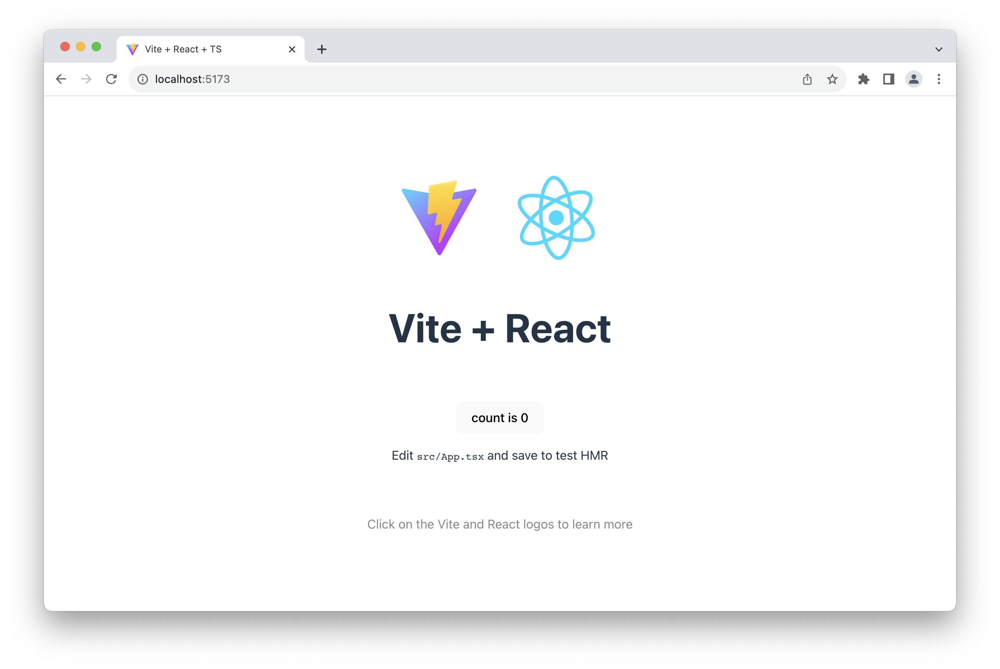
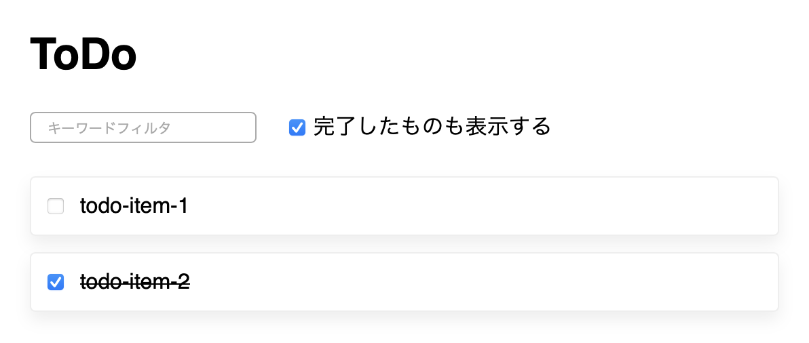

<header-table/>

# {{$page.frontmatter.title}}

[[toc]]

## 講義の全体像

この講義では **「ToDoアプリを作ってReactによる実践的な実装パターンを体感しよう」** を目標として、以下の構成で進めていきます。

- Reactの基本的な動作を体感する(プロパティ、State、イベントハンドラ)
  - ⛳️プログラミング初心者の人のゴール
- ToDoアプリでより実践的な実装パターンを体感する
  - ⛳️通常のゴール
- ToDoアプリでサーバとやり取りする
  - ⛳️進みが早い人のゴール

人によっては既に知っている内容も含まれると思いますので、適宜先へ先へと進めていってください。

通常のゴールまで辿り着けば、以下のようなアプリが完成する予定です。


頑張っていきましょう😉

## 実行環境の用意

この講義では実行環境として以下の2つを想定します。
環境構築に慣れていない人には1のCodeSandboxを、実際の開発環境に近いことをしたい人には2のViteをお勧めします。

### 1. CodeSandboxを利用する

[CodeSandbox](https://codesandbox.io/)を利用してReactの環境を用意します。

React TypeScriptの環境である<https://codesandbox.io/s/react-typescript-react-ts>を開いてください。
以下のようなページが表示されると思います。


以上で環境のセットアップはほぼ完了です。簡単ですね😉

この環境ではエディタとブラウザが左右に表示されており、ファイルをセーブすると自動でブラウザの内容が更新されます。

残るちょっとした作業として、`src/index.ts`の以下の場所に`import "./styles.css"`の行を追加しておいてください。

```tsx{4}
import React from "react";
import ReactDOM from "react-dom/client";
import App from "./App";
import "./styles.css";
```

これから`App.tsx`は頻繁に書き換えるため、特に触ることのない`index.ts`からスタイルシートを`import`するようにします。

### 2. Viteを利用してローカル環境にプロジェクトの雛形を用意する

[Vite](https://vitejs.dev)を利用してローカル環境にプロジェクトの雛形を用意します。

Viteを利用した環境のセットアップを例示しておきます。
難しそうであればCodeSandboxを利用してください。

```sh
# NodeJSのインストール(インストール済みの場合はスキップ)
# nodeコマンドとnpmコマンドが使えるようになれば方法は任意です
# 以下はasdfを利用した一例です
asdf plugin add nodejs
asdf install nodejs latest
asdf global nodejs latest

# Viteを利用したプロジェクトのセットアップ
npm create vite@latest bootcamp-react
# => React => TypeScript を選択する
cd bootcamp-react
npm install
npm run dev
```

開発サーバが起動し、ブラウザで<http://localhost:5173>にアクセスして以下のような画面が見れれば成功です😉



この環境ではファイルを更新すると自動でブラウザの表示も更新されます。
開発のためのエディタは好きなものを利用してください。

### フォルダ構成

Reactのプロジェクトのフォルダにはいろんなファイルがありますが、この講義では`src`フォルダだけを気にしてもらえれば大丈夫です。`src`フォルダの中にもいろんなファイルがありますが、ひとまず以下に示す3つのファイルのみを気にしてください。

```
(プロジェクトのフォルダ)
├── src
│   ├── App.tsx     ← メインのアプリ実装
│   ├── index.tsx   ← アプリのセットアップ (Viteの場合はmain.tsx)
│   ├── styles.css  ← スタイルシート      (Viteの場合はindex.css)
│   └── (その他諸々)
└── (その他諸々)
```

この講義では主に`src/App.tsx`を編集してReactの動作を確認していきます。

### スタイルの適用

今回のハンズオン用のスタイルをあらかじめ[github.com/asa-taka/bootcamp-todo](https://github.com/asa-taka/bootcamp-todo/blob/main/src/index.css)に用意しておきました。
それぞれの環境ごとに以下のファイルにコピペで上書きしてください。

- CodeSandbox環境: `src/index.css`
- Vite環境: `src/styles.css`

### 🚩チェックポイント

ここまでで以下の準備が終わっているようにしましょう。

- CodeSandbox、もしくはViteを利用してReactの開発環境の準備ができた

## 要素技術の軽い紹介

手を動かす前に軽くReactと、Reactと共に使われる要素技術の紹介をしておきます。
まだセットアップが間に合っていない人はTAを呼ぶなりして、この時間に頑張って間に合わせてください😉

### Reactが解決してくれる課題

先に行われたDOMの講義を通して、ブラウザの標準APIとして存在するDOM操作のメソッドを利用し、表示中の画面を書き換えられることは体感できたと思います。

しかしDOM操作を直接行う方法では、次のような複雑なDOMに対して変更を行おうとした場合には大変になります。

```html
<div class="profile-list">
  <div class="profile-container">
    <div class="profile-pict">
      
    </div>
    <div class="profile">
      <p>...</p>
    </div>
  </div>
  <div class="profile-container">
    <!-- ...繰り返し... -->
  </div>
<div>
```

昨今のHTMLはネストが深く属性も山盛りです。
そして実際のウェブアプリはこの数十倍の複雑さになります。
さらにアプリの種類によっては頻繁で細やかな表示の変更が求められることもあります。

この膨大なDOMに対して、変更内容に応じた更新をかける処理をブラウザの素朴なAPIを利用して開発するのは現実的ではありません。

Reactを利用することでこのような処理が簡単に描けるようになります。

### React

[React](https://react.dev)はMeta(旧Facebook)発のUIフレームワークです。

ReactとはデータとDOMの対応付けをやってくれるフレームワークであり、さらにデータの更新に対してリアクティブ(反応的)に画面を更新してくれるフレームワークです。
この「リアクティブな画面更新」を行う機能により複雑で画面が繊細に更新されるようなウェブアプリを効率的に開発することができます。
その辺りはSvelteと同様の位置付けのフレームワークです。

…と、こんなことを言われてもピンとこないですよね。それを理解するためのハンズオンです😉

### TypeScript

Reactの開発ではJavaScriptの代わりに、その拡張言語である[TypeScript](https://www.typescriptlang.org)をよく使います。
TypeScriptはMicrosoft発の、JavaScriptに**型**の概念を加えた言語です。

例えば以下の関数定義は

```js
const fn = (n) => n * 2
```

TypeScriptでは次のように書けます。

```ts
const fn = (n: number) => n * 2
```

引数に`number`という型をつけることができます。
これにより「この関数の引数はどのような値であるべきか」という、JavaScriptではコメントで表現するしかなかった部分を補完することができます。逆に型以外の点ではJavaScriptとほぼ同じ表記になります。

もう少し複雑なオブジェクトを定義して用いることもできます。

```ts
type Props = {
  value: number
}

const fn = (props: Props) => props.value * 2
```

ここでは`Props`という型を定義して関数の引数に利用しています。
Reactでは主にプロパティやStateの型、それからそのアプリが扱うデータの型を定義するのに便利になります。

:::tip TypeScriptを試してみる

TypeScriptでどのような表現が可能かは[TS Playground](https://www.typescriptlang.org/play)で実際に試すと理解がしやすいでしょう。

また[Deno](https://deno.com)というNodeJSとは別のJavaScript実行環境ではデフォルトでTypeScriptを実行できます。

:::

:::tip TypeScriptの実行環境

TypeScriptは通常、そのままではブラウザやNodeJSなどのJavaScriptの実行環境では実行できず、以下の流れで処理する必要があります。

1. TypeScriptでソースコードを記述
2. 型チェック
3. コンパイラ(トランスパイラ)がソースコードをJavaScriptに変換
4. ブラウザ等JavaScriptの動作環境で実行

実際にはこの流れはツール類がほぼ自動で実行してくれます。包括的なツールとして最近では[Vite](https://vitejs.dev)がよく使われます。

面倒に見えるかもしれませんが、最近ではツール類が洗練され、設定の手間がほとんどかからなくなっています。
一般にReactで開発を行う際もTypeScriptがよく使われるため、この講義でもTypeScriptの利用を前提として進めます。

:::

### JSX(TSX)

さらにReactでは**JSX**というJavaScriptの拡張言語を使います。
JSXは簡単に言えば「JavaScriptのコード中にHTMLを書けるようにした言語」です。

例えば以下のような表現ができます。

```tsx
function Hello() {
  const myName = 'asa-taka'
  return (
    <div>Hello <b>{myName}</b></div>
  )
}
```

どうでしょうか。気持ち悪いですね😉

JavaScriptとHTMLが入り混じっています。
ここでは2つだけJSXのルールを紹介しておきますが、まだ覚える必要はありません。

- JSX要素は`return`や変数への代入など、JavaScriptの「値(より正確には式)」として、任意の場所で使える
  - ただしルートの要素は1つでなければならない
- JSXの中(要素の属性値or子要素)では`{}`の中はJavaScriptの表現が使える
  - ただし値を返すもの(簡単に言えばそのまま変数に代入できるもの)に限ります
  - 例として`{1}`や`{fn(1, 'foo') + 1}`は正しいJSX中の表現ですが`{if ...}`は使えません
    - 条件分岐には`&&`や`?:`が、繰り返しには配列の`map`メソッドなどがよく使われます

ハンズオンを進めながら、理解を深めたくなったらまた戻ってきてください。

ウェブアプリを開発する上では慣れるとJSXの方が便利なのと、他のReactの解説でもほぼJSXが使われているため、この講義でもJSXの利用を前提として進めます。

TypeScriptとJSXを合わせたものは特にTSXと呼ばれることもありますが、その場合でもJSXと呼ばれることが多いです。
ただし拡張子は`.jsx`ではなく`.tsx`がよく使われます。

:::tip JSXは実際には何を表しているのか

JSXが最終的なJavaScriptでどのような値になるかはコンパイラの設定によります。
Reactの場合は`ReactElement`という特定の型のオブジェクトを返し、詳細は省きますがこれはReactによるVirtual DOMのノードの表現です。

コンパイラの変換処理としては

```tsx
const element = <div className="app" />
```

というJSXのコードは

```ts
const element = React.createElement('div', { className: 'app' })
```

という純粋なJavaScriptのコードと等価です。
`ReactElement`が具体的にどのようなオブジェクトなのか、気になる人は適当に`console.log(<div />)`を含めたコードの出力をブラウザのコンソールで覗いてみてください。

このようにシンプルな変換処理(シンタックスシュガー)があるだけで実体としては純粋なJavaScriptと同じと思ってもらえると、初見での気持ち悪さはだいぶ軽減されると思います。

:::

### 🚩チェックポイント

この章では以下のことを説明しました。

- **React**はデータの変更に対しリアクティブに画面を更新することで細やかな画面更新が必要なアプリを開発できるフレームワークである
- Reactの開発では**TypeScript**という、JavaScriptに型を追加した拡張源を使うと便利である
- Reactの開発では**JSX**という、JavaScriptの中にHTMLを書けるような拡張言語を使うのが主流である

## Reactコンポーネントとプロパティ

前置きが長くなりましたがReactを触っていきましょう😉

Reactでは画面を構成する部品を「コンポーネント」という単位で定義します。
ここでは最もシンプルなReactコンポーネントとして、プロパティを受け取り描画内容を返すだけのReactコンポーネントを作っていきましょう。

### とりあえずReactを動作させる

この講義では主に`src/App.tsx`を編集してReactの動作を確認していきます。
手始めに`App.tsx`を**丸ごと**以下のように書き換えてください。既にあるコードはすべて消してしまって大丈夫です。

```tsx
export default function App() {
  return (
    <div className="App">
      <p>Hello, <b>React!</b></p>
    </div>
  )
}
```

成功すると以下のような表示になります😉


おめでとうございます。ここでは`App`というコンポーネントを定義しました。
Reactではコンポーネントを「DOMのようなもの」を返す関数として定義します。
この場合`App`は`div`要素に囲まれた「Hello, React!」と表示される「DOMのようなもの」を表しています。
「DOMのようなもの」だと言いにくいので以降は「JSX要素」と呼ぶことにします。

そして`App`というコンポーネントは`src/index.tsx`で読み込まれDOMとしてレンダリング(DOMを操作して描画)されます。

### コンポーネントを切り分けてみる

先ほど「コンポーネント」とは「画面を構成する部品」と説明しました。
この考え方を理解するために、`App`コンポーネントの描画内容の一部を切り分けてみましょう。

以下のように`App.tsx`を書き換えてください。

```tsx{1-5,10}
function Hello() {
  return (
    <p>Hello, <b>React!</b></p>
  )
}

export default function App() {
  return (
    <div className="App">
      <Hello />
    </div>
  )
}
```

この変更では表示内容は特に変わりません。

新しく`Hello`というコンポーネントを定義し、`App`の中にあった「Hello, React!」の`p`要素を切り分けました。
そして新しい表現として、その`Hello`コンポーネントを`App`の中で`<Hello />`として利用しています。
このように他のコンポーネントもJSXの表記により利用することができます。

### プロパティで親コンポーネントから値を渡す

コンポーネントには引数としてオブジェクトを渡すことができます。
これをReactでは「プロパティ」と呼んでいます。
プロパティを利用することでコンポーネントの動作や表示内容にバリエーションを持たせることができます。

`Hello`コンポーネントに`yourName`プロパティを追加して、挨拶する相手を指定できるようにしてみましょう。

以下のように`App.tsx`を書き換えてください。

```tsx{1-5,7,14}
type HelloProps = {
  yourName: string
}

function Hello({ yourName }: HelloProps) {
  return (
    <p>Hello, <b>{yourName}!</b></p>
  )
}

export default function App() {
  return (
    <div className="App">
      <Hello yourName="asa-taka" />
    </div>
  )
}
```

成功すると以下のような表示になります😉


`type HelloProps`というのはTypeScriptの表現であり、ここでは`Hello`コンポーネントがプロパティとして何を受け付けるかを表すための型を定義しています。
そして受け取った`yourName`プロパティを`{yourName}`としてJSXの中で参照しています。
Reactではこのように汎用性を持たせた描画内容の切り出しを行います。

さて、これができたら続けて`Hello`コンポーネントの`yourName`プロパティを変更して複数回使用してみましょう。

以下のように`App.tsx`を書き換えてください。

```tsx{15-16}
type HelloProps = {
  yourName: string
}

function Hello({ yourName }: HelloProps) {
  return (
    <p>Hello, <b>{yourName}!</b></p>
  )
}

export default function App() {
  return (
    <div className="App">
      <Hello yourName="asa-taka" />
      <Hello yourName="igarashi" />
      <Hello yourName="ueda" />
    </div>
  )
}
```

成功すると以下のような表示になります😉


コンポーネントの切り分けと一部の要素をプロパティとして抜き出すことで整理されたコードが書けることがわかると思います。
コンポーネントらしくなってきましたね。

### 繰り返し処理

JSXの中では`{}`で囲むことでJavaScriptの表現がそのまま使えるので、これを利用して更に処理をプログラム的にしてみましょう。
繰り返し処理を利用して同じような要素の生成をまとめて行います。

繰り返し処理といえば`for`文ですが、これはJSXの中では直接は使うことができないため、配列の[`map`](https://developer.mozilla.org/ja/docs/Web/JavaScript/Reference/Global_Objects/Array/map)メソッドがよく利用されます。

配列の`map`メソッドは、例えば以下のように使われるメソッドです。

```js
const list = [1, 2, 3, 4]
const doubled = list.map((x) => x * 2)
console.log(doubled) // => [2, 4, 6, 8]
```

というように、配列の全ての要素に対して引数で渡された関数による変換を行った新たな配列を生成します。
この場合は`(x) => x * 2`という「引数を倍にして返す関数」を渡すことで、各要素を倍にした配列を得ることができます。

Reactではこれを、配列からJSXの要素を生成するためによく使います。
つまり、配列の個々の要素を受け取りJSXを返す関数を書くことでJSXの要素の配列を生成することができます。

:::tip アロー関数

アロー関数は`(引数1, 引数2, ...) => { ... }`の形で定義される関数です。
`{}`内の式(expression)が一つの場合は`{}`を省略でき、その場合はその式の値がそのまま返り値になります。

`function`による関数定義とは何点か違いがありますが、この講義では以下のように使い分けています。

- コンポーネント定義では`function`を利用する
  - `function` による定義を行うとその関数に `.name` というプロパティで名前がつくため
  - この名前により開発用の拡張機能やコンポーネントのエラーメッセージが読みやすくなる
- それ以外の用途では`=>`を利用する
  - シンプルで読みやすいため

この辺りはプロジェクトごとに方針があるので、それに従うのが良いでしょう。

:::

さて、前置きが長くなりましたが以下のように`App.tsx`を書き換えてください。

```tsx{12,15-17}
type HelloProps = {
  yourName: string
}

function Hello({ yourName }: HelloProps) {
  return (
    <p>Hello, <b>{yourName}!</b></p>
  )
}

export default function App() {
  const members = ['asa-taka', 'igarashi', 'ueda']
  return (
    <div className="App">
      {members.map((member) => (
        <Hello key={member} yourName={member} />
      ))}
    </div>
  )
}
```

この変更では表示内容は特に変わりません。

配列の要素には`key`という特殊なプロパティが新たに必要になる点に注意してください。
ここでは配列の中で一意な値を設定する必要があるとだけ覚えておけば十分です。
今回は`member`の値ががそもそも全て異なっているので、それをそのまま`key`に利用しました。

:::tip keyという特殊なプロパティ

`key`はReactのJSXの中で配列を扱うときに必要となるプロパティで、要素のトラッキングのために利用されます。
配列の要素が更新された場合にDOMに正しくその更新を反映させるために使用されます。
コンポーネント側にはプロパティとして特に定義されている必要はありません。

参考: [ja.react.dev - リストのレンダー](https://ja.react.dev/learn/rendering-lists#keeping-list-items-in-order-with-key)

:::

### 条件分岐で描画内容を変更する

繰り返し処理の次は条件分岐を実装してみましょう。

以下のように`App.tsx`を書き換えてください。

```tsx{6-14}
type HelloProps = {
  yourName: string
}

function Hello({ yourName }: HelloProps) {
  if (yourName.length > 5) {
    return (
      <p>こんにちは、<b>{yourName}!</b></p>
    )
  }

  return (
    <p>Hello, <b>{yourName}!</b></p>
  )
}

export default function App() {
  const members = ['asa-taka', 'igarashi', 'ueda']
  return (
    <div className="App">
      {members.map((member) => (
        <Hello key={member} yourName={member} />
      ))}
    </div>
  )
}
```

成功すると以下のように、名前が5文字よりも長いメンバーに対しては「Hello」の代わりに「こんにちは」と表示されるようになります😉


さて、この書き方でも良いのですが、JSXの中で三項演算子`?:`を利用するともう少しシンプルに書けます。

以下のように`App.tsx`を書き換えてください。

```tsx{7-10}
type HelloProps = {
  yourName: string
}

function Hello({ yourName }: HelloProps) {
  return (
    <p>
      {yourName.length > 5 ? 'こんにちは、' : 'Hello, '}
      <b>{yourName}!</b>
    </p>
  )
}

export default function App() {
  const members = ['asa-taka', 'igarashi', 'ueda']
  return (
    <div className="App">
      {members.map((member) => (
        <Hello key={member} yourName={member} />
      ))}
    </div>
  )
}
```

すっきりしましたね😉

常にこの書き方が読みやすいとは限らないので、状況に応じて可読性の高い方を選んでください。

### 🚩チェックポイント

ここまでで、以下のことが理解できていると素晴らしいです。

- Reactでは**プロパティ**を受け取りJSX要素を返す**関数**を**コンポーネント**として定義し、画面を構成する
- プロパティを利用することでコンポーネントの表示内容にバリエーションを持たせることができる
- 繰り返し処理や条件分岐を利用することで効率的に画面を構成することができる

## Stateとその変更に対するリアクティブな動作

ここまでの内容で「Reactのコンポーネントがプロパティを受け取りDOMのようなJSX要素を返す関数であること」と、入れ子にしたり繰り返し処理や条件分岐により、効率的に画面を構築できることを理解してもらえたと思います。
ただし、ここまでは単なるテンプレートエンジン的な処理しかしておらず、実はちょっとした便利関数を書けばブラウザのDOM APIでも同じようなことはできてしまいます。

ここからはReactの真骨頂である「データの変更に応じて描画内容が変わる」というリアクティブな描画更新処理を体感してもらいます。
そのためにはState(状態)にまつわる処理とイベントハンドラを理解する必要があります。

少し難易度が増しますが、頑張ってついてきてください😉

### カウンタプログラム

State(状態)という概念はReactに限らずいろんなフレームワークで取り扱われる概念です。
親から(プロパティなどで)渡される値**ではなく**、かつそのコンポーネントが動いている間に(ユーザとのやり取りの中などで)変化する値をコンポーネント自身で保持したい場合に使われます。

…こんなことを言われてもピンとこないですよね。そのためのハンズオ😉(略)

というわけで以下の「カウンタプログラム」で実際に動作を確かめて欲しいと思います。

カウンタプログラムもReactに限らず、そのフレームワークでStateがどのように実現されているかをデモするためによく使われます。
動作としてはシンプルで、ボタンを押すとカウンタの値が1つずつ増えていくというものです。

`App.tsx`を**丸ごと書き換えて**、以下のようにしてください。

```tsx
import { useState } from "react";

function Counter() {
  const [count, setCount] = useState(0)
  return (
    <div>
      <p>count: {count}</p>
      <button onClick={() => setCount(count + 1)}>+1</button>
    </div>
  )
}

export default function App() {
  return (
    <div className="App">
      <Counter />
    </div>
  )
}
```

ボタンを押すごとに値が「1→2→3→...」のように増えていけば成功です😉


新しく登場した`useState`とイベントハンドラについて少し詳しく説明しましょう。

Reactコンポーネントでは、自身で値を保持する場合、値が更新された場合に描画内容が再評価される必要があるため、そのための仕組みとして`useState`を利用します。
`useState`は初期状態を引数(ここでは`0`)で渡し、状態の値(ここでは`count`)と状態を更新するための関数(ここでは`setCount`)を返します。

```tsx
const [count, setCount] = useState(0)
```

この方法で定義した`setCount`は、呼ばれるたびにコンポーネントの再評価のトリガーとなり、それにより`count`が更新された状態でコンポーネントが再評価され、コンポーネントの返す値の変化をReactが検知することで描画内容の更新が行われます。

:::tip 分割代入

ちなみにこの変数の宣言方法は、配列の1番目の要素と2番目の要素をそれぞれ代入するという便利な書き方で、
[分割代入(destructuring assignment)](https://developer.mozilla.org/ja/docs/Web/JavaScript/Reference/Operators/Destructuring_assignment)と呼ばれます。

:::

状態を更新する手段を手にしたので、次にそれをユーザの操作により実行するためのReactにおけるイベントハンドラの説明をしましょう。
といってもDOMのイベントハンドラとほぼ同じように扱えます。

```tsx
<button onClick={() => setCount(count + 1)}>+1</button>
```

`onClick`には`button`がクリックされた際に評価される任意の関数を書くことができ、ここでは`setCount(count + 1)`を渡すことで、ボタンを押すたびに`count`の値を増やす処理をしています。

描画が更新される流れをまとめると以下のようになります。

1. `button`をクリックする
2. `onClick`の`setCount(count + 1)`が実行される
3. `setCount`が実行されたことによりコンポーネントが再評価される
4. コンポーネントが返す内容が変わったことをReactが検知する
5. それに合わせてブラウザの描画内容が更新される

初めは難しいと思うので **「コンポーネントで値を保持したい場合は`useState`を使い、値の更新には第2引数の関数を使う」** とだけ覚えておけば十分です。

この`useState`とイベントハンドラによる描画内容のリアクティブな更新パターンは、Reactによるアプリを作る上でいろんな形で現れるため、しっかり慣れ親しむことをお勧めします。

:::tip State(状態)の具体例

状態と言われても何が状態になりうるのかピンとこない人も多いと思いますので、具体例をいくつか挙げておきます。

- UIの状態: パネルの開閉状態、フィルタ条件、input要素の値、など
- データの取得系: サーバから取得したデータ自体、取得に失敗した場合のエラー、取得中か否か、など

これらの状態を保持するのにも一般的に`useState`が使われます。

:::

:::tip useStateのようなものが必要となる理由をもう少し詳しく説明するなら

Reactのコンポーネントは一般的に、アプリが実行されている間に何度も関数として評価されます。
具体的には親コンポーネントが再評価された場合や、自身に渡されるプロパティが変更された場合に再評価されます。
その再評価を跨いでオブジェクトや文字列、数値などの値を保持したい場合に`useState`を利用します。
これだけなら関数のスコープ外の適当な変数に値を保持することも考えられますが、その変更を検知して再評価する必要があるため`useState`のようなものが必要となります。

ただし、フレームワークは使って覚えるものなので、今はこういった詳細を把握する必要はありません。

:::

### 文字列のStateとonChange

カウンタプログラムでは実際に作るアプリのイメージが湧きづらいと思いますので、今度は入力された文字列をStateとして保持するパターンを見てみましょう。

`App.tsx`を**丸ごと**、以下のように書き換えてください。

```tsx
import { useState } from "react";

function TextInput() {
  const [text, setText] = useState('')
  return (
    <div>
      <p>input: {text}</p>
      <input value={text} onChange={(event) => setText(event.target.value)} />
    </div>
  )
}

export default function App() {
  return (
    <div className="App">
      <TextInput />
    </div>
  )
}
```

入力欄に入力された値が下にそのまま表示されていれば成功です😉


カウンタプログラムではクリックが起きたことのみを検知すれば十分だったため`() =>`という書き方をしていましたが、
今回は`(event) =>`という書き方をしており、これによりイベントの送信元(この場合は`input`要素)の情報を参照することができます。
`event.target`はイベントの送信元である`input`要素を表し、さらにその`value`属性で入力された値が取得できるため、`event.target.value`で入力値を取得しています。

イベントハンドラにもいろんな種類があり、`onChange`は入力欄の値が変わった場合に毎回実行され、この場合はキーによる入力が行われるごとに実行されます。
`useState`は今回は文字列を保持するものとして定義しており、`setText(event.target.value)`を渡すことで、入力欄の値をStateとして保持しています。

### フィルタ処理で見るもっとリアクティブな例

今の段階の知識で理解できる、ちょっと実践的な実装パターンとして「リストのフィルタ処理」を書いてみましょう😉

以下の2つのメソッドを利用することで、意外とシンプルに実装できてしまいます。

- 配列の[`filter`](https://developer.mozilla.org/ja/docs/Web/JavaScript/Reference/Global_Objects/Array/filter)メソッド
  - 各要素に対して関数を適用して、関数が`true`を返すもののみを含んだ新しい配列を返す
- 文字列の[`includes`](https://developer.mozilla.org/ja/docs/Web/JavaScript/Reference/Global_Objects/String/includes)メソッド
  - 文字列が部分文字列を含む場合に`true`を返す

これらを利用して`App.tsx`を**丸ごと**以下のように書き換えてください。

```tsx
import { useState } from "react";

function ListFilter() {
  const [text, setText] = useState('')
  const members = ['asa-taka', 'igarashi', 'ueda']
  const filteredMembers = members.filter((member) => member.includes(text))
  return (
    <div>
      <input value={text} onChange={(event) => setText(event.target.value)} />
      {filteredMembers.map((member) => (
        <p key={member}>{member}</p>
      ))}
    </div>
  )
}

export default function App() {
  return (
    <div className="App">
      <ListFilter />
    </div>
  )
}
```

入力欄に適当な文字列を入力すると、それを含む要素だけが下に表示されるようになれば成功です😉


例えば`as`と入力するとその文字列を含む`asa-taka`と`igarashi`が表示されます。
これはシンプルな検索機能として有用な実装パターンです。

`members.filter`に、各要素が`text`(入力欄の値)を部分文字列として含む場合に`true`を返す関数を渡すことで実現しています。

これができたら更に以下のように書き換えてみてください。

フィルタの対象となるリストを`members`プロパティとして渡せるようにしています。
プロパティの選び方によりコンポーネントの汎用性を高められることがわかると思います。

```tsx{3-7,23-24}
import { useState } from "react";

type ListFilterProps = {
  members: string[]
}

function ListFilter({ members }: ListFilterProps) {
  const [text, setText] = useState('')
  const filteredMembers = members.filter((member) => member.includes(text))
  return (
    <div>
      <input value={text} onChange={(event) => setText(event.target.value)} />
      {filteredMembers.map((member) => (
        <p key={member}>{member}</p>
      ))}
    </div>
  )
}

export default function App() {
  return (
    <div className="App">
      <ListFilter members={['asa-taka', 'igarashi', 'ueda']} />
      <ListFilter members={['endo', 'ogata', 'kataoka']} />
    </div>
  )
}
```

表示は以下のようになれば成功です😉


こうすることで`ListFilter`コンポーネントは「リストを表示して、それを検索するための入力欄も表示したい」という場合に汎用的に利用できるコンポーネントになりました。

ここまでの内容で、プロパティとState、イベントハンドラを利用して、なんとなくリアクティブに動作する例を紹介してきました。
だんだんと「自分でもアプリが作れるかもしれないな…🤔」と感じてもらえると嬉しいです。

### 🚩チェックポイント

ここまでで、以下のことが理解できていると素晴らしいです。

- `useState`を利用するとコンポーネントに**State(状態)**を持たせることができる
- Stateと**イベントハンドラ**を組み合わせることで、**ユーザの操作に対してリアクティブ**な動作を実装することができる

:::tip ⛳️初心者の人向けのゴール

プログラミング初心者の方はここまでついてくるだけでも大変だったかもしれません。
よく頑張りましたね😉

:::

## ToDoアプリ

さて、ここからはもう少し実践的な複雑さを持ったアプリとしてToDoアプリを作っていきましょう。
完成すると以下のような動作をするアプリになります。


これを実装するために、ここまでに学んできたコンポーネントの切り分け、Stateやイベントハンドラ、フィルタ処理を全部使っていきましょう😉

### ToDoアプリを作る意義

実装に入る前に少しだけ、なぜToDoアプリを題材として選んだかについて説明させてください。
新しくフレームワークを使おうとする場合、よく「ToDoアプリを作ると良い」と言われます(それをまとめた[ToDoMVC](https://todomvc.com)というサイトもある)。

理由としてはデータ操作に必要な「CRUD操作」を最小限の題材で網羅できるためだと思われます。

CRUD操作とはデータに対する基本的な操作である、以下の4種類の操作の頭文字をとったものです。

- Create: 新規作成
- Read: 閲覧 
- Update: 更新・変更
- Delete: 削除

これらはAPIを設計する際やそれに対するフロントエンドを作成する際に基本となる考えになります。
例えばブログシステムを作ろうとする場合、記事に対するCRUD操作や、コメントに対するCRUD操作がそれぞれ必要になりそうだ、というように必要となる機能を洗い出すために参照できます。

そしてこれらの操作に対してはそれぞれある程度決まった実装パターンがあるため、このCRUDという操作の分類は「この機能ははこんな感じに実装できる」という感覚を自身の中で体系化するためにも役立ちます。このToDoアプリを実装することでそれらの実装パターンを体感してもらえると嬉しいです😉

### フィルタ付きリストからToDoアプリの基礎を作る

まずはスタート地点として以下のように`App.tsx`を**丸ごと**書き換えてください。
実装としてはフィルタ処理のものと比べてほぼ新しいことはしていないので、書き換えはコピペで済ませ「何をしていてどういう構成になっているか」の把握に時間を使って欲しいです。

```tsx
import { useState } from 'react'

/** リスト表示の対象となる、個々のToDoを表す型。*/
export type TodoItem = {
  /** 表示や操作の対象を識別するために利用する、全ての`TodoItem`の中で一意な値。 */
  id: number
  /** ToDoの内容となる文字列。 */
  text: string
  /** 完了すると`true`となる。 */
  done: boolean
}

type TodoListItemProps = {
  item: TodoItem
}

/** ToDoリストの個々のToDoとなるReactコンポーネント。 */
function TodoListItem({ item }: TodoListItemProps) {
  return (
    <div className="TodoItem">
      <p style={{ textDecoration: item.done ? 'line-through' : 'none' }}>{item.text}</p>
    </div>
  )
}

/** ToDoリストの初期値。 */
const INITIAL_TODO: TodoItem[] = [
  { id: 1, text: 'todo-item-1', done: false },
  { id: 2, text: 'todo-item-2', done: true },
]

/** アプリケーション本体となるReactコンポーネント。 */
export default function App() {
  const todoItems = INITIAL_TODO
  const [keyword, setKeyword] = useState("")

  const filteredTodoItems = todoItems.filter(item => {
    return item.text.includes(keyword)
  })

  return (
    <div className="App">
      <h1>ToDo</h1>
      <div className="App_todo-list-control">
        <input placeholder="キーワードフィルタ" value={keyword} onChange={ev => setKeyword(ev.target.value)} />
      </div>
      {filteredTodoItems.length === 0 ? (
        <div className="dimmed">該当するToDoはありません</div>
      ) : (
        <div className="App_todo-list">
          {filteredTodoItems.map((item, i) => (
            <TodoListItem key={item.id} item={item} />
          ))}
        </div>
      )}
    </div>
  )
}
```

表示としては以下のようになっていれば想定通りです😉


現時点での機能としては単純にフィルタ付きのリストです。

ちょっとした新しいこととして`style`プロパティを利用して`item.done`が`true`の場合、つまりToDoが完了している場合に`text-decoration: line-throug`で取り消し線を表示するようにしています。

```tsx
<p style={{ textDecoration: item.done ? 'line-through' : 'none' }}>{item.text}</p>
```

他にはクラス指定によりスタイルを適用していますが、Reactの処理の本質とは離れるためここでは割愛します。

### 動作確認用コンポーネントを追加する

ここからは「コンポーネントが現在どのような値を持っているか」を確認できると理解がしやすいため、そのための動作確認用コンポーネント`ValueViewer`を追加します。
以下のように`App.tsx`に`ValueViewer`を追加してください。

:::tip ここからはdiffコマンドによる差分表示

ここからはコード量が増えてきたため、`diff`コマンドを利用した差分表示でコードの変更箇所を示します。
各行頭の`-`が削除してほしい行(赤)、`+`が追加してほしい行(緑)を表しているので、その通りに変更してください。

```diff
- 削除してほしい行
+ 追加してほしい行
```

`@@ -44,9 +50,13 @@`のような記述は`diff`コマンドによる位置表示の出力であり、数字は気にせず「行のまとまりの区切り」程度に捉えてください。

コードの全体像を確認したい場合は [github.com/asa-taka/bootcamp-todo](https://github.com/asa-taka/bootcamp-todo/tree/main/src/todo) に各ステップのコードがまとめられているため、参考にしたり、どうしても動かなくなった場合はここからコピペをしてリカバリーしてください。

:::

```diff
@@ -23,6 +23,19 @@
   )
 }
 
+type ValueViewerProps = {
+  value: any
+}
+
+/** `value`の内容を`JSON.stringify`して表示する、動作確認用コンポーネント。 */
+function ValueViewer({ value }: ValueViewerProps) {
+  return (
+    <pre className="ValueViewer">
+      {JSON.stringify(value, undefined, 2)}
+    </pre>
+  )
+}
+
 /** ToDoリストの初期値。 */
 const INITIAL_TODO: TodoItem[] = [
   { id: 1, text: 'todo-item-1', done: false },
@@ -53,6 +66,7 @@
           ))}
         </div>
       )}
+      <ValueViewer value={{ keyword, todoItems, filteredTodoItems }} />
     </div>
   )
 }
```

ToDoリストの下にJSONが表示されれば成功です😉


ここで定義した`ValueViewer`は`value`で渡された値を「整形されたJSON」として表示するコンポーネントです。

:::tip JSON

[JSON](https://ja.wikipedia.org/wiki/JavaScript_Object_Notation)はJavaScriptに限らず幅広く利用される構造化データの記述方式です。
雑な表現をすると、ここでは「文字列化されたJavaScriptのオブジェクト」程度に考えてもらえれば十分です。
要は任意のデータを手軽に表示する手段として利用しているだけです。

:::

更に動作を確認するためにフィルタ入力欄を操作してみてください。
フィルタの文字列によってJSON内の`filteredTodoItems`が変わるとともに、表示されるToDoリストの要素が変わると思います。

Reactがデータの変更に対して描画内容をリアクティブに更新するということを、これによりさらに体感してもらえると嬉しいです😉

### データの更新処理(Update)に対応する

ここまではフィルタ処理も含め「閲覧操作」の実装を行なってきました。
しかし、アプリケーションの実装の複雑さはデータの追加や更新などの「変更操作」によって生まれると言えます。

つまりここを理解するには頭を使う必要があるかもしれませんが、理解に取り組んだ分「ちょっとできる人」になれるということです😉

変更操作の手始めとして、CRUD操作ののUpdateに該当する「更新処理」を実装してみましょう。
具体的には`TodoListItem`のチェックボックスによりデータの`done`を操作することを可能にします。

`App.tsx`を以下のように変更してください。

```diff
 type TodoListItemProps = {
   item: TodoItem
+  onCheck: (checked: boolean) => void
 }
 
 /** ToDoリストの個々のToDoとなるReactコンポーネント。 */
-function TodoListItem({ item }: TodoListItemProps) {
+function TodoListItem({ item, onCheck }: TodoListItemProps) {
   return (
     <div className="TodoItem">
+      <input
+        type="checkbox"
+        checked={item.done}
+        onChange={ev => { onCheck(ev.currentTarget.checked) }}
+      />
       <p style={{ textDecoration: item.done ? 'line-through' : 'none' }}>{item.text}</p>
     </div>
   )
@@ -44,9 +50,13 @@
 
 /** アプリケーション本体となるReactコンポーネント。 */
 export default function App() {
-  const todoItems = INITIAL_TODO
+  const [todoItems, setTodoItems] = useState(INITIAL_TODO)
   const [keyword, setKeyword] = useState("")
 
+  const updateItem = (newItem: TodoItem) => {
+    setTodoItems(todoItems.map(item => item.id === newItem.id ? newItem : item))
+  }
+
   const filteredTodoItems = todoItems.filter(item => {
     return item.text.includes(keyword)
   })
@@ -62,7 +72,11 @@
       ) : (
         <div className="App_todo-list">
           {filteredTodoItems.map((item, i) => (
-            <TodoListItem key={item.id} item={item} />
+            <TodoListItem
+              key={item.id}
+              item={item}
+              onCheck={checked => { updateItem({ ...item, done: checked }) }}
+            />
           ))}
         </div>
       )}
```

動作としては前述の通り、チェックボックスにより`TodoItem`の`done`の値が変わり、それが表示に随時反映されていれば成功です😉

`ValueViewer`の値もぜひ観察してみてください。


チェックボタンが機能することで一気にToDoらしくなりましたね。

いくつか説明が必要な箇所があると思いますので、ここでは一気に説明してしまいます。

- `todoItems`の定義に`useState`を使用した
  - ToDoのリストがが更新された際に表示を更新する必要があるためです
  - つまり`App`コンポーネントが`todoItems`というStateを持ったということです
- `TodoListItem`に`onCheck`プロパティを追加した
- `App`に`updateItem`を定義して`TodoListItem`の`onCheck`に渡した
  - 実装としては`map`メソッドを利用し「`id`が一致するToDoを引数の`newItem`と入れ替えた新しい配列」でStateを更新しています

この中で注目してほしいのは、`App`と`TodoListItem`というコンポーネントの親子関係の間でどのように役割が分担されているかということです。

整理するとそれぞれ以下の役割を担っています。

- 親コンポーネントの役割(ここでは`App`)
  - Stateの管理(`useState`)とそれに対する処理(`updateItem`)を定義し、子コンポーネントにプロパティとして渡す
- 子コンポーネントの役割(ここでは`TodoListItem`)
  - チェックボックスや入力欄などの「イベントのソースとなる要素」を定義する
  - その要素のイベントに対する処理をプロパティ(`onCheck`)として親から受け取り、イベントハンドラとして登録する
    - この際、親コンポーネントから扱いやすいように引数や返り値の変換も行なうことが多いです

Reactではこのパターンを基本としてアプリのパーツを作り、それらを組み合わせることで、ブラウザのDOM APIを直接触る場合とは比較にならないくらい複雑で細やかに画面が更新されるアプリを「整理された形で」構築することができます。

:::tip Stateの更新時には「入れ物」を更新しよう

`todoItems[id] = newItem`のように直接代入しないのは「それをするとReactの変更検知がうまく動かない」ためです。
詳しくは[state 内の配列の更新](https://ja.react.dev/learn/updating-arrays-in-state)を見てください。

簡単なルールを紹介すると、配列やオブジェクトをStateで管理し更新する場合は「一番外側の入れ物」は新しいものにする必要があります(この表現でも難しいですよね…)

今回の場合は`map`メソッドが新しい配列を返すものであるため、それを利用してStateを更新しています。

:::

### 終了したToDoを非表示にするフィルタ条件を追加する

`done`の更新処理が実装できたところで、次にそれに対するフィルタ条件を追加してみましょう。
更新処理の追加に比べれば小さい変更で実装できます。

以下のように`App.tsx`を修正してください。

```diff
@@ -52,12 +52,14 @@
 export default function App() {
   const [todoItems, setTodoItems] = useState(INITIAL_TODO)
   const [keyword, setKeyword] = useState("")
+  const [showingDone, setShowingDone] = useState(true)
 
   const updateItem = (newItem: TodoItem) => {
     setTodoItems(todoItems.map(item => item.id === newItem.id ? newItem : item))
   }
 
   const filteredTodoItems = todoItems.filter(item => {
+    if (!showingDone && item.done) return false
     return item.text.includes(keyword)
   })
 
@@ -66,6 +68,8 @@
       <h1>ToDo</h1>
       <div className="App_todo-list-control">
         <input placeholder="キーワードフィルタ" value={keyword} onChange={ev => setKeyword(ev.target.value)} />
+        <input id="showing-done" type="checkbox" checked={showingDone} onChange={ev => setShowingDone(ev.target.checked)} />
+        <label htmlFor="showing-done">完了したものも表示する</label>
       </div>
       {filteredTodoItems.length === 0 ? (
         <div className="dimmed">該当するToDoはありません</div>
@@ -80,7 +84,7 @@
           ))}
         </div>
       )}
-      <ValueViewer value={{ keyword, todoItems, filteredTodoItems }} />
+      <ValueViewer value={{ keyword, showingDone, todoItems, filteredTodoItems }} />
     </div>
   )
 }
```

これにより「完了したものを表示する」というチェックボックスが追加され、そのチェック状態によりその通りリストの表示状態が更新されれば期待通りです😉



やっていることは新しいフィルタ条件用チェックボックスの状態を保持する`useState`と、それを参照するフィルタ関数の処理の追加のみであるため説明は省略します。

### データの追加処理に対応する

どんどんいきましょう。次は新しくToDoを追加するための`CreateTodoForm`を追加しましょう。

以下のように`App.tsx`を編集してください。

```diff
@@ -29,6 +29,26 @@
   )
 }
 
+type CreateTodoFormProps = {
+  onSubmit: (text: string) => void
+}
+
+/** 新しくToDoを追加するためのフォームとなるReactコンポーネント。 */
+function CreateTodoForm({ onSubmit }: CreateTodoFormProps) {
+  const [text, setText] = useState("")
+  return (
+    <div className="CreateTodoForm">
+      <input
+        placeholder="新しいTodo"
+        size={60}
+        value={text}
+        onChange={ev => { setText(ev.currentTarget.value) }}
+      />
+      <button onClick={() => { onSubmit(text) }}>追加</button>
+    </div>
+  )
+}
+
 type ValueViewerProps = {
   value: any
 }
@@ -48,12 +68,22 @@
   { id: 2, text: 'todo-item-2', done: true },
 ]
 
+/** 
+ * ID用途に重複しなさそうな数値を適当に生成する。 
+ * 今回は適当にUnix Epoch(1970-01-01)からの経過ミリ秒を利用した。
+ */
+const generateId = () => Date.now()
+
 /** アプリケーション本体となるReactコンポーネント。 */
 export default function App() {
   const [todoItems, setTodoItems] = useState(INITIAL_TODO)
   const [keyword, setKeyword] = useState("")
   const [showingDone, setShowingDone] = useState(true)
 
+  const createItem = (text: string) => {
+    setTodoItems([...todoItems, { id: generateId(), text, done: false }])
+  }
+
   const updateItem = (newItem: TodoItem) => {
     setTodoItems(todoItems.map(item => item.id === newItem.id ? newItem : item))
   }
@@ -84,6 +114,7 @@
           ))}
         </div>
       )}
+      <CreateTodoForm onSubmit={async text => { createItem(text) }} />
       <ValueViewer value={{ keyword, showingDone, todoItems, filteredTodoItems }} />
     </div>
   )
```

以下のように「新しいToDo」という入力欄が表示され、テキストを入力し追加ボタンを押すと新しいToDoが追加されれば成功です😉


これで最低限、ToDoアプリとして動作するようになりましたね。

`generateId`は`map`関数で利用する`key`として使うための値を生成するものです。
他の点は更新処理の実装時と比べて新しいことはしていないため説明を省略します。

### 状態とそれに対する操作をカスタムHookとしてまとめる

さて、`App`コンポーネントの実装が増えてきたため、ある程度の塊で処理を分割したいと思います。

これまでに何度も利用してきましたが`useState`は[React Hook](https://ja.react.dev/reference/react)と呼ばれるものの一つです。
Hookの詳細は省きますが、ここでは「Reactコンポーネントの中だけで使える特殊な関数」という理解で十分です。
詳細はリンク先を確認してください。

そしてReactではHookをまとめて独自のHookを定義でき、これをカスタムHookと呼びます。
Reactではこれを利用し「状態とそれに対する操作」をまとめてカスタムHookとして定義し、処理をまとめるということをよくやります。

ここでは`todoItems`とそれに対する操作をカスタムHookとしてまとめたいと思います。

`App.tsx`を以下のように変更してください。

```diff
@@ -74,24 +74,28 @@
  */
 const generateId = () => Date.now()
 
+/** ToDoのStateとそれに対する操作をまとめたカスタムHook。 */
+const useTodoState = () => {
+  const [todoItems, setTodoItems] = useState(INITIAL_TODO)
+  const createItem = (text: string) => {
+    setTodoItems([...todoItems, { id: generateId(), text, done: false }])
+  }
+  const updateItem = (newItem: TodoItem) => {
+    setTodoItems(todoItems.map(item => item.id === newItem.id ? newItem : item))
+  }
+  return [todoItems, createItem, updateItem] as const
+}
+
 /** アプリケーション本体となるReactコンポーネント。 */
 export default function App() {
-  const [todoItems, setTodoItems] = useState(INITIAL_TODO)
+  const [todoItems, createItem, updateItem] = useTodoState()
   const [keyword, setKeyword] = useState("")
   const [showingDone, setShowingDone] = useState(true)
 
-  const createItem = (text: string) => {
-    setTodoItems([...todoItems, { id: generateId(), text, done: false }])
-  }
-
-  const updateItem = (newItem: TodoItem) => {
-    setTodoItems(todoItems.map(item => item.id === newItem.id ? newItem : item))
-  }
-
   const filteredTodoItems = todoItems.filter(item => {
     if (!showingDone && item.done) return false
     return item.text.includes(keyword)
```

この変更では表示内容は変わりません。

ここでは`todoItems`と`createItem`と`updateItem`を`useTodoState`という名前の関数でまとめました。
この`use***`というのは内部でReact Hookを使っていることをわかりやすくするためのただの命名規則で、実質カスタムHookというのはHookを含んでいるだけのただの関数です。

ひとつ注目して欲しいのは、この切り出しにより`setTodoItems`というメソッドが`App`コンポーネントからはアクセスできなくなった点です。
`setTodoItems`は`todoItems`に対しては、いわばどのような変更も行える万能メソッドです。
それを隠蔽し、追加や変更など、ある特定の操作に特化したメソッドのみを利用者側に見せることで、そのStateがどのような変更操作を意図しているのかを明確にし、コードの可読性を上げることができます。

「Stateとそれに対する操作をまとめる」というパターンはよく使うため覚えておくと良いでしょう😉

### データの削除処理に対応する

最後に残りのCRUD操作である削除(Delete)処理を実装します。
データに対する削除操作は概ね「削除ボタン」として実装されることが多いです。
ここでも「削除ボタン」として実装しましょう。

方針としては`TodoListItem`に`onCheck`を追加した時と同じように`onDelete`プロパティを追加します。
以下のように`App.tsx`を修正ししてください。

```diff
@@ -13,10 +13,11 @@
 type TodoListItemProps = {
   item: TodoItem
   onCheck: (checked: boolean) => void
+  onDelete: () => void
 }
 
 /** ToDoリストの個々のToDoとなるReactコンポーネント。 */
-function TodoListItem({ item, onCheck }: TodoListItemProps) {
+function TodoListItem({ item, onCheck, onDelete }: TodoListItemProps) {
   return (
     <div className="TodoItem">
       <input
@@ -25,6 +26,7 @@
         onChange={ev => { onCheck(ev.currentTarget.checked) }}
       />
       <p style={{ textDecoration: item.done ? 'line-through' : 'none' }}>{item.text}</p>
+      <button className="button-small" onClick={() => onDelete()}>×</button>
     </div>
   )
 }
@@ -83,12 +85,15 @@
   const updateItem = (newItem: TodoItem) => {
     setTodoItems(todoItems.map(item => item.id === newItem.id ? newItem : item))
   }
+  const deleteItem = (id: number) => {
+    setTodoItems(todoItems.filter(item => item.id !== id))
+  }
-  return [todoItems, createItem, updateItem] as const
+  return [todoItems, createItem, updateItem, deleteItem] as const
 }
 
 /** アプリケーション本体となるReactコンポーネント。 */
 export default function App() {
-  const [todoItems, createItem, updateItem] = useTodoState()
+  const [todoItems, createItem, updateItem, deleteItem] = useTodoState()
   const [keyword, setKeyword] = useState("")
   const [showingDone, setShowingDone] = useState(true)
 
@@ -114,6 +119,7 @@
               key={item.id}
               item={item}
               onCheck={checked => { updateItem({ ...item, done: checked }) }}
+              onDelete={() => { deleteItem(item.id) }}
             />
           ))}
         </div>
```

以下のように各ToDoに削除ボタンがついて、ボタンを押してその項目が削除されれば想定通りです😉


以上でToDoアプリの一通りの実装ができました。やったね。

### 🚩チェックポイント

ここまでで、以下のReactにおける実装パターンを学べていると良いでしょう。

- CRUD操作のそれぞれに対応する実装パターン
  - ここで紹介した以外にもたくさんの実装パターンがあります
- Stateとそれに対する操作手段をカスタムHookとしてまとめる
- 親コンポーネントではStateとそれに対する操作手段を、子コンポーネントではイベントのソースとなる要素とそのハンドラへの処理の登録をそれぞれ分担する
  - ただしなんでもかんでも親がStateを持てばいいというわけではないのが難しいところです

:::tip ⛳️通常のゴール

もし2時間でここまでついて来れていたら大したものです。お疲れ様でした😉

:::

### 発展課題

時間に余裕があれば挑戦してみてください。
この先の「APIサーバとのやりとりを行うToDoアプリ」に進んでも構いません。

- [`localStorage`](https://developer.mozilla.org/ja/docs/Web/API/Window/localStorage)を利用してリロードしても変更した内容が保たれるようにしよう
  - 現在の実装ではリロードすると値が消えてしまうが、ブラウザには`localStorage`という値の保存場所があります
  - `localStorage`には文字列しか格納できないため、任意のデータを保存する場合は、保存する前には`JSON.stringify`で文字列にし、取り出した後には`JSON.parse`でJavaScriptの値(オブジェクト・数値・文字列・etc)として変換します
    - こういう文字列変換する処理をシリアライズ、その逆変換をデシリアライズという言います
  - これができると、自分の手元で動作すればいいだけのアプリであればグッと実用性が増します
- `CreateItemForm`の入力後に入力欄の値がクリアされるようにしてみよう
  - この方が使用感は上がると思います
- 削除処理の前に確認メッセージを入れてみよう
  - [`window.confirm`](https://developer.mozilla.org/ja/docs/Web/API/Window/confirm)というブラウザ標準のAPIを使うと割と簡単に実装できます
  - ただしToDoアプリ程度だと、毎回確認が入ると使用感が落ちるかもしれないですね
- その他、好きに機能を拡張してみよう
  - ToDoに締切を入力できるようにする、など自由に機能を拡張してください

:::tip まだまだ序の口 その1 - CRUD操作の奥深さ

今回の講義ではシングルページで組むこととしたため、CRUD操作の実装パターンや悩みどころについては触れられていない部分が多いです。
実際[React Router](https://reactrouter.com/en/main)などを使いマルチページにすることで、イベントハンドラでの連携や各操作のAPIレスポンスとして返されると嬉しい値など、ノウハウの貯めどころは格段に増えてきます。

ただし大きなアプリの機能の一部として「リストをページ遷移なしで編集する」というケースは存在するため、その点ではToDoアプリも十分に応用しがいのある実装例と言えます。

:::

:::tip まだまだ序の口 その2 - 実際のアプリに必要な要素

ToDoアプリは基礎の一要素にはなりますが、より実践的なアプリを組む場合には不足している要素がたくさんあります。

実践を考えると、例えば以下の要素が不足していると考えられます。

- サーバとのやりとり
  - ブラウザを跨いだデータの永続化に必要になります
  - ネットワーク越しにAPIを利用してCRUD操作を行う必要が出てきます
  - `Promise`などの非同期処理の理解やHTTPについての理解も必要になります
- 認証
  - 社内で業務上の情報を扱うツールを作る場合は避けられないでしょう
- ルーティングライブラリを利用したマルチページ化(react-routerなど)
  - 擬似的に複数ページのアプリケーションを表現する技術です
  - アプリ開発の世界ではURLと画面の対応付けのことを「ルーティング」と呼び、IPルーティングとは異なる概念です

[最近のReact公式のチュートリアル](https://react.dev/learn/start-a-new-react-project)では[NextJS](https://nextjs.org)という統合的なフレームワークがプロジェクトを始める際の第一の選択肢として挙げられており、これは上に挙げた要素を含むものになっているため、触ってみると良いかもしれません(まだきちんと触ったことはないので自信はないです)。

また、ToDoMVCのさらに発展版のような、[RealWorld](https://codebase.show/projects/realworld)という、より実践的な要素を網羅した実装例をまとめたサイトもあるため、参考にするといいかもしれません(こちらも私はあまり見たことはないです)。

:::

## APIサーバとのやりとりを行うToDoアプリ

:::info エクストラステージへようこそ

ここからはほとんどの人は2時間では到達できないと思いますが、駆け足で進められた人への暇つぶしとして書いておきます😉

:::

ここまではブラウザ内で完結した処理のみを実装してきましたが、ここからはさらに実践的な例としてサーバとのやり取りを想定した実装に挑戦してみましょう。
一般的にウェブアプリといえば、ほぼこの形態です。
サーバに対してデータを保存することができれば、別のPCや他の人が同じ情報にアクセスできます。
ここまでできると、ちょっとしたSaaS(Software as a Service)ですね。

コードの量が増えるためファイルを2つに分けます。
まず、以下の内容の`api.tsx`を`App.tsx`と同じ階層(`src`の直下)に新たに作成してください。

```tsx
/** 個々のToDoを表す型。*/
export type TodoItem = {
  /** 全てのToDoで一意な値 */
  id: number
  /** ToDoの内容 */
  text: string
  /** 完了すると`true`となる。 */
  done: boolean
}

/**
 * ブラウザ上で動作するAPIクライアントのモック(=それらしく動くもの)。
 * 今回はあまり内部の処理について理解する必要はなく、ToDoの配列を保持して
 * それを操作するためのメソッドを提供している、という程度の理解で十分。
 * 
 * ネットワーク越しのリクエストを再現するため、各メソッドには遅延時間を設けている。
 */
export class TodoApiMock {
  constructor(private todoItems: TodoItem[]) { }

  /** 条件に該当するToDoを配列で返す。 */
  async queryItems(keyword: string, includeDone: boolean) {
    await this.simulateNetworkDelay()
    return this.todoItems.filter(item => {
      if (!includeDone && item.done) return false
      return keyword ? item.text.includes(keyword) : true
    })
  }

  /** 新しくToDoを作成する。 */
  async createItem(text: string) {
    await this.simulateNetworkDelay()
    const newItem = { id: this.generateId(), text, done: false }
    this.todoItems.push(newItem)
    return newItem
  }

  /** 既存のToDoを置き換える。 */
  async updateItem(newItem: TodoItem) {
    await this.simulateNetworkDelay()
    this.todoItems = this.todoItems.map(item => item.id === newItem.id ? newItem : item)
  }

  /** 既存のToDoを削除する。 */
  async deleteItem(id: number) {
    await this.simulateNetworkDelay()
    this.todoItems = this.todoItems.filter(item => item.id !== id)
  }

  private simulateNetworkDelay() {
    return new Promise(resolve => setTimeout(resolve, 500))
  }

  /** ID用途に重複しなさそうな数値を適当に生成する。 */
  private generateId() {
    // モックなので適当に1970-01-01からの経過ミリ秒を利用した
    return Date.now()
  }
}

/**
 * APIサーバに対してリクエストを行う実際のAPIクライアント。
 * REST風のAPIを想定している。
 * 
 * ここではブラウザ標準の`fetch`を利用しているが、[Axios](https://www.npmjs.com/package/axios)
 * というライブラリを使うとこれよりも楽に書け、特にJSONの扱いが便利になる。
 */
export class TodoApiClient {

  /**
   * @example
   * new TodoApiClient('http://localhost:8080')
   */
  constructor(private baseUrl: string) { }

  /** 条件に該当するToDoを配列で返す。 */
  async queryItems(keyword: string, includeDone: boolean) {
    const url = new URL(`${this.baseUrl}/todo`)
    if (keyword !== "") {
      url.searchParams.set("keyword", keyword)
    }
    if (includeDone) {
      url.searchParams.set("include_done", "true")
    }
    return fetch(url).then(res => res.json())
  }

  /** 新しくToDoを作成する。 */
  async createItem(text: string) {
    return fetch(`${this.baseUrl}/todo`, {
      method: 'POST',
      headers: { 'Content-Type': 'application/json' },
      body: JSON.stringify({ text }),
    })
      .then(res => res.json())
  }

  /** 既存のToDoを置き換える。 */
  async updateItem(newItem: TodoItem) {
    return fetch(`${this.baseUrl}/todo/${newItem.id}`, {
      method: 'PUT',
      headers: { 'Content-Type': 'application/json' },
      body: JSON.stringify(newItem),
    })
      .then(res => res.json())
  }

  /** 既存のToDoを削除する。 */
  async deleteItem(id: number) {
    return fetch(`${this.baseUrl}/todo/${id}`, { method: 'DELETE' })
      .then(res => res.json())
  }
}
```

このファイルは`TodoApiClient`と`TodoApiMock`を主に定義しています。

`TodoApiClient`は実際にサーバにアクセスするクライアントクラスであり、`TodoApiMock`はブラウザ上で処理が完結している「それらしく動作する」モック(=クライアントもどき)です。
実際の開発でもモックを利用しながらウェブアプリの実装を進め、ある程度形になったところで実際のサーバにアクセスし、動作を結合させたりします。

次に`App.tsx`を以下のように**丸ごと**書き換えてください。

```tsx
import { useEffect, useState } from 'react'

import { TodoItem, TodoApiMock, TodoApiClient } from './api'

const INITIAL_TODO: TodoItem[] = [
  { id: 1, text: 'todo-item-1', done: false },
  { id: 2, text: 'todo-item-2', done: true },
]

// サーバにアクセスする場合はコメントアウトを入れ替えて、TodoApiClientを有効化する
const todoApi = new TodoApiMock(INITIAL_TODO)
// const todoApi = new TodoApiClient('http://localhost:8080')

type TodoListItemProps = {
  item: TodoItem
  onCheck: (checked: boolean) => void
  onDelete: () => void
}

function TodoListItem({ item, onCheck, onDelete }: TodoListItemProps) {
  return (
    <div className="TodoItem">
      <input
        type="checkbox"
        checked={item.done}
        onChange={ev => { onCheck(ev.currentTarget.checked) }}
      />
      <p style={{ textDecoration: item.done ? 'line-through' : 'none' }}>{item.text}</p>
      <button className="button-small" onClick={() => onDelete()}>×</button>
    </div>
  )
}

type CreateTodoFormProps = {
  onSubmit: (text: string) => void
}

function CreateTodoForm({ onSubmit }: CreateTodoFormProps) {
  const [text, setText] = useState("")
  return (
    <div className="CreateTodoForm">
      <input
        placeholder="新しいTodo"
        size={60}
        value={text}
        onChange={ev => { setText(ev.currentTarget.value) }}
      />
      <button onClick={() => { onSubmit(text) }}>追加</button>
    </div>
  )
}

type ValueViewerProps = {
  value: any
}

function ValueViewer({ value }: ValueViewerProps) {
  return (
    <pre className="ValueViewer">
      {JSON.stringify(value, undefined, 2)}
    </pre>
  )
}

export default function App() {
  const [todoItems, setTodoItems] = useState<TodoItem[] | null>(null)
  const [keyword, setKeyword] = useState("")
  const [showingDone, setShowingDone] = useState(false)

  const reloadTodoItems = async () => {
    setTodoItems(await todoApi.queryItems(keyword, showingDone))
  }

  useEffect(() => {
    reloadTodoItems()
  }, [])

  return (
    <div className="App">
      <h1>ToDo</h1>
      <div className="App_todo-list-control">
        <input placeholder="キーワードフィルタ" value={keyword} onChange={ev => setKeyword(ev.target.value)} />
        <input id="showing-done" type="checkbox" checked={showingDone} onChange={ev => setShowingDone(ev.target.checked)} />
        <label htmlFor="showing-done">完了したものも表示する</label>
        <button onClick={() => reloadTodoItems()}>更新</button>
      </div>
      {todoItems === null ? (
        <div className="dimmed">データを取得中です...</div>
      ) : todoItems.length === 0 ? (
        <div className="dimmed">該当するToDoはありません</div>
      ) : (
        <div className="App_todo-list">
          {todoItems.map(item => (
            <TodoListItem
              key={item.id}
              item={item}
              onCheck={async checked => {
                await todoApi.updateItem({ ...item, done: checked })
                reloadTodoItems()
              }}
              onDelete={async () => {
                await todoApi.deleteItem(item.id)
                reloadTodoItems()
              }}
            />
          ))}
        </div>
      )}
      <CreateTodoForm
        onSubmit={async text => {
          await todoApi.createItem(text)
          reloadTodoItems()
        }}
      />
      <ValueViewer value={todoItems} />
    </div>
  )
}
```

実装としてはかなり複雑になったことがわかると思います。

主な変更点としては以下の通りです。

- `useTodoState`の代わりに`todoApi`のメソッドを利用している
  - つまり`todoItems`の管理の主体がコンポーネントからサーバに移動したということです
    - ただし取得したデータを保持するために`useState`を利用しています
  - ここから先は常に「マスターデータはサーバにある」という認識を持つのが良いでしょう
    - 言い換えるとウェブアプリが持っているのはあくまで「ある瞬間にサーバから取得したデータのコピーである」ということです
- `async/await`による非同期処理に対応している
- `useEffect`により初回のデータ取得を自動でおこなっている
- 値を追加・更新・削除した際にリストを再取得している
  - リストを取得する際に条件を与えているため、値の変更後にその条件にマッチした要素は何か、クライアント側では判断がつかないためリストを再取得する必要があります
  - これも「マスターデータはサーバにある」の一種と言えます

しかし、ここまで来れた人に多くは説明しません。
というより申し訳ないのですが、資料を用意している時間がもうないためここから先は好きなように進めてください。
あとついでにですが、もとのToDoアプリのコードとのつながりを優先したせいで、コンポーネントが妥当な機能の切り分けになっていないと思います。

「こうしたらいいんじゃないかな」という点は次の発展課題に上げておいたので、どうかいい感じにしてやってください…🥺すみません…

### サーバ

APIサーバのコンテナイメージを用意してありますので、以下のようにローカルでサーバを立ててサーバへのアクセスを実際に試してみてください。

```sh
docker run --rm -p 8080:8080 ghcr.io/asa-taka/bootcamp-todo-api --port=8080 --host=0.0.0.0
```

これを実行すると<http://localhost:8080/todo>でAPIサーバが動作します。

残念ながらCodeSandboxでは実行できないためモックで我慢してください🥺

### 発展課題

時間に余裕があれば挑戦してみてください。

- 更新中の状態をユーザに伝えたい
- 条件を変更した時に自動でリストを更新したい
- apiを呼ぶ処理はTodoItemの方に寄せてもいい
  - reloadする処理をどうするか
- エラーレスポンスに対してはどうするか

ただし、実際にはこのあたりの実装は[react-query](https://tanstack.com/query/v3/)などのパッケージを利用することが多いです。

## 参考になるサイト

### React

- React公式: https://react.dev
  - とても親切にまとめられていますし[日本語訳](https://ja.react.dev)もあります
  - Stateやプロパティ、Hookについて理解を深めるのにとても役にたちます

### JavaScript

- MDN: https://developer.mozilla.org/ja/docs/Web
  - Mozilla(Firefoxを開発しているところ)によるJavaScriptリファレンスです
  - 日本語訳も充実しており、JavaScriptの個々のAPIについて調べる場合は一番わかりやすいと思います

### TypeScript

- TypeScript公式: https://www.typescriptlang.org
  - 英語しかないので難しいかもしれません
- [TypeScript Deep Dive 日本語版](https://typescript-jp.gitbook.io/deep-dive/type-system)

<credit-footer/>
