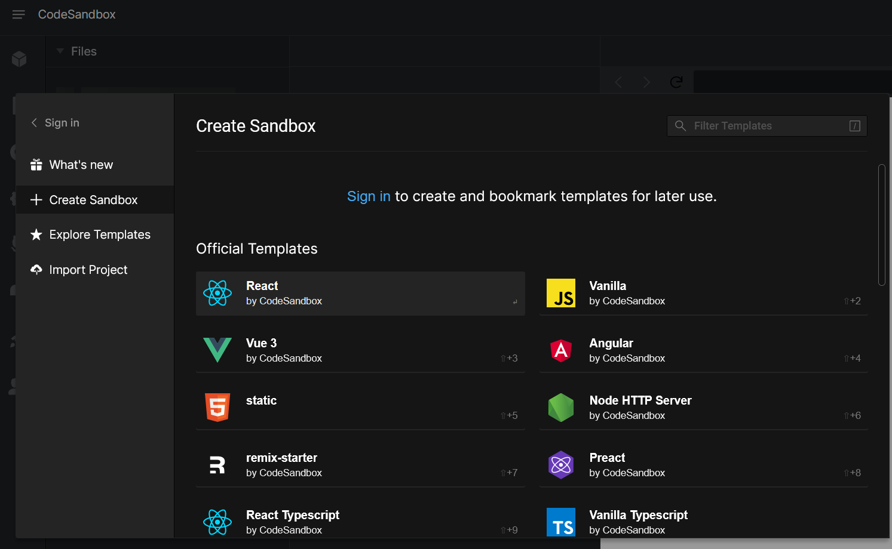
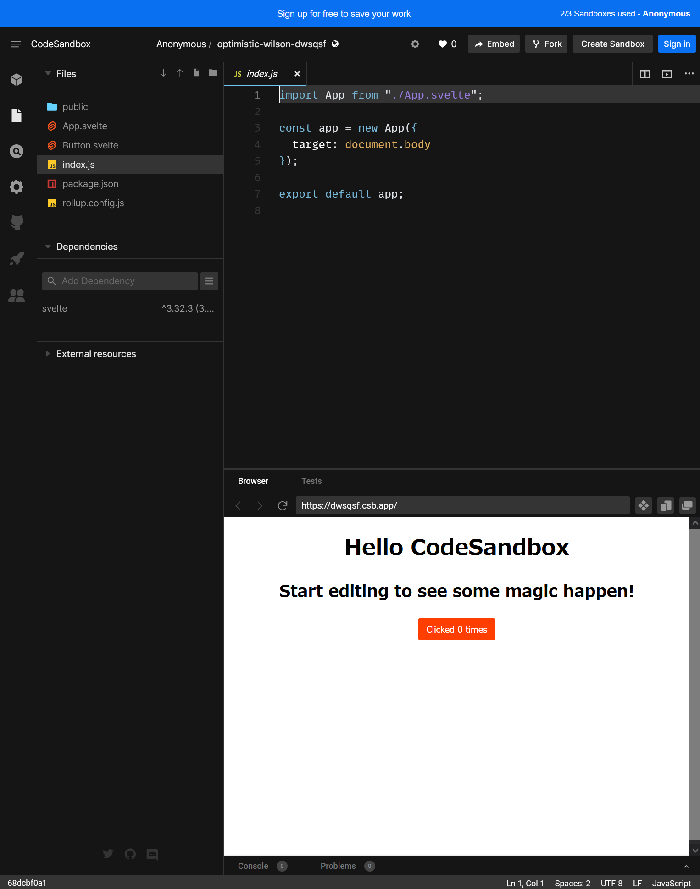

# Svelte を触ってみよう

## 事前準備

- [CodeSandbox](https://codesandbox.io/)というサービスを利用することで、適当なブラウザーさえ動けば学習できるようにします
    - CodeSandboxならローカルにエクスポートしたプロジェクトをそのまま動作させることができる。「後で自分の環境にNode.jsをちゃんと入れて試したい！」という時も安心
    - 万が一利用できない状況だった場合は[StackBlitz](https://stackblitz.com/)か[Svelte公式のREPL](https://svelte.jp/repl/)を利用します

## Svelte とは

[日本語の公式サイト](https://svelte.jp/)

> Svelteはユーザーインタフェースを構築する先鋭的で新しいアプローチです。ReactやVueのような 従来のフレームワークがその作業の大部分を ブラウザ で行うのに対し、 Svelteはその作業を アプリをビルドする際の コンパイル時 に行います。

- HTML・CSS・JavaScriptプラスアルファの構文で`.svelte`というファイルを書くと、いい感じなHTML・CSS・JavaScriptを生成してくれる！
- 生成したJavaScriptに含まれるランタイムライブラリーが少ない！
    - ユーザーがダウンロードするJavaScriptが軽い！
- 生成したHTML・CSS・JavaScriptはSvelte以外のフレームワークの中でも使える！
    - 「ちょっとずつSvelteに移植しよう！」「新しく追加する機能だけSvelte試してみよ！」みたいなことができる！
- 他のフレームワークよりも短く簡潔に書けることを重視
    - <https://svelte.jp/blog/write-less-code>

## 早速書こう

<!-- TODO: 特に他の開発環境を使った場合の説明は本文では行いませんが、万が一CodeSandboxが使えない場合でも頑張ってカバーできるよう、手順くらいは確認すること！ -->

[CodeSandboxのプロジェクト作成ページ](https://codesandbox.io/s)に移動します:



少しスクロールすると出てくる、下記のような「Svelte by CodeSandbox」と書かれた箇所をクリックすると、テンプレートから動作するアプリがすぐに作成されます！


CodeSandboxのSvelteテンプレートで作成したプロジェクト（初期状態）:



利用した開発環境にもよって変わりますが、CodeSandboxを使って上記👆のスクリーンショットにした状態について、画面上にあるものを解説します:

- 画面左上にあるのが、プロジェクトにあるファイルの一覧です。CodeSandboxもStackBlitzも、おなじみVisual Studio Codeをブラウザー上で動かすことで実現しています
- 画面真ん中上に表示されているのが、今開いているファイルを編集する画面です。今開いているファイル（index.jsかmain.js）では、`App.svelte`というファイルに書かれたコンポーネント（後述）を指定した要素に適用しています
    - ※Svelte REPLの場合初期状態で開かれているのはApp.svelte
- 画面真ん中下に表示されているのが、作成したアプリケーションを実行している画面です。編集画面でファイルを変更・保存する度に更新され、都度動作確認できます

### チェックポイント

- CodeSandboxなどのブラウザー上で動く開発環境を利用して、Svelte製のアプリケーションをテンプレートから作成できた
- CodeSandboxなどのブラウザー上で動く開発環境について、画面にあるものを大まかに理解できた

## その1 ほぼただのHTML

```svelte
<h1>Hello IIJ Bootcamp!</h1>
```

## その2 変数の中身を表示

```svelte
<script>
    let name = "<誰か適当に挨拶したい人>";
</script>

<h1>Hello {name}!</h1>
```

## その3 イベントハンドラーを設定

```svelte
<script>
    function clicked() {
        alert("押しましたね！？");
    }
</script>

<button on:click={clicked}>
ぼたん
</button>
```

## その4 変数が変わったらHTMLの中身も変わる

```svelte
<script>
    let count = 0;
    function incrementCount() {
        count += 1;
    }
</script>

<button on:click={incrementCount}>
{count}回押しました！
</button>
```

## その5 変数が変わる度に実行される宣言・文

```svelte
<script>
    let count = 0;
    function incrementCount() {
        count += 1;
    }

    $: plus4 = count + 4;
    $: console.log("変数が変わった！", { plus4, count });
</script>

<button on:click={incrementCount}>
{count}
</button>
+ 4 = {plus4} だ！
```

## その6 コンポーネントの分割

「3の倍数でアホになるボタン」作りに向けて

数値を与えると表示するボタン

NabeatsuButton.svelte:

```svelte
<script>
    export let count;
</script>
<button>
{count}
</button>
```

ボタンを使用するアプリ

App.svelte:

```svelte
<script>
    import NabeatsuButton from './NabeatsuButton.svelte';

    let count = 0;
    function incrementCount() {
        count += 1;
    }
</script>
<!-- <NabeatsuButton count={count}/> -->
<NabeatsuButton {count}/>
```

## その7 コンポーネントにイベントハンドラー

数値を与えると表示するボタン

NabeatsuButton.svelte:

```svelte
<script>
    export let count;
    export let onClick;
</script>
<button on:click={onClick}>
{count}
</button>
```

ボタンを使用するアプリ

App.svelte:

```svelte
<script>
    import NabeatsuButton from './NabeatsuButton.svelte';

    let count = 1;
    function incrementCount() {
        count += 1;
    }
</script>
<!-- <NabeatsuButton on:click={incrementCount} count={count}/> -->
<NabeatsuButton onClick={incrementCount} {count}/>
```

## その8 コンポーネントのロジック

「3の倍数でアホになる」ロジックの追加

※「3が含まれる数字」はやってみたい人だけがやる！

NabeatsuButton.svelte:

```svelte
<script>
    export let count;
    export let onClick;

    $: isAho = count % 3 == 0;
</script>
<button on:click={onClick}>
{#if isAho}
    ((●˚⺣˚)&lt;{count}!!
{:else}
    (・∀・)&lt;{count}
{/if}
</button>
```

どう「アホになる」かの例。他の方法でもアホっぽければよし:

- [[Python]12行で作る世界のナベアツプログラム｜ねこぐらまー｜note](https://note.com/hungair0925/n/ne9a67afed290)
- [【Python】世界のナベアツを完全(?)再現プログラミング - ymLogs](https://ymlogs.hateblo.jp/entry/2020/08/23/035917)

## その9 コンポーネントの中に閉じたstyle

アホになる時だけイタリック体にする

NabeatsuButton.svelte:

```svelte
<script>
    export let count;
    export let onClick;

    $: isAho = count % 3 == 0;
</script>
<style>
    .aho {
        font-style: italic;
    }
</style>
<!-- {...} の中には任意のJavaScriptの式が書ける。下記では三項演算子 -->
<button on:click={onClick} class={isAho ? "aho" : ""}>
{#if isAho}
    ((●˚⺣˚)&lt;{count}!!
{:else}
    (・∀・)&lt;{count}
{/if}
</button>
```

DevToolsを見て、`svelte-1ot19pz`のような、特別なクラスが追加されていることに注目

## その10 input要素からの入力を渡す

何の倍数で「アホになる」か設定できるようにしよう！

NabeatsuButton.svelte:

```svelte
<script>
    export let count;
    export let divisor;
    export let onClick;

    $: isAho = count % divisor == 0;
</script>
<style>
    .aho {
        font-style: italic;
    }
</style>
<button on:click={onClick} class={isAho ? "aho" : ""}>
{#if isAho}
    ((●˚⺣˚)&lt;{count}!!
{:else}
    (・∀・)&lt;{count}
{/if}
</button>
```

App.svelte:

```svelte
<script>
    import NabeatsuButton from './NabeatsuButton.svelte';

    let count = 1;
    function incrementCount() {
        count += 1;
    }

    let divisor = 3;
    function updateDivisor(event) {
        divisor = Number(event.target.value);
    }
</script>
<label>
    何の倍数でアホになる？:
    <input type="number" value={divisor} on:change={updateDivisor}/>
</label>
<br />
<NabeatsuButton onClick={incrementCount} {count} {divisor}/>
```

## その11 input要素からの入力を渡す: もっと簡単な方法

App.svelte:

```svelte
<script>
    import NabeatsuButton from './NabeatsuButton.svelte';

    let count = 1;
    function incrementCount() {
        count += 1;
    }

    let divisor = 3;
</script>
<label>
    何の倍数でアホになる？:
    <input type="number" bind:value={divisor}/>
</label>
<br />
<NabeatsuButton onClick={incrementCount} {count} {divisor}/>
```

話したい:

- [x] ローカル変数を紐付けられること（on-way binding）
    - <https://svelte.jp/tutorial/reactive-assignments>
    - <https://svelte.jp/tutorial/reactive-declarations>
    - <https://svelte.jp/tutorial/reactive-statements>
- [x] コンポーネントの分割
    - <https://svelte.jp/tutorial/declaring-props>
- [x] ロジック
    - <https://svelte.jp/tutorial/if-blocks>
    - <https://svelte.jp/tutorial/else-blocks>
- [x] `<style>`タグがローカルに
    - <https://svelte.jp/tutorial/styling>
- [x] two-way binding
    - <https://svelte.jp/tutorial/text-inputs>

3以外の数も指定できればtwo-way binding

<credit-footer/>
