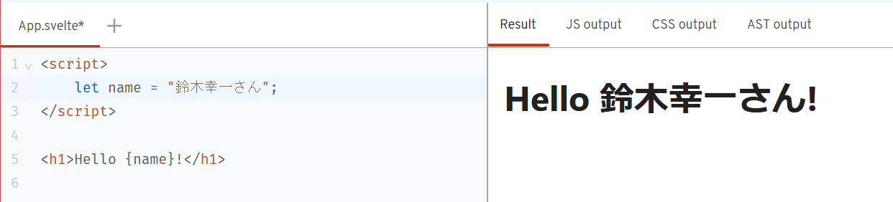
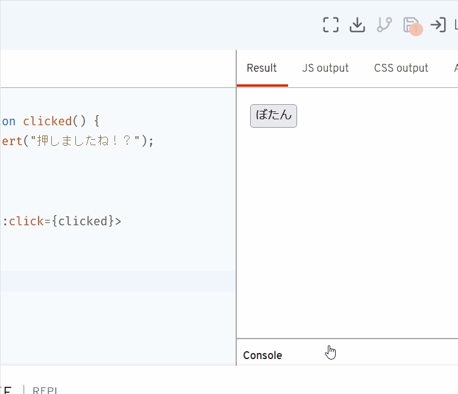
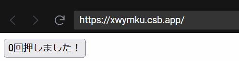
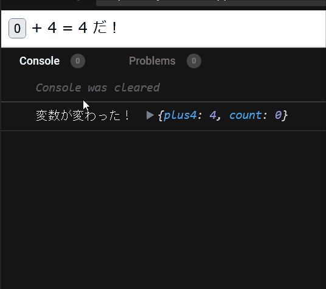
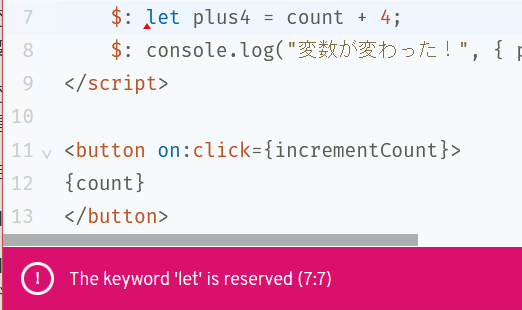

# Svelte を触ってみよう

## 事前準備

- [CodeSandbox](https://codesandbox.io/)というサービスを利用することで、適当なブラウザーさえ動けば学習できるようにします
    - CodeSandboxならローカルにエクスポートしたプロジェクトをそのまま動作させることができる。「後で自分の環境にNode.jsをちゃんと入れて試したい！」という時も安心
    - 万が一利用できない状況だった場合は[StackBlitz](https://stackblitz.com/)か[Svelte公式のREPL](https://svelte.jp/repl/)を利用します

## Svelte とは

[日本語の公式サイト](https://svelte.jp/)

> Svelteはユーザーインタフェースを構築する先鋭的で新しいアプローチです。ReactやVueのような 従来のフレームワークがその作業の大部分を ブラウザ で行うのに対し、 Svelteはその作業を アプリをビルドする際の コンパイル時 に行います。

- HTML・CSS・JavaScriptプラスアルファの構文で`.svelte`というファイルを書くと、いい感じなHTML・CSS・JavaScriptを生成してくれる！
- 生成したJavaScriptに含まれるランタイムライブラリーが少ない！
    - ユーザーがダウンロードするJavaScriptが軽い！
- 生成したHTML・CSS・JavaScriptはSvelte以外のフレームワークの中でも使える！
    - 「ちょっとずつSvelteに移植しよう！」「新しく追加する機能だけSvelte試してみよ！」みたいなことができる！
- 他のフレームワークよりも短く簡潔に書けることを重視
    - <https://svelte.jp/blog/write-less-code>

## 早速書こう

<!-- TODO: 特に他の開発環境を使った場合の説明は本文では行いませんが、万が一CodeSandboxが使えない場合でも頑張ってカバーできるよう、手順くらいは確認すること！ -->

[CodeSandboxのプロジェクト作成ページ](https://codesandbox.io/s)に移動します:


少しスクロールすると出てくる、下記のような「Svelte by CodeSandbox」と書かれた箇所をクリックすると、テンプレートから動作するアプリがすぐに作成されます！


CodeSandboxのSvelteテンプレートで作成したプロジェクト（初期状態）:


利用した開発環境にもよって変わりますが、CodeSandboxを使って上記👆のスクリーンショットにした状態について、画面上にあるものを解説します:

- 画面左上にあるのが、プロジェクトにあるファイルの一覧です。CodeSandboxもStackBlitzも、おなじみVisual Studio Codeをブラウザー上で動かすことで実現しています
- 画面真ん中上に表示されているのが、今開いているファイルを編集する画面です。今開いているファイル（`index.js`か`src/main.js`）では、`App.svelte`というファイルに書かれたコンポーネント（後述）を指定した要素に適用しています
    - ※Svelte REPLの場合初期状態で開かれているのはApp.svelte
- 画面真ん中下に表示されているのが、作成したアプリケーションを実行している画面です。編集画面でファイルを変更・保存する度に更新され、都度動作確認できます

### チェックポイント

- CodeSandboxなどのブラウザー上で動く開発環境を利用して、Svelte製のアプリケーションをテンプレートから作成できた
- CodeSandboxなどのブラウザー上で動く開発環境について、画面にあるものを大まかに理解できた

## その1 ほぼただのHTML

ここからは、`App.svelte`[^stackblitz-app-svelte]というファイルを編集することで、Svelteにおけるコンポーネントの作成方法を紹介します。

[^stackblitz-app-svelte]: StackBlitzの場合`src/App.svelte`

App.svelte:

```svelte
<h1>Hello IIJ Bootcamp!</h1>
```

Svelteのコンポーネントは、表示するHTML・CSSと、そのHTMLを操作するJavaScriptを独立して再利用可能な形で一つにまとめるファイルです。最も単純な（でもあまり役に立たない）コンポーネントは、上記のように表示するHTMLだけで構成されています。結果できあがるものはもちろん書いたタグの通りのHTMLです:


## その2 変数の中身を表示

次は、コンポーネントの中にJavaScriptのコードを書いて、JavaScriptのコードで設定した変数を、HTMLの中で表示させてみましょう:

App.svelte:

```svelte
<script>
    let name = "<誰か適当に挨拶したい人>";
</script>

<h1>Hello {name}!</h1>
```

`.svelte`ファイルでは`<script>`タグの中でコンポーネント専用のJavaScriptを書きます。`let <変数名> = ...`などの構文で定義した変数はHTML内で波括弧`{}`で囲うことで参照できます。もちろん`<誰か適当に挨拶したい人>`の箇所を適当な人の名前に変えて挨拶するのでも構いません。

例:



## その3 イベントハンドラーを設定

とはいえ、この時点ではまだ普通のHTMLを書くのと大して変わらず、つまらないでしょう。と、いうわけでイベントハンドラーを設定することで、HTMLで何かイベントが発生したとき初めて実行するJavaScriptを定義してみましょう。

App.svelte:

```svelte
<script>
    function clicked() {
        alert("押しましたね！？");
    }
</script>

<button on:click={clicked}>
ぼたん
</button>
```

`on:click`のように、`on:<イベント名>`という形式のHTMLの属性は、`.svelte`専用の属性で、Svelteは`on:<イベント名>`という属性で指定したJavaScriptの関数をイベントハンドラーとして設定してくれます[^existing-onclick]。

[^existing-onclick]: 標準のイベントハンドラー用の属性（`onclick`など）ではJavaScriptの式を直接文字列として指定する一方、`on:click`では実行するJavaScriptの関数を表す式を設定します。また、例における`clicked`や前述の`name`のように、コンポーネントの`<script>`で設定した変数や関数を参照できるのは、`on:click`などの属性のみとなっております。

動作例:



## チェックポイント

- HTMLとJavaScriptで、Svelteのコンポーネントを定義できた
- Svelteのコンポーネントの中では、`{... JavaScriptの式 ...}`という構文でJavaScriptの式を参照することを理解できた
- Svelteのコンポーネントにおいてイベントハンドラーを設定するときは、`on:<イベント名>`という名前の属性を用いることを理解できた

## その4 変数が変わったらHTMLの中身も変わる

ここまでで紹介したSvelteの機能は、実はSvelteを使わない、普通のJavaScriptだけでも容易に実現できます。ここからはそれでは難しい、Svelteなら簡単に実装できる機能を学習しましょう。

App.svelte:

```svelte
<script>
    let count = 0;
    function incrementCount() {
        count += 1;
    }
</script>

<button on:click={incrementCount}>
{count}回押しました！
</button>
```

`<script>`において`let`で定義した変数は、同じコンポーネントに書いたHTMLで`{... JavaScriptの式 ... }`という構文でアクセスできることは以前のステップで学びました。`<script>`において`let`で定義した変数はそれだけでなく、変数の中身を変えるとそれに合わせて`{...}`で参照している箇所も変える、ということもできます！

上記の例では、`button`をクリックすると`incrementCount`関数が呼び出されて、`count += 1`という式で変数`count`を書き換えます。するとSvelteのランタイムライブラリーが`count`を参照している箇所を自動で書き換えてくれます。なので、クリックする度に`{count}回押しました！`の`{count}`が、ボタンを押した回数に変わります！

動作例:



## その5 変数が変わる度に実行される宣言・文

`let`で定義した変数は、HTMLに書いたイベントハンドラーを契機に変更されると、HTMLにその変更を伝達するようになっていることを学びました。では、HTMLではなく、`<script>`に書いた任意のコードに、`let`で定義した変数の変更を伝達するにはどうすればよいでしょうか？例えばそれは、「`let`で定義したあの変数`x`に併せて変わる変数`y`を定義したい！[^computed]」とか、「`let`で定義したあの変数`z`が何かしら変わる度に中身を`console.log`で表示したい！」といった場合に最適です。そんな場合は、`$:`で始まる文を`<script>`に書きます:

[^computed]: Vue.jsの経験がある方へ: 要するにこれは、Vue.jsで言うところの「computed properties」に相当するものと考えて差し支えありません。

App.svelte:

```svelte
<script>
    let count = 0;
    function incrementCount() {
        count += 1;
    }

    $: plus4 = count + 4;
    $: console.log("変数が変わった！", { plus4, count });
</script>

<button on:click={incrementCount}>
{count}
</button>
+ 4 = {plus4} だ！
```

Svelteにおいて`$:`で始まる文は特別なサインです。`$: plus4 = count + 4;`のように、`$: 変数名 = <JavaScriptの式>;`という構文で定義した変数は、`<JavaScriptの式>`に含まれている`let`で定義した変数の変更に沿って変わります。`$: console.log("変数が変わった！", { plus4, count });`のように変数への代入を伴わなくとも、`$: JavaScriptの文`という構文で記述した文は、中で参照している変数が変更される度に実行されるようになります[^dollar]。

[^dollar]: 実は`$:...`という構文は、SvelteがJavaScriptに新しく加えた構文ではありません。JavaScript標準の機能である[ラベル付きの文](https://developer.mozilla.org/ja/docs/Web/JavaScript/Reference/Statements/label)を流用し、`$`という名前のラベルが付いた文を特別扱いすることにしたのです。

動作例:



⚠️なお、`plus4`のような変数を定義する際、次のように`let`を使用してもうまく動きません:

間違った例:

```svelte
<script>
... 省略 ...
    let plus4 = count + 4;
... 省略 ...
</script>

... 省略 ...
```

Svelteにおける`let 変数名 = ...`の`...`に書く式は、あくまでも`変数名`の変数に対するデフォルトの値です。そのため、コンポーネントを**作る時だけ**しか評価されません。なので、`let plus4 = count + 4;`と書いた場合は`count`を更新しても`plus4`は更新されないのでご注意ください。

それから、`$: let plus4 = ...`と書いてもいけません。構文エラーになってしまいます:

エラーの例:



## チェックポイント

- Svelteのコンポーネントで`let`を使って定義した変数は、値が変わる毎にHTML内で参照している箇所にも変更が伝わる
- `<script>`の中でも、`$: ...`という構文を使えば、`let`で定義した変数の変更に併せて文を実行できる

## その6 コンポーネントの分割

「3の倍数でアホになるボタン」作りに向けて

数値を与えると表示するボタン

NabeatsuButton.svelte:

```svelte
<script>
    export let count;
</script>
<button>
{count}
</button>
```

ボタンを使用するアプリ

App.svelte:

```svelte
<script>
    import NabeatsuButton from './NabeatsuButton.svelte';

    let count = 0;
    function incrementCount() {
        count += 1;
    }
</script>
<!-- <NabeatsuButton count={count}/> -->
<NabeatsuButton {count}/>
```

## その7 コンポーネントにイベントハンドラー

数値を与えると表示するボタン

NabeatsuButton.svelte:

```svelte
<script>
    export let count;
    export let onClick;
</script>
<button on:click={onClick}>
{count}
</button>
```

ボタンを使用するアプリ

App.svelte:

```svelte
<script>
    import NabeatsuButton from './NabeatsuButton.svelte';

    let count = 1;
    function incrementCount() {
        count += 1;
    }
</script>
<!-- <NabeatsuButton on:click={incrementCount} count={count}/> -->
<NabeatsuButton onClick={incrementCount} {count}/>
```

## その8 コンポーネントのロジック

「3の倍数でアホになる」ロジックの追加

※「3が含まれる数字」はやってみたい人だけがやる！

NabeatsuButton.svelte:

```svelte
<script>
    export let count;
    export let onClick;

    $: isAho = count % 3 == 0;
</script>
<button on:click={onClick}>
{#if isAho}
    ((●˚⺣˚)&lt;{count}!!
{:else}
    (・∀・)&lt;{count}
{/if}
</button>
```

どう「アホになる」かの例。他の方法でもアホっぽければよし:

- [[Python]12行で作る世界のナベアツプログラム｜ねこぐらまー｜note](https://note.com/hungair0925/n/ne9a67afed290)
- [【Python】世界のナベアツを完全(?)再現プログラミング - ymLogs](https://ymlogs.hateblo.jp/entry/2020/08/23/035917)

## その9 コンポーネントの中に閉じたstyle

アホになる時だけイタリック体にする

NabeatsuButton.svelte:

```svelte
<script>
    export let count;
    export let onClick;

    $: isAho = count % 3 == 0;
</script>
<style>
    .aho {
        font-style: italic;
    }
</style>
<!-- {...} の中には任意のJavaScriptの式が書ける。下記では三項演算子 -->
<button on:click={onClick} class={isAho ? "aho" : ""}>
{#if isAho}
    ((●˚⺣˚)&lt;{count}!!
{:else}
    (・∀・)&lt;{count}
{/if}
</button>
```

DevToolsを見て、`svelte-1ot19pz`のような、特別なクラスが追加されていることに注目

## その10 input要素からの入力を渡す

何の倍数で「アホになる」か設定できるようにしよう！

NabeatsuButton.svelte:

```svelte
<script>
    export let count;
    export let divisor;
    export let onClick;

    $: isAho = count % divisor == 0;
</script>
<style>
    .aho {
        font-style: italic;
    }
</style>
<button on:click={onClick} class={isAho ? "aho" : ""}>
{#if isAho}
    ((●˚⺣˚)&lt;{count}!!
{:else}
    (・∀・)&lt;{count}
{/if}
</button>
```

App.svelte:

```svelte
<script>
    import NabeatsuButton from './NabeatsuButton.svelte';

    let count = 1;
    function incrementCount() {
        count += 1;
    }

    let divisor = 3;
    function updateDivisor(event) {
        divisor = Number(event.target.value);
    }
</script>
<label>
    何の倍数でアホになる？:
    <input type="number" value={divisor} on:change={updateDivisor}/>
</label>
<br />
<NabeatsuButton onClick={incrementCount} {count} {divisor}/>
```

## その11 input要素からの入力を渡す: もっと簡単な方法

App.svelte:

```svelte
<script>
    import NabeatsuButton from './NabeatsuButton.svelte';

    let count = 1;
    function incrementCount() {
        count += 1;
    }

    let divisor = 3;
</script>
<label>
    何の倍数でアホになる？:
    <input type="number" bind:value={divisor}/>
</label>
<br />
<NabeatsuButton onClick={incrementCount} {count} {divisor}/>
```

<credit-footer/>
