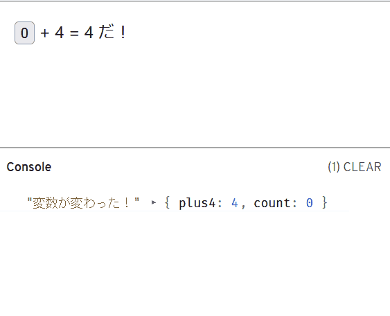
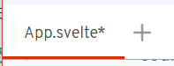
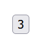

# Svelte を触ってみよう

## 前提知識

- JavaScriptの基本的な構文
    - [素のJavaScript + DOM入門](../dom/)などで学習しておくことを推奨します。ただ、[素のJavaScript + DOM入門](../dom/)で取り上げていないJavaScriptの構文が一部含まれる点をご容赦ください。
- HTMLとCSSについての少しの知識

## 事前準備

- [Svelte公式のREPL](https://svelte.jp/repl/)を利用するので、適当なブラウザーさえ動けば学習できます
    - ローカルにエクスポートしたプロジェクトをそのまま動作させることができる。「後で自分の環境にNode.jsをちゃんと入れて試したい！」という時も安心
        - ⚠️手元で確認したところ、残念ながらエクスポートしたファイルに日本語を入力していると、日本語の部分が文字化けしてしまうようです。
    - 同じようなことは[CodeSandbox](https://codesandbox.io/)や[StackBlitz](https://stackblitz.com/)でも出来ますが、現状アカウントの作成が必要なようなのでより簡単なSvelte公式のREPLを採用しました
    - 万が一利用できない状況だった場合は[PLAYCODE](https://playcode.io/)を利用します

## Svelte とは

[日本語の公式サイト](https://svelte.jp/)の[チュートリアル](https://learn.svelte.jp/tutorial/welcome-to-svelte)冒頭より:

> Svelte は、web アプリケーションを構築するためのツールです。他のユーザーインターフェースフレームワークと同様、マークアップ(markup)、スタイル(styles)、振る舞い(behaviours) を組み合わせたコンポーネントでアプリを *宣言的(declaratively)* に構築することができます。
>
> これらのコンポーネントは小さくて効率的な JavaScript モジュールに *コンパイル* されるため、従来の UI フレームワークには付き物だったオーバーヘッドがありません。
>
> アプリ全体を Svelte で作ることもできますし（中略）、既存のコードベースに部分的/段階的に追加することもできます。また、どんな場所でも機能するスタンドアロンパッケージとしてコンポーネントを配布することもできます。

- HTML・CSS・JavaScriptプラスアルファの構文で`.svelte`というファイルを書くと、いい感じなHTML・CSS・JavaScriptを生成してくれる！
- 生成したJavaScriptに含まれるランタイムライブラリーが少ない！
    - ユーザーがダウンロードするJavaScriptが軽い！
- 生成したHTML・CSS・JavaScriptはSvelte以外のフレームワークの中でも使える！
    - 「ちょっとずつSvelteに移植しよう！」「新しく追加する機能だけSvelte試してみよ！」みたいなことができる！
- 他のフレームワークよりも短く簡潔に書けることを重視
    - <https://svelte.jp/blog/write-less-code>

## おことわり: Svelte 4の知識を紹介しています

実は近々Svelte 5が出ることが発表されています（[参考](https://svelte.dev/blog/svelte-5-release-candidate)）。Svelte 5は今回紹介するSvelte 4より大幅に**構文が変わってしまいます**が、まだリリース候補までしかリリースされていないことや、Svelte 4と基本的な考え方は変わらないと言う点を考慮し、ここではSvelte 4を取り上げます。

## 早速書こう

[Svelte公式のREPL](https://svelte.jp/repl/)に移動すると、直ちに動作するアプリができます！


ℹ️ブラウザーをダークテーマに設定していると、SvelteのREPLもダークテーマになるので、上記とは色合いが大幅に異なります。

利用した開発環境によって変わりますが、Svelte REPLを使って上記👆のスクリーンショットにした状態について、画面上にあるものを解説します:

- 画面左側がエディターです。上部の「App.svelte」と書かれている箇所が現在開いているファイルの名前で、右隣の「+」ボタンを押すと新しいファイルが作れます
    - お手元のブラウザーのタブ機能などと似たようなものなので、特に使うのは難しくないでしょう
- 画面右側に、エディターで入力した結果のアプリケーションが表示されます
    - 編集画面でファイルを変更・保存する度に更新され、都度動作確認できます
    - `console.log`で出力した情報を右下の「Console」ですぐに閲覧できるようにもなっています

### 🚩チェックポイント

- SvelteのREPLなどのブラウザー上で動く開発環境を利用して、Svelte製のアプリケーションをテンプレートから作成できた
- SvelteのREPLなどのブラウザー上で動く開発環境について、画面にあるものを大まかに理解できた

## その1 ほぼただのHTML

ここからは、`App.svelte`というファイルを編集することで、Svelteにおけるコンポーネントの作成方法を紹介します。

App.svelte:

```html
<h1>Hello IIJ Bootcamp!</h1>
```

Svelteのコンポーネントは、表示するHTML、CSSと、そのHTML（を表すDOMツリー）を操作するJavaScriptを、独立して再利用可能な形で一つにまとめたファイルです。最も単純な（でもあまり役に立たない）コンポーネントは、上記のように表示するHTMLだけで構成されています。結果できあがるものはもちろん書いたタグの通りのHTMLです:


## その2 変数の中身を表示

次は、コンポーネントの中にJavaScriptのコードを書いて、JavaScriptのコードで設定した変数を、HTMLの中で表示させてみましょう:

App.svelte:

```html
<script>
    let name = "<誰か適当に挨拶したい人>";
</script>

<h1>Hello {name}!</h1>
```

`.svelte`ファイルでは`<script>`タグの中でコンポーネント専用のJavaScriptを書きます。`let [変数名] = ...`などの構文で定義した変数はHTML内で波括弧`{}`で囲うことで参照できます。もちろん`<誰か適当に挨拶したい人>`の箇所を適当な人の名前に変えて挨拶するのでも構いません。

例:


## その3 イベントハンドラーを設定

とはいえ、この時点ではまだ普通のHTMLを書くのと大して変わらず、つまらないでしょう。と、いうわけでイベントハンドラーを設定することで、HTMLで何かイベントが発生したとき初めて実行するJavaScriptを定義してみましょう。

App.svelte:

```html
<script>
    function clicked() {
        alert("押しましたね！？");
    }
</script>

<button on:click={clicked}>
ぼたん
</button>
```

`on:click`のように、`on:[イベント名]`という形式のHTMLの属性は、`.svelte`専用の属性で、Svelteは`on:[イベント名]`という属性で指定したJavaScriptの関数をイベントハンドラーとして設定してくれます。

:::details
標準のイベントハンドラー用の属性（`onclick`など）ではJavaScriptの式を直接文字列として指定する一方、`on:click`では実行するJavaScriptの関数を表す式を設定します。また、例における`clicked`や前述の`name`のように、コンポーネントの`<script>`で設定した変数や関数を参照できるのは、`on:click`などの属性のみとなっております。
:::

動作例:


## 🚩ここまでにできたこと

- HTMLとJavaScriptで、Svelteのコンポーネントを定義できた
- Svelteのコンポーネントの中では、`{... JavaScriptの式 ...}`という構文でJavaScriptの式を参照することを理解できた
- Svelteのコンポーネントにおいてイベントハンドラーを設定するときは、`on:[イベント名]`という名前の属性を用いることを理解できた

## その4 変数が変わったらHTMLの中身も変わる

ここまでで紹介したSvelteの機能は、実はSvelteを使わない、普通のJavaScriptだけでも容易に実現できます。ここからはそれでは難しい、Svelteなら簡単に実装できる機能を学習しましょう。

App.svelte:

```html
<script>
    let count = 0;
    function incrementCount() {
        count += 1;
    }
</script>

<button on:click={incrementCount}>
{count}回押しました！
</button>
```

`<script>`において`let`で定義した変数は、同じコンポーネントに書いたHTMLで`{... JavaScriptの式 ... }`という構文でアクセスできることは以前のステップで学びました。`<script>`において`let`で定義した変数はそれだけでなく、変数の中身を変えるとそれに合わせて`{...}`で参照している箇所も変える、ということもできます！

上記の例では、`button`をクリックすると`incrementCount`関数が呼び出されて、`count += 1`という式で変数`count`を書き換えます。するとSvelteのランタイムライブラリーが`count`を参照している箇所を自動で書き換えてくれます。なので、クリックする度に`{count}回押しました！`の`{count}`が、ボタンを押した回数に変わります！

動作例:


## その5 変数が変わる度に実行される宣言・文

`let`で定義した変数は、HTMLに書いたイベントハンドラーを契機に変更されると、HTMLにその変更を伝達するようになっていることを学びました。では、HTMLではなく、`<script>`に書いた任意のコードに、`let`で定義した変数の変更を伝達するにはどうすればよいでしょうか？例えばそれは、「`let`で定義したあの変数`x`に併せて変わる変数`y`を定義したい！（※）」とか、「`let`で定義したあの変数`z`が何かしら変わる度に中身を`console.log`で表示したい！」といった場合に最適です。そんな場合は、`$:`で始まる文を`<script>`に書きます:

::: details Vue.jsの経験がある方へ
「`let`で定義したあの変数`x`に併せて変わる変数`y`を定義したい！」を実現する機能は、要するにVue.jsで言うところの「computed properties」に相当するものと考えて差し支えありません。
:::

App.svelte:

```html
<script>
    let count = 0;
    function incrementCount() {
        count += 1;
    }

    $: plus4 = count + 4;
    $: console.log("変数が変わった！", { plus4, count });
</script>

<button on:click={incrementCount}>
{count}
</button>
+ 4 = {plus4} だ！
```

Svelteにおいて`$:`で始まる文は特別なサインです。`$: plus4 = count + 4;`のように、`$: [変数名] = [JavaScriptの式];`という構文で定義した変数は、`[JavaScriptの式]`に含まれている`let`で定義した変数の変更に沿って変わります。`$: console.log("変数が変わった！", { plus4, count });`のように変数への代入を伴わなくとも、`$: JavaScriptの文`という構文で記述した文は、中で参照している変数が変更される度に実行されるようになります。

::: details $: ... について
実は`$: ...`という構文は、SvelteがJavaScriptに新しく加えた構文ではありません。JavaScript標準の機能である[ラベル付きの文](https://developer.mozilla.org/ja/docs/Web/JavaScript/Reference/Statements/label)を流用し、`$`という名前のラベルが付いた文を特別扱いすることにしたのです。
:::

動作例:



⚠️なお、`plus4`のような変数を定義する際、次のように`let`を使用してもうまく動きません:

間違った例:

```html
<script>
... 省略 ...
    let plus4 = count + 4;
... 省略 ...
</script>

... 省略 ...
```

Svelteにおける`let [変数名] = ...`の`...`に書く式は、あくまでも`変数名`の変数に対するデフォルトの値です。そのため、コンポーネントを**作る時だけ**しか評価されません。なので、`let plus4 = count + 4;`と書いた場合は`count`を更新しても`plus4`は更新されないのでご注意ください。

それから、`$: let plus4 = ...`と書いてもいけません。構文エラーになってしまいます:

エラーの例:


## 🚩ここまでにできたこと

- コンポーネントにおいて`let`を使って定義した変数について、値を変える毎にHTML内で参照している箇所に変更を伝えることができた
- `<script>`の中でも`$: ...`という構文を使うことで、`let`で定義した変数の変更に併せて文を実行できた

## その6 コンポーネントの分割

ここからは、ボタンを押した回数が「3の倍数のときだけアホになるボタン」というコンポーネントを、いくつかのステップに分けて作ってみましょう。まずは一つの`.svelte`ファイルに書いていたコンポーネントを、別の`.svelte`ファイルに分割する方法を紹介します。

コンポーネントを分割する方法を説明するため、ここまで編集した`App.svelte`とは別に新しいファイルを作成してください。「App.svelte」と書かれているすぐ隣の「+」ボタンを押すと、新しいファイルができます:



続けてファイル名の入力を求められるので、今回は`NabeatsuButton.svelte`にして（最終的に「3の倍数のときだけアホになるボタン」にするので）、<kbd>Enter</kbd>を押してください。

ファイルができたら、内容は次のようにしてください:

NabeatsuButton.svelte:

```html
<script>
    export let count;
</script>
<button>
{count}
</button>
```

`export let count;`という文は、新しい構文を使っています。Svelteにおいて、`export let [変数名];`で宣言した変数は「プロパティー」と見なされ、宣言した変数を含むコンポーネントを**利用する側**が設定できるようになります（具体的にどう設定するかは後ほど）。

つまり、上記のコンポーネントは、`count`というプロパティーを`<button>`タグで表示する、ただそれだけのものです。これに追々機能を追加して、「3の倍数のときだけアホになるボタン」を作っていきます。

次は、いよいよ新しく作ったコンポーネント`NabeatsuButton.svelte`を実際に使用しましょう:

App.svelte:

```html
<script>
    import NabeatsuButton from './NabeatsuButton.svelte';
</script>
<NabeatsuButton count={3}/>
```

Svelteのコンポーネントを別のコンポーネントから参照する場合、普通のJavaScriptにおける`import`文を使用します。`import [インポートする側で使用する名前] from '[インポートするファイルの名前]';`という構文ですね（※1）。このように書いた上で、`<[インポートする側で使用する名前]/>`と書くと、該当の箇所がインポートしたコンポーネントのHTMLで置き換わります。`[インポートする側で使用する名前]`という名前の新しいHTMLタグが作成されるイメージで捉えてください（※2）。

::: details 注釈
（※1）: インポートするファイル名における拡張子`.svelte`は特に付けなくてもいいようですが、慣習上付けることが多いようなのでこのドキュメントでも付けることにします。

（※2）: このような構文のため、普通のHTMLのタグと区別できるよう、インポートしたコンポーネントの名前は必ず大文字で始めることになっています。ちなみにこれはSvelteだけでなく、ReactやVue.jsにおいても同様のルールがあります。
:::

そして、`<NabeatsuButton count={3}/>`の`count={3}`という箇所が、`NabeatsuButton`コンポーネントのプロパティーを設定している箇所です。先ほど`export let`した`count`という名前が出てきました！ちょうどHTMLタグで属性を設定するがごとく、`[プロパティー名]=[値]`という構文で、指定したコンポーネントのプロパティーを設定することができます。`{3}`のように、`[値]`の箇所で`{... JavaScriptの式 ...}`の構文を使っているのは、HTMLの属性値が本来文字列しかサポートしていない関係で、単に`count=3`と書くと「3」という文字列が渡ってしまうからです。

動作例:



まだまだこれだけでは面白くないですね。どんどん次に行きましょう！

## その7 コンポーネントにイベントハンドラー

前のステップで作成したアプリケーションでは、ボタンを押しても何も起こりません。というわけで今度は`NabeatsuButton`にイベントハンドラーを加えましょう:

NabeatsuButton.svelte:

```html
<script>
    export let count;
    export let onClick;
</script>
<button on:click={onClick}>
{count}
</button>
```

以前のステップで`App.svelte`に書いた`incrementCount`のような関数を直接`NabeatsuButton`に定義して`on:click`に設定してもよいのですが、ここでは敢えて`onClick`というプロパティーを追加することで、`NabeatsuButton`を使用する側でイベントハンドラーを設定することを求めています。これが必ずしもよい設計、というわけではありませんが、コンポーネントの役割を分担する際の一例として参考にしてください。

と、言うわけで早速`App.svelte`側でもイベントハンドラーを設定しましょう。以前使った`incrementCount`をそのまま利用します:

App.svelte:

```html
<script>
    import NabeatsuButton from './NabeatsuButton.svelte';

    let count = 0;
    function incrementCount() {
        count += 1;
    }
</script>
<NabeatsuButton count={count} onClick={incrementCount}/>
```

`NabeatsuButton`コンポーネントに渡しているプロパティー`count`は、`App`コンポーネントにおける変数`count`を参照しています。そのため、やはり`App`の中で`count`の値が変わった場合も`NabeatsuButton`にその変更が伝わり、`NabeatsuButton`が表示する値も変わるのです。

動作例:


## 🚩ここまでにできたこと

- `.svelte`ファイルを分けることで、コンポーネントを分割できた
- コンポーネントの中で`export let`することでプロパティーを定義し、利用する側で具体的な値を設定できた

## その8 コンポーネントのロジック

そろそろ、「Nabeatu」らしく「3の倍数でアホになる」ロジックを`NabeatsuButton`に加えましょう。なお「3が含まれる数字」という条件についてはやってみたい人だけがやってください。ここでは割愛します。

「アホになる」ためには表示するHTMLの内容でアホになったことを表すのが適当でしょう。従って「アホになる」場合とそうでない場合を、HTMLの中で分岐する必要がありますね。そこで出てくるのがSvelteの`{#if [JavaScriptの式]}` ... `{:else}` ... `{/if}`という構文です:

NabeatsuButton.svelte:

```html
<script>
    export let count;
    export let onClick;

    $: isAho = count % 3 == 0;
</script>
<button on:click={onClick}>
{#if isAho}
    ((●˚⺣˚)&lt;{count}!!
{:else}
    (・∀・)&lt;{count}
{/if}
</button>
```

上記のように書き換えた`NabeatsuButton`では、`isAho`変数の値が`true`であるか`false`であるかによって、`<button>`タグで表示する内容を切り替えています。下記のifブロックという構文を使うことで、`isAho`が`true`であれば`((●˚⺣˚)<{count}!!`、`false`であれば`(・∀・)<{count}`を表示します（`<`が`&lt;`に置き換えられているのにご注意ください）。

```
{#if [JavaScriptの式]}
    [trueの場合に表示する内容]
{:else}
    [falseの場合に表示する内容]
{/if}
```

なお、どう「アホになる」かについては、[[Python]12行で作る世界のナベアツプログラム｜ねこぐらまー｜note](https://note.com/hungair0925/n/ne9a67afed290)からアイディアを拝借しました。もちろん他の方法で「アホになる」のでも構いません。「ナベアツ プログラミング」で検索すれば他にも出てくるので参考にしてみるのもよいでしょう。

動作例:


## 🚩ここまでにできたこと

- `{#if [JavaScriptの式]}` ... `{:else}` ... `{/if}`という構文を使って、JavaScriptの値に応じてHTMLの中身を切り替えることができた

## その9 コンポーネントの中に閉じたstyle

せっかくHTMLを使っているのですから、「アホになる」時の見た目をもっといじってみましょう。見た目をいじる、といえばCSSです。Svelteのコンポーネントでは、`<style>`タグの中にCSSを記述すると、コンポーネントの中にしか影響しないCSSが書けます。

以下は「アホになる」時だけ斜字体にする例ですが、みなさんの好みでもっとド派手🤡な見た目にしてもよいでしょう:

NabeatsuButton.svelte:

```html
<script>
    export let count;
    export let onClick;

    $: isAho = count % 3 == 0;
</script>
<style>
    .aho {
        font-style: italic;
    }
</style>
<button on:click={onClick} class={isAho ? "aho" : ""}>
{#if isAho}
    ((●˚⺣˚)&lt;{count}!!
{:else}
    (・∀・)&lt;{count}
{/if}
</button>
```

上記の例では`aho`というクラスを作成して、`<style>`では`aho`クラスが充てられた要素の文字が斜字体（`font-style: italic`）になるよう設定しています。そして、`isAho`が`true`の場合、つまり`count`が3の倍数の時は`button`要素の`class`属性に`aho`が設定することで、3の倍数の時だけ見た目が変わるようにしています。`{...}`の中には任意のJavaScriptの式が書けるので、上記では三項演算子を使って`class`属性の中身を記述しているんですね。

もちろん、下記のように書き換えても問題ありません:

```html
... 省略 ...
{#if isAho}
<button on:click={onClick} class="aho">
    ((●˚⺣˚)&lt;{count}!!
</button>
{:else}
<button on:click={onClick}>
    (・∀・)&lt;{count}
</button>
{/if}
```

::: tip
ここでは割愛しますが実際のところ、Svelteで要素の`class`属性を設定する方法にはもっと簡潔な方法があります。詳細は[公式のドキュメント](https://svelte.jp/docs#template-syntax-element-directives-class-name)をご覧ください。
:::

動作例:


さて、Svelteのコンポーネントにおける`<style>`の使い方はこれだけなんですが、実は他にも知っておくべき重要なポイントがあります。作成した`NabeatsuButton`コンポーネントが持つ、`<button>`要素を右クリックして、Developer Toolsを起動してください。Chromeでは「検証」、Edgeでは「開発者ツールで調査する」、Firefoxでは「検証」をクリックすれば起動します。

すると、`<button>`要素の`class`属性に`aho`の他`svelte-1ot19pz`のような、`svelte-`で始まる見慣れないクラスも付与されているのが分かるでしょう:


更にDeveloper Toolsの画面右、`<button>`要素に適用されているCSSのルールの一覧を見ると、私たちが`<style>`タグに書いた`.aho`についてのルールが、`.aho.svelte-1ot19pz`のような、`<button>`に追加で適用された、`svelte-`で始まるクラスを付け加えたセレクターで置き換えられていることが分かるでしょう:


この、Svelteが自動で書き換えるセレクターにより、Svelteのコンポーネントで`<style>`に書いたCSSは、そのコンポーネントだけで有効になります。このようにしてSvelteは、コンポーネントが外に与える影響を最小化しているんですね。

## 🚩ここまでにできたこと

- Svelteのコンポーネントにおける`<style>`が、書いたコンポーネントだけに適用されることが分かった

## その10 input要素からの入力を渡す

このSvelteチュートリアルで勉強するSvelteの機能は、あと一つです。早速学びましょう... と言いたいところですが、その前にこれまでの復習を兼ねて、その機能を使わなかった場合にどれだけ煩雑になるかを確かめてみましょう。

例として、`NabeatsuButton`に新しいプロパティー、`divisor`を追加して、何の倍数で「アホになる」かを設定できるようにしましょう。`NabeatsuButton`がより多様なケースに対応できるようになりますね！

まずは`divisor`プロパティーを`NabeatsuButton`に追加した上で、これまで`3`の余りを計算していたところを`divisor`の余りを計算するよう書き換えます:

NabeatsuButton.svelte:

```html
<script>
    export let count;
    export let divisor;
    export let onClick;

    $: isAho = count % divisor == 0;
</script>
<style>
    .aho {
        font-style: italic;
    }
</style>
<button on:click={onClick} class={isAho ? "aho" : ""}>
{#if isAho}
    ((●˚⺣˚)&lt;{count}!!
{:else}
    (・∀・)&lt;{count}
{/if}
</button>
```

それから、`App`コンポーネントでは`NabeatsuButton`に渡す`divisor`と、`divisor`を設定する`<input>`要素を作ります:

App.svelte:

```html
<script>
    import NabeatsuButton from './NabeatsuButton.svelte';

    let count = 0;
    function incrementCount() {
        count += 1;
    }

    let divisor = 3;
    function updateDivisor(event) {
        divisor = Number(event.target.value);
    }
</script>
<label>
    何の倍数でアホになる？:
    <input type="number" value={divisor} on:change={updateDivisor}/>
</label>
<br />
<NabeatsuButton onClick={incrementCount} count={count} divisor={divisor}/>
```


新しく追加した`<input>`要素では、`value={divisor} on:change={updateDivisor}`と設定することで、`divisor`の値を常に表示しつつ`change`イベントのイベントハンドラーを設定し、`divisor`に`event.target.value`、つまり`<input>`に新しく入力された値をセットしています。

動作例:


## その11 input要素からの入力を渡す: もっと簡単な方法

前のステップでは、`<input>`要素の`value`属性で変数`divisor`を設定し、`change`イベントで`divisor`を更新する設定をしていました。このように、`<input>`要素に変数の値を表示して、`<input>`要素の内容が変わると変数にその値を反映させる、という変数の中身と`<input>`要素の値を相互に同期させる実装パターンは、とてもありふれています。なので、Svelteではこれを「双方向バインディング」という機能で簡単に実装できるようにしました。AngularやVueなど、他のフレームワークでも馴染み深い機能ではないかと思います。

「双方向バインディング」を使うとステップ10の`App`コンポーネントは、次のように生まれ変わります:

App.svelte:

```html
<script>
    import NabeatsuButton from './NabeatsuButton.svelte';

    let count = 0;
    function incrementCount() {
        count += 1;
    }

    let divisor = 3;
</script>
<label>
    何の倍数でアホになる？:
    <input type="number" bind:value={divisor}/>
</label>
<br />
<NabeatsuButton onClick={incrementCount} count={count} divisor={divisor}/>
```

`<input>`要素には`bind:value={divisor}`と書くだけでよくなり、`updateDivisor`のような`<input>`要素の値を`divisor`にセットするだけの関数もなくなりました！`bind:value={divisor}`は、対象の`<input>`要素の`value`属性と変数`divisor`を双方向に紐付ける（バインドする）ための設定です。紐付けた変数`divisor`の値を`value`属性で表示して、ユーザーの入力によって`value`属性が更新されたら`divisor`の値も更新し、また新たな値を`value`属性の値として表示する...という処理をこれ一つで賄ってくれます。

::: tip 補足
更にSvelteは気を遣ってくれまして、`type="number"`な`<input>`要素については、入力された値を自動で数値に変換した上で紐付けた変数に代入してくれます。
:::

動作例:

※ステップ10と同じなので省略

## 🚩ここまでにできたこと

- 「双方向バインディング」を使うことで、紐付けた変数と`<input>`要素の`value`属性の値を簡単に同期させることができた

## おわりに

Svelteの機能はまだまだたくさんあります。気になる方は、とてもうまく翻訳された[日本語のチュートリアル](https://learn.svelte.jp/tutorial/welcome-to-svelte)を軽く通してみるといいでしょう。

<credit-footer/>
