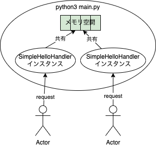

<header-table/>

# {{$page.frontmatter.title}}

## 環境準備

以下のdockerコマンドでコンソールを取得してください。

```terminal
$ docker pull iijrfujimoto/bootcamp_concurrent
$ mkdir bootcamp_work  # 作業用のディレクトリ。名前はなんでもいい
$ cd bootcamp_work
$ docker run --name bootcamp_concurrent -p 8000:8000 -v $PWD:/work --rm -it iijrfujimoto/bootcamp_concurrent /bin/bash
```

## この資料の約束

ターミナルでの実行例を示す際、以下のように`$`で始まっている場合はdockerを起動しているホスト側で実行するコマンドを示します。

```terminal
$ curl localhost:8000
```

以下のように`root@40e566b8e23e`などで示されている場合はdockerコンテナ上で実行するコマンドであることを示します。

```terminal
root@0dd4d9fad678:/work# python3 main.py
```

## このハンズオンの目的

このハンズオンでは、Webアプリケーションの実装に欠かせない「並行処理」について取り扱います。

プログラミングにおいて、同時に複数の処理を行う「並行処理」は複雑で実装が難しいものです。
それは・・・（実装が難しい理由を本から引用）

しかしユーザからの多数のリクエストに対応するため、Webアプリケーションに並行処理の実装は必須です。
昨今ではライブラリやフレームワークが発達し並行処理を意識しなくてもWebアプリケーションを作ることが可能ですが、
並行処理の勘所を理解せずに使うと思わぬバグや事故を起こす可能性があります。

このハンズオンではWebアプリケーションにおける並行処理実装の初歩的な注意点を紹介し、不具合を起こさないための知識を得てもらうことを目的としています。

::: tip 並行処理と並列処理

並行処理(concurrent processing)と並列処理(parallel processing)は似た言葉ですが異なる動作を指す言葉です。

- 並行処理: ある時間内に複数のタスクを処理すること
- 並列処理: 複数のタスクを「同時に」処理すること

「並行処理」と言う場合はある時間内に複数タスクを実行できればいいので、実行するタスクを小まめに切り替えながら処理する動作も含みます。
一方で「並列処理」の場合は複数のCPUコアによって全く同時に複数タスクを処理することを指します。

（参考: [Concurrency is not parallelism](https://go.dev/blog/waza-talk)）

:::

## ハンズオン

### 簡単な並行処理サンプル

まずはPythonで簡単なWebサーバを書いてみましょう。

vscode等を利用して作業用ディレクトリ(`bootcamp_work`)でPythonコードを書いていきましょう。

```termianl
$ vim main.py
```

```python
from http.server import BaseHTTPRequestHandler, ThreadingHTTPServer
import time

PORT = 8000

class SimpleHelloHandler(BaseHTTPRequestHandler):
  def do_GET(self):
    print('start processing path = {}'.format(self.path))

    time.sleep(5) # 何かの処理

    print('end processing path = {}'.format(self.path))

    self.send_response(200)
    self.send_header('Content-Type', 'text/plain; charset=utf-8')
    self.end_headers()
    self.wfile.write(b'Hello simple server!\n')

with ThreadingHTTPServer(("", PORT), SimpleHelloHandler) as httpd:
    print("serving at port", PORT)
    httpd.serve_forever()
```

保存したら、dockerコンテナ内からサーバを起動してみます。

```terminal
root@0dd4d9fad678:/work# python3 main.py
```

手元のホストから以下のようにcurlで叩いてみましょう。
「Hello simple server!」と返ってくれば成功です。

```terminal
$ curl localhost:8000
Hello simple server!
```

リクエストした直後、サーバー側のログに`start processing path = /`と表示されたことを覚えておいてください。

### メモリ空間の共有とレースコンディション

#### サンプルコード

先ほどのプログラムを少し改造して、今までのアクセス数をカウントできるようにしてみましょう。

```python
from http.server import BaseHTTPRequestHandler, ThreadingHTTPServer
import time

PORT = 8000

class SimpleHelloHandler(BaseHTTPRequestHandler):
    request_total = 0

    def count_and_do_something(self, path):
        t = SimpleHelloHandler.request_total
        print('start processing path = {}, before request count = {}'.format(path, t))

        time.sleep(5)  # 何かの処理

        t = t + 1
        print('end processing path = {}, after request count = {}'.format(path, t))

        SimpleHelloHandler.request_total = t

    def do_GET(self):
        self.count_and_do_something(self.path)

        self.send_response(200)
        self.send_header('Content-Type', 'text/plain; charset=utf-8')
        self.end_headers()
        self.wfile.write(b'Hello! request count=%a\n' % SimpleHelloHandler.request_total)

with ThreadingHTTPServer(("", PORT), SimpleHelloHandler) as httpd:
    print("serving at port", PORT)
    httpd.serve_forever()

```

以下のようにcurlを複数叩いてみます。`&`はコマンドをバックグラウンドで実行する書き方です。
先ほどはサーバ側が処理をする10秒間curlコマンドはずっと待っていましたが、`&`をつけることですぐに次のコマンドを叩けます。

```terminal
$ curl localhost:8000 &
$ curl localhost:8000 &
$ curl localhost:8000 &
```

さて結果はどうでしょうか。3回コマンドを実行しましたが、サーバのログは以下のようになったのではないでしょうか。

```terminal
serving at port 8000
start processing path = /, before request count = 0
start processing path = /, before request count = 0
start processing path = /, before request count = 0
end processing path = /, after request count = 1
end processing path = /, after request count = 1
end processing path = /, after request count = 1
```

きちんとリクエスト数をカウントできていない、重大な不具合があるようです。

#### コード解説

#### forkとthread

このプログラムではユーザからのリクエストを同時に処理するために [ThreadingHTTPServer](https://docs.python.org/ja/3/library/http.server.html#http.server.ThreadingHTTPServer) を利用しています。
ThreadingHTTPServer の説明を見てみましょう。

> This class is identical to HTTPServer but uses threads to handle requests by using the ThreadingMixIn.

どうやらリクエストを処理(handle)するために「スレッド」を利用するようです。
[ThreadingMixIn](https://docs.python.org/ja/3.7/library/socketserver.html#socketserver.ThreadingMixIn) の説明も見てみましょう。

> Forking and threading versions of each type of server can be created using these mix-in classes.

`fork`もしくは`thread`いずれかの仕組みで渡したServerオブジェクトを並列に実行してくれるようです。`fork`と`thread`は両方とも並列処理のための方法ですが、大きな違いがあります。




図の通り`fork`の場合forkで分かれたプロセス上で`SimpleHelloHandler`のインスタンスが実行されます。そのためリクエストを処理する各インスタンス間でメモリ空間を共有していません（できないとも言う）。
一方で`thread`の場合はメモリ空間を共有した同じプロセス内で`SimpleHelloHandler`インスタンスが実行されます。

今回`request_total`はクラス変数として宣言されています。そのため各`SimpleHelloHandler`インスタンスから共有するメモリ上の変数としてアクセスが可能です。
Webサーバを実装する時に限りませんが、ライブラリやフレームワークを利用する際にはそれがどういう仕組みで動くのか把握しておく必要があります。

#### クリティカルセッション

`count_and_do_something`の以下の部分に注目してみましょう（といっても中身全てですが）。

```python{2-10}
    def count_and_do_something(self, path):
        t = SimpleHelloHandler.request_total
        print('start processing path = {}, before request count = {}'.format(path, t))

        time.sleep(5)  # 何かの処理

        t = t + 1
        print('end processing path = {}, after request count = {}'.format(path, t))

        SimpleHelloHandler.request_total = t
```

上記2-10行目は`SimpleHelloHandler.request_total`という共有資源にアクセスしており、複数のスレッドから同時にアクセスされると不具合が起きます。このような箇所を「**クリティカルセクション**」と呼びます。
また実際にクリティカルセクションに複数のスレッドが同時にアクセスしてしまい、不具合が起きている状態を「**レースコンディション(競合状態)**」と呼びます。

スレッドなどを利用する並行処理プログラミングではこのクリティカルセクションを如何に減らし、そして保護するかが大切になります。

### 排他制御・アトミック処理

#### 排他制御

クリティカルセクションを保護する手法の一つが、ロックを取得する排他制御と呼ばれるものです。まずは素朴に実装してみましょう。
（説明用にすごく雑な実装なので間違っても仕事で以下のようなコードを書かないでください）

```python
from http.server import BaseHTTPRequestHandler, ThreadingHTTPServer
import time

PORT = 8000


class SimpleHelloHandler(BaseHTTPRequestHandler):
    request_total = 0
    request_total_lock = False

    def count_and_do_something(self, path):
        while True:
            if not SimpleHelloHandler.request_total_lock:  # request_total_lock がFalseになるまで無限ループする
                SimpleHelloHandler.request_total_lock = True  # ロックの取得
                break

        t = SimpleHelloHandler.request_total
        print('start processing path = {}, before request count = {}'.format(path, t))

        time.sleep(5)  # 何かの処理

        t = t + 1
        print('end processing path = {}, after request count = {}'.format(path, t))

        SimpleHelloHandler.request_total = t
        SimpleHelloHandler.request_total_lock = False  # 処理が完了したらロックを解放する

    def do_GET(self):
        self.count_and_do_something(self.path)

        self.send_response(200)
        self.send_header('Content-Type', 'text/plain; charset=utf-8')
        self.end_headers()
        self.wfile.write(b'Hello! request count=%a\n' % SimpleHelloHandler.request_total)


with ThreadingHTTPServer(("", PORT), SimpleHelloHandler) as httpd:
    print("serving at port", PORT)
    httpd.serve_forever()
```

サーバを実行してみてください。先ほどと同じようにcurlを実行するとどうでしょうか。

```terminal
$ curl localhost:8000 &
$ curl localhost:8000 &
$ curl localhost:8000 &
```

ここでは新しくクラス変数として`request_total_lock`を追加し、`count_and_do_something`の先頭でこの変数を検査しています。
`True`の場合は次のループに遷移し、無限に検査を繰り返します。`False`だった場合は`True`を代入しクリティカルセクションに入ります。
クリティカルセクションの終了後、`request_total_lock`に`False`を代入し、別のスレッドが実行できるようにします。

少しややこしいですが、複数のスレッド間の動作を順番に書くと以下のようになります。

1. 最初のリクエスト(thread1)が来て`count_and_do_something`が実行される
2. `request_total_lock`は`False`なのでthread1が`True`を代入してロックを取得する
3. 2個目のリクエスト(thread2)が来て`count_and_do_something`が実行される
4. `request_total_lock`は`True`なのでthread2は無限ループを続ける
5. thread1でクリティカルセクションが完了し、`request_total_lock`に`False`が代入される
6. thread2がロックを取得し、クリティカルセクションを開始する

このロック機構によりクリティカルセクションが保護され、`request_total`が正しくカウントされるようになりました。
このようにロックが取得できるまで無限ループで待ち続けるような実装を「スピンロック」と言います。

このコードは一見うまくいっていますが、実はレースコンディションを引き起こすクリティカルセクションが隠れています。

```python{3-4}
    def count_and_do_something(self, path):
        while True:
            if not SimpleHelloHandler.request_total_lock:     # ここから
                SimpleHelloHandler.request_total_lock = True  # ここまでが実はクリティカルセクション
                break
```

上記の3行目で`request_total_lock`を見た後`True`を代入するまでにわずかながらでもラグがあるため、運が悪いと3行目が複数のスレッドで同時に実行される可能性があります。
すると複数のスレッドが同時にロックを取得してしまい、クリティカルセクションが同時に実行されてしまいます。

後でも記載しますが、これは`request_total_lock`の検査とロックの獲得が「アトミックでない」処理のためです。

さて、このように並行処理に関わるスピンロックなどのコードを自前で実装するのはやめて、ライブラリを使いましょう。これはスレッドプログラミングにおける大原則です。

```python
from http.server import BaseHTTPRequestHandler, ThreadingHTTPServer
from threading import Lock
import time

PORT = 8000


class SimpleHelloHandler(BaseHTTPRequestHandler):
    request_total = 0
    request_total_lock = Lock()

    def count_and_do_something(self, path):
        SimpleHelloHandler.request_total_lock.acquire()  # ロックの取得。他のスレッドはアクセスできなくなる

        t = SimpleHelloHandler.request_total
        print('start processing path = {}, before request count = {}'.format(path, t))

        time.sleep(5)  # 何かの処理

        t = t + 1
        print('end processing path = {}, after request count = {}'.format(path, t))

        SimpleHelloHandler.request_total = t
        SimpleHelloHandler.request_total_lock.release()  # ロックの解放

    def do_GET(self):
        self.count_and_do_something(self.path)

        self.send_response(200)
        self.send_header('Content-Type', 'text/plain; charset=utf-8')
        self.end_headers()
        self.wfile.write(b'Hello! request count=%a\n' % SimpleHelloHandler.request_total)

with ThreadingHTTPServer(("", PORT), SimpleHelloHandler) as httpd:
    print("serving at port", PORT)
    httpd.serve_forever()
```

Pythonの [threadingパッケージ](https://docs.python.org/ja/3/library/threading.html) にはスレッドプログラミングに使えるツールが用意されています。今回は [Lock](https://docs.python.org/ja/3/library/threading.html#lock-objects) を利用しました。
`acquire()`を実行するとロックを取得し、もし他のスレッドで既に取得済みの場合はブロック（コード実行をそこで停止する）します。

この部分は以下のようにも書けます。

```python
    def count_and_do_something(self, path):
        with SimpleHelloHandler.request_total_lock:
            t = SimpleHelloHandler.request_total
            print('start processing path = {}, before request count = {}'.format(path, t))

            time.sleep(5)  # 何かの処理

            t = t + 1
            print('end processing path = {}, after request count = {}'.format(path, t))

            SimpleHelloHandler.request_total = t
```

クリティカルセクションが分かりやすくロックの開放し忘れもないので、基本的には`with`を利用して書きましょう。

#### スレッドセーフ（アトミック）な処理

ロックを取得することでクリティカルセクションを保護できることは分かりました。
しかし皆さんも薄々お気づきの通り、そもそもこのコードのクリティカルセクションをもっと小さくできるのではないでしょうか。

```python
from http.server import BaseHTTPRequestHandler, ThreadingHTTPServer
import time

PORT = 8000


class SimpleHelloHandler(BaseHTTPRequestHandler):
    request_total = 0

    def count_and_do_something(self, path):
        print('start processing path = {}, before request count = {}'.format(
            path, SimpleHelloHandler.request_total))

        time.sleep(5)  # 何かの処理

        SimpleHelloHandler.request_total += 1
        print('end processing path = {}, after request count = {}'.format(
            path, SimpleHelloHandler.request_total))

    def do_GET(self):
        self.count_and_do_something(self.path)

        self.send_response(200)
        self.send_header('Content-Type', 'text/plain; charset=utf-8')
        self.end_headers()
        self.wfile.write(b'Hello! request count=%a\n' % SimpleHelloHandler.request_total)


with ThreadingHTTPServer(("", PORT), SimpleHelloHandler) as httpd:
    print("serving at port", PORT)
    httpd.serve_forever()

```

どうでしょう。試しに同じようにcurlで叩いてみましょう。

```terminal
$ curl localhost:8000 &
$ curl localhost:8000 &
$ curl localhost:8000 &
```

```terminal
serving at port 8000
start processing path = /, before request count = 0
start processing path = /, before request count = 0
start processing path = /, before request count = 0
end processing path = /, after request count = 1
end processing path = /, after request count = 2
end processing path = /, after request count = 3
```

`before request count` はともかくとして、「リクエスト数をカウントする」という要件は満たせているように見えます。
しかしここにもレースコンディションを引き起こすクリティカルセクションが隠れています。

```python
print('start processing path = {}, before request count = {}'.format(
            path, SimpleHelloHandler.request_total))

        time.sleep(5)  # 何かの処理

        SimpleHelloHandler.request_total += 1 # クリティカルセクション
        print('end processing path = {}, after request count = {}'.format(
            path, SimpleHelloHandler.request_total))
```

スレッドプログラミングにおいて、ある処理が複数スレッドから同時に実行されても問題ない実装であることを「スレッドセーフ(thread safe)である」と言います。
例えば先ほどの`acquire()`はスレッドセーフなメソッドであり、複数スレッドから同時にアクセスされてもレースコンディションを起こさないように実装されています。

一方でPythonにおける`+= 1`とはスレッドセーフな処理なんでしょうか。結論から言うとそうではありません。
なぜこの短いコードでレースコンディションが発生するのでしょうか。

Pythonで書かれたコードは最終的にバイトコードにコンパイルされて実行されます（CPythonの場合）。
`dis`を利用して実際に実行されるバイトコードを見てみましょう。

```terminal
root@40e566b8e23e:/work# python3
Python 3.9.2 (default, Feb 28 2021, 17:03:44)
[GCC 10.2.1 20210110] on linux
Type "help", "copyright", "credits" or "license" for more information.
>>> import dis
>>> a = 0
>>> dis.dis("a += 1")
  1           0 LOAD_NAME                0 (a)
              2 LOAD_CONST               0 (1)
              4 INPLACE_ADD
              6 STORE_NAME               0 (a)
              8 LOAD_CONST               1 (None)
             10 RETURN_VALUE
>>>
```

`a += 1`というコードは上記の通り6行のバイトコードに変換されます。内容を見てみると以下のように動作することが分かります。

1. 「a」というメモリ領域から値を読み込む(`LOAD_NAME`)
2. 加算する(`INPLACE_ADD`)
3. 「a」というメモリ領域に値を書き込む(`STORE_NAME`)

つまり`a += 1`という一見1ステップのコードでも、バイトコードや機械語レベルでは複数のステップに分かれた処理である可能性があります。
（ここで「可能性」と言っているのは、あくまで言語やコンパイラの仕様や実装次第なためです。少なくともCPythonではアトミックな機械語は生成されないはずです。）

仮に機械語レベルで複数ステップに分かれた処理であった場合、タイミングによってはthread1が1ステップ目を実行した後、
入れ替わりthread2が1ステップ目を実行してしまう可能性があります。
そのため`a += 1`のようなコードでも、レースコンディションを起こす可能性があります。

スレッドプログラミングにおいては常に「その処理がスレッドセーフなのか」、仕様を確認しつつ進める必要があります。

::: tip アトミックな処理
「アトム(atom)」とは「これ以上分割不可能な単位」という意味を持ち、「原子性」などとも呼ばれます。
同じように「アトミックな処理」とはその処理が「外部から途中経過が観測できず、失敗した場合は処理前の状態に復元される」ことを言います。
その意味でCPythonにおける`a += 1`はメモリからreadしてwriteする過程があるためアトミックな処理ではありません。

例えばMySQLなどのRDBでトランザクションを張り、最後にCOMMITする操作はアトミックな処理です。
また最近のCPUには加算処理などをアトミックに行う処理が命令として用意されており、言語によってはそういった命令を利用してアトミックな加算処理などを利用することが可能です。

例: gccなどのCコンパイラに実装されている`__sync_fetch_and_add`など

:::

::: tip コンテキストスイッチ
CPython(c言語で書かれたPython処理系)にはGILという仕組みがあり、Pythonプログラムは1個のCPUコアしか使うことができません。
1個のCPUコアでは同時に1個の仕事しかできないため、複数のスレッドを動かす際は1個のCPUコアの処理時間を分け合うことになります。
つまりあるCPUコアでthread1の仕事を進めつつあるタイミングでthread1を待機状態にし、thread2の仕事を始める・・・ということをことを行っていきます。
この仕事の割り振りを決めるのがLinuxカーネルにおける「スケジューラ」と呼ばれる機能であり、thread1->thread2など仕事内容が切り替わるのを「コンテキストスイッチ」と呼びます。
:::

`a += 1` がスレッドセーフでないことが分かったので、きちんとロックを利用してスレッドセーフな実装にしましょう。

```python
from http.server import BaseHTTPRequestHandler, ThreadingHTTPServer
from threading import Lock
import time

PORT = 8000


class SimpleHelloHandler(BaseHTTPRequestHandler):
    request_total = 0
    request_total_lock = Lock()

    def increment_request_total(self):
        with SimpleHelloHandler.request_total_lock:
            SimpleHelloHandler.request_total += 1

    def count_and_do_something(self, path):
        print('start processing path = {}, before request count = {}'.format(
            path, SimpleHelloHandler.request_total))

        time.sleep(5)  # 何かの処理

        self.increment_request_total()
        print('end processing path = {}, after request count = {}'.format(
            path, SimpleHelloHandler.request_total))

    def do_GET(self):
        self.count_and_do_something(self.path)

        self.send_response(200)
        self.send_header('Content-Type', 'text/plain; charset=utf-8')
        self.end_headers()
        self.wfile.write(b'Hello! request count=%a\n' % SimpleHelloHandler.request_total)


with ThreadingHTTPServer(("", PORT), SimpleHelloHandler) as httpd:
    print("serving at port", PORT)
    httpd.serve_forever()
```

## 最後に

この資料で伝えたいのは以下のことです。

- ライブラリやフレームワークを利用する際はその仕組みをきちんと理解しましょう
  - webプログラミングにおいては特に並行・並列処理をどのように実装しているのか確認しましょう
- スレッドプログラミングを書いているという認識を持ち、書こうとしている処理がスレッドセーフなのか常に確認しましょう
  - Webフレームワークが推奨する書き方に習うことで、トラブルを防ぐことができます
- ロックなど排他制御の実装を行う際は自前で実装せず、必ずライブラリを利用しましょう

並行・並列処理、スレッドプログラミングは非常に複雑になります（これは実行するまで処理がどのような順番で実行されるか分からない非決定性から来ています）。

Webフレームワークはこの並行・並列処理の複雑性を隠蔽するために発達しているという側面があり、推奨される書き方をすることで複雑性を意識しなくても実装が可能なようになっています。
しかし自分が今どのような仕組みの上で実装しているのかを意識していないと、思わぬ事故を起こす可能性があります。

フレームワークが提供するレールに乗りながらも、自分がスレッドプログラミングをしていることを常に意識することが大切です。

<credit-footer/>
