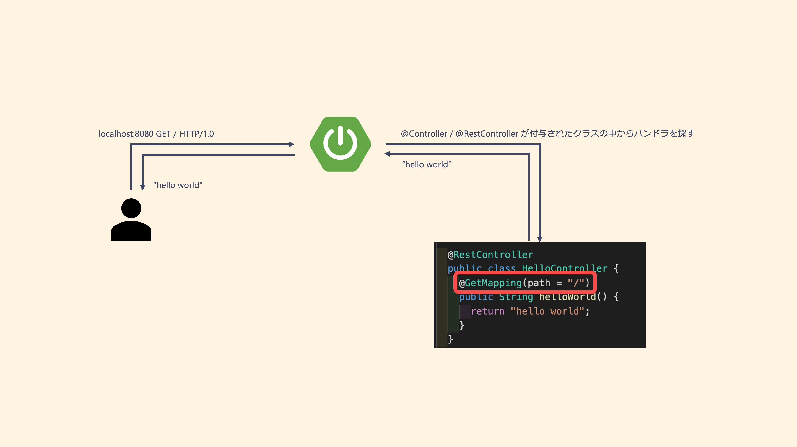

<header-table/>

# {{$page.frontmatter.title}}

## 始めに

- Java の基本
- Spring Boot の基本
- Spring Boot ハンズオン

本講義では上記について紹介し、Java というプログラミング言語とその Web フレームワークである Spring Boot といった技術的な選択肢を増やすことを目的としています。

### 本講義の前提

本講義ではプログラム言語共通の制御構文や概念、たとえば if 文や型など、の解説は行いません。そのため、受講者は何らかのプログラミング言語で簡単な制御構文が書けることを前提とさせてください。

また、ファイルの編集については VSCode を使って編集することを前提として進めていきます。もちろん、vim などのお好きなエディタを使って頂いても問題ありませんが、その場合は適宜資料を読み替えて対応をお願いします。

### この資料のお約束

:computer: は自分で操作する箇所を示しています。 また`$`はホストマシンのプロンプトを意味し、`❯`はコンテナ内部でのプロンプトを意味します。

たとえば下記の通りです。

```shell
# ホストマシン上で git clone git@github.com:iij/bootcamp.git を実行する
$ git clone git@github.com:iij/bootcamp.git

# コンテナ上で curl localhost:8080 を実行する
❯ curl localhost:8080
```

### 下準備

講義を受講する前にコンテナイメージの pull と起動をしておくことをお勧めしています。
また、Docker の実行環境があることを前提として本講義を進めます。

#### 手順

1. ハンズオン用の Docker イメージを pull してくる

   ```bash
   # やや重たいので注意してください
   $ docker pull tamago0224/bootcamp-springboot:2024
   ```

2. ハンズオン用の作業ディレクトを作成する

   ```bash
   # 適当な場所に作業用ディレクトリを作成し、その中に work ディレクトリを作成してください。
   $ mkdir bootcamp-java-2024 # このディレクトリ名は何でも良い
   $ cd bootcamp-java-2024
   $ mkdir work
   ```

3. ハンズオン用の docker-compose.yml を用意する

   ```bash
   $ curl -o docker-compose.yml https://raw.githubusercontent.com/iij/bootcamp/master/src/server-app/java/server-app/docker-compose.yml
   ```

   ```yaml
   services:
     java:
       image: tamago0224/bootcamp-springboot:2024
       volumes:
         - ./work:/work
       working_dir: /work
       tty: true
   ```

4. コンテナを起動する

   ```bash
   # コンテナを起動する
   $ docker compose up -d
   # コンテナに入る
   $ docker compose exec java /bin/bash
   > pwd
   /work
   ```

5. 必要なプロジェクトファイルの用意。別画面のターミナルで以下のコマンドを実行

   ```bash
   $ cd bootcamp-java-2024
   $ docker exec cp java:/app/. ./work
   $ ls ./work # 以下のファイル群が確認できる
   build  build.gradle  gradle  gradlew  settings.gradle  src
   ```

6. アプリケーションの起動チェック

   ```bash
   # Spring Bootを起動する
   ❯ ./gradlew bootrun
   # ...
   # いろんなログが流れる
   ```

7. 動作チェック

ホストマシンの適当なブラウザから[localhost:8080](http://localhost:8080)にアクセスし、下記のようなエラーページが表示されることを確認してください。


## Java の基本

Java は OpenJDK コミュニティによって開発され、各ベンダからリリースされているプログラミング言語です。
古くから利用されているプログラミング言語/プラットフォームである一方、2022 年現在でも SI や大規模開発の現場などでよく利用されています。

### 言語としての特徴

Java は C 言語や Rust と同じ静的型付き言語です。そのため文法や記法は C 言語を踏襲した書き方となっています。\
Java の言語のパラダイムとしては、クラスの継承の概念やインタフェースなどの言語仕様を持つためオブジェクト指向プログラミングであります。その一方、Java のバージョン 8 以降は関数型インタフェースやパターンマッチなど、関数型プログラミングを楽しめるような仕様も導入されています。

:::details Java のサンプルコード

```java
package com.github.iij.bootcamp.serverapp; // パッケージ名(世界でユニークであると良い)

// 自社ドメインを持つ企業での製造物には自社ドメインをそのまま利用することが多い

import java.util.List; // 外部モジュールの利用(JavaではIDEに任せてしまうのが一般的)

/**
 * 複数行に渡るコメント文
 *
 * - 一般的にはJavaのクラス名の命名はパスカルケース - クラス名とjavaファイルの名前は一致させる方が良い(1クラス1ファイル)
 */
public class SampleClass extends Object {

  // アクセス修飾子はprivate/protected/public
  private String iamPrivate;

  // Javaの変数・メソッドの命名は(ローワー)キャメルケース
  protected String iamProtected;
  public String iamPublic;

  // アノテーション。そのものに効果があるものではなく、横断的に処理したりする際の目印として使うことが多い
  @SuppressWarnings("unused")
  private String sampleMethod(String a) {
    String b = null;
    if ("hello".equals(a)) {
      b = "world";
    }
    return b.toString(); // 残念ながらJavaはnull安全な言語ではない(NullPointerExceptionの危機)
  }

  public class MyInnerClass { // クラスの中にクラスを定義することもできる(インナークラス)
    private final String finalizedString; // final化(不変化)ができる

    public MyInnerClass(String arg) { // コンストラクタはクラス名を同一にすることで表現
      this.finalizedString = arg;
    }

    public String getFinalizedString() {
      return this.finalizedString;
    }
  }

  public void makeInstance() {
    // クラスの具体的な値(オブジェクト)のことを"インスタンス"と言います
    var ins = new MyInnerClass("hello"); // Java11から型推論が使える
    ins.getFinalizedString(); // → hello
  }
}
```

:::

### プロジェクト構成

Java のプロジェクトのディレクトリ構成は、ほかのプログラミング言語と異なり言語として定められています。名前空間として定義できる"パッケージ"がそのままディレクトリに反映されるようにディレクトリを構成する必要があります。

参考: https://docs.oracle.com/javase/tutorial/java/package/managingfiles.html

たとえば`com.github.iij.bootcamp`パッケージ(=名前空間)配下に`Hoge`と`Huga`というクラスを作成する場合、下記のようなディレクトリ構造/ファイル構造になります。

```
.
├── build.gradle
└── src
    └── main
        └── java
            └── com
                └── github
                    └── iij
                        └── bootcamp
                            └── Hoge.java
                            │   └── class Hoge { ... }
                            └── Huga.java
                                └── class Huga { ... }
```

:::tip パッケージ
Java におけるパッケージとは、DNS 形式で定義できる名前空間のような概念です。`.`で区切ることでパッケージ間の親子関係を定義できます。たとえば`com.example.iij`パッケージと`com.example.iij.bootcamp`パッケージでは前者が親で後者が子といった関係があります。

:::

### Gradle

Python であれば pip、Rust であれば cargo、Node.js であれば npm のようにプログラミング言語にはそれぞれ依存関係を解決しビルドを自動化する自動化システムツールが用意されています。

Java では Maven と Gradle という 2 つの種類の自動化システムツールがよく利用されています。本講義では Gradle を利用して話を進めていきます。

## Spring Boot の基本

Spring Boot は Java の Web フレームワークのひとつです。Spring Boot の規約に従ってアプリケーションロジックを実装することで簡単に Web アプリケーションを構築できます。

このフレームワークは大規模な主幹システムや Web アプリケーションを実装/構築する際によく利用されており、IIJ がホストしているいくつかのサービスも Spring Boot を利用して実装されています。

### 特徴

Spring Boot は複雑な業務要件や非機能要件をクリアするためのさまざまな機能を有しています。依存関係を宣言して注入してくれる DI コンテナや横断的な関心事を解決する AOP のサポート、数多く公開されている starter パッケージなどはその最たる例です。

残念ながらこの Bootcamp ですべての要素に触れることはできないため、興味のあるほうはドキュメントを読んでみることをお勧めします。

## Spring Boot ハンズオン

本ハンズオンではブラウザで閲覧できる Web UI の機能を持たない、HTTP API(Application Programming Interface)だけを持つ API サーバを構築していきます。

それでは始めましょう。

### 簡単なクラスを作ってみる

まず始めに、Java 言語のウォーミングアップとして純粋な Java のクラスを作ってみましょう。

:computer: `User`クラスを作成します。

下記の通りに修正してみましょう。

```java
// src/main/java/com/github/iij/bootcamp/serverapp/User.java
package com.github.iij.bootcamp.serverapp;

public class User {

  private String name;
  private String id;

  public User(String name, String id) {
    this.name = name;
    this.id = id;
  }

  public String getName() {
    return this.name;
  }

  public String getId() {
    return this.id;
  }

  public void setName(String name) {
    this.name = name;
  }

  public void setId(String id) {
    this.id = id;
  }

  public String toString() {
    return "name: " + this.name + "," + "id: " + this.id;
  }
}
```

これで`User`クラスを作成できました。次にこのクラスを実際にインスタンス化してみます。\
Spring Boot アプリケーションの main 関数は`com.github.iij.bootcamp.serverapp.ServerAppApplication`にあります。ためしにこの main 関数の中で`User`クラスをインスタンス化してみます。

:computer: ServerAppApplication.java を修正してください。

```java{10-13}
// src/main/java/com/github/iij/bootcamp/serverapp/ServerAppApplication.java
package com.github.iij.bootcamp.serverapp;

import org.springframework.boot.SpringApplication;
import org.springframework.boot.autoconfigure.SpringBootApplication;

@SpringBootApplication
public class ServerAppApplication {

	public static void main(String[] args) {
		// 追記BEGIN
		User user = new User("アリス", "alice");
		System.out.println(user.toString());
		// 追記END
		SpringApplication.run(ServerAppApplication.class, args);
	}
}
```

編集が完了したら以下のコマンドをコンテナから実行してサーバを起動しましょう。

```bash
❯ ./gradlew bootRun
```

再起動時にログに"name: アリス,id: alice"と表示されていれば OK です。

#### チェックポイント その 1

- Java のクラスを作成した
- クラスをインスタンス化し、標準出力に文字列を表示した

#### 解説

純粋な Java のクラスを作成し、インスタンス化とメソッドの呼び出しを行いました。`User`クラスを眺めてもらうとわかるとおり、`getName`や`getId`など Java にはかなり冗長なコードが多いです。これらのコードはよく「ボイラープレート」と呼ばれ、開発者が嫌うコードです。

Java には Lombok などのボイラープレートを解消するツールなどありますが、本講義はあえて紹介しません。興味がある人は調べてみてください。

### 簡単な HTTP のインタフェースを作成してみる

それでは Spring Boot を使ってみましょう。\
簡単な HTTP のインタフェースを作成し、実際に Spring Boot がどのように動作しているのかを見てみます。

:computer: ServerAppApplication.java を修正し、サーバを再起動してみてください。

```java{5-8,19-27}
// src/main/java/com/github/iij/bootcamp/serverapp/ServerAppApplication.java
package com.github.iij.bootcamp.serverapp;

import org.springframework.boot.SpringApplication;
import org.springframework.boot.autoconfigure.SpringBootApplication;
// 追記BEGIN
import org.springframework.web.bind.annotation.GetMapping;
import org.springframework.web.bind.annotation.RestController;
// 追記END

@SpringBootApplication
public class ServerAppApplication {

  public static void main(String[] args) {
    User user = new User("アリス", "alice");
    System.out.println(user.toString());
    SpringApplication.run(ServerAppApplication.class, args);
  }

  // 追記BEGIN
  @RestController
  public class HelloController {
    @GetMapping(path = "/")
    public String helloWorld() {
      return "hello world";
    }
  }
  // 追記END
}
```

```bash
# Spring Bootサーバーを再起動する
❯ ./gradlew bootRun
```

```
# 動作確認
$ curl localhost:8080 -X GET
hello world
```

"hello world"が返ってきたら成功です。

#### チェックポイント その 2

- `@RestController`アノテーションをクラスに付与して HTTP のインタフェースを作成した

#### 解説

`bootRun`コマンドにより Spring Boot が起動します。すると、Spring Boot の機能により `@RestController`アノテーションが付いている`ServerAppApplication.HelloController`が HTTP のインタフェースとして登録されます。



その結果、この Spring Boot が動いている 8080 番ポート宛の HTTP リクエストと`ServerAppApplication.HelloController#helloWorld`が紐づけられることになり、`GET /`へのリクエストのレスポンスとして"hello world"が返ってきました。

:::details Spring Boot と DI コンテナ

Spring Boot は起動時に起動クラスのパッケージ配下の Java ファイルから特殊なアノテーション(`@Contoroller` / `@Component` / etc...)がついたクラスを探し出します。そして Spring Boot はそのクラスを適当な方法でインスタンス化し、自身の管理下(=DI コンテナ)に置きます。

(「適当な方法」を指定することもできます > [Bean Annotation](https://docs.spring.io/spring-framework/docs/current/javadoc-api/org/springframework/context/annotation/Bean.html))

DI コンテナに格納されたインスタンスは、後述する`@Autowired`アノテーションを使って引き出すことができます。

特に、`@Controller` `@RestController`アノテーションが付与されたクラスから生成されたインスタンスは HTTP のインタフェースとして働くことになります。

今回の例では、 `ServerAppApplication`クラスに`@SpringBootApplication`アノテーションが付与されているので`ServerAppApplication`クラスのパッケージ`com.github.iij.bootcamp.serverapp`配下のクラスから上述の特殊なアノテーションがついているクラスを探索します。

`HelloController`クラスは`@RestController`アノテーションが付与されているため、Spring Boot 起動時に`HelloController`が Spring Boot によってインスタンス化され DI コンテナに登録されました。
その結果、`GET /`のリクエストを Spring Boot が受け取ると`HelloController#helloWorld` が実行されるようになっていたというわけです。

:::

### 簡単なリクエストを受け取ってみる

次にクエリパラメータから情報を取得してみましょう。

:computer: UserController.java を作成し、サーバを再起動してみてください。

```java
// src/main/java/com/github/iij/bootcamp/serverapp/UserController.java
package com.github.iij.bootcamp.serverapp;

import org.springframework.web.bind.annotation.GetMapping;
import org.springframework.web.bind.annotation.RequestParam;
import org.springframework.web.bind.annotation.RestController;

@RestController
public class UserController {

  private User secretUser = new User("ボブ", "bob");

  @GetMapping(path = "/user")
  public User find(@RequestParam String id) {
    if ("bob".equals(id)) {
      return this.secretUser;
    } else {
      return null;
    }
  }
}
```

```bash
# Spring Bootサーバーを再起動する
❯ ./gradlew bootRun
```

```bash
# 動作確認
$ curl 'localhost:8080/user?id=bob'
{"name":"ボブ","id":"bob"}
```

#### チェックポイント その 3

- `@GetMapping`アノテーションを持つメソッドを作成し、HTTP のハンドラとして登録した
- HTTP のハンドラとして登録されたメソッドの引数に`@RequestParam`アノテーションを付与することでクエリパラメータを実装した

#### 解説

新しいクラス`UserController`を作成しました。このクラスにも`@RestController`アノテーションが付いているため HTTP のインタフェースとして振る舞います。

`UserController`クラスの持つメソッド`find`には`@GetMapping`アノテーションがついているため、`GET /user`宛のリクエストのハンドラとして登録されることになります。そのため、Spring Boot アプリケーションの`/user`へ GET リクエストを送ることでこの`find`メソッドがコールされます。

さらに`find`メソッドの引数`id`に`@RequestParam`アノテーションが付与されています。これにより、HTTP リクエストのクエリパラメータの値がこの変数に注入されます。つまり`GET /user?id=bob`へのリクエストを Spring Boot アプリケーションへ送ることで`find`メソッドがコールされ引数`id=bob`が引き渡されます。

### 責任を分離する

さて、前章まで基本的な HTTP のインタフェースの作り方と使い方について解説してきました。もう少し実装を深めていきましょう。\
現在`UserController`クラスは HTTP のインタフェースとデータソースの管理の 2 つの責務を持っています。これは単一責務の原理から外れているためリファクタリングする対象です。

今回はシンプルに`UserController#find`の処理を抽出して別のクラスに分離、処理そのものを`UserController`クラスの外から与えてあげるようにしましょう。

:computer: UserService.java を作成、UserController.java を修正し、サーバを再起動してください。

```java
// src/main/java/com/github/iij/bootcamp/serverapp/UserService.java
package com.github.iij.bootcamp.serverapp;

import java.util.ArrayList;
import java.util.Arrays;
import java.util.List;

import org.springframework.stereotype.Component;

@Component
public class UserService {

  // データソースに該当する部分
  private List<User> userPool = new ArrayList<User>(Arrays.asList(new User("ボブ", "bob")));

  /**
   * ユーザープールからid値で検索し、その結果を返却します idと一致するユーザーが見つからない場合nullを返却します
   * TODO 本当にこの実装で問題ないか、考えてみましょう
   *   - 同一のidをもつインスタンスがいる場合は？データ構造はこれで良いか？
   *   - nullは`User`インスタンスではない、では見つからない場合は何を返すべき？
   */
  public User findById(String id) {
    // Java8から導入されたStreamAPI
    User user = this.userPool
      .stream() // Streamを作成
      .filter(u -> id.equals(u.getId())) // idと一致する`User`インスタンスのみを抽出
      .findFirst() // 抽出結果の先頭1つだけを取り出す
      .orElse(null); // もし抽出した結果何も残らなかった場合、nullを返却する
    return user;
  }
}

```

```java{6-8,13-21}
// src/main/java/com/github/iij/bootcamp/serverapp/UserController.java
package com.github.iij.bootcamp.serverapp;

import org.springframework.web.bind.annotation.GetMapping;
import org.springframework.web.bind.annotation.RestController;
import org.springframework.web.bind.annotation.RequestParam;
// 追記BEGIN
import org.springframework.beans.factory.annotation.Autowired;
// 追記END

@RestController
public class UserController {

  // 修正BEGIN
  @Autowired
  private UserService userService;

  @GetMapping(path = "/user")
  public User find(@RequestParam String id) {
    return this.userService.findById(id);
  }
  // 修正END
}
```

```bash
# Spring Bootサーバーを再起動する
❯ ./gradlew bootRun
```

```bash
# 動作確認
$ curl 'localhost:8080/user?id=bob'
{"name":"ボブ","id":"bob"}
```

#### チェックポイント その 4

- `@Component`アノテーションをクラスに付与し、Spring Boot 起動時に自動的にインスタンス化した
- `@Autowired`アノテーションをフィールドに付与し、そのフィールドに Spring Boot がインスタンス化したインスタンスの中から適切なインスタンスを注入した

#### 解説

新しいクラス`UserService`を作成しました。このクラスには`@Component`アノテーションが付与されているため、Spring Boot 起動時に Spring Boot によって自動的にインスタンス化され Spring Boot の管理下に入ります。このように Spring Boot に管理されるようになったインスタンスはほかのクラスから`@Autowired`を利用することで利用されます。

今回の例では`UserController`クラスが`userService`フィールドに`@Autowired`アノテーションを付与しているため自動的に作成された`UserService`クラスのインスタンスが`UserController.userService`に代入されることになりました。このように依存関係を分離、外から依存関係を持ち込む構成のことを DI(Dependency Injection)と呼びます。

注意点として、デフォルトの挙動では Spring Boot が管理するインスタンスは各クラス"1 つ"となっています。つまり`UserController`クラスが引っ張ってきている`userService`とほかのクラスが引っ張ってこれる`UserService`インスタンスは完全に一致しています。このようにひとつのインスタンスを使い回す構成のことを"シングルトン"と呼びます。

### 少し複雑なリクエストを受け取ってみる

最後に、POST リクエストとリクエストボディを指定して`User`インスタンスを登録してみましょう。\
`User`インスタンスには`id`と`name`の値を指定する必要があるので、これらを与えられるエンドポイントを用意します。

:computer: UserService.java と UserController.java を修正し、サーバを再起動してください。

```java{27-35}
// src/main/java/com/github/iij/bootcamp/serverapp/UserService.java
package com.github.iij.bootcamp.serverapp;

import java.util.ArrayList;
import java.util.Arrays;
import java.util.List;

import org.springframework.stereotype.Component;

@Component
public class UserService {

  // データソースに該当する部分
  private List<User> userPool = new ArrayList<User>(Arrays.asList(new User("ボブ", "bob")));

  /**
   * ユーザープールからid値で検索し、その結果を返却します idと一致するユーザーが見つからない場合nullを返却します
   */
  public User findById(String id) {
    User user = this.userPool
      .stream()
      .filter(u -> id.equals(u.getId()))
      .findFirst()
      .orElse(null);
    return user;
  }

  // 追記BEGIN
  /**
   * ユーザープールにUserを追加します
   */
  public User save(User user) {
    this.userPool.add(user);
    return user;
  }
  // 追記END
}
```

```java{7-10,23-52}
// src/main/java/com/github/iij/bootcamp/serverapp/UserController.java
package com.github.iij.bootcamp.serverapp;

import org.springframework.beans.factory.annotation.Autowired;
import org.springframework.web.bind.annotation.GetMapping;
import org.springframework.web.bind.annotation.RestController;
import org.springframework.web.bind.annotation.RequestParam;
// 追記BEGIN
import org.springframework.web.bind.annotation.PostMapping;
import org.springframework.web.bind.annotation.RequestBody;
// 追記END

@RestController
public class UserController {

  @Autowired
  private UserService userService;

  @GetMapping(path = "/user")
  public User find(@RequestParam String id) {
    return this.userService.findById(id);
  }

  // 追記BEGIN

  // POST /user 宛のリクエストボディスキーマ
  public static class UserCreateRequest {
    private String name;
    private String id;

    public String getName() {
      return name;
    }

    public String getId() {
      return id;
    }

    public void setName(String name) {
      this.name = name;
    }

    public void setId(String id) {
      this.id = id;
    }
  }

  @PostMapping(path = "/user")
  public User create(@RequestBody UserCreateRequest request) {
    User newUser = new User(request.getName(), request.getId());
    return this.userService.save(newUser);
  }
  // 追記END

}
```

```bash
# Spring Bootサーバーを再起動する
❯ ./gradlew bootRun
```

```bash
# 動作確認
$ curl localhost:8080/user -X POST -H 'Content-Type: application/json' -d '{"name": "アリス", "id": "alice"}'
{"name": "アリス", "id": "alice"}

$ curl 'localhost:8080/user?id=alice'
{"name": "アリス", "id": "alice"}
```

#### チェックポイント その 5

- `@PostMapping`アノテーションをメソッドに付与し、POST リクエストの HTTP ハンドラとして登録した
- Java の POJO を用いて POST リクエストのリクエストボディのスキーマを表現した

## まとめ

以上で Spring Boot のハンズオンは終了です。

本講義では Java の基本的な知識や書き方、Spring Boot の使い方など、基本的な機能や文法に触れてもらいました。しかし Spring Boot には多様な機能がまだまだ存在しており、データベースとの接続や非同期処理などさまざまなプロダクション環境で活躍できるポテンシャルを持っているフレームワークです。

本講義が、受講者のみなさまの今後の技術選定の手助けになれれば幸いです。

### 追加の資料

- [Spring Boot リファレンスドキュメント](https://spring.pleiades.io/spring-boot/docs/current/reference/html)
  - 多くの Spring Boot 開発者がお世話になる公式ドキュメントです。アプリケーションの開発からデプロイ方法まで、幅広く情報が提供されています。
- [Spring Boot Guides](https://spring.pleiades.io/guides)
  - Spring Boot の各種機能を試してみるチュートリアルが公開されています。Pub/Sub や MongoDB、Docker との連携など Spring Boot の拡張が多種公開されています。興味のある項目に触ってみてください。

<credit-footer/>
