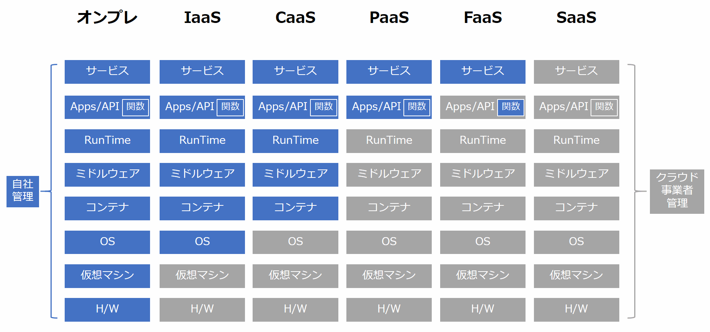

# サーバアプリケーション界隈Overview

## Webアプリケーションとは？

世の中はWebアプリケーションで溢れています。

この図の「Ruby on Rails」と書かれているのはWebアプリケーション。


次の図の「Perl CGI」もWebアプリケーション。


次の図の「Apache」はWebアプリケーションじゃない。


次の図の「Go」は多分Webアプリケーション。


明確な定義はありませんが、サーバ上で動作しHTTPなどの仕組みを利用してWeb上からアクセスされること、DBなどと連携し何らかの動的な結果を返すアプリケーションのことを呼びます。

## 色々なWebアプリケーションの実装

### CGI

（1993年 フォーマルな[仕様](https://www.w3.org/CGI/)制定は1997年）

```perl
#!/usr/bin/perl

print "Content-type: text/html \n\n";
print "<html>";
print "<head><title>IIJ Bootcamp</title></head>";
print "<body>";
print "<p>Welcome to IIJ Bootcamp</p>";
print "</body>";
print "</html>";
```

- Common Gateway Interface の略
- The Apache HTTP Server ("httpd") などのWebサーバでHTTPリクエストを受けて、外部プログラムにHTTPリクエストを渡し、出力をHTTPレスポンスとして返すしくみ。
- Perlが大流行するきっかけとなった。
  - Perlは文字列処理が強力（C言語は文字列処理が貧弱）
  - PerlからMySQL/PostgreSQLに接続してHTTPレスポンスを生成するスタイル
- 今日でもPerlで実装されたプロダクトは存続している（MovableTypeとか、mixiとか。CookPadもPerlでスタートしたはず)。
- CGIの仕組み自体はPerl以外でもRubyやPython、シェルスクリプトなど文字列を出力できるプログラムであれば利用できる

### PHP

```php
<html>
 <head>
  <title>IIJ Bootcamp</title>
 </head>
 <body>
 <?php echo '<p>Welcom to IIJ Bootcamp</p>'; ?> 
 </body>
</html>
```

（開発開始は1994年 実質的に最初の公開版PHP 3が1997年 本格普及はPHP 4で2000年)

1. CGIはHTTPリクエストを受けるごとに、新しいプロセスをforkする必要があり、Webサーバにとって負荷が高かった。
2. WebサーバのモジュールとしてPerlを動作させる方法が考案された（apache httpd + mod_perl 1998年)。
   1. しかしPerlはWebサーバのモジュールとして動作させる前提で設計/実装されたものではなく、やや使い勝手が悪かった。
   2. 類似の技術としてFastCGIというものもあり、これは常駐プロセスとしてCGI実行エンジンを用意しておくことで、リクエストごとにプロセスをforkする必要を無くしたものだったが、やはり癖があった。
3. 最初からWebサーバのモジュールとして実行することを念頭に置いた、Webプログラミングに特化した処理系としてPHPが登場、大流行してPerlを駆逐する。
   1. Facebookも長い間PHPで書かれていた。

#### Perl CGI


#### mod_perl


### Java Servlet (サーブレット)

（1996年に初期バージョンが公開 1998年に最初の公式API仕様が確立 2001年にStrutsが登場)

Java Servletの例

```java
package bootcamp;

import java.io.*;
import javax.servlet.*;
import javax.servlet.http.*;

public class HelloServlet extends HttpServlet {
  public void doGet (HttpServletRequest req, HttpServletResponse res)
    throws ServletException, IOException {
    PrintWriter pw = res.getWriter();

    res.setContentType("text/html; charset=Shift_JIS");

    pw.println("<html>");
    pw.println("<head><title>IIJ Bootcamp</title></head>");
    pw.println("<body>");
    pw.println("<p>Welcome to IIJ Bootcamp</p>");
    pw.println("</body>");
    pw.println("</html>");
  }
}

```

JavaのテンプレートエンジンであるJSP(JavaServer Pages)の例

```java
<%@ page contentType="text/html" %>

<html>
<head>
<title>IIJ Bootcamp</title>
</head>
<body>
<p>
<% System.out.println("Welcom to IIJ Bootcamp"); %>
</p>

現在時刻: <%= new java.util.Date() %>

</body>
</html>
```

1. 1995年Sun Microsystems社がJava言語を売り出した。
   - 最初にアピールした`Applet`は、Webページの中にJavaのサンドボックス環境を埋め込んでアプリケーションを実行するというものだった。しかし制約が大きいうえにマシンパワーを要求するので、実用的なアプリケーションを作る環境としては、流行らなかった。
2. しかしサーバサイドの技術として発表されたサーブレットは2000年ごろから流行し始め、2001年にStrutsが登場するとその人気は決定的になった。
    1. サーブレットはHTTPリクエストを（CGIのようにプロセスをforkするのではなく)スレッドで処理するので性能が高かった。
    2. Javaは静的に型付けされた言語であるため、Javaで書かれたアプリケーションはPHPよりも品質を確保しやすいかった。
    3. WebアプリケーションフレームワークであるStrutsを使うと、プログラムを一定のスタイルで記述することを助け、同時に大人数で分業することを助けた。規模の大きなエンタープライズシステムの実装が可能になった。
    4. Javaで書かれたコードはポータビリティがあり、サーバのOSやCPUが変わっても、そのまま実行できた。（まだx86系のCPUが市場を独占しておらず、SPARCやAlphaなどのCPUもある程度のシェアを持っていた。)
3. かくしてカジュアルな（コンシューマ向けの）WebアプリケーションはPHPで、シリアスな（エンタープライズ向けの）WebアプリケーションはJavaサーブレットで書く、という時代が続くことになった。

### Java EE / Spring

（Java EE 1999年 / Spring 2002年）

※ サンプルは適当です

JavaEE

```java
@ManagedBean(name="HelloBootcamp")
@RequestScoped
public class HelloBootcamp {
   private String message;

   /** Creates a new instance of HelloBootcamp */
   public HelloBootcamp() {
      this.message = "Welcom to IIJ Bootcamp";
   }

   *@EJB
   private MessageFacade messageFacade;*

   public String getMessage() {
      return this.message;
   }
}
```

Spring Framework

```java
@RestController
public class HelloController {

   @RequestMapping("/")
   public String index() {
      return "Welcom to IIJ Bootcamp";
   }

}
```

1. Sun Microsystemsはサーブレットの成功に気を良くして、これを一層強力に推進してエンタープライズの世界を支配しようと試みた。そうして出てきたのはJava EE（Enterprise Edition）であった。
2. Java EEは、エンタープライズアプリケーションを多数のサーバの連携する分散処理を通じて実現することを構想し、その中核技術としてEJB（Enterprise JavaBeans）を据えた。EJBを使うと、ネットワーク越しにJavaのオブジェクトが通信し合い、データベースへの永続化も含めてエレガントに処理できるはずだった。Sun Microsystemsの制定したJava EE仕様を実装するアプリケーションサーバ製品が複数のベンダーから出荷され、活況を呈した。
3. だが、実際のJava EEアプリケーションサーバ製品は不安定で性能も悪く、プログラミングも難しいものであった。人々はJava EEを信じて使い続けていたが、疑問も大きく膨らんでいった。
4. そこに登場したのがSpring Frameworkだった（2002年頃）。
   - 作者のRod JohnsonがExpertt One-on-One J2EE Design and Developmentとともに世に問うたもの。
   - Java EE（J2EE) の欠点を指摘し、EJB、とりわけ`Entity Beans`を使うことは断念し、POJO（Plain Old Java Object) をベースに開発することを提唱した。
   - DI （Dependency Injecttion) のアイデアを普及させ、大規模なJavaアプリケーションを効率よく分業体制で実装する道を切り開いた。
5. Spring Frameworkは一世を風靡しただけでなく、今日まで人気を失うことなく、利用されている。
   - StrutsはStrus1の後継バージョンであるStruts2が、Struts1とまったく互換性がなかったため、Struts1を採用していた開発会社に受け入れられなかった。
   - その後脆弱性問題を連発したため、今日ではまったく人気がない。

### Ruby on Rails

```ruby
class HelloController < ApplicationController

   def hello
      render :html => '<p>Welcom to IIJ Bootcamp</p>'
   end
end
```

1. 2004年、37signals社がbasecampというプロジェクト管理アプリケーションの実装に使用していたRuby on RailsというWebアプリケーションフレームワークを発表した。Railsは非常にインパクトのあるフレームワークで、以降のサーバサイドプログラミングの世界を一変させてしまった。
2. その特徴を列挙すると以下のとおり。
   1. 2つの哲学。「同じことを繰り返さない DRY: Don't repeat yourself」「設定より規約 Convention over Configuration」
      - Strutsでは互いに関連し合う複雑な設定ファイルが多く必要だった
         - ルーティング（あるURLをどのアクションクラスで処理するかのマッピング）やアクションが処理するリクエストのフォームを記述するクラス、テンプレートの中で使用するタグライブラリの定義など
         - ほとんどの設定項目は、自動的なものであり、設定ファイルのメンテナンスは大量の単純作業であった。
      - そこで多くの現場ではExcelなどで主要設定項目を管理し、そのExcelファイルからマクロで個々の設定ファイルを生成するようなことが行われていた。
      - Railsでは、これを「デフォルトで定められているディレクトリ構造や命名規則に沿っている限り、設定ファイルは不要とする（特別な場合だけ、設定ファイルを書く）」という方法で解決した。
      - たとえばRDBMSのpersonsテーブルに対応するモデルクラスを、ModelsディレクトリにあるPerson.rbファイルとして記述すれば、自動的にDBアクセス可能とするというような具合である。
      - こうした開発者体験(Developer Experience)の良さは、Rubyが非常にメタプログラミングをしやすい言語であることで成り立っている。
         - Rails 独自の拡張や構文を多数実装することで、上記の哲学を実現している。
   2. コマンドラインユーティリティによる開発のサポート
      - たとえばあるURLに対応するコントローラクラスのスケルトンをコマンドラインユーティリティから生成できる。
      - このようなユーティリティを提供することで、開発者を単純作業から解放し、価値あるコードを書くことへ集中できるようにした。
   3. Ruby on Railsに触発されて、別の言語でも同様のフレームワークが多数開発された。
      - PHP: CakePHP
      - Java: JBoss Seam, Java EE 6, Grails（Groovyを使う)
      - Python: Django

```bash
rails generate controller User name:string email:string
```

```ruby
class Person < ActiveRecord::Base
   attr_accessible :email, :name
end
```

```ruby
person = Person.find(1) # id=1なデータをDBで検索する

Person.create(email: 'hoge@example.com', username: 'hoge') # データの作成（DBにinsert）
```

### Ajaxの出現 / フロントエンド+APIサーバの時代

1. Google MapsおよびGmailの出現により、「画面遷移を伴わないWebアプリケーション」というものがユーザーに認知され始めた。2005年ごろのことである。
2. Googleのエンジニアたちの使った技法は、技術としてはそれ以前から存在していたが誰も注目してこなかったXMLHttpRequestというJavaScriptの機能を初めて本格的に使用するものだった。
   1. この技法をAsynchronous JavaScript + XMLの頭文字をとってAjax （エイジャックス) と呼ぶようになった。
3. StrutsやRuby on Railsはサーバサイド（バックエンド）側でリクエストを処理して画面も生成するというようなスタイルが中心だった。しかしAjaxが人気を集めるようになるとクライアント（フロントエンド）側で画面描画をすべて行い、バックエンドにはAPIサーバのみを置くというスタイルが人気を集めるようになった。
   1. 画面遷移を伴わないWebアプリケーションのことをSPA （Single Page Application) などと呼ぶ。
   2. このスタイルが定着すると、デスクトップアプリケーションと比較しても遜色ないUIのWebアプリケーションが当たり前のように期待されるようになっていった。
   3. 要求の高度化に応えるため、フロントエンド側のフレームワークが非常に速いペースで開発されているのが今日の状況である。今日、人気のあるフロントエンド・フレームワークとしてReact （Facebook)、Angular （Google)、Vue.js （Evan You)などがある。

### Node.js

Perlから始まり、ここまで出てきたJavaやRailsは基本的に同期的なI/Oとシングルプロセスで動作する。
そのため複数のリクエストを同時に処理するためにはマルチプロセスやスレッドといった仕組みを利用する必要があった。

- マルチプロセス: リクエストごと、あるいは事前にプロセスを複数立ち上げておき、1つのリクエストを1プロセスに割り当てる
  - CGI, FastCGI, Railsのpassengerなど。Apache自体も長らくこの仕組みだった
- スレッド: 言語内で並列処理用の軽量なプロセスを立ち上げる。負荷は低いが言語ごとに癖がある
  - Javaなど
- 上の二つは組み合わせて利用する場合もある


しかしインターネット利用者に増加にともなってWebサービスへのアクセス量も増え、プロセスのforkやスレッドによる処理モデルの限界が表面化してきた。特にプロセスの場合は1サーバあたりで起動できるプロセス数には限界がある他、プロセスを作るコスト（メモリ消費など）が無視できなくなってきたのである。
(C10K問題と呼ばれる)

::: tip
たとえば32bit環境のlinuxサーバでは、プロセスの作成上限は管理番号(PID)の上限となる32768になる。
また１スレッドあたり数MBのメモリを使うとすると、8GBのメモリを積んだサーバでは4000ほどが上限になる。
（あくまで単純に計算した場合の理論値）
:::

この問題への解決として、Node.jsをはじめとした非同期I/OとEventDrivenなアーキテクチャが注目された。
Node.jsはJavaScriptの実行環境の一つで、I/O待ち（HDDへの書き込みなど）中に他の処理を行うことで、1プロセスで複数のリクエストを同時に処理することができる。


開発スタイルの特徴としては以下が挙げられる。

- フロントエンド開発と同じJavaScriptで書けるので、1サービスを作るのに複数の言語を扱わなくてよくなる
- 豊富なライブラリやツールの選択肢がある
- 反面EventDrivenな実装はコードが複雑になりがちで、どちらかというと小規模な実装向け
  - TypeScriptによる型の導入やasync/await記法の導入などで改善されつつはある
- できるだけ自分で実装せずにライブラリを使うことがよしとされる風潮があり、ライブラリの依存関係が膨らみがち
  - 正しくはあるが、小さな機能のために追加ライブラリをパッケージする必要があり、依存関係の複雑さやビルド時間の増加を招く
  - Rubyの頃からある業界的な課題ではあるが、Node.jsでは特に顕著

最近ではSPAフレームワークからの流れでSSR(Server Side Rendering)を採用するサービスも増えており、その実行環境としてNode.jsが引き続き使われている。

最近は [Deno](https://deno.land/) というTypeScriptがネイティブで動作するランタイムも流行り始めている。

### Go

2016年くらいから利用例の増えてきたプログラミング言語で、静的型付け・シンプルな言語体系・高速な動作・並行処理が得意などの特徴がある。
RubyやPythonなどのスクリプト言語のような開発スピードと、JavaやCのような静的型付けによる安全性・実行の速さを両立していることで、Webサービスのバックエンドとして使われることが増えた。
RubyやPython、Javaなどのように実行環境をインストールする必要がなく、コンパイルしたバイナリファイル1つで動作するため、デプロイや環境構築が容易なのも特徴。
またGoにはgoroutineという軽量なスレッドのような並行処理の仕組みがあり、このgoroutineを使って複数のリクエストを処理することができる。


開発スタイルとしては以下のような特徴がある。

- あまりライブラリやフレームワークを使わずに、自分で実装することが推奨される
  - 標準ライブラリが優秀で、大抵の機能はフレームワークがなくても十分実装できる
  - 抽象化関連の機能も少ないためフレームワークの旨味があまりなく、デファクトが生まれづらい
- goroutineという仕組みでシンプルに並行処理が書ける
- 言語仕様がシンプルなのと静的型付けなこともあり、linterやコード補完ツールが作りやすい
  - 言語解析をしてくれる`analysis package`が公式から提供されている
- コーディング規約がある程度公式で決まっており、誰が書いても同じ書き方になる
  - 複数人での開発がやりやすい
- コンパイル言語なので（スクリプト言語に比べると）デバッグが難しい
- Railsのようなフレームワークに頼らず、自力でアプリケーションを構築していく必要がある

## アプリケーションプログラミングインタフェース(API)

API(Application Programming Interface)とはアプリケーションが他のソフトウェアの機能を利用するための仕組みを指す。
Webアプリケーションの文脈では主にhttpプロトコル越しに他のWebアプリケーションにrequestを送信し、responseを受け取る仕組みを指す。

一番分かりやすいのはブラウザ上で動作するJavaScriptがサーバのAPIを叩いてJSON形式のresponseを受け取るもの。
他に実は裏側でサーバ同士がAPIでやり取りしていることもよくあるし、サーバからさらに外部のサービスを呼び出す場合もある。

APIをどのような形式で実装するかは非常に重要な問題で、過去から現在に至るまで様々な設計・実装手法が存在する。

### RPC

そもそもプログラムからネットワーク越しに外部のプログラムの機能を実行する仕組みをRPC(Remote Procedure Call)と呼ぶ。
この場合はHTTPなどのWebの仕組みは前提にしておらず、各言語や実装ごとに独自の仕組みで動作するものだった。

### XML/RPC(JSON-RPC)

独自の仕組みで動いていたRPCをHTTP通信を前提にして規格として整えたものはXML/RPCと呼ばれる。
字の如くXML形式のデータをやり取りし、そのフォーマットなどを定めたものなっている。

リクエストの例

```xml
<?xml version="1.0"?>
<methodCall>
  <methodName>examples.getStateName</methodName>
  <params>
    <param>
        <value><i4>40</i4></value>
    </param>
  </params>
</methodCall>
```

レスポンスの例

```xml
<?xml version="1.0"?>
<methodResponse>
  <params>
    <param>
        <value><string>South Dakota</string></value>
    </param>
  </params>
</methodResponse>
```

XMLの代わりにJSON形式でやり取りされる場合はJSON-RPCと呼ばれる。

### SOAP

XML/RPCを発展させたもの？
主にエンタープライズの文脈で企業同士がデータのやり取りをするために利用されていたらしい。

（よく知らないので誰か追記してください）

### REST

RPCは相手がどのようなメソッド（関数）を実装しているのか、そのメソッドがどのような挙動をするのか定まっておらず、統一感がなかった。
そこで「APIの設計思想」のようなものとしてRESTが登場し、そのRESTの思想を満たすようなAPIをREST APIと呼ぶようになった。

（実際のところ、厳密にはRESTに従っていないなんちゃってREST APIが大半）

その思想には

- セッションなどの状態管理を行わない
- あるリソースをURLで表現する（例えば `example.com/book/001` は「`001`というIDが付けられた`book`」というリソースを表す）
- HTTPにおける GET/POST/PUT/DELETE の各メソッドをそのままリソースの 取得/作成/編集/削除 に対応させる
  - `GET example.com/book/` をするとbookの一覧が取得できる
  - `POST example.com/book/` で新しいbookを追加する
  - `GET example.com/book/001` で`ID:001`のbookの詳細を取得する
  - `PUT example.com/book/001` で`ID:001`のbookを更新する
  - `DELETE example.com/book/001` で`ID:001`のbookを削除する

データフォーマットには基本的にJSONが使われる。

### OpenAPI

TBD

### GraphQL

TBD

### gRPC

TBD

## アプリケーションを支えるインフラ

アプリケーションを支えるインフラとして **オンプレミス** と **クラウドサービス** がある。

どちらが優れているというわけではなく、アプリケーションの性質や目的・用途に応じて使い分けることが重要。

ここでは、主にクラウドサービスに重きを置いてついて説明します。

### オンプレミス

サーバ等の機器を購入(又はリース)し、自社内やデータセンターに設置して運用することを指す。

初期投資コスト、機器リプレイス等による運用コスト、調達時間が多くかかるデメリットがあるが、全て自社内での管理になるためカスタマイズを自由に行うことが出来るメリットがある。

### クラウドサービス

インターネットを経由して、ITリソースをオンデマンドで利用できるサービスを指す。

初期投資コストや調達時間は不要で、必要な時に必要な分だけ即利用出来るメリットがある。

インフラ構築をコード化する **Infrastructure as Code** と相性が非常によい。

反面、クラウド事業者が提供するサービスに依存することになり、ベンダーロックインのリスクがある。

また、オンプレミスに無い概念として「リージョン」「ゾーン」が存在する。

リージョンによっては料金、提供しているサービスが異なる場合があるため、用途に応じて慎重な選択が必要。
- リージョン ・・・ データセンターが設置されている地域。日本や北米など国、州レベルで分かれている。
- ゾーン ・・・ リージョンを物理的に細分化した単位。複数のゾーンに分散させることで災害対策が可能。


余談となるが、クラウドサービスが提供している機能をオンプレミスに導入するサービスも存在する。オンプレ版クラウドのイメージ。
- Azure Stack
- AWS Outposts

#### 主なクラウドサービスの種類

- **SaaS**
  - 読み (サーズ)
  - **Software as a Service** の略。ソフトウェアをサービスとして提供。
  - インストールが不要で、プラットフォームを問わないマルチデバイスで利用可能。
  - 主なSaaS
    - GMail、Slack、Office Online 等
- **IaaS**
  - 読み (イアース)
  - **Infrastructure as a Service** の略。サーバやストレージ等のハードウェアリソースをサービスとして提供。
  - 機器の購入や設置が不要で、CPUやメモリなど構成を自由に選択可能。またリソースの増減も容易に出来る。
  - 仮想マシンの立ち上げとなるため起動に時間がかかる。
  - 主なIaaS
    - Amazon EC2、Google Compute Engine、Azure Virtual Machines 等
- **PaaS**
  - 読み (パース)
  - **Platform as a Service** の略。アプリケーションを実行するためのプラットフォームをサービスとして提供。
  - アプリケーションを実行するに必要なハードウェア、ネットワーク、OS、ミドルウェア、実行環境が用意されており、プログラムを準備するだけで手軽にサービスを提供出来る。
  - 反面、構成が決められているため柔軟性に欠ける場合がある。
  - 主なPaaS
    - AWS Elastic Beanstalk、Google App Engine、Heroku 等
- **CaaS**
  - 読み (カース)
  - **Container as a Service** の略。コンテナ管理・実行環境(コンテナオーケストレーション)をサービスとして提供。
  - コンテナ技術を使用するため、IaaSよりも高速に立ち上がり、PaaSよりも柔軟な構成が可能。
  - 主なCaaS
    - Amazon EKS、Amazon ECS、Google Kubernetes Engine 等
- **FaaS**
  - 読み (ファーズ)
  - **Function as a Service** の略。関数の管理・実行環境をサービスとして提供。
  - ハードウェア、ネットワークなどのインフラ管理をクラウド業者に任せ、開発者は業務に必要な処理のみに集中出来る。
  - イベントドリブンで動作し、イベントが発生した時に処理が実行される。
  - 主なFaaS
    - AWS Lambda、Google Cloud Functions、Azure Functions 等




### 主なクラウドサービス事業者
#### Amazon Web Services (AWS)


- Amazonが提供するクラウドサービス。2021年5月時点でシェア1位。
- 2006年に最初のサービス(SQS)をリリース、2021年時点で200個を超えるサービスを提供している。
- 25のリージョン、80のゾーンが利用可能。
- Amazonのプライムデーやサイバーマンデー等で急増するトラフィックを支えている。
- 主なサービス
  - Amazon EC2、AWS Lambda、Amazon S3、Amazon RDS、Amazon DynamoDB、Amazon VPC


#### Google Cloud Platform (GCP)


- Googleが提供するクラウドサービス。2021年5月時点でシェア3位。
- 2008年に最初のサービス(GAE)をリリース、2021年時点で90個を超えるサービスを提供している。
- 25のリージョン、76のゾーンが利用可能。
- 膨大な計算を必要とするGoogleのインフラを支えている。
- 主なサービス
  - Compute Engine、Cloud Functions、Cloud Storage、Cloud SQL、Cloud Bigtable、Virtual Private Cloud

#### Microsoft Azure


- Microsoftが提供するクラウドサービス。2021年5月時点でシェア2位。
- 2010年に最初のサービス(Azure)をリリース、2021年時点で200個を超えるサービスを提供している。
- 60を超えるリージョンが利用可能。
- Microsoft製品との親和性が高く、Microsoft製品を使ってきた企業・ユーザーは学習コストが少なく済む。
- 主なサービス
  - Azure Virtual Machines、Azure Functions、Azure Blob Storage、Azure SQL Database、Azure Cosmos DB、Azure Virtual Network

#### その他

- Alibaba Cloud
  - Alibabaが提供するクラウドサービス。2021年5月時点でシェア4位。
- IBM Cloud
  - IBMが提供するクラウドサービス。2021年5月時点でシェア5位。
- Oracle Cloud
  - Oracleが提供するクラウドサービス。常に無料で使えるAlways Freeが強力。

<credit-footer/>
