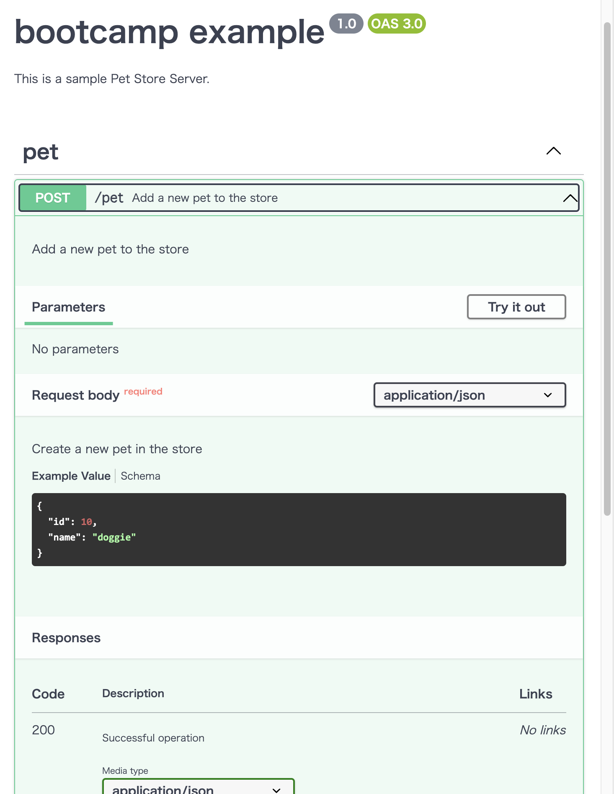

# サーバアプリケーション界隈Overview

## Webアプリケーションとは？

世の中はWebアプリケーションで溢れています。

この図の「Ruby on Rails」と書かれているのはWebアプリケーション。


次の図の「Perl CGI」もWebアプリケーション。


次の図の「Apache」はWebアプリケーションじゃない。


次の図の「Go」は多分Webアプリケーション。


明確な定義はありませんが、サーバ上で動作しHTTPなどの仕組みを利用してWeb上からアクセスされること、DBなどと連携し何らかの動的な結果を返すアプリケーションのことを呼びます。

## 色々なWebアプリケーションの実装

Webアプリケーションはwebの発展と共に様々な「書き方」と「動かし方」が提案されていました。
書き方が同じでも動かし方が変わったもの、言語を含めて書き方だけが違うやり方、様々です。

この章では様々なWebアプリケーションの実装を「書き方」と「動かし方」それぞれの面で見ていきます。
大体登場した歴史順に紹介しますが、必ずしも新しいものが正しい・素晴らしいというわけではなく、「得意なユースケースは何か？」がポイントとなります。

### CGI

（1993年 フォーマルな[仕様](https://www.w3.org/CGI/)制定は1997年）

```perl
#!/usr/bin/perl

print "Content-type: text/html \n\n";
print "<html>";
print "<head><title>IIJ Bootcamp</title></head>";
print "<body>";
print "<p>Welcome to IIJ Bootcamp</p>";
print "</body>";
print "</html>";
```

- Common Gateway Interface の略
- The Apache HTTP Server ("httpd") などのWebサーバでHTTPリクエストを受けて、外部プログラムにHTTPリクエストを渡し、出力をHTTPレスポンスとして返すしくみ。
- Perlが大流行するきっかけとなった。
  - Perlは文字列処理が強力（C言語は文字列処理が貧弱）
  - PerlからMySQL/PostgreSQLに接続してHTTPレスポンスを生成するスタイル
- 今日でもPerlで実装されたプロダクトは存続している（MovableTypeとか、mixiとか。CookPadもPerlでスタートしたはず)。
- CGIの仕組み自体はPerl以外でもRubyやPython、シェルスクリプトなど文字列を出力できるプログラムであれば利用できる

CGIはHTTPリクエストを受けるごとに、新しいプロセスをforkする必要があり、Webサーバにとって負荷が高かった。


WebサーバのモジュールとしてPerlを動作させる「mod_perl」という方法が考案された（apache httpd + mod_perl 1998年)


### PHP

```php
<html>
 <head>
  <title>IIJ Bootcamp</title>
 </head>
 <body>
 <?php echo '<p>Welcom to IIJ Bootcamp</p>'; ?> 
 </body>
</html>
```

（開発開始は1994年 実質的に最初の公開版PHP 3が1997年 本格普及はPHP 4で2000年)

1. CGIはHTTPリクエストを受けるごとに、新しいプロセスをforkする必要があり、Webサーバにとって負荷が高かった。
1. 前述の通りmod_perlという形でPerlを動作させる手法が流行っていた
1. しかし当然ながらPerlはWebサーバのモジュールとして動作させる前提で設計・実装されたものではなく、使い勝手が悪かった
1. 類似の技術としてFastCGIというものもあったが、やはり癖があり使いにくかった
1. そこで最初からWebサーバのモジュールとして実行することを念頭に置いた、Webプログラミングに特化した処理系としてPHPが登場、大流行してPerlを駆逐する。
   1. Facebookも長い間PHPで書かれていた。
1. 元々はWebページを動的に生成するためのテンプレート的な言語であったが、機能が追加された結果スクリプト言語としての機能も持つ
1. 動かし方はCGI, mod_php（モジュール形式）などがあり、Perlの項目とほぼ同様の形式で動作する
1. 現在でも広く利用されており、[CakePHP](https://cakephp.org/jp) など今風のフレームワークも存在する

### Java Servlet (サーブレット)

（1996年に初期バージョンが公開 1998年に最初の公式API仕様が確立 2001年にStrutsが登場)

Java Servletの例

```java
package bootcamp;

import java.io.*;
import javax.servlet.*;
import javax.servlet.http.*;

public class HelloServlet extends HttpServlet {
  public void doGet (HttpServletRequest req, HttpServletResponse res)
    throws ServletException, IOException {
    PrintWriter pw = res.getWriter();

    res.setContentType("text/html; charset=Shift_JIS");

    pw.println("<html>");
    pw.println("<head><title>IIJ Bootcamp</title></head>");
    pw.println("<body>");
    pw.println("<p>Welcome to IIJ Bootcamp</p>");
    pw.println("</body>");
    pw.println("</html>");
  }
}

```

JavaのテンプレートエンジンであるJSP(JavaServer Pages)の例

```java
<%@ page contentType="text/html" %>

<html>
<head>
<title>IIJ Bootcamp</title>
</head>
<body>
<p>
<% System.out.println("Welcom to IIJ Bootcamp"); %>
</p>

現在時刻: <%= new java.util.Date() %>

</body>
</html>
```

1. 1995年Sun Microsystems社がJava言語を売り出した。
   - 最初にアピールした`Applet`は、Webページの中にJavaのサンドボックス環境を埋め込んでアプリケーションを実行するというものだった。しかし制約が大きいうえにマシンパワーを要求するので、実用的なアプリケーションを作る環境としては、流行らなかった。
2. しかしサーバサイドの技術として発表されたサーブレットは2000年ごろから流行し始め、2001年にStrutsが登場するとその人気は決定的になった。
    1. サーブレットはHTTPリクエストを（CGIのようにプロセスをforkするのではなく)スレッドで処理するので性能が高かった。
    2. Javaは静的に型付けされた言語であるため、Javaで書かれたアプリケーションはPHPよりも品質を確保しやすいかった。
    3. WebアプリケーションフレームワークであるStrutsを使うと、プログラムを一定のスタイルで記述することを助け、同時に大人数で分業することを助けた。規模の大きなエンタープライズシステムの実装が可能になった。
    4. Javaで書かれたコードはポータビリティがあり、サーバのOSやCPUが変わっても、そのまま実行できた。（まだx86系のCPUが市場を独占しておらず、SPARCやAlphaなどのCPUもある程度のシェアを持っていた。)
3. かくしてカジュアルな（コンシューマ向けの）WebアプリケーションはPHPで、シリアスな（エンタープライズ向けの）WebアプリケーションはJavaサーブレットで書く、という時代が続くことになった。

### Java EE / Spring

（Java EE 1999年 / Spring 2002年）

※ サンプルは適当です

JavaEE

```java
@ManagedBean(name="HelloBootcamp")
@RequestScoped
public class HelloBootcamp {
   private String message;

   /** Creates a new instance of HelloBootcamp */
   public HelloBootcamp() {
      this.message = "Welcom to IIJ Bootcamp";
   }

   *@EJB
   private MessageFacade messageFacade;*

   public String getMessage() {
      return this.message;
   }
}
```

Spring Framework

```java
@RestController
public class HelloController {

   @RequestMapping("/")
   public String index() {
      return "Welcom to IIJ Bootcamp";
   }

}
```

1. Sun Microsystemsはサーブレットの成功に気を良くして、これを一層強力に推進してエンタープライズの世界を支配しようと試みた。そうして出てきたのはJava EE（Enterprise Edition）であった。
2. Java EEは、エンタープライズアプリケーションを多数のサーバの連携する分散処理を通じて実現することを構想し、その中核技術としてEJB（Enterprise JavaBeans）を据えた。EJBを使うと、ネットワーク越しにJavaのオブジェクトが通信し合い、データベースへの永続化も含めてエレガントに処理できるはずだった。Sun Microsystemsの制定したJava EE仕様を実装するアプリケーションサーバ製品が複数のベンダーから出荷され、活況を呈した。
3. だが、実際のJava EEアプリケーションサーバ製品は不安定で性能も悪く、プログラミングも難しいものであった。人々はJava EEを信じて使い続けていたが、疑問も大きく膨らんでいった。
4. そこに登場したのがSpring Frameworkだった（2002年頃）。
   - 作者のRod JohnsonがExpertt One-on-One J2EE Design and Developmentとともに世に問うたもの。
   - Java EE（J2EE) の欠点を指摘し、EJB、とりわけ`Entity Beans`を使うことは断念し、POJO（Plain Old Java Object) をベースに開発することを提唱した。
   - DI （Dependency Injecttion) のアイデアを普及させ、大規模なJavaアプリケーションを効率よく分業体制で実装する道を切り開いた。
5. Spring Frameworkは一世を風靡しただけでなく、今日まで人気を失うことなく、利用されている。
   - StrutsはStrus1の後継バージョンであるStruts2が、Struts1とまったく互換性がなかったため、Struts1を採用していた開発会社に受け入れられなかった。
   - その後脆弱性問題を連発したため、今日ではまったく人気がない。

### Ruby on Rails

```ruby
class HelloController < ApplicationController

   def hello
      render :html => '<p>Welcom to IIJ Bootcamp</p>'
   end

   def hello_json
      render :json => {msg: 'Welcom to IIJ Bootcamp'}
   end
end
```

1. 2004年、37signals社がbasecampというプロジェクト管理アプリケーションの実装に使用していたRuby on RailsというWebアプリケーションフレームワークを発表した。Railsは非常にインパクトのあるフレームワークで、以降のサーバサイドプログラミングの世界を一変させてしまった。
2. その特徴を列挙すると以下のとおり。
   1. 2つの哲学。「同じことを繰り返さない DRY: Don't repeat yourself」「設定より規約 Convention over Configuration」
      - Strutsでは互いに関連し合う複雑な設定ファイルが多く必要だった
         - ルーティング（あるURLをどのアクションクラスで処理するかのマッピング）やアクションが処理するリクエストのフォームを記述するクラス、テンプレートの中で使用するタグライブラリの定義など
         - ほとんどの設定項目は、自動的なものであり、設定ファイルのメンテナンスは大量の単純作業であった。
      - そこで多くの現場ではExcelなどで主要設定項目を管理し、そのExcelファイルからマクロで個々の設定ファイルを生成するようなことが行われていた。
      - Railsでは、これを「デフォルトで定められているディレクトリ構造や命名規則に沿っている限り、設定ファイルは不要とする（特別な場合だけ、設定ファイルを書く）」という方法で解決した。
      - たとえばRDBMSのpersonsテーブルに対応するモデルクラスを、ModelsディレクトリにあるPerson.rbファイルとして記述すれば、自動的にDBアクセス可能とするというような具合である。
      - こうした開発者体験(Developer Experience)の良さは、Rubyが非常にメタプログラミングをしやすい言語であることで成り立っている。
         - Rails 独自の拡張や構文を多数実装することで、上記の哲学を実現している。
   2. コマンドラインユーティリティによる開発のサポート
      - たとえばあるURLに対応するコントローラクラスのスケルトンをコマンドラインユーティリティから生成できる。
      - このようなユーティリティを提供することで、開発者を単純作業から解放し、価値あるコードを書くことへ集中できるようにした。
   3. Ruby on Railsに触発されて、別の言語でも同様のフレームワークが多数開発された。
      - PHP: CakePHP
      - Java: JBoss Seam, Java EE 6, Grails（Groovyを使う)
      - Python: Django
1. 今でも第一線で使われており、githubもRailsで作られ続けている。一方で一時期より採用されることは減ってきた。
  - 「マイクロサービス」が注目され、小さなアプリケーションを多く作るようになった
    - Railsはどちらかというと大きなアプリを作るためのフレームワークであり、マイクロサービスと対比してモノリスアプリの例として扱われる
    - とはいえ最近はまた一巡してモジュラーモノリスなど大きなアプリが着目されており、流れが変わりつつあるかもしれない
  - pythonが言語として人気であり、その流れでDjangoが採用されることが増えた（？）
  - Goなどに比べてパフォーマンス面で不利

```bash
rails generate controller User name:string email:string
```

```ruby
class Person < ActiveRecord::Base
   attr_accessible :email, :name
end
```

```ruby
person = Person.find(1) # id=1なデータをDBで検索する

Person.create(email: 'hoge@example.com', username: 'hoge') # データの作成（DBにinsert）
```

### Ajaxの出現 / フロントエンド+APIサーバの時代

1. Google MapsおよびGmailの出現により、「画面遷移を伴わないWebアプリケーション」というものがユーザーに認知され始めた。2005年ごろのことである。
2. Googleのエンジニアたちの使った技法は、技術としてはそれ以前から存在していたが誰も注目してこなかったXMLHttpRequestというJavaScriptの機能を初めて本格的に使用するものだった。
   1. この技法をAsynchronous JavaScript + XMLの頭文字をとってAjax （エイジャックス) と呼ぶようになった。
3. StrutsやRuby on Railsはサーバサイド（バックエンド）側でリクエストを処理して画面も生成するというようなスタイルが中心だった。しかしAjaxが人気を集めるようになるとクライアント（フロントエンド）側で画面描画をすべて行い、バックエンドにはAPIサーバのみを置くというスタイルが人気を集めるようになった。
   1. 画面遷移を伴わないWebアプリケーションのことをSPA （Single Page Application) などと呼ぶ。
   2. このスタイルが定着すると、デスクトップアプリケーションと比較しても遜色ないUIのWebアプリケーションが当たり前のように期待されるようになっていった。
   3. 要求の高度化に応えるため、フロントエンド側のフレームワークが非常に速いペースで開発されているのが今日の状況である。今日、人気のあるフロントエンド・フレームワークとしてReact （Facebook)、Angular （Google)、Vue.js （Evan You)などがある。

### Node.js

Perlから始まり、ここまで出てきたJavaやRailsは基本的に同期的なI/Oとシングルプロセスで動作する。
そのため複数のリクエストを同時に処理するためにはマルチプロセスやスレッドといった仕組みを利用する必要があった。

- マルチプロセス: リクエストごと、あるいは事前にプロセスを複数立ち上げておき、1つのリクエストを1プロセスに割り当てる
  - CGI, FastCGI, Railsのpassengerなど。Apache自体も長らくこの仕組みだった
- スレッド: 言語内で並列処理用の軽量なプロセスを立ち上げる。負荷は低いが言語ごとに癖がある
  - Javaなど
- 上の二つは組み合わせて利用する場合もある


しかしインターネット利用者に増加にともなってWebサービスへのアクセス量も増え、プロセスのforkやスレッドによる処理モデルの限界が表面化してきた。特にプロセスの場合は1サーバあたりで起動できるプロセス数には限界がある他、プロセスを作るコスト（メモリ消費など）が無視できなくなってきたのである。
(C10K問題と呼ばれる)

::: tip
たとえば32bit環境のlinuxサーバでは、プロセスの作成上限は管理番号(PID)の上限となる32768になる。
また１スレッドあたり数MBのメモリを使うとすると、8GBのメモリを積んだサーバでは4000ほどが上限になる。
（あくまで単純に計算した場合の理論値）
:::

この問題への解決として、Node.jsをはじめとした非同期I/OとEventDrivenなアーキテクチャが注目された。
Node.jsはJavaScriptの実行環境の一つで、I/O待ち（HDDへの書き込みなど）中に他の処理を行うことで、1プロセスで複数のリクエストを同時に処理することができる。

Node.jsのイベントループによる非同期I/Oの実現


Node.jsの中でリクエストを並列に捌けるためWebアプリ用にプロセスをforkする必要がなくなり、裏で動いているNode.jsのサーバにリクエストをただプロキシするだけで良くなった。


開発スタイルの特徴としては以下が挙げられる。

- フロントエンド開発と同じJavaScriptで書けるので、1サービスを作るのに複数の言語を扱わなくてよくなる
- 豊富なライブラリやツールの選択肢がある
- 反面EventDrivenな実装はコードが複雑になりがちで、どちらかというと小規模な実装向け
  - TypeScriptによる型の導入やasync/await記法の導入などで改善されつつはある
- できるだけ自分で実装せずにライブラリを使うことがよしとされる風潮があり、ライブラリの依存関係が膨らみがち
  - 正しくはあるが、小さな機能のために追加ライブラリをパッケージする必要があり、依存関係の複雑さやビルド時間の増加を招く
  - Rubyの頃からある業界的な課題ではあるが、Node.jsでは特に顕著

最近ではSPAフレームワークからの流れでSSR(Server Side Rendering)を採用するサービスも増えており、その実行環境としてNode.jsが引き続き使われている。

最近は [Deno](https://deno.land/) というTypeScriptがネイティブで動作するランタイムも流行り始めている。

### Go言語

2016年くらいから利用例の増えてきたプログラミング言語で、静的型付け・シンプルな言語体系・高速な動作・並行処理が得意などの特徴がある。
RubyやPythonなどのスクリプト言語のような開発スピードと、JavaやCのような静的型付けによる安全性・実行の速さを両立していることで、Webサービスのバックエンドとして使われることが増えた。
RubyやPython、Javaなどのように実行環境をインストールする必要がなく、コンパイルしたバイナリファイル1つで動作するため、デプロイや環境構築が容易なのも特徴。
またGoにはgoroutineという軽量なスレッドのような並行処理の仕組みがあり、このgoroutineを使って複数のリクエストを処理することができる。


開発スタイルとしては以下のような特徴がある。

- あまりライブラリやフレームワークを使わずに、自分で実装することが推奨される
  - 標準ライブラリが優秀で、大抵の機能はフレームワークがなくても十分実装できる
  - 抽象化関連の機能も少ないためフレームワークの旨味があまりなく、デファクトが生まれづらい
- goroutineという仕組みでシンプルに並行処理が書ける
- 言語仕様がシンプルなのと静的型付けなこともあり、linterやコード補完ツールが作りやすい
  - 言語解析をしてくれる`analysis package`が公式から提供されている
- コーディング規約がある程度公式で決まっており、誰が書いても同じ書き方になる
  - 複数人での開発がやりやすい
- コンパイル言語なので（スクリプト言語に比べると）デバッグが難しい
- Railsのようなフレームワークに頼らず、自力でアプリケーションを構築していく必要がある

### その先...

- Haskellなどの関数型言語が流行りそう？
- Rustはいい言語だが書くのが難しく、どちらかというとOSなどのシステムプログラミング向け
  - Rustのメモリ管理はGC（ガベージコレクト）を起こさないためのもの
  - Webアプリの実行環境はある程度メモリやCPUを富豪的に使えるため、書きやすさを優先してGoやRuby, JavaなどGCのある言語が使われる傾向にある

## アプリケーションプログラミングインタフェース(API) の色々

API(Application Programming Interface)とはアプリケーションが他のソフトウェアの機能を利用するための仕組みを指す。
Webアプリケーションの文脈では主にhttpプロトコル越しに他のWebアプリケーションにrequestを送信し、responseを受け取る仕組みを指す。

一番分かりやすいのはブラウザ上で動作するJavaScriptがサーバのAPIを叩いてJSON形式のresponseを受け取るもの。
他に実は裏側でサーバ同士がAPIでやり取りしていることもよくあるし、サーバからさらに外部のサービスを呼び出す場合もある。

APIをどのような形式で実装するかは非常に重要な問題で、過去から現在に至るまで様々な設計・実装手法が存在しています。
プログラミング言語と同様に長い変遷の歴史があるので、そちらを紹介していこうと思います。

### RPC

そもそもプログラムからネットワーク越しに外部のプログラムの機能を実行する仕組みをRPC(Remote Procedure Call)と呼ぶ。
黎明期におけるRPCはHTTPなどのWebの仕組みは前提にしておらず、各言語や実装ごとに独自の仕組みで動作するものだった。

### XML/RPC(JSON-RPC)

独自の仕組みで動いていたRPCをHTTP通信を前提にして規格として整えたものはXML/RPCと呼ばれる。
字の如くXML形式のデータをやり取りし、そのフォーマットなどを定めたものなっている。

リクエストの例

```xml
<?xml version="1.0"?>
<methodCall>
  <methodName>examples.getStateName</methodName>
  <params>
    <param>
        <value><i4>40</i4></value>
    </param>
  </params>
</methodCall>
```

レスポンスの例

```xml
<?xml version="1.0"?>
<methodResponse>
  <params>
    <param>
        <value><string>South Dakota</string></value>
    </param>
  </params>
</methodResponse>
```

XMLの代わりにJSON形式でやり取りされる場合はJSON-RPCと呼ばれる。

### SOAP

XML/RPCを発展させたもの？
主にエンタープライズの文脈で企業同士がデータのやり取りをするために利用されていたらしい。

（よく知らないので誰か追記してください）

### REST

RPCは相手がどのようなメソッド（関数）を実装しているのか、そのメソッドがどのような挙動をするのか定まっておらず、統一感がなかった。
そこで「APIの設計思想」のようなものとしてRESTが登場し、そのRESTの思想を満たすようなAPIをRESTful APIと呼ぶ。

その原則には以下のような項目が挙げられる。

- リソースをURLを通して表現すること
  - 例えば `example.com/book/001` は「`001`というIDが付けられた`book`」というリソースを表す
- セッションなどの状態管理を行わないこと(=ステートレス性)
- HTTPにおける GET/POST/PUT/DELETE の各メソッドをそのままリソースの 取得/作成/編集/削除 に対応させる
  - `GET example.com/book/` をするとbookの一覧が取得できる
  - `POST example.com/book/` で新しいbookを追加する
  - `GET example.com/book/001` で`ID:001`のbookの詳細を取得する
  - `PUT example.com/book/001` で`ID:001`のbookを更新する
  - `DELETE example.com/book/001` で`ID:001`のbookを削除する

とはいえ厳密にRESTに従っているものは少なく、多少違反していてもざっくり「REST API」と呼ばれることが多い。
（なんちゃってRESTとか言ったりする）

元々は「到達可能性」のような概念が謳われており、例えば`GET`で取得した内容に他のリソースのURLが含まれることで、人間がブラウザを使うのと同じように機械が情報を自律的に探索可能にすることも目指されていた。
その未来は来ず、世の中にはなんちゃってRESTが便利に使われている。

データフォーマットには基本的にJSONが使われる。

### OpenAPI

REST APIの仕様を機械可読可能な形で記述するための仕様。
元々「Swagger」という名前だったのが、汎用的な仕様として定義するにあたって「OpenAPI」と名前が付けられた。

以下はymlで書かれたAPI仕様の例

```yml
openapi: 3.0.3
info:
  title: bootcamp example
  description: |-
    This is a sample Pet Store Server.
  version: "1.0"
paths:
  /pet:
    post:
      tags:
        - pet
      summary: Add a new pet to the store
      description: Add a new pet to the store
      requestBody:
        description: Create a new pet in the store
        content:
          application/json:
            schema:
              $ref: '#/components/schemas/Pet'
        required: true
      responses:
        '200':
          description: Successful operation
          content:
            application/json:
              schema:
                $ref: '#/components/schemas/Pet'          
        '405':
          description: Invalid input
  /pet/{petId}:
    get:
      summary: Find pet by ID
      description: Returns a single pet
      parameters:
        - name: petId
          in: path
          description: ID of pet to return
          required: true
          schema:
            type: integer
            format: int64
      responses:
        '200':
          description: successful operation
          content:
            application/json:
              schema:
                $ref: '#/components/schemas/Pet'
        '400':
          description: Invalid ID supplied
        '404':
          description: Pet not found
components:
  schemas:
    Pet:
      required:
        - name
        - photoUrls
      type: object
      properties:
        id:
          type: integer
          format: int64
          example: 10
        name:
          type: string
          example: doggie
```

仕様に従って書かれているので、これを画面で作成するのも簡単ですし、綺麗に整形することもできます。




[https://editor.swagger.io/](https://editor.swagger.io/) で触れるのでぜひ試してみてください。

APIを作る場合必ず仕様書を用意しますが、open_apiのフォーマットに従うと何を書くべきなのか明確ですし、そこから綺麗な形式に出力することができます。
またopen_apiの仕様からコードを自動生成するツールも多数存在しており、REST APIを設計する場合、可能な限りopen_apiで仕様を定義しておくと後々役に立ちます。

### GraphQL

RESTに代表されるように、データへのアクセス方法や形式（レスポンスのJSON構造など）はサーバ側が決め、クライアントはその定義に従ってAPIを叩くのが基本でした。
しかしモバイルアプリによる利用が増える中で、ブラウザからのアクセスとモバイルアプリからのアクセスで異なるデータ形式が望ましいケースが出てきました。
こういったユースケースに対応するため、APIで取得するデータ形式をクライアント側で指定できるのがGraphQLです。

単純な例では、例えばREST APIで`GET https://example.com/persons`すると以下のようなデータが返ってきたとします。

```json
[
  {
    "name": "tanaka",
    "email": "tanaka@example.com",
    "group_id": 5,
    "profile": "Lorem ipsum dolor sit amet, consectetur adipiscing elit. Quisque nisl eros, pulvinar facilisis."
  },
  {
    "name": "higashi",
    "email": "higashi@example.com",
    "group_id": 10,
    "profile": "Lorem ipsum dolor sit amet, consectetur adipiscing elit. Integer nec odio. Praesent libero."
  },
  ...
]
```

ここでモバイルアプリは`profile`が不要な一方、`group`の情報も一緒にUIに出したいとします。
その場合`profile`の長いデータは完全に無駄な通信ですし、`group`の情報を問い合わせるために`GET https://example.com/groups/5`をしないといけません。モバイルアプリにとって理想的なAPIにするためには、サーバ側に新しいAPIを作ってもらう必要があります。

これをクライアント側で制御するのがGraphQLのやりたいことで、例えばGraphQLでは以下のようなクエリをサーバの`https://example.com/graphql`にPOSTします。

```graphql
query {
  persons {
    name
    email
    group {
      name
    }
  }
}
```

するとサーバが以下のようなレスポンスを返してくるという算段です。

```json
{
  "data": {
    "persons": [
      {
        "name": "tanaka",
        "email": "tanaka@example.com",
        "group": {
          "name": "Engineering Team"
        }
      },
      {
        "name": "higashi",
        "email": "higashi@example.com",
        "group": {
          "name": "Marketing Team"
        }
      },
      ...
    ]
  }
}
```

様々なユースケースを持つクライアントが多く存在するような場合非常に強力です。[githubのAPI](https://docs.github.com/ja/graphql) は多数向けに公開されデータ構造も複雑なため、まさにgraphqlがハマるパターンです。

一方でgraphqlとしては一発でデータを取れているように見えても、データベース上は相変わらずperson -> groupとSQLを2回以上叩く必要があるかもしれません。
クライアント側のユースケースが限られサーバ側の実装変更が可能であれば、ユースケースに合わせて効率よくデータを取得できるAPIを作った方がパフォーマンストラブルを引き起こさずに済むでしょう。

### gRPC

TBD

<credit-footer/>
