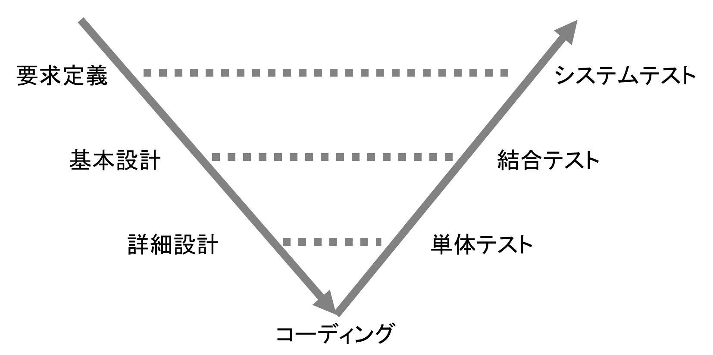

<header-table/>

# {{$page.frontmatter.title}}

# 目次
- [はじめに](#はじめに)
- [概論](#概論)
  - [なぜテストを行うのか](#なぜテストを行うのか)
  - [効率的なテストとは](#効率的なテストとは)
  - [いつテストを作るのか](#いつテストを作るのか)
- [準備](#準備)
  - [dockerコンテナの立ち上げ方](#dockerコンテナの立ち上げ方)
  - [テストの実行](#テストの実行方法)
  - [関数・テストの修正方法](#関数・テストの修正方法)
- [テストを実行する](#テストを実行する)
  - [同値クラス・境界値テスト](#同値クラス・境界値テスト)
  - [APIと関数のモック](#apiと関数のモック)
  - [TDDをやってみる](#tddをやってみる)
- [おわりに](#おわりに)

<br />

# はじめに

本講義はdockerを使用します。  
dockerコンテナのpullには時間を要するため、概論の聴講と並行して「準備 ⇒ [dockerコンテナの立ち上げ方](#dockerコンテナの立ち上げ方)」を実施することを推奨します。

<br />

# 概論

## なぜテストを行うのか

昨今ではIT技術が普及し、炊飯器・電子レンジ・洗濯機といった身の回りのものから、航空機や車など、普段の生活に必須になるものにまで。ソフトウェアが使用されています。  
また、世の中に流通しているソフトウェアはテストが実施されており、その挙動で問題が起こらないことを保証されています。  

<br />

例えばソフトウェアに対し、テストを行われていないと仮定して、個人的に運営しているブログなどで不具合が発生した場合はどうなるでしょうか。  
その不具合によってサーバがダウンしている間は、運営者に広告費が入らないなど、ある程度小規模で済みます。  
（ブログ収益で生計を立てている場合、致命的ですが。）  

<br />

例えば自動車や医療機器などで不具合が発生してしまった場合、どうなるでしょうか。  
最悪の場合、ブレーキが効かない、医療機器のレーザーの出力が多すぎたなど、ソフトウェアの欠陥によって人命が失われてしまう可能性もあります。  

<br />

上記2つの例を上げましたが、大なり小なり、ソフトウェアの不具合によって、どこかの誰かが被害を被ってしまいます。  
そのため、自身が作成するプログラムでは必ず動作のテストを行い、極力不具合を発生させないソフトウェアを作ることを目指す必要があります。  

<br />

## 効率的なテストとは

テストを作成する場合には、不具合をなくすことも重要ですが、テストにコストをかけないことも重要になります。  

<br />

例えば、あるプロダクトに使用される、以下のような仕様の関数```f(x)```があるとします。  
- 関数```f```は、任意の数字```x```の値を取ります。
- 任意の数字```x```は、int型であり、 *-2,147,483,648* から *2,147,483,647* の範囲の値を格納できます。
- 関数```f```は、与えられた数字が *0* から *100* の間であれば```True```、そうでなければ```False```を返却します。

上記の```f(x)```の挙動を100%確かめるためには、 *4,294,967,296* 件のテストを行わなければなりません。  
しかし、実際のプロダクトを作成する場合、1つの関数に対し40億回もテストを実施してしまうと、プロダクトの売上以上に人件費や計算機の運用コストがかかってしまい、会社は倒産の危機に瀕してしまいます。  
  
そのため、後述する「同値クラス・境界値テスト」などの手法によって、最低限かつ最適な回数でテストを行うことが求められます。  

<br />

## いつテストを作るのか

開発を行う際、ウォーターフォール型の開発では、下記の流れになるかと思います。    
右下向きの矢印が設計工程、中央が開発工程、右上向きの矢印がテスト工程になります。  


  
設計における各要素は、テスト工程の各要素に対応することになります。  
例えば、まずは要求定義を行い、ソフトウェアに必要な要件を決めますが、この時点で明確な要件が定義できているのであれば、システムテストで実施するテスト項目を作成しておくことができます。  
  
<br />  

このように各設計段階でテスト項目を作成することで、要件に沿ったテストを作成することができます。  
（何年も開発を行っているとわかるのですが、ものを作ってからテストを作成すると、「今動くものを通すテスト」を無意識的に書いてしまい、要件も網羅できないテストを作ってしまう傾向が出てきます。）  

<br />  

また、後述するTDD（テスト駆動開発）のように、テストを作成して開発を進める手法もあります。  
今回のハンズオンではコーディング・単体テスト段階で実施するテストプログラミングをやってみましょう。

<br />  

# 準備

## dockerコンテナの立ち上げ方

下記のコマンドでdockerコンテナを立ち上げます。  

```bash
# リポジトリのクローン
$ git clone git@github.com:iij/bootcamp.git
$ cd bootcamp/src/server-app/test-hands-on

# コンテナの立ち上げ
$ docker-compose up --build
```

<br />

## テストの実行方法

この項では、任意の「[テストを実行する](#テストを実行する)」の項のテストを実行します。  
  
<br />
  
「[dockerコンテナの立ち上げ方](#dockerコンテナの立ち上げ方)」で、起動中のコンソールとは別のコンソールを開き、実行中のコンテナにアクセスします。  
コマンドを実行すると、コンテナ内のbashが実行されます。  
```bash
$ cd bootcamp/src/server-app/test-hands-on
$ docker-compose exec bootcamp-test bash
```

<br />

下記のコマンドで、テストを実行してみましょう。  
```bash
# ソースは全て"/test-hands-on"配下にあります。
$ cd /test-hands-on

# 任意のテストを実行します。
$ python -m unittest -v exercises.exercise0.test_challenge
```

<br />

## 関数・テストの修正方法

「テストの実行方法」の項でテストを行うと、初回は下記のようにテストが失敗してしまいます。

```bash
$ python -m unittest -v exercises.exercise0.test_challenge
test_success (exercises.exercise0.test_challenge.HelloTestCase) ... FAIL

======================================================================
FAIL: test_success (exercises.exercise0.test_challenge.HelloTestCase)
----------------------------------------------------------------------
Traceback (most recent call last):
  File "/test-hands-on/exercises/exercise0/test_challenge.py", line 7, in test_success
    self.assertEqual(hello(), "goodbye world?")
AssertionError: "hello world" != "goodbye world?"
- hello world
+ goodbye world?
```

<br />

試しに、このテストを修正してみましょう。
テストソースである、 ```/test-hands-on/exercises/exercise0/test_challenge.py``` を開いてみます。  

内容は下記のようになっており、ソース内でimportしている ```hello()``` 関数に対し、文字列"goodbye world?"が来ることを期待してテストを行っているようです。  

```python
import unittest
from .challenge import hello


class HelloTestCase(unittest.TestCase):
    def test_success(self):
        self.assertEqual(hello(), "goodbye world?")
```

<br />

では、テスト対象である ```hello()``` 関数を見てみましょう。  
どうやら、この関数は文字列"hello world"を返すようです。  

```python
def hello():
    return "hello world"
```

<br />

しかし、これではテストソースで期待されている関数の返り値と、実際の関数の返り値が異なってしまっています。  
これがテストが失敗してしまう原因となるため、テストの期待する値を"goodbye world?"から"hello world"に変えてみましょう。

```python
import unittest
from .challenge import hello


class HelloTestCase(unittest.TestCase):
    def test_success(self):
        self.assertEqual(hello(), "hello world")
```

このテストを実行してみると、先程まで失敗していたテストが成功しました。

```bash
python -m unittest -v exercises.exercise0.test_challenge
test_success (exercises.exercise0.test_challenge.HelloTestCase) ... ok

----------------------------------------------------------------------
Ran 1 test in 0.000s

OK
```

<br />

このように、テストソースというものは、テストを実施したい関数に対して動作を確認するように作成・実行します。  
  
本講義では、テストを実施したい関数に対し、テストソースで期待する返り値を設定し、関数の動作確認を行っていきます。

<br />

ちなみに、ローカルのソースファイルの変更は、コンテナ内にも自動で同期されます。  
以降はローカルでファイルを変更し、コンテナ内でテストを実行してみましょう。  

<br />

# テストを実行する

## 1. 同値クラス・境界値テスト

この項では「同値クラステスト」と「境界値テスト」という手法のテストを実施し、効率的なテストについて学びます。

<br />

### 同値クラステストとは
同値クラステストとは「任意の関数```g(x)```の引数```x```に対し、有効である値、無効である値のグループ（有効同値クラス、無効同値クラス）を定義してテストを実施する」ものになります。  
  
例えば、本書の冒頭で出てきた、関数```f(x)```では、```x```の値が *0* から *100* の間であれば有効同値クラス、そうでなければ無効同値クラス、と定義できます。  
仮に「有効同値クラス内の値が入力された場合は正常終了、無効同値クラス内の値が入力された場合は異常終了する」と見た場合、終了の仕方は「正常終了か異常終了か」の2択と見ることができます。  
  
すなわち、関数```f(x)```に対する同値クラステストとは、有効同値である *10* , *50* , *90* など、いくつかの値のグループと、無効同値である *-500* , *-10* , *110* , *500* などの値のグループのテストを実施すればよいことになります。  
  
<br />

### 境界値テストとは
同値クラステストでは「有効/無効と定義した値に対する処理が正しく動くか」を確認できました。  
  
しかし、これでは「有効/無効の範囲は正しいか」が確認できていません。  
こういった場合は境界値テストを実施し、有効値/無効値の境界が、正しく実行されるかのテストを行います。  
  
本書冒頭の関数```f(x)```を例にすると、下限の境界値は *-1* , *0* 、上限の境界値は *100* , *101* となります。  

<br />

### テスト実装例
本書冒頭で定義した、関数```f(x)```がPythonで以下のように定義されているとします。  
```python
def f(x):
  if 0 <= x <= 100:
    return True
  else:
    return False
```
  
<br />
  
上記の関数に対し、同値クラスのテストを定義すると、下記のように書くことができます。  
下記のテストでは、関数```f(x)```に有効同値クラスの値を入力すると```True```、そうでない値を入力すると```False```が返却されることを確認しています。  
```python
import unittest

class ExampleTestCase(unittest.TestCase):
    def test_equivalence_partitioning(self):
        # 有効同値のテスト
        self.assertEqual(f(10), True)
        self.assertEqual(f(50), True)
        self.assertEqual(f(90), True)

        # 無効同値のテスト
        self.assertEqual(f(-500), False)
        self.assertEqual(f(-10), False)
        self.assertEqual(f(110), False)
        self.assertEqual(f(500), False)
```

<br />

境界値テストを定義すると、下記のように書くことができます。  
下記のテストでは、関数```f(x)```に下限の境界値 *-1* , *0* 、上限の境界値 *100* , *101* を入力し、適宜```True```か```False```が返却されることを確認しています。  
```python
import unittest

class ExampleTestCase(unittest.TestCase):
    def test_equivalence_partitioning(self):
        # 下限の境界値
        self.assertEqual(f(-1), False)
        self.assertEqual(f(0), True)

        # 上限の境界値
        self.assertEqual(f(100), True)
        self.assertEqual(f(101), False)
```

<br />

### 問題にチャレンジしよう
dockerコンテナ内の```/test-hands-on/exercises/exercise1/challenge.py```に、商品の申し込みを行う関数```apply(quantity)```が定義されています。  
  
関数は以下の仕様になっています。  
- この関数は、int型の引数```quantity```を取ります。
- 関数```apply()```は、10以上、100以下の値が入力されると、申し込みが成功し、文字列```"accepted"```が返却されます。
- 申し込みに失敗した場合は、文字列```"not accepted"```が返却されます。
- int型以外のデータが入力された場合、例外```TypeError()```が発生し、プログラムが異常終了します。
  
dockerコンテナ内の```/test-hands-on/exercises/exercise1/test_challenge.py```に、作成途中のテストクラス```ApplyTestCase```が定義されているため、関数```apply(quantity)```に対するテストを作成してみましょう。  

<br />

## 2. APIと関数のモック

この項では、Pythonで実行できるAPI（FastAPI）のフレームワークを使用し、APIに対するテストや、関数のモックに触れてみましょう。

<br />

### モックとは
「モックアップ」の略称であり、工業製品などの試作や、店頭展示などのためにつくられる実物大模型のことを指します。  
「[goo辞書 モックアップ（mock-up）](https://dictionary.goo.ne.jp/word/%e3%83%a2%e3%83%83%e3%82%af%e3%82%a2%e3%83%83%e3%83%97/)」より  
  
テストにおけるモックとは、主にクラスや関数の動作をシミュレートするためのオブジェクトになります。  

<br />
  
例えば、以下のような仕様の関数```rock_paper_scissors(shoot)```があるとします。
- 関数```rock_paper_scissors(shoot)```は、じゃんけんを行う関数で、引数```shoot```は文字列"rock", "paper", "scissors"の、いずれかを取ります。
- 関数```rock_paper_scissors()```は、内部で引数に対してじゃんけんの手を出す関数```my_shoot()```が実行されます。
- 関数```my_shoot()```は、それぞれ *1/3* の確率で"rock", "paper", "scissors"のいずれかを取得します。
- 関数```rock_paper_scissors()```は、入力された引数```shoot```が、関数```my_shoot()```の返り値に勝利できる場合 *1* 、引き分けであれば *0* 、敗北であれば *-1* を返します。

上記の関数```rock_paper_scissors()```をテストする場合、内部の関数の返り値が乱数で決定されてしまうため、通常であればテストが実行できません。  
（例えば、1回目の```my_shoot()```を実行した時に"rock"が返却されたとしても、2回目も"rock"が返却されるとは限らないですよね）  
  
こういった場合、関数のモックを使用して、テスト対象の関数内で使用されているクラスや関数をモックし、返り値を固定してシミュレーションを行う必要があります。  
  
<br />

### テスト実装例
関数```rock_paper_scissors(shoot)```が、Pythonで以下のように定義されているとします。  
```python
def rock_paper_scissors(shoot):
  # 1/3で"rock", "paper", "scissors"が格納される
  my_shoot_result = my_shoot()

  # あいこ
  if shoot == my_shoot_result:
    return 0
  
  # 勝利
  if shoot == "rock" and my_shoot_result == "scissors":
    return 1
  if shoot == "paper" and my_shoot_result == "rock":
    return 1
  if shoot == "scissors" and my_shoot_result == "paper":
    return 1
  
  # 敗北
  return -1
```

<br />

上記の関数に対し、モックを使用したテストを定義すると、下記のように書くことができます。  
```python
import unittest
from unittest import mock
# 関数rock_paper_scissors(), my_shoot()は、exampleパッケージに含まれているとする
from . import example

rock_paper_scissors = example.rock_paper_scissors

class ExampleTestCase(unittest.TestCase):
    def test_rock_paper_scissors(self):
        # あいこのテスト
        with mock.patch.object(example, 'my_shoot', return_value="rock"):
            self.assertEqual(rock_paper_scissors("rock"), 0)
        
        # 勝利のテスト
        with mock.patch.object(example, 'my_shoot', return_value="scissors"):
            self.assertEqual(rock_paper_scissors("rock"), 1)

        # 敗北のテスト
        with mock.patch.object(example, 'my_shoot', return_value="paper"):
            self.assertEqual(rock_paper_scissors("rock"), -1)
```

<br />

### FastAPIについて
IIJ Bootcamp「FastAPI でwebアプリを作る」にて紹介されているため、詳細の説明は省きます。
  
下記「テスト実装例」にサンプルを記載するように、簡単にAPIを実装できるフレームワークになっています。

<br />
  
### テスト実装例
FastAPIは、下記のようにAPIを実装できます。  
下記は、ブラウザで```http://localhost:8000/hello```にアクセスすると、データ```{"response": "hello"}```を返却します。
```python
from fastapi import FastAPI

app = FastAPI()

@app.get("/hello")
async def get_hello():
    return {"response": "hello"}
```

<br />

上記のAPIに対し、HTTPステータスやレスポンスを検証するテストは、下記のように書くことができます。
```python
import unittest


class ExampleTestCase(unittest.TestCase):
    def test_api(self):
        # パス"/hello"に接続する
        res = client.get("/hello")

        # HTTPステータスと、レスポンスの取得
        status = res.status_code
        data = res.json()

        # HTTPステータスと、レスポンスの検証
        self.assertEqual(status, 200)
        self.assertEqual(data, {"response": "hello"})
```

<br />

### 問題にチャレンジしよう
dockerコンテナ内の```/test-hands-on/exercises/exercise2/challenge.py```に、FastAPIと、いくつかのエンドポイントが定義されています。  
  
上記のAPIは、コンテナから下記のコマンドで実行することができます。  
```bash
$ python3 -m uvicorn exercises.exercise2.challenge:app --reload --host "0.0.0.0"
```

<br />

API実行後は、ブラウザに下記のURLを入力すると、APIにアクセスできます。
```
http://localhost:8000/
```

<br />

また、APIは下記のエンドポイントがあります。
|パス|詳細|
|---|---|
|/|```{"message": "hello world"}```が返却されます。|
|/echo/{data}|```{"message": "got the message: {data}"}```が返却されます。<br />※```{data}```は、任意の値が代入されます。|
|/gacha|```{"message": "{result}"```が返却されます。<br />※```{result}```は、 *1/100* で文字列"you win"、それ以外で文字列"you lose"が代入されます。|

dockerコンテナ内の```/test-hands-on/exercises/exercise2/test_challenge.py```に、作成途中のテストクラス```ApiTestCase```が定義されているため、上記の仕様のAPIに対するテストを作成してみましょう。  

<br />

## 3. TDDをやってみる

TDDとは、「テスト駆動開発( *Test-Driven* )」のことを指し「テストファースト（テスト優先）」を掲げて開発を行う、 **開発手法** のことになります。　　

テスト手法じゃないよ !!!!
  
<br />

### TDDのやり方

TDDは、任意の開発を行う設計があるうえで、下記のサイクルで開発を行っていきます。
1. Red
    - 動作をしないテストを書く。
2. Green
    - 迅速に、テストを実行できるコードを書いてテストを通すようにする。  
    ※コードが汚くても良い。
3. Refactoring
    - リファクタリングを行い、コード内から重複を削除する。

上記 *1~3* のサイクルを実行し、動きつつコードとリファクタリングによって最適化されたコードを、着実に作っていく手法になります。  

<br />

### テスト実装例
この項で実際に、TDDのサイクルを見てみましょう。  
  
例えば、以下の仕様のソースを作りたいとします。
- クラス内の```do()```関数の、実行回数が3の倍数なら"Fizz"、5の倍数なら"Buzz"を返す、クラス```FizzBuzz```を実装します。
- このクラスは```do()```の実行回数を、内部でカウントします。
- 3でも5の倍数でもないカウントに対しては、そのカウントを返します。

上記のコードをTDDで作成していきましょう。

<br />

### サイクル1 Red

まずは、クラス```FizzBuzz```の関数を作成します。  
下記のコードは、```example.py```のようなパッケージにあると考えてください。  
```python
class FizzBuzz:
    def do(self):
        pass
```

<br />

次に、動作をしないテストを書きましょう。  
```do()```が最初に実行する時は、下記の仕様が適用されます。  

> 3でも5の倍数でもないカウントに対しては、そのカウントを返します。

<br />

とりあえず1回目の実行では「1」が返ってくるはずなので、テストでは「1」を期待してみます。

```python
import unittest
from .fizzbuzz import FizzBuzz


class ExampleTestCase(unittest.TestCase):
    def test_success(self):
        fb = FizzBuzz()
        self.assertEqual(fb.do(), 1)
```

<br />

これを実行すると、当然のようにコケますね。  

```bash
$ python -m unittest -v example.test_fizzbuzz
test_success (example.test_fizzbuzz.ExampleTestCase) ... FAIL
```

<br />

### サイクル1 Green

次は「とりあえず動くコードを書く」ことをします。  
テストでは1が返却されることを期待しているので、1を返しましょう。  
TDDって簡単ですね。  

```python
class FizzBuzz:
    def do(self):
        return 1
```

<br />

動いたよ！！！！やったね！！！！！！！！！  

```bash
$ python -m unittest -v example.test_fizzbuzz
test_success (example.test_fizzbuzz.ExampleTestCase) ... ok
```

<br />

### サイクル1 Refactoring
現在の```FizzBuzz```は、この世界に存在するどんなものよりも洗練されているため、リファクタリングは必要ないですね。  
素晴らしい。  

<br />

### サイクル2 Red

2サイクル目に来ました。  
Redでは、あえてテストを失敗させなければならないため、泣く泣く完成されたテストコードに手を加えましょう。
  
サイクル1 Redでも確認した通り、どうやら```do()```を実行するごとに実行回数を返してくれるそうです。  
実行回数毎に、期待する値を増加させてみましょう。

```python
import unittest
from .fizzbuzz import FizzBuzz


class ExampleTestCase(unittest.TestCase):
    def test_success(self):
        fb = FizzBuzz()
        self.assertEqual(fb.do(), 1)
        self.assertEqual(fb.do(), 2)
        self.assertEqual(fb.do(), 3)
        self.assertEqual(fb.do(), 4)
        self.assertEqual(fb.do(), 5)
        self.assertEqual(fb.do(), 6)
        self.assertEqual(fb.do(), 7)
        self.assertEqual(fb.do(), 8)
        self.assertEqual(fb.do(), 9)
        self.assertEqual(fb.do(), 10)
        self.assertEqual(fb.do(), 11)
        self.assertEqual(fb.do(), 12)
        self.assertEqual(fb.do(), 13)
        self.assertEqual(fb.do(), 14)
        self.assertEqual(fb.do(), 15)
```

<br />

```FizzBuzz```は既に完成されているため、テストをいくら加えようが失敗するはずがないのですが、試してみましょう。  
まあ、やる意味はないと思うのですが（笑）  

```bash
$ python -m unittest -v example.test_fizzbuzz
test_success (example.test_fizzbuzz.ExampleTestCase) ... FAIL
```

<br />

### サイクル2 Green

なんということでしょうか。  
完成されていたと思われた```do()```は、何回実行しても「1」しか返してくれないではないですか。  

誰ですか、こんな実装にしたのは（怒）  

```python
count = 0

class FizzBuzz:
    def do(self):
        global count
        count += 1
        return count
```

<br />

だいぶ雑なコードですが、たぶん動くと思うからテストしましょう。
```bash
$ python -m unittest -v example.test_fizzbuzz
test_success (example.test_fizzbuzz.ExampleTestCase) ... ok
```

<br />

### サイクル2 Refactoring
現在の```FizzBuzz```はグローバル変数が使用されているなど、あまり美しくありません。  
クラスで値を持たせて、インスタンス毎に値を共有させないようにしましょう。

```python
class FizzBuzz:
    def __init__(self):
        self.count = 0

    def do(self):
        self.count += 1
        return self.count
```

<br />

コードを変更しましたが、テストの結果が成功のままであることを確認します。
```bash
$ python -m unittest -v example.test_fizzbuzz
test_success (example.test_fizzbuzz.ExampleTestCase) ... ok
```

<br />

### サイクル3 Red
さて、ここまでで以下の仕様を実装することができました。
- 内部でカウントを保持する。
- 3でも5でもないカウントは、その値を返す。

<br />

次は「3の倍数なら"Fizz"を返す」を実装してみましょう。
  
失敗するテストを書きます。
テスト全体を書くと文字量が多くなりますので、以降は差分で表記します。
```
-        self.assertEqual(fb.do(), 3)
+        self.assertEqual(fb.do(), "Fizz")

-        self.assertEqual(fb.do(), 6)
+        self.assertEqual(fb.do(), "Fizz")

-        self.assertEqual(fb.do(), 9)
+        self.assertEqual(fb.do(), "Fizz")

-        self.assertEqual(fb.do(), 12)
+        self.assertEqual(fb.do(), "Fizz")

-        self.assertEqual(fb.do(), 15)
+        self.assertEqual(fb.do(), "Fizz")
```

<br />

テストは失敗しますね。
```bash
$ python -m unittest -v example.test_fizzbuzz
test_success (example.test_fizzbuzz.ExampleTestCase) ... FAIL
```

<br />

### サイクル3 Green
さて、"Fizz"を返せるように```FizzBuzz```を修正しましょう。

```python
class FizzBuzz:
    def __init__(self):
        self.count = 0

    def do(self):
        self.count += 1
        if self.count % 3 == 0:
            return "Fizz"

        return self.count
```

<br />

テストはオールグリーンです。
```bash
$ python -m unittest -v example.test_fizzbuzz
test_success (example.test_fizzbuzz.ExampleTestCase) ... ok
```

<br />

### サイクル3 Refactoring
特にリファクタリング箇所がないので省きます。

<br />

### サイクル4 Red
最後の仕様になります。  
最後は「5の倍数なら"Buzz"を返す」を実装します。

ただし、3かつ5の倍数であれば"FizzBuzz"が返ることに注意してください。

```
-        self.assertEqual(fb.do(), 5)
+        self.assertEqual(fb.do(), "Buzz")

-        self.assertEqual(fb.do(), 10)
+        self.assertEqual(fb.do(), "Buzz")

-        self.assertEqual(fb.do(), 15)
+        self.assertEqual(fb.do(), "FizzBuzz")
```

<br />

「手がかかる子ほど可愛い」というのは、このことを言うのでしょうか。  
だんだんコンソールに出力される「FAIL」が愛おしく思えてきました。  

きっと「失敗の後は必ず成功する」ということが約束されているからでしょう。

みなさんも、そう思いませんか？

```bash
$ python -m unittest -v example.test_fizzbuzz
test_success (example.test_fizzbuzz.ExampleTestCase) ... FAIL
```

<br />

### サイクル4 Green
"Buzz"および"FizzBuzz"を返せるようにしましょう。

```python
class FizzBuzz:
    def __init__(self):
        self.count = 0

    def do(self):
        self.count += 1
        if self.count % 15 == 0:
            return "FizzBuzz"
        if self.count % 3 == 0:
            return "Fizz"
        if self.count % 5 == 0:
            return "Buzz"

        return self.count
```

<br />

テストも通ります。  
やったか！？（まだ終わりじゃないです。）
```bash
$ python -m unittest -v example.test_fizzbuzz
test_success (example.test_fizzbuzz.ExampleTestCase) ... ok
```

<br />

### サイクル4 Refactoring
最後のリファクタリングになります。  
これで全てを終わらせて、あなたは次のステージへ進むことになるでしょう。

先程書いた```FizzBuzz```では、まだ手続きを共通化し、最適にできる部分があります。

```python
#####################################
# このコードは一例です。
# みんなが読みやすいコードを書こうね！
#####################################
class FizzBuzz:
    def __init__(self):
        self.count = 0

    def _divided(self, count, div):
        return int(not(count % div))

    def do(self):
        self.count += 1
        result = [self.count, "Fizz", "Buzz", "FizzBuzz"]
        index = (self._divided(self.count, 5) << 1) \
            + self._divided(self.count, 3)
        return result[index]
```

<br />

多分これが一番美しいと思います。

```bash
$ python -m unittest -v example.test_fizzbuzz
test_success (example.test_fizzbuzz.ExampleTestCase) ... ok
```

<br />

### 問題にチャレンジしよう
dockerコンテナ内の```/test-hands-on/exercises/exercise3/challenge.py```には、FastAPIで書かれた作りかけのAPIがあります。

上記のAPIは、コンテナから下記のコマンドで実行することができます。  
```bash
$ python3 -m uvicorn exercises.exercise3.challenge:app --reload --host "0.0.0.0"
```

<br />

API実行後は、ブラウザに下記のURLを入力すると、APIにアクセスできます。
```
http://localhost:8000/
```

<br />

みなさんには、TDDを使って上記のAPIを完成させてもらいます。  
作ってもらいたいAPIの仕様は、下記のものになります。
- このAPIは、```/, /add, /sub, /mul, /div```の5つのエンドポイントがあります。
- このAPIはサーバ内部でint型の値を保持し、現在設定されている値を```/```にアクセスすることで、確認することができます。
  また、値は0始まりになります。
- ```/add, /sub, /mul, /div```にパスパラメータを与えると、保持されている値に対し、四則演算を行います（後述）。
- 本APIでは、全てint型で計算を行います。

<br />

以下、APIのパスについて

|パス|詳細|
|---|---|
|/|```{"current_number": {数値}}```が返却されます。<br />{数値}には、サーバで保持されている値が入ります。
|/add/{data}|```{"current_number": {数値}}```が返却されます。<br />{data}に渡された値をサーバで保持している値に加算します。|
|/sub/{data}|```{"current_number": {数値}}```が返却されます。<br />{data}に渡された値をサーバで保持している値から減算します。|
|/mul/{data}|```{"current_number": {数値}}```が返却されます。<br />{data}に渡された値をサーバで保持している値に乗算します。|
|/div/{data}|```{"current_number": {数値}}```が返却されます。<br />{data}に渡された値をサーバで保持している値から除算します。|

<br />

サーバでの値の保持・取得関数は、ソース内に定義されています。  
以下に、使い方の例を記載します。  
```python
# サーバ内に保持されている値を記録します。
set_current_number(1)

# サーバ内に保持されている値を取得します
got_data = get_current_number()
# got_data = 1

set_current_number(123 + 456)
got_data = get_current_number()
# got_data = 579
```

dockerコンテナ内の```/test-hands-on/exercises/exercise3/test_challenge.py```には、本APIが完成すると通るようになる、テスト```test_success()```が定義されています。  
  
上記のテストがOKになるよう、各種APIをTDDを使って作成してみましょう。　  

<br />

# おわりに

一般的にソフトウェアテストというと、専門のテスト部隊があって「Excelにスクショをペタペタ貼るだけでしょ？」というようなイメージを持ち、敬遠される方も少なくはないと思います。  

開発者がテストについて知識を持ち、単体テストで可能な限りの不具合をなくしておくと、後の工程で不具合が少なく済ますことができたり、メリットがあります。  
また、後の工程で発生した不具合の内容を聞いた・見ただけで、どのモジュール同士で問題が起こっているのか目星がつくなど、効率的なトラブルシュートやソフトウェアの理解にも繋がります。  

冒頭でも述べましたが、ソフトウェアにも品質というものがあり、この品質次第で会社の売上に影響が出たり、企業のセキュリティや人命に影響を及ぼしてしまう懸念もあります。  

そのため。開発を行う際には是非テストにも注力をしていただき、ユーザーの満足できるソフトウェアを作れるよう、目指してみてください。  

良いエンジニアライフを！👍  

<credit-footer/>
