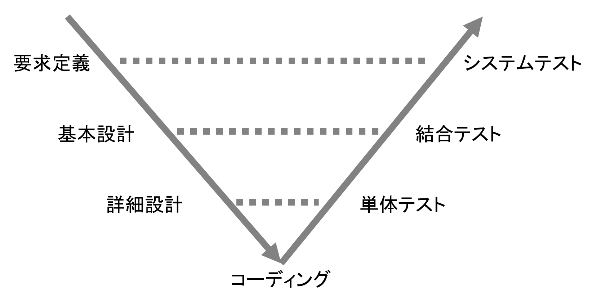

<header-table/>

# {{$page.frontmatter.title}}

# 目次
- [はじめに](#はじめに)
- [概論](#概論)
  - [なぜテストを行うのか](#なぜテストを行うのか)
  - [効率的なテストとは](#効率的なテストとは)
  - [いつテストをするのか](#いつテストをするのか)
- [準備](#準備)
  - [dockerコンテナの立ち上げ方](#dockerコンテナの立ち上げ方)
  - [テストの実行方法](#テストの実行方法)
  - [関数・テストの修正方法](#関数・テストの修正方法)
- [テストを実行する](#テストを実行する)
  - [同値クラス・境界値テスト](#同値クラス・境界値テスト)
  - [APIと関数のモック](#APIと関数のモック)
- [おわりに](#おわりに)


# はじめに

本講義はdockerを使用します。
dockerコンテナのpullには時間を要するため、概論の聴講と並行して「準備 ⇒ [dockerコンテナの立ち上げ方](#dockerコンテナの立ち上げ方)」を実施することを推奨します。

また、ローカルでのコマンド実行なのか、docker コンテナ内でのコマンド実行なのかが分かるよう、以下の記述方法を用います。
基本的には、手を動かすのはローカル、成果物の確認 (テスト実行) は docker コンテナになります。
```terminal
### "$" で始まるものはローカルでのコマンド実行
$ cd bootcamp/src/server-app/test-hands-on

### "root@..." で始まるものは docker コンテナ内でのコマンド実行
root@a3f5935947a2:/# cd /test-hands-on
```

また、ファイルを開くのは以下のように vscode を前提として書いていますが、適宜お手元のエディターに読み替えていただいて問題ありません。
```terminal
### とりあえず vscode にしているが、コードを編集できれば何でもよい
$ code ./exercises/exercise0/test_challenge.py
```


# 概論
## なぜテストを行うのか

昨今ではIT技術が普及し、炊飯器・電子レンジ・洗濯機といった身の回りのものから、航空機や車など、普段の生活に必須になるものにまで、ソフトウェアが使用されています。
また、世の中に流通しているソフトウェアはテストが実施されており、その挙動で問題が起こらないことを保証されています。

例えばソフトウェアに対し、テストを行われていないと仮定して、個人的に運営しているブログなどで不具合が発生した場合はどうなるでしょうか。
その不具合によってサーバがダウンしている間は、運営者に広告費が入らないなど、ある程度小規模で済みます。
（ブログ収益で生計を立てている場合、致命的ですが。）

例えば自動車や医療機器などで不具合が発生してしまった場合、どうなるでしょうか。
最悪の場合、ブレーキが効かない、医療機器のレーザーの出力が多すぎたなど、ソフトウェアの欠陥によって人命が失われてしまう可能性もあります。

上記2つの例を上げましたが、大なり小なり、ソフトウェアの不具合によって、どこかの誰かが被害を被ってしまいます。
そのため、自身が作成するプログラムでは必ず動作のテストを行い、極力不具合を発生させないソフトウェアを作ることを目指す必要があります。

## 効率的なテストとは

テストを作成する場合には、不具合をなくすことも重要ですが、テストにコストをかけないことも重要になります。

例えば、あるプロダクトに使用される、以下のような仕様の関数```f(x)```があるとします。
- 関数```f```は、任意の数字```x```の値を取ります。
- 任意の数字```x```は、int型であり、 *-2,147,483,648* から *2,147,483,647* の範囲の値を格納できます。
- 関数```f```は、与えられた数字が *0* から *100* の間であれば```True```、そうでなければ```False```を返却します。

上記の```f(x)```の挙動を100%確かめるためには、 *4,294,967,296* 件のテストを行わなければなりません。
しかし、実際のプロダクトを作成する場合、1つの関数に対し40億回もテストを実施してしまうと、プロダクトの売上以上に人件費や計算機の運用コストがかかってしまい、会社は倒産の危機に瀕してしまいます。

そのため、後述する「同値クラス・境界値テスト」などの手法によって、最低限かつ最適な回数でテストを行うことが求められます。

## いつテストをするのか

開発を行う際、ウォーターフォール型の開発では、下記の流れになります。
右下向きの矢印が設計工程、中央が開発工程、右上向きの矢印がテスト工程になります。



設計における各要素は、テスト工程の各要素に対応することになります。
例えば、最初の工程では要求定義を行い、ソフトウェアに必要な要件を決めます。そして工程の最後にソフトウェアが要件を満たしているかを確認するためのテスト（システムテスト）行います。

これはコーディングにおいても同様です。書いたコードの機能 1 つ 1 つに問題がないかを単体テストします。
多くの場合、少しをコードを書く → 単体テストを実行 → 少しコードを書く ... というサイクルを繰り返します。

なぜこのようなサイクルを繰り返すかというと、早い段階で単体テストに失敗することで不具合やロジックミスを早期発見でき、後からまとめてデバッグするよりも効率的に問題を修正できるからです。

---

概論は以上です。以降は実際にハンズオンをやってみましょう。今回のハンズオンではコーディング・単体テスト段階で実施するテストプログラミングをやっていきます。

# 準備

## dockerコンテナの立ち上げ方

下記のコマンドでdockerコンテナを立ち上げます。

```terminal
### リポジトリのクローン (既にある場合はスキップで OK)
$ git clone https://github.com/iij/bootcamp.git
$ cd bootcamp/src/server-app/test-hands-on
### clone をスキップした場合は、リポジトリを最新化
$ git pull

### コンテナの立ち上げ
$ docker compose up --build

### 以下のように出力されたら OK.
(中略)
 ✔ Network test-hands-on_default            Created  0.0s
 ✔ Container test-hands-on-bootcamp-test-1  Created  0.0s
Attaching to bootcamp-test-1
```

## テストの実行方法

まずは単純な例で、テストの実行と修正をやってみましょう。

「[dockerコンテナの立ち上げ方](#dockerコンテナの立ち上げ方)」で、起動中のコンソールとは別のコンソールを開き、実行中のコンテナにアクセスします。
コマンドを実行すると、コンテナ内のbashが実行されます。
```terminal
$ cd bootcamp/src/server-app/test-hands-on
$ docker compose exec bootcamp-test bash
```

下記のコマンドで、テストを実行してみましょう。
```terminal
### コードは全て"/test-hands-on"配下にあります。
root@a3f5935947a2:/# cd /test-hands-on

### 任意のテストを実行します。
root@a3f5935947a2:/test-hands-on# uv run pytest -v exercises/exercise0/
```

## 関数・テストの修正方法

「テストの実行方法」の項でテストを行うと、初回は下記のようにテストが失敗してしまいます。

```terminal
root@a3f5935947a2:/test-hands-on# uv run pytest -v exercises/exercise0/
============================= test session starts ==============================
platform linux -- Python 3.14.2, pytest-9.1.1, pluggy-1.6.0 -- /test-hands-on/.venv/bin/python
cachedir: .pytest_cache
rootdir: /test-hands-on
configfile: pyproject.toml
plugins: anyio-4.14.2
collecting ... collected 1 item

exercises/exercise0/test_challenge.py::test_success FAILED               [100%]

=================================== FAILURES ===================================
_________________________________ test_success _________________________________

    def test_success():
>       assert hello() == "hello iij-bootcamp"
E       AssertionError: assert 'hello world' == 'hello iij-bootcamp'
E         
E         - hello iij-bootcamp
E         + hello world

exercises/exercise0/test_challenge.py:5: AssertionError
=========================== short test summary info ============================
FAILED exercises/exercise0/test_challenge.py::test_success - AssertionError: ...
============================== 1 failed in 0.02s ===============================
```

テストコードを開いて確認してみましょう。
```terminal
$ cd bootcamp/src/server-app/test-hands-on
$ code ./exercises/exercise0/test_challenge.py
```

内容は下記のようになっており、コード内でimportしている ```hello()``` 関数に対し、文字列 "hello iij-bootcamp" が来ることを期待してテストを行っているようです。

```python
from .challenge import hello


def test_success():
    assert hello() == "hello iij-bootcamp"
```

では次に、テスト対象である ```hello()``` 関数を見てみましょう。

```terminal
$ code ./exercises/exercise0/challenge.py
```
どうやら、この関数は文字列"hello world"を返すようです。

```python
def hello():
    return "hello world"
```

しかし、これではテストコードで期待されている関数の返り値と、実際の関数の返り値が異なってしまっています。

ちなみにテストコードは、対象の関数やインスタンスが動作したときにどういった振る舞いをするのかを具体的に表現したもの、「動く仕様書」であると考えることができます。
この考えからいくと、今回は仕様を表現している (期待値を書いている) テストコードが正であり、実装に不具合があるといえます。

それでは、テストが失敗する (期待する振る舞いになっていない) 原因である、return 値 "hello world" を "hello iij-bootcamp" に変えてみましょう。

```python
def hello():
    return "hello iij-bootcamp"
```

もう一度テストを実行してみると、先程まで失敗していたテストが成功しました。

```terminal
root@a3f5935947a2:/test-hands-on# uv run pytest -v exercises/exercise0/
============================= test session starts ==============================
platform linux -- Python 3.14.2, pytest-9.1.1, pluggy-1.6.0 -- /test-hands-on/.venv/bin/python
cachedir: .pytest_cache
rootdir: /test-hands-on
configfile: pyproject.toml
plugins: anyio-4.14.2
collecting ... collected 1 item

exercises/exercise0/test_challenge.py::test_success PASSED               [100%]

============================== 1 passed in 0.01s ===============================
```

このように、テストコードというものは、テストを実施したい関数に対して動作を確認するように作成・実行します。
そして動作に問題があれば、適宜実装を (場合によってはテストコードも) 修正していくことになります。

本講義では、テストを実施したい関数に対し、テストコードで期待する返り値を設定し、関数の動作確認を行っていきます。

ちなみに、ローカルでのコードの変更は、コンテナ内にも自動で同期されます。
以降はローカルでファイルを変更し、コンテナ内でテストを実行してみましょう。

# テストを実行する

## 同値クラス・境界値テスト

この項では「同値クラステスト」と「境界値テスト」という手法のテストを実施し、効率的なテストについて学びます。

### 同値クラステストとは
同値クラステストとは「任意の関数```g(x)```の引数```x```に対し、有効である値、無効である値のグループ（有効同値クラス、無効同値クラス）を定義してテストを実施する」ものになります。

例えば、本書の冒頭で出てきた、関数```f(x)```では、```x```の値が *0* から *100* の間であれば有効同値クラス、そうでなければ無効同値クラス、と定義できます。

```
関数fは、任意の数字xの値を取ります。
任意の数字xは、int型であり、 -2,147,483,648 から 2,147,483,647 の範囲の値を格納できます。
関数fは、与えられた数字が 0 から 100 の間であればTrue、そうでなければFalseを返却します。
```

仮に「有効同値クラス内の値が入力された場合は正常終了、無効同値クラス内の値が入力された場合は異常終了する」と見た場合、終了の仕方は「正常終了か異常終了か」の2択と見ることができます。

すなわち、関数```f(x)```に対する同値クラステストとは、有効同値である *10* , *50* , *90* など、いくつかの値のグループと、無効同値である *-500* , *-10* , *110* , *500* などの値のグループのテストを実施すればよいことになります。

### 境界値テストとは
同値クラステストでは「有効/無効と定義した値に対する処理が正しく動くか」を確認できました。

しかし、これでは「有効/無効の範囲は正しいか」が確認できていません。
こういった場合は境界値テストを実施し、有効値/無効値の境界が、正しく実行されるかのテストを行います。

本書冒頭の関数```f(x)```を例にすると、下限の境界値は *-1* , *0* 、上限の境界値は *100* , *101* となります。

### テスト実装例
本書冒頭で定義した、関数```f(x)```がPythonで以下のように定義されているとします。

`exercises/sample1/sample.py` を見てみましょう。

```python
def f(x):
    if 0 <= x <= 100:
        return True
    else:
        return False
```

上記の関数に対し、同値クラスのテストを定義すると、下記のように書くことができます。
下記のテストでは、関数```f(x)```に有効同値クラスの値を入力すると```True```、そうでない値を入力すると```False```が返却されることを確認しています。

`exercises/sample1/test_sample.py` を見てみましょう。

```python
from .sample import f


def test_equivalence_partitioning():
    # 有効同値のテスト
    assert f(10) is True
    assert f(50) is True
    assert f(90) is True

    # 無効同値のテスト
    assert f(-500) is False
    assert f(-10) is False
    assert f(110) is False
    assert f(500) is False
```

境界値テストを定義すると、下記のように書くことができます。
下記のテストでは、関数```f(x)```に下限の境界値 *-1* , *0* 、上限の境界値 *100* , *101* を入力し、適宜```True```か```False```が返却されることを確認しています。

```python
def test_boundary_value():
    # 下限の境界値
    assert f(-1) is False
    assert f(0) is True

    # 上限の境界値
    assert f(100) is True
    assert f(101) is False
```

docker コンテナ内からテスト実行してみましょう。
```terminal
root@a3f5935947a2:/test-hands-on# uv run pytest -v exercises/sample1/
============================= test session starts ==============================
platform linux -- Python 3.14.2, pytest-9.1.1, pluggy-1.6.0 -- /test-hands-on/.venv/bin/python
cachedir: .pytest_cache
rootdir: /test-hands-on
configfile: pyproject.toml
plugins: anyio-4.14.2
collecting ... collected 2 items

exercises/sample1/test_sample.py::test_equivalence_partitioning PASSED   [ 50%]
exercises/sample1/test_sample.py::test_boundary_value PASSED             [100%]

============================== 2 passed in 0.01s ===============================
```

### 問題にチャレンジしよう: 同値クラス・境界値テスト (10分)
```exercises/exercise1/challenge.py```に、商品の申し込みを行う関数```apply(quantity)```が定義されています。

関数は以下の仕様になっています。
- この関数は、int型の引数```quantity```を取ります。
- 関数```apply()```は、10以上、100以下の値が入力されると、申し込みが成功し、文字列```"accepted"```が返却されます。
- 申し込みに失敗した場合は、文字列```"not accepted"```が返却されます。
- int型以外のデータが入力された場合、例外```TypeError()```が発生し、プログラムが異常終了します。

```exercises/exercise1/test_challenge.py```に、作成途中のテスト関数が定義されているため、関数```apply(quantity)```に対するテストを作成してみましょう。

`test_catch_typeerror` メソッドは余裕がある方向けの stretch goal です。例外を検証するテストの書き方については pytest ドキュメントの `pytest.raises` を参照してください。

## APIと関数のモック

この項では、Pythonで実行できるAPI（FastAPI）のフレームワークを使用し、APIに対するテストや、関数のモックに触れてみましょう。

### FastAPIについて
IIJ Bootcamp「FastAPI でwebアプリを作る」にて紹介されているため、詳細の説明は省きます。

下記「テスト実装例」にサンプルを記載するように、簡単にAPIを実装できるフレームワークになっています。

### テスト実装例 (FastAPI)
FastAPIは、下記のようにAPIを実装できます。
下記は、ブラウザで```http://localhost:8000/hello```にアクセスすると、データ```{"response": "hello"}```を返却します。

`exercises/sample2/sample.py` を見てみましょう。

```python
from fastapi import FastAPI

app = FastAPI()


@app.get("/hello")
async def get_hello():
    return {"response": "hello"}
```

上記のAPIに対し、HTTPステータスやレスポンスを検証するテストは、下記のように書くことができます。

`exercises/sample2/test_sample.py` を見てみましょう。

```python
from fastapi.testclient import TestClient
from . import sample

client = TestClient(sample.app)


def test_api():
    # パス"/hello"に接続する
    res = client.get("/hello")

    # HTTPステータスと、レスポンスの取得
    status = res.status_code
    data = res.json()

    # HTTPステータスと、レスポンスの検証
    assert status == 200
    assert data == {"response": "hello"}
```

docker コンテナ内から実行してみましょう。
```terminal
root@a3f5935947a2:/test-hands-on# uv run pytest -v exercises/sample2/
============================= test session starts ==============================
platform linux -- Python 3.14.2, pytest-9.1.1, pluggy-1.6.0 -- /test-hands-on/.venv/bin/python
cachedir: .pytest_cache
rootdir: /test-hands-on
configfile: pyproject.toml
plugins: anyio-4.14.2
collecting ... collected 1 item

exercises/sample2/test_sample.py::test_api PASSED                        [100%]

============================== 1 passed in 0.50s ===============================
```

### 問題にチャレンジしよう: API テスト (10分)
```exercises/exercise2/challenge.py```に、FastAPIと、いくつかのエンドポイントが定義されています。

上記のAPIは、コンテナから下記のコマンドで実行することができます。
```terminal
root@a3f5935947a2:/test-hands-on# uv run uvicorn exercises.exercise2.challenge:app --reload --host "0.0.0.0"
```

API実行後は、ブラウザに下記のURLを入力すると、APIにアクセスできます。
```
http://localhost:8000/
```

また、APIは下記のエンドポイントがあります。
|パス|詳細|
|---|---|
|/|```{"message": "hello world"}```が返却されます。|
|/echo/{data}|```{"message": "got the message: {data}"}```が返却されます。<br />※```{data}```は、任意の値が代入されます。|

```exercises/exercise2/test_challenge.py```に、作成途中のテスト関数が定義されているため、上記の仕様のAPIに対するテストを作成してみましょう。

### モックとは
「モックアップ」の略称であり、工業製品などの試作や、店頭展示などのためにつくられる実物大模型のことを指します。
「[Weblio辞書 モックアップ](https://www.weblio.jp/content/モックアップ)」より

テストにおけるモックとは、主にクラスや関数の動作をシミュレートするためのオブジェクトになります。

例えば、以下のような仕様の関数```rock_paper_scissors(shoot)```があるとします。
- 関数```rock_paper_scissors(shoot)```は、じゃんけんを行う関数で、引数```shoot```は文字列"rock", "paper", "scissors"の、いずれかを取ります。
- 関数```rock_paper_scissors()```は、内部で引数に対してじゃんけんの手を出す関数```my_shoot()```が実行されます。
- 関数```my_shoot()```は、それぞれ *1/3* の確率で"rock", "paper", "scissors"のいずれかを取得します。
- 関数```rock_paper_scissors()```は、入力された引数```shoot```が、関数```my_shoot()```の返り値に勝利できる場合 *1* 、引き分けであれば *0* 、敗北であれば *-1* を返します。

上記の関数```rock_paper_scissors()```をテストする場合、内部の関数の返り値が乱数で決定されてしまうため、通常であればテストが実行できません。
（例えば、1回目の```my_shoot()```を実行した時に"rock"が返却されたとしても、2回目も"rock"が返却されるとは限らないですよね）

こういった場合、関数のモックを使用して、テスト対象の関数内で使用されているクラスや関数をモックし、返り値を固定してシミュレーションを行う必要があります。

### テスト実装例 (モック)

関数```rock_paper_scissors(shoot)```が、Pythonで以下のように定義されているとします。

`exercises/sample3/sample.py` を見てみましょう。

```python
import random


def _my_shoot():
    choices = ["rock", "paper", "scissors"]
    return random.choice(choices)


def rock_paper_scissors(shoot):
    # 1/3で"rock", "paper", "scissors"が格納される
    my_shoot_result = _my_shoot()

    # あいこ
    if shoot == my_shoot_result:
        return 0

    # 勝利
    if shoot == "rock" and my_shoot_result == "scissors":
        return 1
    if shoot == "paper" and my_shoot_result == "rock":
        return 1
    if shoot == "scissors" and my_shoot_result == "paper":
        return 1

    # 敗北
    return -1
```

上記の関数に対し、モックを使用したテストを定義すると、下記のように書くことができます。

`exercises/sample3/test_sample.py` を見てみましょう。

```python
from unittest import mock
from . import sample


def test_rock_paper_scissors():
    # あいこのテスト
    with mock.patch.object(sample, "_my_shoot", return_value="rock"):
        assert sample.rock_paper_scissors("rock") == 0

    # 勝利のテスト
    with mock.patch.object(sample, "_my_shoot", return_value="scissors"):
        assert sample.rock_paper_scissors("rock") == 1

    # 敗北のテスト
    with mock.patch.object(sample, "_my_shoot", return_value="paper"):
        assert sample.rock_paper_scissors("rock") == -1
```

docker コンテナ内から実行してみましょう。
```terminal
root@a3f5935947a2:/test-hands-on# uv run pytest -v exercises/sample3/
============================= test session starts ==============================
platform linux -- Python 3.14.2, pytest-9.1.1, pluggy-1.6.0 -- /test-hands-on/.venv/bin/python
cachedir: .pytest_cache
rootdir: /test-hands-on
configfile: pyproject.toml
plugins: anyio-4.14.2
collecting ... collected 1 item

exercises/sample3/test_sample.py::test_rock_paper_scissors PASSED        [100%]

============================== 1 passed in 0.01s ===============================
```

### 問題にチャレンジしよう: モックテスト (15分)
```exercises/exercise3/challenge.py```に、FastAPIとガチャのAPIが定義されています。

上記のAPIは、コンテナから下記のコマンドで実行することができます。
```terminal
root@a3f5935947a2:/test-hands-on# uv run uvicorn exercises.exercise3.challenge:app --reload --host "0.0.0.0"
```

API実行後は、ブラウザに下記のURLを入力すると、APIにアクセスできます。
```
http://localhost:8000/gacha
```

|パス|詳細|
|---|---|
|/gacha|```{"message": "{result}"}```が返却されます。<br />※```{result}```は、 *1/100* で文字列"you win"、それ以外で文字列"you lose"が代入されます。|

```exercises/exercise3/test_challenge.py```に、作成途中のテスト関数が定義されているため、上記の仕様のAPIに対するテストを作成してみましょう。
返り値が乱数で決定されるため、モックを使って```_exec_gacha```の返り値を固定するのがポイントです。


# おわりに

一般的にソフトウェアテストというと、専門のテスト部隊があって「Excelにスクショをペタペタ貼るだけでしょ？」というようなイメージを持ち、敬遠される方も少なくはないと思います。

開発者がテストについて知識を持ち、単体テストで可能な限りの不具合をなくしておくと、後の工程で不具合が少なく済ますことができたり、メリットがあります。
また、後の工程で発生した不具合の内容を聞いた・見ただけで、どのモジュール同士で問題が起こっているのか目星がつくなど、効率的なトラブルシュートやソフトウェアの理解にも繋がります。

冒頭でも述べましたが、ソフトウェアにも品質というものがあり、この品質次第で会社の売上に影響が出たり、企業のセキュリティや人命に影響を及ぼしてしまう懸念もあります。

そのため、開発を行う際には是非テストにも注力し、ユーザーの満足できるソフトウェアを作れるよう、目指してみてください。

昨今はAIエージェントがテストコードを自動生成することも増えています。しかし、そのコードを読み解き、良し悪しを判断できるのは、テストの基礎を理解した人間です。今日の内容が皆さんの土台になれば幸いです。

良いエンジニアライフを！👍


<credit-footer/>
