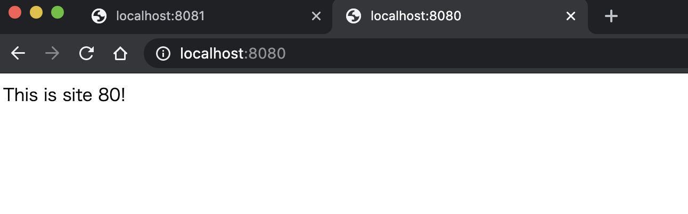

# Apache を触ってみよう

## 事前準備

以下のように`docker pull`をしておいてください。

```bash
docker pull python:3.8.2-buster
```

## Apacheとは

「Apache HTTP Server」はnginxと並んで2台勢力を誇っているWebサーバソフトウェアのひとつです。
CentOSではhttpdという名前になっていたり、単にApacheと呼ばれます。

Webサーバソフトウェアとは、HTTPリクエストを受けて何らかのレスポンスを返すソフトウェアのことで、たとえばHTMLファイルなどをブラウザに返すなどの役割を持っています。
Webを扱ううえでほぼ必ず必要になる、現代に欠かせないソフトウェアです。

### Webサーバソフトウェアのユースケース

ApacheやnginxといったWebサーバの役割を並べてみると、以下のようになります。

- HTMLやテキストファイルの配信
- 動的アプリケーションのホスティング
  - jsonを返すようなWeb APIを含む
- リクエストを中継するプロキシ
- Basic認証などによる認証処理
- ACLなどのアクセス制御・不正な通信への防御

一番初めのWebサーバの役割は、HTTPのリクエストを受け取りそれに対応するHTMLファイルを返すことでした。
今でも大半の役割がこれです。それに付随して認証処理やアクセス制御といったセキュリティ的な役割も持つようになります。

その後CGI(Perl)というしくみが登場し、静的なファイルだけではなく動的にページを生成しそれを返す役割を持つようになりました。
現在はPerlが使われることはめったにありませんが、PHPやRuby・Pythonなどの言語で書かれたプログラムを使って動的なページを扱うことができます。

最近では動的なページ生成を行うプログラムは別で立て、Webサーバはそこに対してリクエストを中継するだけという使われ方も増えてきました。
この時Webサーバは不正なリクエストを弾いたり、後段のアプリケーションの負荷分散や冗長性の確保といった役割を持ちます。
（ほかにもroutingやlogging、アクセス管理などWebサーバに求められる基本的な機能を提供してくれます。）

### 動的アプリケーションのホスティングとモジュール

Apacheやnginxにはモジュールと呼ばれる、いわゆるプラグインのしくみがあります。
さまざまなモジュールが存在していますが、動的アプリケーションのホスティングもこのモジュールを使ってツールを読み込むことで実現します。

PythonやJavaといったWebアプリケーションをモジュールから動作させる大きな利点として、プロセス管理をApacheに任せられることがあります。
Pythonなどの言語は基本的にシングルプロセスで動作するため、同時に多くのリクエストをさばく必要のあるWebアプリケーションとして動作させるには、何らかの方法でマルチプロセス化する必要があります。
Apacheには多くのリクエストをさばくためpre-forkなどのマルチプロセスを管理するしくみが備わっています。ApacheのモジュールからWebアプリケーションを実行することで、Apacheによるプロセス管理の恩恵に預かることができます。

別の手段として、[Unicorn(ruby)](https://yhbt.net/unicorn/)や[Gunicorn(Python)](https://gunicorn.org/)といったツールでマルチプロセス対応をする。あるいはGo言語など初めから並列処理を前提にした言語の場合はApacheでプロセス管理を行う必要はありません。

その場合Webサーバはプロキシとしての役割に集中することとなります。

### Apacheの立ち位置

Apacheは「Apacheソフトウェア財団」によって管理されるOSSで、20年以上の歴史を持ちます。
世界的にもっとも普及したWebサーバで、LAMP（Linux, Apache, MySQL, PHP）環境のひとつにも挙げられます。

以前は大量のリクエストを受けた際にプロセスをforkできず、リクエストを捌き切れなくなる（いわゆるC10K問題）ことが問題視されました。
その際nginxをはじめとして新しいWebサーバーソフトウェアが登場しましたが、Apache自体もworkerやevent MPMといった新しい仕組みを導入し、動作も安定していることからいまだに高いシェアを占めています。

参考: [February 2020 Web Server Survey](https://news.netcraft.com/archives/2020/02/20/february-2020-web-server-survey.html))

## Apacheをインストールして立ち上げる

なにはともあれ動かしてみましょう。今回はdebianをdockerで立ち上げてその中にApacheをインストールしてみます。

まずは以下のようにdockerコンテナの中に入ります。

```bash
docker run --rm -itd --name test-debian -p 8080:80 -p 8081:81 python:3.8.2-buster /bin/bash
docker exec -it test-debian /bin/bash
```

入れたら`apt install`を使ってApacheをインストールしてみましょう。

```bash
apt update

#Get:1 http://security.ubuntu.com/ubuntu focal-security InRelease [107 kB]
#Get:2 http://security.ubuntu.com/ubuntu focal-security/restricted amd64 Packages [4673 B]
#Get:3 http://security.ubuntu.com/ubuntu focal-security/main amd64 Packages [60.9 kB]
#Get:4 http://security.ubuntu.com/ubuntu focal-security/universe amd64 Packages [8273 B]
#~~~略~~~

apt install -y apache2 apache2-dev vim

#Reading package lists... Done
#Building dependency tree
#Reading state information... Done
#~~~略~~~
#Updating certificates in /etc/ssl/certs...
#0 added, 0 removed; done.
#Running hooks in /etc/ca-certificates/update.d...
#done.
```

途中でtimezoneなどを聞かれたら`Asia`や`Tokyo`を選んでください。以下のようにバージョンを表示できれば成功です。

```shell
apache2 -v
#Server version: Apache/2.4.38 (Debian)
#Server built:   2019-10-15T19:53:42
```

以下のようにApacheを起動してください。

```shell
service apache2 start
```

ブラウザを開いて`localhost:8080`にアクセスしてみてください。以下のような画面が表示されれば成功です。


## HTMLファイルの配信 (check1)

表示されたページはデフォルトのHTMLファイルです。これを自分で作成したページに置き換えてみます。
デフォルトではDocument Rootは`/var/www/html/`に設定されています。

::: tip
Document RootはApacheが静的ファイルを配信するためのroot directryです。
:::

この下にある`index.html`ファイルを自分の物に置き換えてみましょう。

```sh
cd /var/www/html/
mv index.html _index.html
echo 'Hello Bootcamp!!' > index.html
```

再び`http://localhost:8080/`を開くと`Hello Bootcamp!!`が表示されるのを確認してください。

::: tip
`http://localhost:8080/` のようにファイル名を指定せずディレクトリ（この場合はルートディレクトリ）を指定した場合、Apacheは`index.html`を返すようにデフォルトで設定されています。
この設定は変更できます。
:::

Document root配下にディレクトリを作成するとブラウザからも同様にアクセスできます。

```sh
mkdir /var/www/html/hoge
echo 'Hello HUGA!!' > /var/www/html/hoge/huga.txt
```

`http://localhost:8080/hoge/huga.txt` にアクセスすると追加したファイルが表示されます。

## VirtualHost の設定

1つのApacheで複数のWebサイトを管理したいことがあります。異なるIPアドレスやアドレス、port番号からアクセスされた時にDocument Rootなどを切り替えたいときは`VirtualHost`を設定することで実現できます。

ここではport番号を`80`と`81`に分けて別々のWebサイトを設定してみます。
(docker起動時にport forwardしているため、手元からは`8080`と`8081`からアクセスできます。)

まずは新しくDocument RootになるディレクトリとHTMLファイルを作成します。

```sh
mkdir /var/www/html/site-80
mkdir /var/www/html/site-81
echo 'This is site 80!' > /var/www/html/site-80/index.html
echo 'This is site 81!' > /var/www/html/site-81/index.html
```

次にApacheの設定をして行きます。やることは

- listen portに81を追加
- virtual host設定の追加

の2つです。listen portの追加は`/etc/apache2/ports.conf`に書きましょう。
以下のように`Listen 80` の下に `Listen 81`の記述を追加します。

```apache
# If you just change the port or add more ports here, you will likely also
# have to change the VirtualHost statement in
# /etc/apache2/sites-enabled/000-default.conf

Listen 80
Listen 81

<IfModule ssl_module>
        Listen 443
</IfModule>

<IfModule mod_gnutls.c>
        Listen 443
</IfModule>

# vim: syntax=apache ts=4 sw=4 sts=4 sr noet
```

VitrualHostの設定は`/etc/apache2/sites-available`の下に作成して行きます。

`/etc/apache2/sites-available/site-80.conf`

```xml
<VirtualHost *:80>
  DocumentRoot /var/www/html/site-80
</VirtualHost>
```

`/etc/apache2/sites-available/site-81.conf`

```xml
<VirtualHost *:81>
  DocumentRoot /var/www/html/site-81
</VirtualHost>
```

設定ファイルを作成したら`a2dissite`、`a2ensite`コマンドを使って設定を有効化しましょう。

:::tip
`a2dissite`や`a2ensite`といったコマンドは実はapache本体の機能ではありません。`a2ensite`は`/etc/apache2/sites-available`以下のファイルのsimlinkを`/etc/apache2/sites-enable`以下に追加するだけのコマンドです。
実際のApacheは`/etc/apache2/sites-enable`以下のコンフィグファイルをloadしているため、コマンドによってサイトが有効化されたように見えるのです。

CentOSなど他のディストリビューションでは、これらのコマンドが存在しないことが多いので注意してください。
:::

```sh
a2dissite 000-default
a2ensite site-80
a2ensite site-81
```

そしてApacheをリスタートします。

```sh
service apache2 reload
```

`localhost:8080`と`localhost:8081`にアクセスしてみてください。意図通りの挙動になっているでしょうか。

|  |
| ------------------------------- |

|  |
| ------------------------------- |

## Basic 認証をかけてみる(check2)

特定ディレクトリにアクセスできる人を制限するために、Basic認証をかけてみましょう。
Basic認証用のmoduleが既にインストールされているはずなので、有効化します。

```sh
a2enmod auth_basic
ls -l /etc/apache2/mods-enabled/auth_basic.load #確認

#lrwxrwxrwx 1 root root 33 May 10 23:22 /etc/apache2/mods-enabled/auth_basic.load -> ../mods-available/auth_basic.load
```

まずはパスワードが記載された`.htpasswd`ファイルを作成します。

```sh
mkdir /etc/apache2/auth/
htpasswd -c /etc/apache2/auth/.htpasswd admin
```

`admin`がユーザ名になります。パスワードの入力を求められるので、適当に設定してください。

次に`/etc/apache2/sites-available/site-81.conf`を以下のように編集します。

```xml
<VirtualHost *:81>
  DocumentRoot /var/www/html/site-81
  <Directory "/var/www/html/site-81">
    AuthUserFile /etc/apache2/auth/.htpasswd
    AuthName "site-81 Authorization"
    AuthType Basic
    Require valid-user
  </Directory>
</VirtualHost>
```

ファイルを編集したら`service apache2 restart`で再起動しましょう。`localhost:8081`にアクセスしてみてください。パスワードが求められ、先ほど入力した認証情報を入れないとアクセスできなくなっているはずです。

## Pythonアプリを動かしてみよう(check3)

ここまではVirtualHostでリソースを管理しつつ、静的なファイルを配信する設定を作ってきました。この章では別のユースケースとして、Pythonで書かれたWebアプリをApache経由で動かす設定を作ってみます。

このdocker imageには既にpythonがインストールされています。

```sh
python --version
#Python 3.8.2
```

Pythonで作成したWebアプリをApacheなどから実行する場合、[WSGI](https://ja.wikipedia.org/wiki/Web_Server_Gateway_Interface)というインタフェース定義に従ってWebアプリを作成します。
これはPython側のインタフェースを規定することで、他のプログラム(今回の場合Apache)から呼び出しやすくする物です。

あとでやるDjangoなど主要なPythonフレームワークはこのAPIに従っているため、Djangoで作成したアプリは今回と同じ手順でApacheから実行することができます。

以下のようなPythonコードを`/var/www/html/site-80`以下に置いておきましょう。

`vim /var/www/html/site-80/app.py`

```python
def application(environ, start_response):
    status = '200 OK'
    output = b'Hello! This is python application!'

    response_headers = [('Content-type', 'text/plain'),
                        ('Content-Length', str(len(output)))]
    start_response(status, response_headers)
    return [output]
```

次にwsgiを動かすためのApache moduleをインストールします。

```sh
pip install mod-wsgi

#Collecting mod-wsgi
#  Using cached mod_wsgi-4.7.1.tar.gz (498 kB)
#Building wheels for collected packages: mod-wsgi
#  Building wheel for mod-wsgi (setup.py) ... done
#  Created wheel for mod-wsgi: filename=mod_wsgi-4.7.1-cp38-cp38-linux_x86_64.whl size=809821 sha256=570b19e67813e819f04ee00006b5c556339e37a03dea4af0021837b098588c0d
#  Stored in directory: /root/.cache/pip/wheels/e9/82/71/1b42d6274a24af477453cecc993213fc8abd15433d80b01e93
#Successfully built mod-wsgi
#Installing collected packages: mod-wsgi
#Successfully installed mod-wsgi-4.7.1
```

インストールすると以下のディレクトリにsoファイルが生成されています。Apacheに読み込ませる必要があるため確認しておきましょう。

```sh
ls /usr/local/lib/python3.8/site-packages/mod_wsgi/server/mod_wsgi-py38.cpython-38-x86_64-linux-gnu.so
```

このファイルを読み込むように、`vim /etc/apache2/mods-available/wsgi.load`を以下のように作成します。

```xml
LoadModule wsgi_module /usr/local/lib/python3.8/site-packages/mod_wsgi/server/mod_wsgi-py38.cpython-38-x86_64-linux-gnu.so
```

moduleを有効化しておきます。

```sh
a2enmod wsgi
```

準備が整ったのでsite-80に先ほどのPythonアプリケーションを読み込ませましょう。
`vim /etc/apache2/sites-available/site-80.conf`

```xml
<VirtualHost *:80>
  DocumentRoot /var/www/html/site-80
  WSGIScriptAlias /app /var/www/html/site-80/app.py
</VirtualHost>
```

最後にApacheをリスタートします。

```sh
service apache2 restart
```

`http://localhost:8080/app` にアクセスしてみてください。`Hello! This is python application!` が表示されるでしょうか。

うまくいったら`app.py`を適当に変更して、Pythonが動的に実行されているのを確認してください。

## パフォーマンス測定（任意課題）

ApacheにはApache Benchというパフォーマンス測定ツールがついています。これを使ってMPMの違いがどのようにパフォーマンスに影響するか確認してみましょう。

Apache Benchは`ab`コマンドで使用できます。試しに先ほどのPythonアプリケーションのパフォーマンスを測定してみましょう。

```sh
ab -n 1000 -c 100 localhost:80/app
```

これは`localhost:80/app`に対して合計10000リクエストを同時に100ずつ実行するコマンドです。
実行結果には成功したリクエスト数や処理時間など、分析に使える情報が書かれています。

同時に1000リクエストを投げても、この時点では捌けていると思います。

```sh
ab -n 1000 -c 1000 localhost:80/app
```

これだけでは面白くないので、pythonアプリにわざとディレイを入れてみましょう。

`vim /var/www/html/site-80/app.py`

```python
import time

def application(environ, start_response):
    time.sleep(3)

    status = '200 OK'
    output = b'Hello! Thisa is python application!'

    response_headers = [('Content-type', 'text/plain'),
                        ('Content-Length', str(len(output)))]
    start_response(status, response_headers)
    return [output]
```

保存したらもう一度

```sh
ab -n 1000 -c 1000 localhost:80/app
```

を試してみましょう。理論上は3秒で全部のリクエストが成功するはずですがどうでしょうか。
さらにもっと数を増やすとどうでしょうか。

他にも色んなことを試してみてください。

- psコマンドでApacheのプロセスを確認して、リクエスト中に何が起こってるのか確認しましょう。
  - apache の再起動直後とパフォーマンス測定後の変化を見てみましょう
- `/var/log/apache2/error.log` を確認してみましょう
- MPM(Multi-Processing-Module)をpreforkやworkerに変えるとどうなるでしょうか
- MPMの設定を変えてパフォーマンスチューニングをしてみましょう

### 補足: MPMの変更

現在のMPMの確認

```sh
apachectl -V | grep MPM

#Server MPM:     event
```

MPMをpreforkに変更する。

```sh
a2dismod mpm_event
a2enmod mpm_prefork
service apache2 restart
apachectl -V | grep MPM

#Server MPM:     prefork
```

<credit-footer/>
