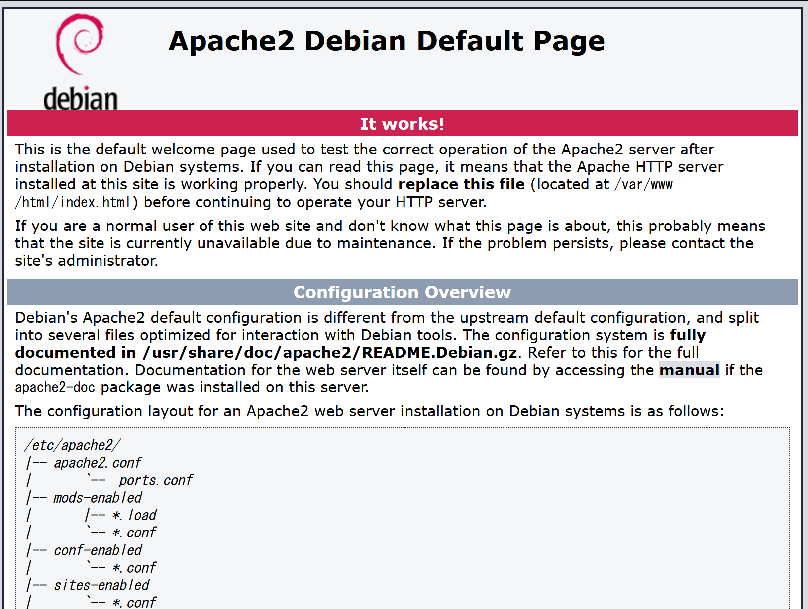
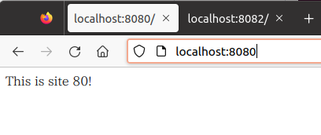
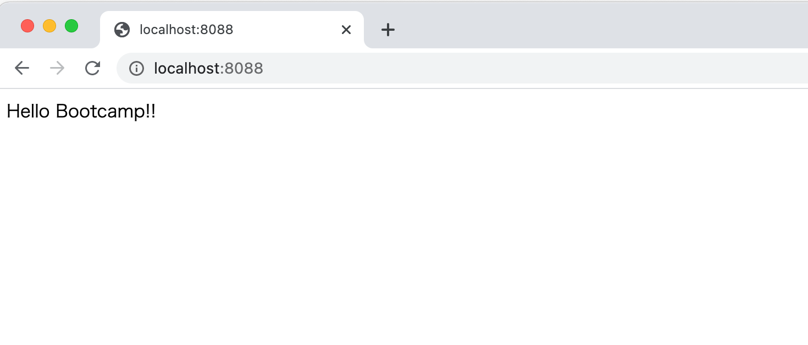
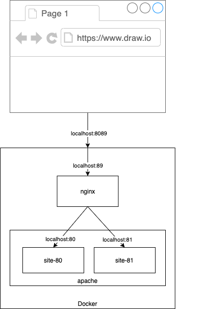

# Apache + Nginx を触ってみよう

## 事前準備

以下のように`docker pull`をしたあと、ハンズオン用のコンテナを立ち上げてログインしてください。

```shell-session
$ docker pull python:3.8.2-buster
3.8.2-buster: Pulling from library/python
90fe46dd8199: Pull complete
35a4f1977689: Pull complete
bbc37f14aded: Pull complete
74e27dc593d4: Pull complete
4352dcff7819: Pull complete
deb569b08de6: Pull complete
98fd06fa8c53: Pull complete
7b9cc4fdefe6: Pull complete
512732f32795: Pull complete
Digest: sha256:003990f08716aef3eb0772f9d9fa8e27603f2b863c56c649a3e9693ddb5b41f1
Status: Downloaded newer image for python:3.8.2-buster
docker.io/library/python:3.8.2-buster
$ docker run --rm -itd --name test-debian -p 8080:80 -p 8081:81 -p 8088:88 -p 8089:89 -p 8443:443 -p 8444:444 python:3.8.2-buster /bin/bash
b8c0df20d1540aba0342362d88d1b0cb9ec94a1877ae1ca5aea5583880193a8e
$ docker exec -it test-debian /bin/bash
root@b8c0df20d154:/#
```

Apacheとnginxをインストールします。

```shell-session
root@b8c0df20d154:/# apt update
Get:1 http://security.debian.org/debian-security buster/updates InRelease [65.4 kB] 
Get:2 http://deb.debian.org/debian buster InRelease [121 kB]                        
Get:3 http://deb.debian.org/debian buster-updates InRelease [51.9 kB]
Get:4 http://security.debian.org/debian-security buster/updates/main amd64 Packages [289 kB]
Get:5 http://deb.debian.org/debian buster/main amd64 Packages [7907 kB]
Get:6 http://deb.debian.org/debian buster-updates/main amd64 Packages [10.9 kB]
Fetched 8445 kB in 18s (471 kB/s)
Reading package lists... Done
Building dependency tree       
Reading state information... Done
103 packages can be upgraded. Run 'apt list --upgradable' to see them.

root@b8c0df20d154:/# apt install -y apache2 apache2-dev nginx vim
Reading package lists... Done
Building dependency tree
Reading state information... Done
The following additional packages will be installed:
  apache2-bin apache2-data apache2-utils autopoint bsdmainutils debhelper dh-autoreconf dh-strip-nondeterminism dwz geoip-database gettext gettext-base
  groff-base intltool-debian libapr1-dev libaprutil1-dbd-sqlite3 libaprutil1-dev libaprutil1-ldap libarchive-cpio-perl libarchive-zip-perl libbrotli1
  libfile-stripnondeterminism-perl libgd3 libgeoip1 libgpm2 libjansson4 libldap-2.4-2 libldap2-dev liblua5.2-0 

~~~略~~~

Setting up dh-strip-nondeterminism (1.1.2-1) ...
Setting up apache2-dev (2.4.38-3+deb10u4) ...
Processing triggers for mime-support (3.62) ...
Processing triggers for hicolor-icon-theme (0.17-2) ...
Processing triggers for libc-bin (2.28-10) ...
root@b8c0df20d154:/#
```

以下のコマンドでバージョンが表示されれば成功です。

```shell-session
root@b8c0df20d154:/# apache2 -v
Server version: Apache/2.4.38 (Debian)
Server built:   2021-12-21T16:50:43

root@b8c0df20d154:/# nginx -v
nginx version: nginx/1.14.2
```

## Webサーバー

いわゆる「Webサーバー」とは、HTTP(Hypertext Transfer Protocol)でリクエストを受け、HTTPでレスポンスを返すソフトウェアの通称です。
僕らがブラウザなどにURLを入力したりリンクをクリックした時、Webページが表示されるのはWebサーバーが要求したURLに対するレスポンスを返しているからです。またスマホアプリの裏で行われるサーバーとのやりとりには多くの場合HTTPが使われており、ここでもWebサーバーがゲームのデータなどをレスポンスとして返しています。

Webサーバのシンプルな機能は前述の通りですが、実際にはユースケースに合わせてさまざまな役割を持ちます。

- HTMLやテキストファイルの配信
- 動的アプリケーションのホスティング
  - JavaやPythonやPHPなど、プログラムで生成されたレスポンスを返す
- HTTP通信を別のサーバーに中継するプロキシ
- Basic認証などによる認証処理
- ACL(Access Control List)によるアクセス制御・不正な通信への防御

簡単なWebサーバーであればどのプログラミング言語でも比較的簡単に作ることができます。
しかし実用上はさまざまな機能をもち、セキュリティやパフォーマンスについても長年改善されてきた専用のソフトウェアが必要になり、それがいわゆる「Webサーバーソフトウェア」と呼ばれるツールです。

有名どころを挙げてみると

- Apache HTTP Server
- IIS
- lighttpd
- nginx

あたりでしょうか。Linuxサーバー上で動かすのであればほぼApacheとnginxの2択になると思います。

また最近ではenvoyやtraefikなど、クラウドやKubernetesという文脈ではプロキシ機能に特化したソフトウェアが使われることも多くなりました。

## Apache と Nginx

### Apache HTTP Server

「Apache HTTP Server」はnginxと並んで2大勢力を誇っているWebサーバソフトウェアのひとつです。 CentOSではhttpdという名前になっていたり、単にApacheと呼ばれます。

「Apache HTTP Server」は「Apacheソフトウェア財団」によって管理されるOSSで、20年以上の歴史を持ちます。 世界的にもっとも普及したWebサーバで、LAMP（Linux, Apache, MySQL, PHP）環境のひとつにも挙げられ、nginxと並んで2大勢力を誇ります。
(参考: [June 2022 Web Server Survey](https://news.netcraft.com/archives/2022/06/30/june-2022-web-server-survey.html))

正式名称は「Apache HTTP Server」ですが、歴史的経緯などからCentOSではhttpdという名前になっていたり、単にApacheと呼ばれたりします。

以前は大量のリクエストを受けた際にプロセスをforkできず、リクエストを捌き切れなくなる（いわゆるC10K問題）ことが問題視されました。 その際nginxをはじめとして新しいWebサーバーソフトウェアが登場しましたが、Apache自体もworkerやevent MPMといった新しい仕組みを導入し、動作も安定していることからいまだに高いシェアを占めています。

### nginx

nginxは2004年頃、当時のWebサーバーが抱えていたパフォーマンス問題(C10K問題)の解決を背景に開発が進められました。
当時からApache 2.2は高機能で信頼性が高く、ある種成熟したソフトウェアでしたが、それに対してnginxは軽量さと高パフォーマンスに焦点をあてて開発されており、Apacheのカバーしきれないユースケースに対して力を発揮しました。

特に後段のサーバーにリクエストを流すリバースプロキシ・ロードバランサ機能がとても使いやすく、どちらかというと軽量なリクエストを大量に捌くのに向いています。

## Apache ハンズオン

### HTMLファイルの配信(check1)

まずはApacheを起動しましょう。

```shell-session
$ service apache2 start
```

ブラウザを開いて[localhost:8080](http://localhost:8080)にアクセスしてみてください。以下のような画面が表示されれば成功です。



表示されたページはデフォルトのHTMLファイルです。これを自分で作成したページに置き換えてみましょう。 デフォルトではDocument Rootは/var/www/html/に設定されています。

::: tip
Document RootはApacheが静的ファイルを配信するためのroot directoryです。
:::

この下にある`index.html`ファイルを自分の物に置き換えてみましょう。

```shell-session
$ cd /var/www/html/
$ mv index.html _index.html
$ echo 'Hello Bootcamp!!' > index.html
```

再び`http://localhost:8080/`を開くと`Hello Bootcamp!!`が表示されるのを確認してください。

::: tip
`http://localhost:8080/` のようにファイル名を指定せずディレクトリ（この場合はルートディレクトリ）を指定した場合、Apacheは`index.html`を返すようにデフォルトで設定されています。
この設定は変更できます。
:::

Document Root配下にディレクトリを作成するとブラウザからも同様にアクセスできます。

```shell-session
$ mkdir /var/www/html/hoge
$ echo 'Hello HUGA!!' > /var/www/html/hoge/huga.txt
```

`http://localhost:8080/hoge/huga.txt` にアクセスすると追加したファイルが表示されます。

アクセスログも確認してみましょう。

```sh
tail /var/log/apache2/access.log
```

### VirtualHost の設定(check2)

1つのApacheで複数のWebサイトを管理したいことがあります。異なるIPアドレスやアドレス、port番号からアクセスされた時にDocument Rootなどを切り替えたいときは`VirtualHost`を設定することで実現できます。

ここではport番号を`80`と`81`に分けて別々のWebサイトを設定してみます。
(docker起動時にport forwardしているため、手元からは`8080`と`8081`からアクセスできます。)

まずは新しくDocument RootになるディレクトリとHTMLファイルを作成します。

```sh
mkdir /var/www/html/site-80
mkdir /var/www/html/site-81
echo 'This is site 80!' > /var/www/html/site-80/index.html
echo 'This is site 81!' > /var/www/html/site-81/index.html
```

次にApacheの設定をして行きます。やることは

- listen portに81を追加
- virtual host設定の追加

の2つです。listen portの追加は`/etc/apache2/ports.conf`に書きましょう。
以下のように`Listen 80` の下に `Listen 81`の記述を追加します。

```apache
# If you just change the port or add more ports here, you will likely also
# have to change the VirtualHost statement in
# /etc/apache2/sites-enabled/000-default.conf

Listen 80
Listen 81

<IfModule ssl_module>
        Listen 443
</IfModule>

<IfModule mod_gnutls.c>
        Listen 443
</IfModule>

# vim: syntax=apache ts=4 sw=4 sts=4 sr noet
```

VitrualHostの設定は`/etc/apache2/sites-available`の下に作成して行きます。

`/etc/apache2/sites-available/site-80.conf`

```xml
<VirtualHost *:80>
  DocumentRoot /var/www/html/site-80
</VirtualHost>
```

`/etc/apache2/sites-available/site-81.conf`

```xml
<VirtualHost *:81>
  DocumentRoot /var/www/html/site-81
</VirtualHost>
```

設定ファイルを作成したら`a2dissite`、`a2ensite`コマンドを使って設定を有効化しましょう。

```sh
a2dissite 000-default
a2ensite site-80
a2ensite site-81
```

:::tip
`a2dissite`や`a2ensite`といったコマンドは実はapache本体の機能ではありません。`a2ensite`は`/etc/apache2/sites-available`以下のファイルのsimlinkを`/etc/apache2/sites-enable`以下に追加するだけのコマンドです。
実際のApacheは`/etc/apache2/sites-enable`以下のコンフィグファイルをloadしているため、コマンドによってサイトが有効化されたように見えるのです。

CentOSなど他のディストリビューションでは、これらのコマンドが存在しないことが多いので注意してください。
:::

そしてApacheをリスタートします。

```sh
service apache2 reload
```

`localhost:8080`と`localhost:8081`にアクセスしてみてください。意図通りの挙動になっているでしょうか。

|  |
| ------------------------------- |

|  |
| ------------------------------- |

## nginx ハンズオン

### HTMLファイルの配信(check3)

次はnginxを使って同じことをしてみましょう。

80 portはすでにApacheが使っているため、nginxのサイトは88 portでリクエストを受け付けるようにします。

```bash
vim /etc/nginx/sites-enabled/default
```

```nginx
server {
        listen 88 default_server;      # 80 => 88 に変更
        listen [::]:88 default_server; # 80 => 88 に変更

        root /var/www/html;

        index index.html index.htm index.nginx-debian.html;

        server_name _;

        location / {
                try_files $uri $uri/ =404;
        }
}
```

変更したらnginxを起動しましょう。

```shell-session
root@6adf6c41f5d8:/# service nginx start
[ ok ] Starting nginx: nginx.
```

[localhost:8088](http://localhost:8088) にアクセスしてみてください。さっき作った`Hello Bootcamp!!`のHTMLが見えていれば成功です。



アクセスログも確認してみましょう。

```sh
tail /var/log/nginx/access.log
```

### ロードバランス(check4)

nginxのプロキシ・ロードバランス機能を使ってみましょう。以下のような構成を作ってみます。



`localhost:8089`にアクセスすると、先ほどApacheで作ったsite-80とsite-89のどちらかにランダムでリクエストをプロキシするようにします。

そのための設定を`/etc/nginx/sites-enabled/proxy`に書いていきます。

```nginx
upstream backend {
        server localhost:80 weight=1;
        server localhost:81 weight=1;
}

server {
        listen 89 default_server;
        listen [::]:89 default_server;

        index index.html index.htm index.nginx-debian.html;

        server_name _;

        location / {
                proxy_pass http://backend;
        }
}
```

`/etc/nginx/sites-enabled/proxy`を作成したらnginxをリスタートしましょう。

```shell-session
root@dea1ac0e1edb:/var/www/html# service nginx restart
[ ok ] Restarting nginx: nginx.
```

[http://localhost:8089/](http://localhost:8089/) にアクセスしてみてください。
site-80とsite-81がランダムで表示されたでしょうか。

### https 対応(check5)

HTTP は基本的に平文でデータをやりとりします。

ということは、途中でパケットキャプチャをすると、やり取りの内容を読み取ることができます。

もしそこにパスワード情報など見られてはいけない情報が含まれていたら...怖いですね。

そこで、SSL/TLS (Secure Socket Layer/Transport Layer Securityの技術)を用いて通信路の暗号化を行うHTTP over SSL いわゆるHTTPS を重要な情報のやりとりを行う際には用いるのが一般的です。

各種Web サーバはこのHTTPS もサポートしており、証明書とそれに対応する秘密鍵さえあれば、簡単に設定することができます。

#### 証明書と秘密鍵の用意

HTTPS で用いる証明書は、権威ある証明局から、これは正当な証明書である、とお墨付きをもらうことで正当性が担保されています。

通常、証明書は以下の手順で入手します。

1. 秘密鍵を生成する
2. 秘密鍵からCSR (Certificate Signing Request) を生成する
3. CSR を証明書に提出し、審査を受け、証明局の持つ秘密鍵で署名された証明書を発行してもらう

ここでは、３を簡略化して1 で生成した鍵で署名する、自己署名証明書(いわゆるオレオレ証明書)を作ります。
このdocker image に既にインストールされている、openssl ツールで一通りの操作を行うことができます。

##### 1. 秘密鍵を生成する

ここではRSA の2048 bit の秘密鍵を生成します。

::: tip
サブコマンドであるgenrsa はRSA 暗号の秘密鍵を生成するものとなります。
:::

```sh
root@b8c0df20d154:/# openssl genrsa 2048 > private.key
Generating RSA private key, 2048 bit long modulus (2 primes)
........................+++++
...........................................................................................................................+++++
e is 65537 (0x010001)
```

##### 2. 秘密鍵からCSR (Certificate Signing Request) を生成する

1 で作った秘密鍵から、CSR を生成します。

::: tip
サブコマンドであるreq はCSR を扱うためのものとなります。
:::

証明書で表示する情報をここで入力することになります。
実際に発行する際は、正当性を担保したい対象であるCommon Name は特に間違わないようにしましょう。

```sh
root@b8c0df20d154:/# openssl req -new -sha256 -key private.key -out server.crt
You are about to be asked to enter information that will be incorporated
into your certificate request.
What you are about to enter is what is called a Distinguished Name or a DN.
There are quite a few fields but you can leave some blank
For some fields there will be a default value,
If you enter '.', the field will be left blank.
-----
Country Name (2 letter code) [AU]:JP
State or Province Name (full name) [Some-State]:Tokyo
Locality Name (eg, city) []:Chiyoda
Organization Name (eg, company) [Internet Widgits Pty Ltd]:IIJ
Organizational Unit Name (eg, section) []:TU
Common Name (e.g. server FQDN or YOUR name) []:localhost
Email Address []:

Please enter the following 'extra' attributes
to be sent with your certificate request
A challenge password []:
An optional company name []:
```

##### 3. 署名された証明書を発行する

1 で作った秘密鍵、2 で作ったCSR から証明書を発行します。

::: tip
サブコマンドであるx509 は、証明書の標準規格を指しています。
-req でinput がCSR であることを示し、signkey に1 で作った秘密鍵を指定することでこれで署名します。
:::


```sh
root@b8c0df20d154:/# openssl x509 -req -in server.csr -out server.crt -signkey private.key -days 365
Signature ok
subject=C = JP, ST = Tokyo, L = Chiyoda, O = IIJ, OU = TU, CN = localhost
Getting Private key
```

出来上がったら、証明書の中を覗いてみましょう。text オプションでテキスト出力をすることができます。

```sh
root@b8c0df20d154:/# openssl x509 -in server.crt -text
Certificate:
    Data:
        Version: 1 (0x0)
        Serial Number:
            45:ef:45:48:8c:89:e0:e5:38:74:f7:fc:21:32:35:eb:2b:bc:10:6b
        Signature Algorithm: sha256WithRSAEncryption
        Issuer: C = JP, ST = Tokyo, L = Chiyoda, O = IIJ, OU = TU, CN = localhost
        Validity
            Not Before: Aug  1 16:29:36 2022 GMT
            Not After : Aug  1 16:29:36 2023 GMT
        Subject: C = JP, ST = Tokyo, L = Chiyoda, O = IIJ, OU = TU, CN = localhost
        Subject Public Key Info:
(...省略...)
```

実際に発行されたものを確認する際は、期間(Not BeforeとNot After)とSubject (CN が正しいか)に特に注意しましょう。

秘密鍵と証明書のペアが正しいかを確認するには、RSA のものならmodulus を比較するのが簡単です。

```sh
root@b8c0df20d154:/# openssl rsa -in private.key -modulus -noout
Modulus=FB1908BE2B1567D1B8B7EE99DF3480CE2EDF57EC73ADD08AE2FA37A833321C84CF49D6D3F8011419BDAF8882B6E610C097D7016D173A14B7343E8D1381B8CF7FCD14CAA5717594B6F5CD586BF13EB90D2673E03B73EB25463333BD8D4384477C7910E87C8CEB2E71C83E59DD3BAC61E9B19DB97545AA9DB96DC995B01B2F96FA62CD8C777C0DA3A0377F71E0F6251CE7511964F2B4604D7F88472759C0178ECA1C7B21F9D9198166F28097A6EDF76925247119B7BEBDA73DD387607BD6320444E0242E127108C234B7F0D6CD6EB7E496747BDE7249E606BA44024E1FCC61E9ADBBE1BDABE51B342AF7DA5801AE36393E11EFFFAE60047EA7FE1E8E9A12FFF57B

root@b8c0df20d154:/# openssl x509 -in server.crt -modulus -noout
Modulus=FB1908BE2B1567D1B8B7EE99DF3480CE2EDF57EC73ADD08AE2FA37A833321C84CF49D6D3F8011419BDAF8882B6E610C097D7016D173A14B7343E8D1381B8CF7FCD14CAA5717594B6F5CD586BF13EB90D2673E03B73EB25463333BD8D4384477C7910E87C8CEB2E71C83E59DD3BAC61E9B19DB97545AA9DB96DC995B01B2F96FA62CD8C777C0DA3A0377F71E0F6251CE7511964F2B4604D7F88472759C0178ECA1C7B21F9D9198166F28097A6EDF76925247119B7BEBDA73DD387607BD6320444E0242E127108C234B7F0D6CD6EB7E496747BDE7249E606BA44024E1FCC61E9ADBBE1BDABE51B342AF7DA5801AE36393E11EFFFAE60047EA7FE1E8E9A12FFF57B
```

#### https の設定

check4 で作ったhttp で受けていたproxy をhttps でも受けられるようにしてみます。

`/etc/nginx/sites-enabled/proxy` の一番下に以下を追記していきます。


```sh
server {
        listen 443 default_server;
        listen [::]:443 default_server;

        ssl on;
        ssl_certificate /server.crt;
        ssl_certificate_key /private.key;

        index index.html index.htm index.nginx-debian.html;

        server_name _;

        location / {
                proxy_pass http://backend;
        }
}
```

追記したら、nginx をリスタートしましょう。

```sh
root@dea1ac0e1edb:/var/www/html# service nginx restart
[ ok ] Restarting nginx: nginx.
```

443 は8443 にポートフォワードの設定が入っているため、8443 ポートにアクセスしてみましょう。
https での通信となるため、URL の先頭がhttp ではなくhttps となっています。

[https://localhost:8443/](https://localhost:8443/)

今回は自己署名証明書であるため、ほとんどのブラウザは正当な証明書ではないと判断し、注意喚起の画面が表示されます。
危険性を承知で閲覧すると、Check4 の時と同様のものが表示されます。

また、ブラウザ上で暗号化に使っている証明書の内容が確認できるので、確認もしてみましょう。

## 追加課題（時間の余った人用）

### apache でもhttpsを設定してみよう

- Apache でもhttps を受けられるようにしてみましょう。
- 8444 を444 にポートフォワードする設定も予め入れてあるので、444 で受ける設定を入れれば、外から8444 でアクセスできます。証明書は同じものを使い回しで構いません。

### Basic認証を追加してみよう

- ApacheとnginxそれぞれにBasic認証を導入し、アクセスした時にユーザー名とパスワードの入力を求められるようにしてください。
- ブラウザで動作確認ができたら、次は`curl`コマンドでアクセスしてBasic認証がどのように動作するか確認してください。

### Pythonアプリを動かしてみよう

Pythonで書かれたWebアプリをApache経由で動かす設定を作ってみます。
このdocker imageには既にpythonがインストールされています。

```sh
python --version
#Python 3.8.2
```

Pythonで作成したWebアプリをApacheなどから実行する場合、[WSGI](https://ja.wikipedia.org/wiki/Web_Server_Gateway_Interface)というインタフェース定義に従ってWebアプリを作成します。
これはPython側のインタフェースを規定することで、他のプログラム(今回の場合Apache)から呼び出しやすくする物です。

あとでやるDjangoなど主要なPythonフレームワークはこのAPIに従っているため、Djangoで作成したアプリは今回と同じ手順でApacheから実行することができます。

以下のようなPythonコードを`/var/www/html/site-80`以下に置いておきましょう。

`vim /var/www/html/site-80/app.py`

```python
def application(environ, start_response):
    status = '200 OK'
    output = b'Hello! This is python application!'

    response_headers = [('Content-type', 'text/plain'),
                        ('Content-Length', str(len(output)))]
    start_response(status, response_headers)
    return [output]
```

次にwsgiを動かすためのApache moduleをインストールします。

```sh
pip install mod-wsgi

#Collecting mod-wsgi
#  Using cached mod_wsgi-4.7.1.tar.gz (498 kB)
#Building wheels for collected packages: mod-wsgi
#  Building wheel for mod-wsgi (setup.py) ... done
#  Created wheel for mod-wsgi: filename=mod_wsgi-4.7.1-cp38-cp38-linux_x86_64.whl size=809821 sha256=570b19e67813e819f04ee00006b5c556339e37a03dea4af0021837b098588c0d
#  Stored in directory: /root/.cache/pip/wheels/e9/82/71/1b42d6274a24af477453cecc993213fc8abd15433d80b01e93
#Successfully built mod-wsgi
#Installing collected packages: mod-wsgi
#Successfully installed mod-wsgi-4.7.1
```

インストールすると以下のディレクトリにsoファイルが生成されています。Apacheに読み込ませる必要があるため確認しておきましょう。

```sh
ls /usr/local/lib/python3.8/site-packages/mod_wsgi/server/mod_wsgi-py38.cpython-38-x86_64-linux-gnu.so
```

このファイルを読み込むように、`vim /etc/apache2/mods-available/wsgi.load`を以下のように作成します。

```xml
LoadModule wsgi_module /usr/local/lib/python3.8/site-packages/mod_wsgi/server/mod_wsgi-py38.cpython-38-x86_64-linux-gnu.so
```

moduleを有効化しておきます。

```sh
a2enmod wsgi
```

準備が整ったのでsite-80に先ほどのPythonアプリケーションを読み込ませましょう。
`vim /etc/apache2/sites-available/site-80.conf`

```xml
<VirtualHost *:80>
  DocumentRoot /var/www/html/site-80
  WSGIScriptAlias /app /var/www/html/site-80/app.py
</VirtualHost>
```

最後にApacheをリスタートします。

```sh
service apache2 restart
```

`http://localhost:8080/app` にアクセスしてみてください。`Hello! This is python application!` が表示されるでしょうか。

うまくいったら`app.py`を適当に変更して、Pythonが動的に実行されているのを確認してください。

またnginxから同様のアプリケーションを動かせるようにしてみてください。

### パフォーマンス測定

ApacheにはApache Benchというパフォーマンス測定ツールがついています。これを使ってMPMの違いがどのようにパフォーマンスに影響するか確認してみましょう。

Apache Benchは`ab`コマンドで使用できます。試しに先ほどのPythonアプリケーションのパフォーマンスを測定してみましょう。

```sh
ab -n 1000 -c 100 localhost:80/app
```

これは`localhost:80/app`に対して合計10000リクエストを同時に100ずつ実行するコマンドです。
実行結果には成功したリクエスト数や処理時間など、分析に使える情報が書かれています。

同時に1000リクエストを投げても、この時点では捌けていると思います。

```sh
ab -n 1000 -c 1000 localhost:80/app
```

これだけでは面白くないので、pythonアプリにわざとディレイを入れてみましょう。

`vim /var/www/html/site-80/app.py`

```python
import time

def application(environ, start_response):
    time.sleep(3)

    status = '200 OK'
    output = b'Hello! Thisa is python application!'

    response_headers = [('Content-type', 'text/plain'),
                        ('Content-Length', str(len(output)))]
    start_response(status, response_headers)
    return [output]
```

保存したらもう一度

```sh
ab -n 1000 -c 1000 localhost:80/app
```

を試してみましょう。理論上は3秒で全部のリクエストが成功するはずですがどうでしょうか。
さらにもっと数を増やすとどうでしょうか。

他にも色んなことを試してみてください。

- psコマンドでApacheのプロセスを確認して、リクエスト中に何が起こってるのか確認しましょう。
  - apache の再起動直後とパフォーマンス測定後の変化を見てみましょう
- `/var/log/apache2/error.log` を確認してみましょう
- MPM(Multi-Processing-Module)をpreforkやworkerに変えるとどうなるでしょうか
- MPMの設定を変えてパフォーマンスチューニングをしてみましょう

### 補足: MPMの変更

現在のMPMの確認

```sh
apachectl -V | grep MPM

#Server MPM:     event
```

MPMをpreforkに変更する。

```sh
a2dismod mpm_event
a2enmod mpm_prefork
service apache2 restart
apachectl -V | grep MPM

#Server MPM:     prefork
```

<credit-footer/>
