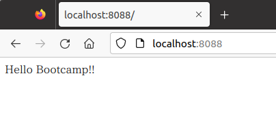

# Apache + Nginx を触ってみよう

## 事前準備

このハンズオンでは、dockerをただの隔離環境として扱っています。

以下のように`docker pull`をしたあと、ハンズオン用のコンテナを立ち上げてログインしてください。

```shell-session
$ docker pull python:3.8.17-bookworm
3.8.17-bookworm: Pulling from library/python
d52e4f012db1: Pull complete
7dd206bea61f: Pull complete
2320f9be4a9c: Pull complete
6e5565e0ba8d: Pull complete
d3797e13cc41: Pull complete
9d8ab9ac5a7d: Pull complete
43ed38f1d568: Pull complete
164b4060be55: Pull complete
Digest: sha256:2ee706fa11ec6907a27f1c5116e9749ad1267336b3b0d53fc35cfba936fae32e
Status: Downloaded newer image for python:3.8.17-bookworm
docker.io/library/python:3.8.17-bookworm
$ docker run --rm -itd --name test-debian -p 8080:80 -p 8082:82 -p 8088:88 -p 8089:89 -p 8443:443 -p 8444:444 python:3.8.17-bookworm /bin/bash
a0da070e286fd52ebb323e5faff9c960014bfcd8eb1e509cb5a12daa9fb9a85e
$ docker exec -it test-debian /bin/bash
root@a0da070e286f:/#
```

Apacheとnginxをインストールします。

```shell-session
root@a0da070e286f:/# apt update
Get:1 http://deb.debian.org/debian bookworm InRelease [151 kB]
Get:2 http://deb.debian.org/debian bookworm-updates InRelease [52.1 kB]
Get:3 http://deb.debian.org/debian-security bookworm-security InRelease [48.0 kB]
Get:4 http://deb.debian.org/debian bookworm/main amd64 Packages [8906 kB]
Get:5 http://deb.debian.org/debian bookworm-updates/main amd64 Packages [4732 B]
Get:6 http://deb.debian.org/debian-security bookworm-security/main amd64 Packages [48.0 kB]
Fetched 9210 kB in 3s (3184 kB/s)
Reading package lists... Done
Building dependency tree... Done
Reading state information... Done
10 packages can be upgraded. Run 'apt list --upgradable' to see them.

root@a0da070e286f:/# apt install -y apache2 apache2-dev nginx neovim
Reading package lists... Done
Building dependency tree... Done
Reading state information... Done
The following additional packages will be installed:
  apache2-bin apache2-data apache2-utils autopoint bsdextrautils debhelper dh-autoreconf dh-strip-nondeterminism dwz gettext gettext-base groff-base intltool-debian iproute2
  libapr1-dev libaprutil1-dbd-sqlite3 libaprutil1-dev libaprutil1-ldap libarchive-cpio-perl libarchive-zip-perl libatm1 libbpf1 libcap2-bin libdebhelper-perl
  libfile-stripnondeterminism-perl libgpm2 libldap-dev libldap2-dev liblua5.3-0 libmail-sendmail-perl libmnl0 libpam-cap libpipeline1 libsctp-dev libsctp1 libsodium23

~~~略~~~

Setting up libapr1-dev (1.7.2-3) ...
Setting up libaprutil1-dev (1.6.3-1) ...
Setting up debhelper (13.11.4) ...
Setting up apache2-dev (2.4.57-2) ...
Processing triggers for libc-bin (2.36-9) ...
Processing triggers for hicolor-icon-theme (0.17-2) ...
root@a0da070e286f:/#
```

以下のコマンドでバージョンが表示されれば成功です。

```shell-session
root@a0da070e286f:/# apache2 -v
Server version: Apache/2.4.61 (Debian)
Server built:   2024-07-07T12:08:26
root@a0da070e286f:/# nginx -v
nginx version: nginx/1.22.1
```

## Webサーバー

いわゆる「Webサーバー」とは、HTTP(Hypertext Transfer Protocol)でリクエストを受け、HTTPでレスポンスを返すソフトウェアの通称です。
僕らがブラウザなどにURLを入力したりリンクをクリックした時、Webページが表示されるのはWebサーバーが要求したURLに対するレスポンスを返しているからです。またスマホアプリの裏で行われるサーバーとのやりとりには多くの場合HTTPが使われており、ここでもWebサーバーがゲームのデータなどをレスポンスとして返しています。

Webサーバのシンプルな機能は前述の通りですが、実際にはユースケースに合わせてさまざまな役割を持ちます。

- HTMLやテキストファイルの配信
- 動的アプリケーションのホスティング
  - JavaやPythonやPHPなど、プログラムで生成されたレスポンスを返す
- HTTP通信を別のサーバーに中継するプロキシ
- Basic認証などによる認証処理
- ACL(Access Control List)によるアクセス制御・不正な通信への防御

簡単なWebサーバーであればどのプログラミング言語でも比較的簡単に作ることができます。
しかし実用上はさまざまな機能をもち、セキュリティやパフォーマンスについても長年改善されてきた専用のソフトウェアが必要になり、それがいわゆる「Webサーバーソフトウェア」と呼ばれるツールです。

有名どころを挙げてみると

- Apache HTTP Server
- IIS
- lighttpd
- nginx

あたりでしょうか。Linuxサーバー上で動かすのであればほぼApacheとnginxの2択になると思います。
(参考: [June 2025 Web Server Survey](https://www.netcraft.com/blog/june-2025-web-server-survey/))

また最近ではenvoyやtraefikなど、クラウドやKubernetesという文脈ではプロキシ機能に特化したソフトウェアが使われることも多くなりました。

## Apache と Nginx

### Apache HTTP Server

「Apache HTTP Server」はnginxと並んで2大勢力を誇っているWebサーバソフトウェアのひとつです。 CentOSではhttpdという名前になっていたり、単にApacheと呼ばれます。

「Apache HTTP Server」は「Apacheソフトウェア財団」によって管理されるOSSで、20年以上の歴史を持ちます。 世界的にもっとも普及したWebサーバで、Webサイトの定番OSS構成としてLAMP（Linux, Apache, MySQL, PHP）があげられる時期もあり、nginxと並んで2大勢力を誇っていました。

正式名称は「Apache HTTP Server」ですが、歴史的経緯などからCentOSではhttpdという名前になっていたり、単にApacheと呼ばれたりします。

以前は大量のリクエストを受けた際にプロセスをforkできず、リクエストを捌き切れなくなる（いわゆるC10K問題）ことが問題視されました。 その際nginxをはじめとして新しいWebサーバーソフトウェアが登場しましたが、Apache自体もworkerやevent MPMといった新しい仕組みを導入し、多機能で動作も安定していることからいまだに高いシェアを占めています。

### nginx

nginxは2004年頃、当時のWebサーバーが抱えていたパフォーマンス問題(C10K問題)の解決を背景に開発が進められました。
当時からApache 2.2は高機能で信頼性が高く、ある種成熟したソフトウェアでしたが、それに対してnginxは軽量さと高パフォーマンスに焦点をあてて開発されており、Apacheのカバーしきれないユースケースに対して力を発揮しました。

特に後段のサーバーにリクエストを流すリバースプロキシ・ロードバランサ機能がとても使いやすく、どちらかというと軽量なリクエストを大量に捌くのに向いています。

2019にF5 Networksに買収された後もNGINXブランドのオープンソースとして提供されていますが、
2024年2月に元開発者がnginxのフォーク版であるfreenginxを立ち上げられています。
また、nginxのディストリビューションとして、luaのjitなどをパッケージングしたOpenRestyも昨今少しずつシェアを伸ばしています。

## Apache ハンズオン

### HTMLファイルの配信(check1)

まずはApacheを起動しましょう。

```shell-session
root@a0da070e286f:/# service apache2 start
```

ブラウザを開いて[localhost:8080](http://localhost:8080)にアクセスしてみてください。以下のような画面が表示されれば成功です。


表示されたページはデフォルトのHTMLファイルです。これを自分で作成したページに置き換えてみましょう。 デフォルトではDocument Rootは/var/www/html/に設定されています。

::: tip
Document RootはApacheが静的ファイルを配信するためのroot directoryです。
:::

この下にある`index.html`ファイルを自分の物に置き換えてみましょう。

```shell-session
root@a0da070e286f:/# mv /var/www/html/index.html /var/www/html/_index.html
root@a0da070e286f:/# echo 'Hello Bootcamp!!' > /var/www/html/index.html
```

再び`http://localhost:8080/`を開くと`Hello Bootcamp!!`が表示されるのを確認してください。

::: tip
`http://localhost:8080/` のようにファイル名を指定せずディレクトリ（この場合はルートディレクトリ）を指定した場合、Apacheは`index.html`を返すようにデフォルトで設定されています。
この設定は変更できます。
:::

Document Root配下にディレクトリを作成するとブラウザからも同様にアクセスできます。

```shell-session
root@a0da070e286f:/# mkdir /var/www/html/hoge
root@a0da070e286f:/# echo 'Hello HUGA!!' > /var/www/html/hoge/huga.txt
```

`http://localhost:8080/hoge/huga.txt` にアクセスすると追加したファイルが表示されます。

アクセスログも確認してみましょう。

```sh
root@a0da070e286f:/# tail /var/log/apache2/access.log
```

### VirtualHost の設定(check2)

1つのApacheで複数のWebサイトを管理したいことがあります。異なるIPアドレスやアドレス、port番号からアクセスされた時にDocument Rootなどを切り替えたいときは`VirtualHost`を設定することで実現できます。

ここではport番号を`80`と`82`に分けて別々のWebサイトを設定してみます。
(docker起動時にport forwardしているため、手元からは`8080`と`8082`からアクセスできます。)

まずは新しくDocument RootになるディレクトリとHTMLファイルを作成します。

```sh
root@a0da070e286f:/# mkdir /var/www/html/site-80
root@a0da070e286f:/# mkdir /var/www/html/site-82
root@a0da070e286f:/# echo 'This is site 80!' > /var/www/html/site-80/index.html
root@a0da070e286f:/# echo 'This is site 82!' > /var/www/html/site-82/index.html
```

次にApacheの設定をして行きます。やることは

- listen portに82を追加
- virtual host設定の追加

の2つです。listen portの追加は`/etc/apache2/ports.conf`に書きましょう。
以下のように`Listen 80` の下に `Listen 82`の記述を追加します。

```apache
# If you just change the port or add more ports here, you will likely also
# have to change the VirtualHost statement in
# /etc/apache2/sites-enabled/000-default.conf

Listen 80
Listen 82

<IfModule ssl_module>
        Listen 443
</IfModule>

<IfModule mod_gnutls.c>
        Listen 443
</IfModule>

```

VitrualHostの設定は`/etc/apache2/sites-available`の下に作成して行きます。

`/etc/apache2/sites-available/site-80.conf`

```xml
<VirtualHost *:80>
  DocumentRoot /var/www/html/site-80
</VirtualHost>
```

`/etc/apache2/sites-available/site-82.conf`

```xml
<VirtualHost *:82>
  DocumentRoot /var/www/html/site-82
</VirtualHost>
```

設定ファイルを作成したら`a2dissite`、`a2ensite`コマンドを使って設定を有効化しましょう。

```sh
root@a0da070e286f:/# a2dissite 000-default
root@a0da070e286f:/# a2ensite site-80
root@a0da070e286f:/# a2ensite site-82
```

:::tip
`a2dissite`や`a2ensite`といったコマンドは実はapache本体の機能ではありません。`a2ensite`は`/etc/apache2/sites-available`以下のファイルのsymlinkを`/etc/apache2/sites-enable`以下に追加するだけのコマンドです。
実際のApacheは`/etc/apache2/sites-enable`以下のコンフィグファイルをloadしているため、コマンドによってサイトが有効化されたように見えるのです。

CentOSなど他のディストリビューションでは、これらのコマンドが存在しないことが多いので注意してください。
:::

そしてApacheをリスタートします。

```sh
root@a0da070e286f:/# service apache2 reload
```

`localhost:8080`と`localhost:8082`にアクセスしてみてください。意図通りの挙動になっているでしょうか。

|  |
| ------------------------------- |

|  |
| ------------------------------- |

## nginx ハンズオン

### HTMLファイルの配信(check3)

次はnginxを使って同じことをしてみましょう。

80 portはすでにApacheが使っているため、nginxのサイトは88 portでリクエストを受け付けるようにします。

```bash
root@a0da070e286f:/# nvim /etc/nginx/sites-enabled/default
```

```nginx
server {
        listen 88 default_server;      # 80 => 88 に変更
        listen [::]:88 default_server; # 80 => 88 に変更

        root /var/www/html;

        index index.html index.htm index.nginx-debian.html;

        server_name _;

        location / {
                try_files $uri $uri/ =404;
        }
}
```

変更したらnginxを起動しましょう。

```shell-session
root@a0da070e286f:/# service nginx start
[ ok ] Starting nginx: nginx.
```

[localhost:8088](http://localhost:8088) にアクセスしてみてください。さっき作った`Hello Bootcamp!!`のHTMLが見えていれば成功です。



アクセスログも確認してみましょう。

```sh
root@a0da070e286f:/# tail /var/log/nginx/access.log
```

### ロードバランス(check4)

nginxのプロキシ・ロードバランス機能を使ってみましょう。以下のような構成を作ってみます。


`localhost:8089`にアクセスすると、先ほどApacheで作ったsite-80とsite-89のどちらかにランダムでリクエストをプロキシするようにします。

そのための設定を`/etc/nginx/sites-enabled/proxy`に書いていきます。

```nginx
upstream backend {
        server localhost:80 weight=1;
        server localhost:82 weight=1;
}

server {
        listen 89 default_server;
        listen [::]:89 default_server;

        index index.html index.htm index.nginx-debian.html;

        server_name _;

        location / {
                proxy_pass http://backend;
        }
}
```

`/etc/nginx/sites-enabled/proxy`を作成したらnginxをリスタートしましょう。

```shell-session
root@a0da070e286f:/# service nginx restart
[ ok ] Restarting nginx: nginx.
```

[http://localhost:8089/](http://localhost:8089/) にアクセスしてみてください。
site-80とsite-82がランダムで表示されたでしょうか。

### コンテンツをキャッシュしてみる(check5)

Webサーバを多段で使う目的の一つとして、キャッシュを行う、というのもあります。
前段のWebサーバでキャッシュすることにより、後段への問い合わせ回数が減り、
レスポンスの高速化を図れます。

参考: [エンジニアブログのキャッシュについての連載記事](https://eng-blog.iij.ad.jp/archives/18584)

nginx ではデフォルトでそのための機能をもっているため、nginx に設定して使ってみましょう。

```bash
root@a0da070e286f:/# nvim /etc/nginx/conf.d/cache.conf
```

```nginx
proxy_cache_path /var/cache/nginx keys_zone=zone1:1m inactive=1d max_size=100m;
proxy_temp_path /var/cache/nginx_tmp;
```

```bash
root@a0da070e286f:/# nvim /etc/nginx/sites-enabled/proxy
```

```nginx
upstream backend {
        server localhost:80 weight=1;
        server localhost:82 weight=1;
}

server {
        listen 89 default_server;
        listen [::]:89 default_server;

        index index.html index.htm index.nginx-debian.html;

        server_name _;

        proxy_cache zone1;                                # 追記 zone1としてキャッシュを行う
        proxy_cache_valid 200 1m;                         # 追記 200を返すものについて1分保持する
        add_header X-Nginx-Cache $upstream_cache_status;  # 追記 キャッシュの利用状態をヘッダに詰めて返す

        location / {
                proxy_pass http://backend;
        }
}
```

変更したらnginxをリスタートしましょう。

```shell-session
root@a0da070e286f:/# service nginx restart
[ ok ] Restarting nginx: nginx.
```

[http://localhost:8089/](http://localhost:8089/) にアクセスしてみてください。
ブラウザの開発者モードなどでヘッダを覗いてみると、X-Nginx-CacheにMISS、あるいはHITが入っています。
今回、わざとキャッシュの保持期間を1分と短くしていますが、2分ほど待った後で改めてアクセスしてみると、MISSが入っているものが観測できるかと思います。

キャッシュが利用できた場合、裏のapacheへのアクセスも省略されたことをログから確認できるはずです。

キャッシュの実体はこの設定だと/var/cache/nginx 下に置かれます。
catしてみてどういうものがキャッシュされているのかも見てみましょう。

## 追加課題（時間の余った人用）
### サーバ側でキャッシュを制御してみる

本編では、nginxに施した設定に従ってキャッシュを行っていました。
保持期間などの設定は、コンテンツサーバであるapacheからこのnginxに返したレスポンスにつけたヘッダによっても制御できます。
URLや条件に従って細かく制御したい場合は、コンテンツサーバ側での制御を行うのがよいでしょう。

この用途として、主にCache-Controlヘッダが用いられます。
no-cacheでこのレスポンスをキャッシュとして使わせない、max-ageで保持期間を指定、などが行えます。

Apacheの設定でHeaderディレクティブを用いてCache-Controlヘッダを付与してみて、挙動の変化を確認してみましょう。

参考:
[エンジニアブログのCache-Control についての詳細](https://eng-blog.iij.ad.jp/archives/18666)
[Mozillaのリファレンス](https://developer.mozilla.org/ja/docs/Web/HTTP/Headers/Cache-Control)

### Basic認証を追加してみよう

- ApacheとnginxそれぞれにBasic認証を導入し、アクセスした時にユーザー名とパスワードの入力を求められるようにしてください。
- ブラウザで動作確認ができたら、次は`curl`コマンドでアクセスしてBasic認証がどのように動作するか確認してください。

### Pythonアプリを動かしてみよう

Pythonで書かれたWebアプリをApache経由で動かす設定を作ってみます。
このdocker imageには既にpythonがインストールされています。

```sh
python --version
#Python 3.8.17
```

Pythonで作成したWebアプリをApacheなどから実行する場合、[WSGI](https://ja.wikipedia.org/wiki/Web_Server_Gateway_Interface)というインタフェース定義に従ってWebアプリを作成します。
これはPython側のインタフェースを規定することで、他のプログラム(今回の場合Apache)から呼び出しやすくする物です。

あとでやるDjangoなど主要なPythonフレームワークはこのAPIに従っているため、Djangoで作成したアプリは今回と同じ手順でApacheから実行することができます。

以下のようなPythonコードを`/var/www/html/site-80`以下に置いておきましょう。

`nvim /var/www/html/site-80/app.py`

```python
def application(environ, start_response):
    status = '200 OK'
    output = b'Hello! This is python application!'

    response_headers = [('Content-type', 'text/plain'),
                        ('Content-Length', str(len(output)))]
    start_response(status, response_headers)
    return [output]
```

次にwsgiを動かすためのApache moduleをインストールします。

```sh
pip install mod-wsgi

Collecting mod-wsgi
  Downloading mod_wsgi-4.9.4.tar.gz (497 kB)
     ━━━━━━━━━━━━━━━━━━━━━━━━━━━━━━━━━━━━━━━━ 497.5/497.5 kB 6.1 MB/s eta 0:00:00
  Preparing metadata (setup.py) ... done
Building wheels for collected packages: mod-wsgi
  Building wheel for mod-wsgi (setup.py) ... done
  Created wheel for mod-wsgi: filename=mod_wsgi-4.9.4-cp38-cp38-linux_x86_64.whl size=734287 sha256=b643e88dbd9659e671e2e014621153066c1061f7c385385b4ccb48b3cc453ee1
  Stored in directory: /root/.cache/pip/wheels/a7/96/89/a6231ee168c52f30f56065d1431e08ee24443e96b402595c85
Successfully built mod-wsgi
Installing collected packages: mod-wsgi
Successfully installed mod-wsgi-4.9.4
```

インストールすると以下のディレクトリにsoファイルが生成されています。Apacheに読み込ませる必要があるため確認しておきましょう。

```sh
ls /usr/local/lib/python3.8/site-packages/mod_wsgi/server/mod_wsgi-py38.cpython-38-x86_64-linux-gnu.so
```

このファイルを読み込むように、`nvim /etc/apache2/mods-available/wsgi.load`を以下のように作成します。

```xml
LoadModule wsgi_module /usr/local/lib/python3.8/site-packages/mod_wsgi/server/mod_wsgi-py38.cpython-38-x86_64-linux-gnu.so
```

moduleを有効化しておきます。

```sh
a2enmod wsgi
```

準備が整ったのでsite-80に先ほどのPythonアプリケーションを読み込ませましょう。
`nvim /etc/apache2/sites-available/site-80.conf`

```xml
<VirtualHost *:80>
  DocumentRoot /var/www/html/site-80
  WSGIScriptAlias /app /var/www/html/site-80/app.py
</VirtualHost>
```

最後にApacheをリスタートします。

```sh
service apache2 restart
```

`http://localhost:8080/app` にアクセスしてみてください。`Hello! This is python application!` が表示されるでしょうか。

うまくいったら`app.py`を適当に変更して、Pythonが動的に実行されているのを確認してください。

またnginxから同様のアプリケーションを動かせるようにしてみてください。

### パフォーマンス測定

ApacheにはApache Benchというパフォーマンス測定ツールがついています。これを使ってMPMの違いがどのようにパフォーマンスに影響するか確認してみましょう。

Apache Benchは`ab`コマンドで使用できます。試しに先ほどのPythonアプリケーションのパフォーマンスを測定してみましょう。

```sh
ab -n 1000 -c 100 localhost:80/app
```

これは`localhost:80/app`に対して合計10000リクエストを同時に100ずつ実行するコマンドです。
実行結果には成功したリクエスト数や処理時間など、分析に使える情報が書かれています。

同時に1000リクエストを投げても、この時点では捌けていると思います。

```sh
ab -n 1000 -c 1000 localhost:80/app
```

これだけでは面白くないので、pythonアプリにわざとディレイを入れてみましょう。

`nvim /var/www/html/site-80/app.py`

```python
import time

def application(environ, start_response):
    time.sleep(3)

    status = '200 OK'
    output = b'Hello! Thisa is python application!'

    response_headers = [('Content-type', 'text/plain'),
                        ('Content-Length', str(len(output)))]
    start_response(status, response_headers)
    return [output]
```

保存したらもう一度

```sh
ab -n 1000 -c 1000 localhost:80/app
```

を試してみましょう。理論上は3秒で全部のリクエストが成功するはずですがどうでしょうか。
さらにもっと数を増やすとどうでしょうか。

他にも色んなことを試してみてください。

- psコマンドでApacheのプロセスを確認して、リクエスト中に何が起こってるのか確認しましょう。
  - apache の再起動直後とパフォーマンス測定後の変化を見てみましょう
- `/var/log/apache2/error.log` を確認してみましょう
- MPM(Multi-Processing-Module)をpreforkやworkerに変えるとどうなるでしょうか
- MPMの設定を変えてパフォーマンスチューニングをしてみましょう

### 補足: MPMの変更

現在のMPMの確認

```sh
apachectl -V | grep MPM

#Server MPM:     event
```

MPMをpreforkに変更する。

```sh
a2dismod mpm_event
a2enmod mpm_prefork
service apache2 restart
apachectl -V | grep MPM

#Server MPM:     prefork
```

<credit-footer/>
