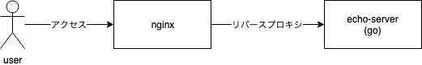
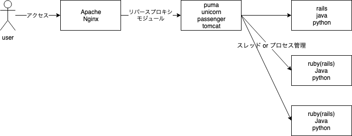

<header-table/>

# 動的アプリのホスティング

## 事前準備

- dockerのインストール

## 前置き

現在では様々な言語、フレームワークを使ってWebサーバーアプリケーションの構築を行います。

- ruby
  - rails
- python
  - Django
- go
- java
- PHP

上はほんの一例ですが、どの言語で作っても「HTTPリクエストを受け取って何らかのレスポンスを返す」というHTTPサーバーとしての機能を持っていることには変わりありません。

しかし実際の本番環境においては、通常これらのアプリケーションがユーザーからのリクエストを直接受けることはしません。必ずApacheやNginxなど専用のWebサーバーを中継してリクエストを処理します。

なぜこんな二度手間のようなことをするかというと理由は色々ありますが、大雑把に以下のようなものです。

- 各言語で実装されたHTTPサーバーの機能が貧弱
- TLSの終端などをアプリケーション側に実装したくない
  - 証明書の管理などをアプリケーションでやらないといけない
- HTTPサーバーとして信頼性の高いものを使いたい
  - 脆弱性対策などが一通り行われている
  - 不具合が少ない
    - HTTPサーバーとしての機能に特化している
    - 世界中で多く使われているため修正が活発

このハンズオンではフロントとしてApacheまたはNginxを利用し、裏側のRailsやGo製アプリケーションと連携するような構成を手元で作ってみたいと思います。

## go + nginx

### echo-serverの起動

まずは比較的シンプルな例としてGo言語で作られたアプリケーションとNginxを連携させてみましょう。なぜシンプルなのかはあとでお話しします。

以下のコマンドでハンズオン用のdockerコンテナにログインしてください。

```bash
$ docker run -p 8080:8080 -p 80:80 -it --rm regunorf/bootcamp-go-nginx /bin/bash
```

このコンテナの中にはgo言語で書かれたリクエストを返すだけのシンプルなechoサーバーと、nginxがインストールされています。ソースコードとDockerfileは [ここ](https://github.com/ryoya-fujimoto/go-echo-server) にあります。

dockerにログインしたら試しにecho-serverを起動してみましょう。

```bash
root@4dd714ba5f7b:/# echo-server --bind 0.0.0.0:8080
```

8080 portで動き始めるので、別のターミナルを開いてcurlを叩くかブラウザからアクセスしてみましょう。

```bash
$ curl -H 'Content-Type:application/json' -H 'Accept-Encoding:gzip,deflate' -d "{"bootcamp":"true"}" localhost:8080
User-Agent: curl/7.54.0
Accept: */*
Content-Type: application/json
Accept-Encoding: gzip,deflate
Content-Length: 15

{bootcamp:true}
```

送信したリクエストのheaderとbodyが出力されます。ブラウザでアクセスするとどのようなヘッダーが送信されているか面白いので試してみてください。

### nginxと連携させる

echo-serverを立ち上げて外からアクセスできるようにはできましたが、echo-serverにはTLSの終端機能もHTMLなどの静的ファイル配信機能もありません。頑張って実装してもいいですが、ここではnginxにその辺りをやってもらいましょう。
(TLSは今回やりませんが・・・)



まずはecho-serverの起動方法を変更します。今は外からecho-serverに直接アクセスできてしまいますが、それでは都合が悪いためサーバー内部からしかアクセスできないようにします。

ついでにecho-server起動中も他の作業ができるようにバックグラウンドで実行させておきましょう。echo-serverが起動しているかどうかは`ps`コマンドなどで確認できます。

```bash
$ echo-server --bind 127.0.0.1:8080 &

# 起動できているか確認
$ ps -aux | grep echo-server
```

バックグラウンドで起動している他に、先ほどのecho-server起動と何が違うでしょうか。試しに先ほどと同じようにブラウザや手元のマシンからcurlなどでアクセスみてもecho-serverにアクセスできません。

しかしecho-serverを起動したdockerの中で`localhost:8080`にアクセスするとレスポンスが返ってきます。

```bash
# 手元のwindowsマシンでcurlやブラウザを開くとアクセスできない
$ curl localhost:8080
curl: (52) Empty reply from server

# dockerの中からはアクセスできる
root@4dd714ba5f7b:/# curl localhost:8080
127.0.0.1:40468 | GET / | time: 2019-07-21 02:02:09.250992846 +0000 UTC
User-Agent: curl/7.58.0
Accept: */*


```

最初の例では`bind`オプションに`0.0.0.0:8080`を指定していました。`0.0.0.0`はざっくり言うと「全てのアドレス」と言う意味で、この場合は「全てのアドレスからのリクエストを受け付ける」と言う設定になります。

反対に2回目の`127.0.0.1:8080`は`127.0.0.1 = localhost`からのリクエストからしか受け付けないため、上のような挙動になっています。

ではこの`localhost`で公開されているecho-serverに、nginxを通してアクセスできるようにしてみましょう。
nginxの設定ファイルは`/etc/nginx/nginx.conf`にありますが、設定を見やすくするため`/etc/nginx/conf.d/`の下に新しく設定ファイルを作っていきます。

`/etc/nginx/conf.d/bootcamp.conf`というファイルを以下のように作成してください。

```
server {
    listen       80 default_server;
    server_name  _;

    root /var/www/html;
    location / {
        try_files $uri $uri/ =404;
    }
    location /echo-server {
        proxy_pass http://127.0.0.1:8080;
    }
}
```

次にdefaultで作られている設定を削除しておきます（上の内容をこちらに追記しても構いません）。

```bash
$ rm /etc/nginx/sites-enabled/default
```

nginxを起動します

```bash
$ nginx
```

ブラウザなどから`localhost`にアクセスしてみてください。するとnginxのwelcomeページが表示されるはずです。そして`localhost/echo-server`というパスにアクセスするとecho-serverからリクエストが返ってきます。

```bash
$ curl -H 'Content-Type:application/json' -d "{"bootcamp":"true"}" localhost/echo-server
Connection: close
Content-Length: 15
User-Agent: curl/7.54.0
Accept: */*
Content-Type: application/json
Accept-Encoding: gzip,deflate

{bootcamp:true}
```

無事にgoアプリ＋nginxな構成を作ることができました。今回はecho-serverとの連携に`localhost`を使いましたが、unixドメインソケットを介して連携することもよく行われます。

## ruby + apache

### 前書き

Go言語やNode.jsで作られたアプリケーションは、大抵の場合複数のリクエストを並行して捌くことが可能です。これはGoの場合はgoroutine、Node.jsは非同期IOという形で並行処理をデフォルトで扱えるような設計になっているためです。

そのため上の例ではnginxからのリクエストを単にそれぞれのアプリケーションに投げつければ、複数のユーザーからアクセスが同時にあっても問題はありませんでした。

それに対してjavaやruby、pythonなどで作られたアプリケーションは通常１度に１つの処理しか行えないため、「マルチプロセス」や「マルチスレッド」という形で並行処理を実現します。そのためプロセスやスレッドを管理するためのソフトウェアが追加で必要になります。



このようなソフトウェアの例としては以下のようなものがあります

- ruby
  - puma
  - unicorn
  - passenger
- java
  - tomcat
- python
  - uWSGI?

pumaやunicornはアプリケーション側に組み込んで並行処理機能を追加するもの、passengerやtomcatはwebサーバー側(Apache)に組み込んでアプリケーションを動かすもの、といったようにツールによって動かし方は様々です。

### 動かしてみる

ここではrubyのアプリケーションをwebサーバーと連携させてみましょう。最近だとpumaやunicornが使われることが多いですが、その場合は先ほどのGoの例と同じようにpumaやunicornをwebアプリとして起動させて、リバースプロキシで連携させます。

同じことをしてもつまらないので、passengerを使ってモジュール組み込みな例を動かしてみましょう。このようにモジュールとして動作させる場合はnginxよりもApacheの方が便利です。

先ほどと同じようにdockerで練習用のコンテナを起動します。

```bash
$ docker run -p 80:80 --rm -it regunorf/bootcamp-passenger /bin/bash
```

ソースコードは [ここ](https://github.com/ryoya-fujimoto/ruby-echo-server) にあります。アプリケーションは`/app`ディレクトリにあります。

```bash
root@f8fb220a22d0:/app# ls -l
total 20
-rw-r--r-- 1 root root  66 Jul 21 05:15 Dockerfile
-rw-r--r-- 1 root root  45 Jul 21 04:59 Gemfile
-rw-r--r-- 1 root root 325 Jul 21 05:00 Gemfile.lock
-rw-r--r-- 1 root root  64 Jul 21 04:57 README.md
-rw-r--r-- 1 root root 319 Jul 21 05:12 app.rb
```

コンテナには既にrubyの環境が作られているので、`ruby main.rb`するとアプリケーションが起動します。

ではpassengerの環境を作っていきましょう。まずはgemコマンドでpassengerをインストールします。

```bash
root@f8fb220a22d0:/app# gem install passenger
Fetching passenger-6.0.2.gem
Building native extensions. This could take a while...
Successfully installed passenger-6.0.2
1 gem installed
```

そしてapache用のモジュール（プラグイン）をビルドするコマンドを実行します。

```bash
root@f8fb220a22d0:/app# passenger-install-apache2-module
```

TUIが起動するので、今回はrubyだけを選択してエンターを押します。
すると足りてないライブラリが表示されるので、言われるがままインストールしましょう。

```bash
apt-get install -y apache2-dev libapr1-dev libaprutil1-dev
```

もう一度実行するとモジュールのビルドが始まります（結構かかる）。

```bash
root@f8fb220a22d0:/app# passenger-install-apache2-module
```

成功すると`Please edit your Apache configuration file, and add these lines:`というメッセージが表示されます。そこに書いてある内容をapacheの設定ファイルに追記せよとのこと。

```
LoadModule passenger_module /usr/local/bundle/gems/passenger-6.0.2/buildout/apache2/mod_passenger.so
<IfModule mod_passenger.c>
    PassengerRoot /usr/local/bundle/gems/passenger-6.0.2
    PassengerDefaultRuby /usr/local/bin/ruby
</IfModule>
```

一旦enterを押して抜けましょう。apacheの設定ファイルに以下の内容を追加します。

```bash
root@0111e4e14e6d:/app# vi /etc/apache2/conf-enabled/bootcamp.conf
```

```
LoadModule passenger_module /usr/local/bundle/gems/passenger-6.0.2/buildout/apache2/mod_passenger.so
<IfModule mod_passenger.c>
    PassengerRoot /usr/local/bundle/gems/passenger-6.0.2
    PassengerDefaultRuby /usr/local/bin/ruby
</IfModule>

<VirtualHost *:80>
  ServerName bootcamp
  DocumentRoot "/app/public"
  RackEnv production
</VirtualHost>

<Directory /app/public>
  Options FollowSymlinks Includes
  AllowOverride All
  AddType text/html .html

  Require all granted
</Directory>
```

apacheを起動します。ServerNameについて警告が出ますがひとまず問題ありません。

```bash
root@0111e4e14e6d:/app# apachectl restart
```

無事起動できたらホストのブラウザなどからアクセスしてみましょう。sinatraアプリが動いていれば成功です。

```bash
$ curl -H 'Content-Type:application/json' -d "{"bootcamp":"true"}" localhost
```

１つ目の例と違うのは、sinatraアプリケーションが単体で起動してlocalhostなどをlistenしているのではなく、apacheの一部として起動している点です。この場合はechoアプリケーションを再起動するためにはApacheごと再起動しなければいけません。

## 追加

- apacheが起動している状態で`/app`以下の`app.rb`を変更してみましょう。
- pumaまたはunicornを使ってapacheまたはnginxとrubyアプリケーションを連携させてみましょう。

<credit-footer/>
