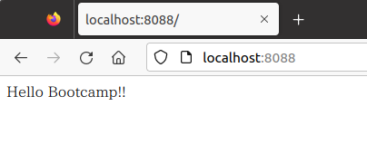

# SSL/TLS を触ってみよう

## 事前準備

このハンズオンでは、dockerをただの隔離環境として扱っています。

apache/nginx のハンズオンの際のものが残っているのであればそのまま流用できますので、以下の手順はスキップしてください。

以下のように`docker pull`をしたあと、ハンズオン用のコンテナを立ち上げてログインしてください。

```shell-session
$ docker pull python:3.8.17-bookworm
3.8.17-bookworm: Pulling from library/python
d52e4f012db1: Pull complete
7dd206bea61f: Pull complete
2320f9be4a9c: Pull complete
6e5565e0ba8d: Pull complete
d3797e13cc41: Pull complete
9d8ab9ac5a7d: Pull complete
43ed38f1d568: Pull complete
164b4060be55: Pull complete
Digest: sha256:2ee706fa11ec6907a27f1c5116e9749ad1267336b3b0d53fc35cfba936fae32e
Status: Downloaded newer image for python:3.8.17-bookworm
docker.io/library/python:3.8.17-bookworm
$ docker run --rm -itd --name test-debian -p 8080:80 -p 8082:82 -p 8088:88 -p 8089:89 -p 8443:443 -p 8444:444 python:3.8.17-bookworm /bin/bash
a0da070e286fd52ebb323e5faff9c960014bfcd8eb1e509cb5a12daa9fb9a85e
$ docker exec -it test-debian /bin/bash
root@a0da070e286f:/#
```

nginxをインストールします。

```shell-session
root@a0da070e286f:/# apt update
Get:1 http://deb.debian.org/debian bookworm InRelease [151 kB]
Get:2 http://deb.debian.org/debian bookworm-updates InRelease [52.1 kB]
Get:3 http://deb.debian.org/debian-security bookworm-security InRelease [48.0 kB]
Get:4 http://deb.debian.org/debian bookworm/main amd64 Packages [8906 kB]
Get:5 http://deb.debian.org/debian bookworm-updates/main amd64 Packages [4732 B]
Get:6 http://deb.debian.org/debian-security bookworm-security/main amd64 Packages [48.0 kB]
Fetched 9210 kB in 3s (3184 kB/s)
Reading package lists... Done
Building dependency tree... Done
Reading state information... Done
10 packages can be upgraded. Run 'apt list --upgradable' to see them.

root@a0da070e286f:/# apt install -y apache2 apache2-dev nginx neovim
Reading package lists... Done
Building dependency tree... Done
Reading state information... Done
The following additional packages will be installed:
  apache2-bin apache2-data apache2-utils autopoint bsdextrautils debhelper dh-autoreconf dh-strip-nondeterminism dwz gettext gettext-base groff-base intltool-debian iproute2
  libapr1-dev libaprutil1-dbd-sqlite3 libaprutil1-dev libaprutil1-ldap libarchive-cpio-perl libarchive-zip-perl libatm1 libbpf1 libcap2-bin libdebhelper-perl
  libfile-stripnondeterminism-perl libgpm2 libldap-dev libldap2-dev liblua5.3-0 libmail-sendmail-perl libmnl0 libpam-cap libpipeline1 libsctp-dev libsctp1 libsodium23

~~~略~~~

Setting up libapr1-dev (1.7.2-3) ...
Setting up libaprutil1-dev (1.6.3-1) ...
Setting up debhelper (13.11.4) ...
Setting up apache2-dev (2.4.57-2) ...
Processing triggers for libc-bin (2.36-9) ...
Processing triggers for hicolor-icon-theme (0.17-2) ...
root@a0da070e286f:/#
```

以下のコマンドでバージョンが表示されれば成功です。

```shell-session
root@a0da070e286f:/# nginx -v
nginx version: nginx/1.22.1
```

### nginx の初期設定

nginxのサイトは88 portでリクエストを受け付けるようにします。

```bash
root@a0da070e286f:/# echo 'Hello Bootcamp!!' > /var/www/html/index.html
root@a0da070e286f:/# nvim /etc/nginx/sites-enabled/default
```

```nginx
server {
        listen 88 default_server;      # 80 => 88 に変更
        listen [::]:88 default_server; # 80 => 88 に変更

        root /var/www/html;

        index index.html index.htm index.nginx-debian.html;

        server_name _;

        location / {
                try_files $uri $uri/ =404;
        }
}
```

変更したらnginxを起動しましょう。

```shell-session
root@a0da070e286f:/# service nginx start
[ ok ] Starting nginx: nginx.
```

[localhost:8088](http://localhost:8088) にアクセスしてみてください。`Hello Bootcamp!!`のHTMLが見えていれば成功です。



アクセスログも確認してみましょう。

```sh
root@a0da070e286f:/# tail /var/log/nginx/access.log
```

ここまでが事前作業となります。間に合わなければ、座学の間で準備してください。

## SSL/TLS とは　

例えば、HTTP は基本的に平文でデータをやりとりします。

ということは、途中でパケットキャプチャをすると、やり取りの内容を読み取ることができます。

もしそこにパスワード情報など見られてはいけない情報が含まれていたら...怖いですね。

そこで、SSL/TLS (Secure Socket Layer/Transport Layer Securityの技術)を用いて通信路の暗号化を行うHTTP over SSL いわゆるHTTPS を重要な情報のやりとりを行う際には用いるのが一般的となっています。

SSL/TLSは通信路の暗号化として汎用性のあるものとなっており、HTTPに限らず様々なプロトコルでの暗号化に用いられています。

- ファイル転送: FTP -> FTPS
- メール: SMTP -> SMTPS, POP3 -> POP3S, IMAP -> IMAPS

プロトコルとまではなっていなくても、mysqlなどでもレプリケーションの経路を暗号化するために用いられていたりもします。

では、そのSSL/TLS の概要と歴史について、はIPAの資料がよくまとまっているため、そちらの2章1節を読むのがよいでしょう。
ざっくりというと、公開鍵暗号を用いて共通鍵を共有し、その共通鍵を用いて以後の経路の暗号化を行う、というものになります。

[TLS 暗号設定ガイドライン](https://www.ipa.go.jp/security/crypto/guideline/ssl_crypt_config.html)

この講義では、主にHTTPSをメインに触っていこうと思います。
また、以下ではSSL/TLSの総称としてTLSということにします。

## 証明書 とは

TLSは公開鍵暗号と共通鍵暗号の組み合わせという話をしました。
この公開鍵暗号の部分を担う重要なパーツとして証明書があります。

証明書には、以下の役割があります。
- 公開鍵暗号の公開鍵情報の共有手段
- 通信相手が確かにアクセスしようとしたドメインのサーバであることの確認手段

後者について、どのように確認が行えるのでしょうか？

試しに[IIJの公式サイト](https://www.iij.ad.jp)の証明書を覗いてみましょう。

ブラウザでHTTPSなサイトを開くと、アドレスバーの横に鍵のマークが出ているかと思います。
そこから、証明書の情報を見ることができます。

まずは、本体の証明書を見てみましょう。
見るところは色々ありますが、この辺りを注意してみましょう。
ブラウザによって表記が異なる場合がありますので、いくつか名称は並べて書きます

- 共通名、一般名、Common Name(CN)
  - 基本的にはサイトのドメイン
  - 昔は、ここのドメインをもって確認をしても良いことになっていましたが、現在では禁止されています(RFC9110)
    - 参考: [エンジニアブログ](https://eng-blog.iij.ad.jp/archives/14820)
- 組織、Organization(O)
  - この証明書を用いたサイトの管理組織
- 有効期間
  - この証明書の有効期間
  - 昔は5年などもありましたが、2024年現在では13か月が最長となっています。90日まで短縮する議論もあるようです。
- 主体者代替名、サブジェクトの代替名、サブジェクトの別名、Subject Alternative Names(SANs)
  - いくつか項目があるが、このうち重要なのはDNS名。この証明書が有効であるサイトを示しています。
  - 複数存在しうる
  - 現在では、証明書が管理するサイトを示す唯一の項目となります。
- 公開鍵
  - この証明書が提供する公開鍵。これを用いて共通鍵の共有を行います。

ここまで見たところで、証明書に添付された公開鍵を用いて暗号化通信を始めてよいのでしょうか？
まだ、単に私はこのサイトの管理者だぞ！と自称しているに過ぎません。
信用して暗号化した経路でクレジットカードの情報を送ったのに、送った相手は偽サイトを運用する悪人だった、
となったら目も当てられません。
確かにこのサイトの管理者だと信じるには、信頼できる第三者の担保が欲しいですね。

ここで登場するのが、認証局(Certification Authority: CA)です。

証明書に戻ると、発行者(発行元、Issuer)と証明書の署名という項目があるのがわかります。
具体的な検証手段は割愛しますが、この署名を検証することで、確かに証明書が発行者に認められたものであることがわかります。

では、その発行者は信頼できるのでしょうか？
証明書の情報を見ると、階層構造のようになっている部分があり、本体の証明書の上に発行者の証明書が表示されているかと思います。
発行者の証明書もまた同じような構造をしており、有効期間や組織などの情報はもちろん、またその上位の発行者と署名があります。
こうして証明書のチェインがつながっていった結果、最終的にRootCA の証明書に行きつきます。

ブラウザのユーザは、少なくともそのブラウザは信用して使っているのだと思います。
ブラウザは、そのブラウザを含めて世界的に信用している認証局の証明書を、リストとして保持しています。
その認証局がRootCAと呼ばれているものです。
証明書のチェインがつながって、RootCAのものまで辿れれば、それは信頼できる認証局が証明したものとして信用できる、と判断できるようになります。

このような証明書のチェインを通じて公開鍵の正当性を担保するための枠組みを公開鍵基盤(Public Key Infrastrcture:PKI)と呼びます。

余談ですが、政府がRootとして正当性を担保する、政府認証基盤(Government PKI:GPKI)というものもあります。
例えばマイナンバーカードの証明書は公的個人認証サービス(JPKI)というものが発行していますが、JPKIの正当性はGPKIと相互認証する形で担保していたりします。


## 実際に手を動かしてみる
### 証明書と秘密鍵を作ってみる (check1)

通常、証明書は以下の手順で入手します。

1. 秘密鍵を生成する
2. 秘密鍵からCSR (Certificate Signing Request) を生成する
3. CSR を証明局に提出し、審査を受け、証明局の持つ秘密鍵で署名された証明書を発行してもらう

ここでは、３を簡略化して1 で生成した鍵で署名する、自己署名証明書(いわゆるオレオレ証明書)を作ります。
このdocker image に既にインストールされている、openssl ツールで一通りの操作を行うことができます。

#### 1. 秘密鍵を生成する

ここではRSA の2048 bit の秘密鍵を生成します。

::: tip
サブコマンドであるgenrsa はRSA 暗号の秘密鍵を生成するものとなります。
:::

```sh
root@a0da070e286f:/# mkdir /etc/nginx/ssl
root@a0da070e286f:/# openssl genrsa 2048 > /etc/nginx/ssl/private.key
Generating RSA private key, 2048 bit long modulus (2 primes)
........................+++++
...........................................................................................................................+++++
e is 65537 (0x010001)
```

#### 2. 秘密鍵からCSR (Certificate Signing Request) を生成する

1 で作った秘密鍵から、CSR を生成します。

::: tip
サブコマンドであるreq はCSR を扱うためのものとなります。
:::

証明書で表示する情報をここで入力することになります。
実際に発行する際は、正当性を担保したい対象であるCommon Name は特に間違わないようにしましょう。

```sh
root@a0da070e286f:/# openssl req -new -sha256 -key /etc/nginx/ssl/private.key -out /etc/nginx/ssl/server.csr
You are about to be asked to enter information that will be incorporated
into your certificate request.
What you are about to enter is what is called a Distinguished Name or a DN.
There are quite a few fields but you can leave some blank
For some fields there will be a default value,
If you enter '.', the field will be left blank.
-----
Country Name (2 letter code) [AU]:JP
State or Province Name (full name) [Some-State]:Tokyo
Locality Name (eg, city) []:Chiyoda
Organization Name (eg, company) [Internet Widgits Pty Ltd]:IIJ
Organizational Unit Name (eg, section) []:TU
Common Name (e.g. server FQDN or YOUR name) []:localhost
Email Address []:

Please enter the following 'extra' attributes
to be sent with your certificate request
A challenge password []:
An optional company name []:
```

#### 3. 署名された証明書を発行する

1 で作った秘密鍵、2 で作ったCSR から証明書を発行します。

::: tip
サブコマンドであるx509 は、証明書の標準規格を指しています。
-req でinput がCSR であることを示し、signkey に1 で作った秘密鍵を指定することでこれで署名します。
:::


```sh
root@a0da070e286f:/# openssl x509 -req -in /etc/nginx/ssl/server.csr -out /etc/nginx/ssl/server.crt -signkey /etc/nginx/ssl/private.key -days 365
Certificate request self-signature ok
subject=C = JP, ST = Tokyo, L = Chiyoda, O = IIJ, OU = TU, CN = localhost
```

出来上がったら、証明書の中を覗いてみましょう。text オプションでテキスト出力をすることができます。

```sh
root@a0da070e286f:/# openssl x509 -in /etc/nginx/ssl/server.crt -text
Certificate:
    Data:
        Version: 1 (0x0)
        Serial Number:
            45:ef:45:48:8c:89:e0:e5:38:74:f7:fc:21:32:35:eb:2b:bc:10:6b
        Signature Algorithm: sha256WithRSAEncryption
        Issuer: C = JP, ST = Tokyo, L = Chiyoda, O = IIJ, OU = TU, CN = localhost
        Validity
            Not Before: Aug  1 16:29:36 2022 GMT
            Not After : Aug  1 16:29:36 2023 GMT
        Subject: C = JP, ST = Tokyo, L = Chiyoda, O = IIJ, OU = TU, CN = localhost
        Subject Public Key Info:
(...省略...)
```

実際に発行されたものを確認する際は、期間(Not BeforeとNot After)とSubject (CN が正しいか)に特に注意しましょう。

秘密鍵と証明書のペアが正しいかを確認するには、RSA のものならmodulus を比較するのが簡単です。

```sh
root@a0da070e286f:/# openssl rsa -in /etc/nginx/ssl/private.key -modulus -noout
Modulus=FB1908BE2B1567D1B8B7EE99DF3480CE2EDF57EC73ADD08AE2FA37A833321C84CF49D6D3F8011419BDAF8882B6E610C097D7016D173A14B7343E8D1381B8CF7FCD14CAA5717594B6F5CD586BF13EB90D2673E03B73EB25463333BD8D4384477C7910E87C8CEB2E71C83E59DD3BAC61E9B19DB97545AA9DB96DC995B01B2F96FA62CD8C777C0DA3A0377F71E0F6251CE7511964F2B4604D7F88472759C0178ECA1C7B21F9D9198166F28097A6EDF76925247119B7BEBDA73DD387607BD6320444E0242E127108C234B7F0D6CD6EB7E496747BDE7249E606BA44024E1FCC61E9ADBBE1BDABE51B342AF7DA5801AE36393E11EFFFAE60047EA7FE1E8E9A12FFF57B

root@a0da070e286f:/# openssl x509 -in /etc/nginx/ssl/server.crt -modulus -noout
Modulus=FB1908BE2B1567D1B8B7EE99DF3480CE2EDF57EC73ADD08AE2FA37A833321C84CF49D6D3F8011419BDAF8882B6E610C097D7016D173A14B7343E8D1381B8CF7FCD14CAA5717594B6F5CD586BF13EB90D2673E03B73EB25463333BD8D4384477C7910E87C8CEB2E71C83E59DD3BAC61E9B19DB97545AA9DB96DC995B01B2F96FA62CD8C777C0DA3A0377F71E0F6251CE7511964F2B4604D7F88472759C0178ECA1C7B21F9D9198166F28097A6EDF76925247119B7BEBDA73DD387607BD6320444E0242E127108C234B7F0D6CD6EB7E496747BDE7249E606BA44024E1FCC61E9ADBBE1BDABE51B342AF7DA5801AE36393E11EFFFAE60047EA7FE1E8E9A12FFF57B
```

### https の設定(check2)

事前作業で作ったhttp で受けていたサイトをhttps でも受けられるようにしてみます。

`/etc/nginx/sites-enabled/default` の一番下に以下を追記していきます。


```sh
server {
        listen 443 default_server;
        listen [::]:443 default_server;

        ssl on;
        ssl_certificate /etc/nginx/ssl/server.crt;
        ssl_certificate_key /etc/nginx/ssl/private.key;

        root /var/www/html;

        index index.html index.htm index.nginx-debian.html;

        server_name _;

        location / {
                try_files $uri $uri/ =404;
        }
}
```

追記したら、nginx をリスタートしましょう。

```sh
root@dea1ac0e1edb:/# service nginx restart
[ ok ] Restarting nginx: nginx.
```

443 は8443 にポートフォワードの設定が入っているため、8443 ポートにアクセスしてみましょう。
https での通信となるため、URL の先頭がhttp ではなくhttps となっています。

[https://localhost:8443/](https://localhost:8443/)

今回は自己署名証明書であるため、ほとんどのブラウザは正当な証明書ではないと判断し、注意喚起の画面が表示されます。
危険性を承知で閲覧すると、`Hello Bootcamp!!`の表示が確認できるかと思います。

また、ブラウザ上で暗号化に使っている証明書の内容が確認できるので、確認もしてみましょう。

